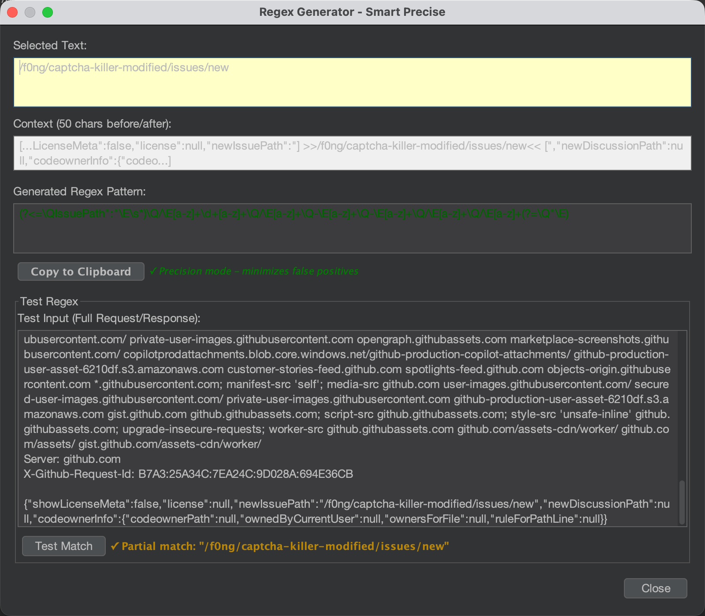

# **Burp Suite Regex Generator**


> github地址：[https://github.com/handbye/BRG](https://github.com/handbye/BRG)


一个智能的Burp Suite插件，用于生成精确的正则表达式模式。


### **核心功能**


快速生成两种类型的正则表达式：

1. **Escape Literal** - 完全精确匹配
2. **Smart Precise** - 上下文定位 + 值匹配（推荐）

### **Smart Precise 原理**


使用**正则断言**（lookaround assertions）实现：

- **上下文** → 用于精确定位（不包含在匹配结果中）
- **值模式** → 通用正则，可匹配同类值

### **示例**


**HTTP响应**：


```text
{"code": 200, "message": "success", "data": {...}}
```


**操作**：选中 `success`


**生成的正则**：


```text
(?<="message":\s*")[a-z0-9]+(?=")
```


**工作原理**：

- `(?<="message":\s*")` - 正向后顾：确保前面是 `"message": "`
- `[a-z0-9]+` - 匹配模式：任何字母数字组合
- `(?=")` - 正向先行：确保后面是 `"`

**匹配结果**：

- ✅ 匹配 `success`（只匹配值本身）
- ✅ 也能匹配 `error`、`failed` 等
- ✅ 不会匹配其他字段的值（上下文限制）
- ✅ 结果中不包含 `"message":` 或引号

### **自动模式识别**


Smart Precise会自动识别值的类型，生成相应的通用模式：


| **值类型** | **示例**                  | **生成模式**                      |
| ------- | ----------------------- | ----------------------------- |
| Base64  | `iVBORw0KGgoAAAA...`    | `[A-Za-z0-9+/]+=*`            |
| 十六进制    | `abc123def456`          | `[0-9a-fA-F]+`                |
| UUID    | `550e8400-e29b-41d4...` | `[0-9a-f]{8}-[0-9a-f]{4}-...` |
| 字母数字    | `la91gabie35w9e8...`    | `[a-z0-9]+`                   |
| 纯数字     | `12345`                 | `\d+`                         |
| 纯字母     | `success`               | `[a-z]+`                      |


### **使用方法**

1. 在Burp Suite中选中要匹配的值
2. 右键 → **Generate Regex**
3. 选择模式：
	- **Escape Literal** - 完全精确匹配选中的文本
	- **✓ Smart Precise** - 生成带上下文的通用模式（推荐）
4. 在弹出对话框中：
	- 查看生成的正则表达式
	- 在完整的请求/响应中测试
	- 复制到剪贴板使用

### **安装**


### **方法1：从Release下载**

1. 下载 `regex-generator-1.0.jar`
2. Burp Suite → Extender → Extensions → Add
3. 选择下载的JAR文件

### **方法2：从源码编译**


```text
# 需要Java 17
export JAVA_HOME=/path/to/jdk-17
mvn clean package

# 生成的文件：target/regex-generator-1.0.jar
```


### **实际应用场景**


### **场景1：API响应消息**


```text
{"message": "success"}
```


选中 `success` → 生成：`(?<="message":\s*")[a-z]+(?=")`
可用于匹配任何message值


### **场景2：Base64图片数据**


```text
{"image": "iVBORw0KGgoAAAA..."}
```


选中Base64 → 生成：`(?<="image":\s*")[A-Za-z0-9+/]+=*(?=")`
可用于提取任何Base64图片


### **场景3：Token/Identifier**


```text
{"identifier": "la91gabie35w9e8gmyrnkvryl47hzaa1"}
```


选中identifier值 → 生成：`(?<="identifier":\s*")[a-z0-9]+(?=")`
可用于匹配任何identifier


## 图片





### **技术细节**

- **Java版本**：17
- **Burp API**：Montoya API 2023.12.1
- **正则引擎**：Java `java.util.regex.Pattern`
- **上下文长度**：最多12个字符，自动处理换行边界

### **优势**


✅ **精确定位** - 使用上下文确保在正确位置匹配  
✅ **值匹配** - 匹配结果只包含值本身，不含上下文  
✅ **通用性强** - 自动生成可复用的模式  
✅ **智能识别** - 自动检测Base64、UUID等常见格式  
✅ **易于测试** - 内置测试功能，显示完整请求/响应

