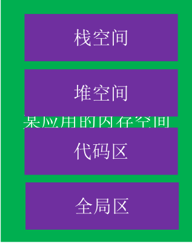
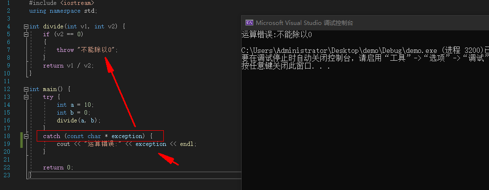
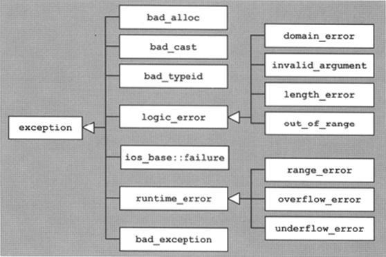

## 程序执行的本质


当我们写完一段程序需要给电脑进行运行时，首先编译器需要将代码编译为CPU可以看懂的机器码然后装载到内存中，CPU读取到内存中的指令后就会执行其中的执行控制IO设备完成相应的工作。


CPU分为寄存器，运算器和控制器三部分。


## 第一行c++代码


```c++
#include <iostream>

int main()
{
    std::cout << "Hello World!\n";
}

```


## 常用语法


c++的源文件扩展名是cpp


c++程序的入口是main函数


c++完全兼容c


### cin、cout


需包含头文件 `#include <iostream>`


cout表示输出，例如：


```c++
#include <iostream>
using namespace std;

int main()
{
    cout << "Hello World!\n";
    return 0;
}


```


其中`<<`表示左移运算符（位运算）


在c++中`endl`也表示换行，所以上述语句也可以写成：


```c++
#include <iostream>
using namespace std;

int main()
{
    cout << "Hello World!" << endl;
    return 0;
}

```


cin表示从键盘输入，例如：


```c++
#include <iostream>
using namespace std;

int main()
{
    int age;
    cin >> age;
    cout << "age is: " << age << endl;
    return 0;
}


```


其中`>>`表示有移运算符


### getchar()


等待用户输入


## 函数重载（overload）


当一个项目中存在多个函数，这些函数的函数名相同，但是函数传入的个数和类型不同，c++会自动按照函数传入的个数和类型寻找对应的函数进行运算，这个过程称为函数重载。


例如：


```c++
#include <iostream>
using namespace std;

int sum(int v1, int v2) {
    return v1 + v2;
}

int sum(int v1, int v2, int v3) {
    return v1 + v2 + v3;
}

int main()
{
    cout << sum(10, 20) << endl;
    cout << sum(10, 20, 30) << endl;
    return 0;
}


```


sum函数随着传入的实参个数不同会自动寻找对应的函数去计算。


返回值类型与函数重载无关。


在c语言中是不支持函数重载的。


## 默认参数


c++允许函数设置默认参数，在调用时可以根据情况省略实参，规则如下：

- 默认参数只能按照右到左的顺序
- 如果函数同时有声明，实现，默认参数只能放在函数声明中
- 默认参数的值可以时常量，全局符号（全局变量，函数名）

例：


```c++
#include <iostream>
using namespace std;

int sum(int v1 = 5, int v2 = 6) {
    return v1 + v2;
}


int main()
{   
    cout << sum() << endl;
    cout << sum(10) << endl;
    cout << sum(10, 20) << endl;
    return 0;
}


```


## extern "C"


被extern c 修饰的代码会按照c语言的方式进行编译。


例：


```c++
#include <iostream>
using namespace std;

extern "C" {
    void func() {

    }

    void func(int v1) {

    }
}


int main()
{   

    return 0;
}

```


上面的两个函数使用`extern  “c”`修饰后就会使用c语言的方式进行编译，但是由于c语言不支持函数重载，所以编译会报错。


- 如果函数通过是有声明和实现，要让函数声明被`extern "c"`修饰，函数实现可以不修饰。

何时需要用到 `extern c` ？

1. 用在c，c++的混合开发中，如果用到一些第三方的c语言库，那么就可以使用 extern c

例：


现在有一个c文件内容为：


```c
#include <math.h>

int sum(int v1, int v2) {
	return v1 + v2;
}

int delta(int v1, int v2) {
	return v1 - v2;
}

```


如果在c++中需要调用这个c文件中的函数，那么c++文件应该这么写：


```c++
#include <iostream>
using namespace std;

extern "C"{
	int sum(int v1, int v2);
	int delta(int v1, int v2);
}


int main(){
	cout << sum(10, 20) << endl;
	cout << delta(50, 10) << endl;
	return 0;
}


```


**`也就是声明必须用extern "c" 包裹，否则编译会报错`**


为了方便调用，可以将声明放到头文件中，新建头文件`math.h`:


然后c++中include此头文件即可：


## ifdef


为了使只有c++调用`math.h`头文件时才加`extern “c”`，可以使用`#ifdef`进行判断


> c++文件默认都会有一个宏定义 #define  cplusplus


然后头文件就可以这样写：


```c++
#ifdef cplusplus
extern "C" {
#endif
    
	int sum(int v1, int v2);
	int delta(int v1, int v2);

#ifdef cplusplus
}
#endif

```


## pragma once


`## pragma once`是用来防止头文件被重复包含


例如在某个程序中多次写了包含头文件，在头文件中写了`## pragma once`就可以防止头文件中的内容被多次编译。


## 内联函数


使用`inline`修饰函数的声明或实现，可以使其变成内联函数


建议声明和实现都增加`inline修饰`


特点：

- 编译器会将函数调用直接展开为函数体代码
- 可以减少函数调用的开销
- 会增大代码体积

注意：

- 尽量不要内联超过10行代码的函数
- 有些函数即使声明为`inline`,也不一定会被编译器内联，比如递归函数

**内联函数和宏的区别**

- 内联函数和宏，都可以减少函数调用的开销

例如：


```c++
#include <iostream>
using namespace std;

#define sum(v1,v2) v1 + v2

int main(){
	int c = sum(10, 20);
	cout << c << endl;
	return 0;
}

```


上述代码也可以正常运行

- 对比宏，内联函数多了语法检测和函数特性
- 宏只是简单的文本替换，所以遇到计算尽量使用函数

## const


const是常量的意思，被其修饰的变量不可修改。

- 如果修饰的是类、结构体（的指针），其成员也不可以更改
- const修饰的其右边的内容

一下5个指针的分别是什么含义？


```c++
_int age = 10;
const int p0 = &age;
int const p1 = &age;
int  const p2 = &age;_

```


例如：


```c++
_#include <iostream>
using namespace std;

int main(){

    int age = 10;
    int heigh = 20;

    int  const p2 = &age;

    p2 = 30; //age=30
    p2 = &heigh;  //报错
    p2 = 40; //heigh = 40

    return 0;
}_


```


报错的原因是const修饰的是其右边的内容，const修饰的是p2所以`p2=&heigh`报错，而_`p2=30`_就不会报错.


## 引用(reference)


在C语言中，使用指针（Pointer）可以间接获取、修改某个变量的值


例：


```c++
_#include <iostream>
using namespace std;

int main(){

    int age = 10;

    int p = &age;

    p = 20;

    cout << age << endl;

    return 0;
}_


```


在C++中，使用引用（Reference）可以起到跟指针类似的功能


例：


```c++
#include <iostream>
using namespace std;

int main(){

    int age = 10;

    //定义一个age的引用
    int &refAge = age;
    refAge = 20;
    cout << age << endl;

    return 0;
}

```


- 引用相当于是变量的别名（基本数据类型、枚举、结构体、类、指针、数组等，都可以有引用）
- 对引用做计算，就是对引用所指向的变量做计算
- 在定义的时候就必须初始化，一旦指向了某个变量，就不可以再改变，“从一而终”
- 可以利用引用初始化另一个引用，相当于某个变量的多个别名
- 不存在【引用的引用、指向引用的指针、引用数组】

**引用存在的价值之一：比指针更安全、函数返回值可以被赋值**


例：


```c++
#include <iostream>
using namespace std;

void swap(int &v1, int &v2) {
	int tmp = v1;
	v1 = v2;
	v2 = tmp;
}

int main(){
	int a = 10;
	int b = 20;
	swap(a, b);
	cout << "a= " << a << "  b= " << b << endl;
	return 0;
}

```


上述代码就轻松完成了在主函数内部使用用swap函数完成a和b的值的替换，使得**swap函数访问了它函数外部的值**。


## 汇编


汇编语言的种类：

- 8086汇编（16bit）
- x86汇编（32bit）
- x64汇编（64bit）
- ARM汇编（嵌入式、移动设备

### 寄存器


通常，CPU会将内存中的数据存到寄存器中，然后在对寄存器中的数据进行运算


### x64汇编-寄存器


RAX RBX RCX RDX 为通用寄存器


X64架构的寄存器，一个寄存器可以存8个字节的数据


x86架构下的通用寄存器为：EAX EBX ECX EDX ,为了兼容32位的CPU架构，拿出了最低四个字节来存放EAX的数据


### 内联汇编


在c++中嵌入汇编代码称为内联汇编，汇编代码使用**`asm`**包裹。


例如：


```c++
#include <iostream>
using namespace std;

int main(){
	int a = 10;

	asm {
		mov eax, 10

	}

	return 0;
}

```


### mov指令


`mov dest, src`
将src的内容赋值给dest，类似于dest = src


`[ 地址值 ]`
中括号[ ]里面放的都是内存地址


word是2字节，dword是4字节（double word），qword是8字节（quad word）


```text
mov dword ptr [a],0Ah  

```


表示将10放到内存地址为a的存储空间中，并占用4个字节


### call函数地址


call 表示调用函数


### lea指令


`lea dest, [ 地址值 ]`


将地址值赋值给dest，类似于dest = 地址值


lea是直接赋值地址值，而mov是取内存地址中存放的东西


例：


```json
mov eax, dword ptr [1122H]
表示取出[1122H]这个内存地址中存放的东西赋值给eax
lea eax, [1122H]
表示直接将1122H赋值给eax

```


### ret


ret表示函数返回


### xor


`xor op1, op2`


将op1和op2异或的结果赋值给op1，类似于op1 = op1 ^ op2


### add


`add op1, op2`


类似于op1 = op1 + op2


### sub


`sub op1, op2`


类似于op1 = op1 - op2


### inc


 `inc op`


自增，类似于op = op + 1


### des


`dec op`


自减，类似于op = op – 1


### jmp


jmp 内存地址


跳转到某个内存地址去执行代码


j开头的一般都是跳转，大多数是带条件的跳转，一般跟test、cmp等指令配合使用


## 面向对象


### 类的定义


C++中可以使用struct、class来定义一个类
**struct和class的区别:**
struct的默认成员权限是public
class的默认成员权限是private


```c++
_#include <iostream>
using namespace std;

//类的定义
struct Person{
	//成员变量
	int mage;
	//成员函数
	void run() {
		cout << mage << "run" << endl;
	}
};_

```


或：


```c++
_class Person {
public:
	//成员变量
	int mage;
	//成员函数
	void run() {
		cout << mage << "run" << endl;
	}
};_

```


### 类的实例化


```c++
_int main(){
	Person person;
	person.mage = 20;
	person.run();
	return 0;
}_

```


### 对象的内存布局


### this


this是指向当前对象的指针


对象在调用成员函数的时候，会自动传入当前对象的内存地址


```c++
_#include <iostream>
using namespace std;

//类的定义
class Person {
public:
	//成员变量
	int mage;
	//成员函数
	void run() {
		cout << this->mage << "run()" << endl;
	}
};
int main(){
	Person person1;
	person1.mage = 20;
	person1.run();

	Person person2;
	person2.mage = 30;
	person2.run();
	return 0;
}_

```


如上面的例子，当存在两个Person对象时，不同的对象在调用同一个`run()`_方法时是如何寻找到属于自己的mage的呢？就是靠this这个指针，this默认指向当前对象的内存地址，为当前对象寻找对应方法。this是一个隐式参数，其实不写this也可以正常执行，如下：_


```c++
_#include <iostream>
using namespace std;

//类的定义
class Person {
public:
	//成员变量
	int mage;
	//成员函数
	void run() {
		cout << mage << "run()" << endl;
	}
};
int main(){
	Person person1;
	person1.mage = 20;
	person1.run();

	Person person2;
	person2.mage = 30;
	person2.run();
	return 0;
}_

```


### 指针访问对象成员的本质


待补充


### 封装


封装的含义是成员变量私有化，提供公共的getter和setter给外界去访问成员变量。


例：


```c++
_#include <iostream>
using namespace std;

//类的定义
class Person {
private:
	//成员变量
	int mage;
public:
	void setAge(int age) {
		if (age<=0){
			mage = 1;
		}
		else {
			mage = age;
		}
	}
	int getAge(){
		return mage;
	}
};
int main(){
	Person person;
	person.setAge(-4);
	cout << person.getAge() << endl;

	return 0;
}_

```


### 内存空间布局


每个应用都有自己独立的内存空间，其内存空间一般都有以下几大区域：
**代码段（代码区）**
用于存放代码
**数据段（全局区**）
用于存放全局变量等
**栈空间**
每调用一个函数就会给它分配一段连续的栈空间，等函数调用完毕后会自动回收这段栈空间
自动分配和回收
**堆空间**
需要主动去申请和释放





### 堆空间


在程序运行过程，为了能够自由控制内存的生命周期、大小，会经常使用堆空间的内存


堆空间的申请\释放（malloc \ free）


例：


```c++
_#include <iostream>
using namespace std;

int main(){
	//申请四个字节的内存空间用来存储整形数据，
	//由于malloc申请的内存默认都为void  ，所以需要强转
	int_  _p = (int_ _) malloc(4);
	 p = 11;
	cout <<  p << endl;
	free(p);
	return 0;
}_


```


或申请一个char类型的内存


```c++
#include <iostream>
using namespace std;

int main(){

	char  _p = (char_ _) malloc(4);
	p = 'a';
	(p + 1) = 10;
	(p + 2) = 11;
	(p + 3) = 12;
	cout <<  p << endl;
	free(p);
	return 0;
}_


```


除此外c++还支持new/delete方式申请内存


```c++
_#include <iostream>
using namespace std;

int main(){

	int p = new int;
	p = 10;
	cout <<  p << endl;
	delete p;
	return 0;
}_


```


**注意**

- 申请堆空间成功后，会返回那一段内存空间的地址
- 申请和释放必须是1对1的关系，不然可能会存在内存泄露

### 堆空间的初始化


memset函数是将较大的数据结构（比如对象、数组等）内存清零的比较快的方法。


### 对象的内存


对象的内存可以存在于3种地方：

- 全局区（数据段）：全局变量
- 栈空间：函数里面的局部变量
- 堆空间：动态申请内存（malloc、new等）


### 构造函数（Constructor）


构造函数（也叫构造器），在对象创建的时候自动调用，一般用于完成对象的初始化工作


例：


```c++
_#include <iostream>
using namespace std;

class Person {
public:
	int mage;
	Person() {
		cout << "Person()" << endl;
	}
};

int main(){
	Person person;
	Person person1;
	Person person2;
	return 0;
}_

```


可看到在对象初始化时就会自动调用构造函数。


**特点**

- 函数名与类同名，无返回值（void都不能写），可以有参数，可以重载，可以有多个构造函数
- 一旦自定义了构造函数，必须用其中一个自定义的构造函数来初始化对象

**注意**:


通过malloc分配的对象不会调用构造函数


### 析构函数（Destructor）


析构函数（也叫析构器），在对象销毁的时候自动调用，一般用于完成对象的清理工作。


函数名以`~`开头，与类同名，无返回值（void都不能写），无参，不可以重载，有且只有一个析构函数


例：


```c++
_#include <iostream>
using namespace std;

class Person {
public:
	int mage;
	Person() {
		cout << "Person()" << endl;
	}

	//一个Person对象销毁的象征
	~Person() {
		cout << "~Persoon()" << endl;
	}
};

int main(){
	Person person;
	Person person1;
	Person person2;
	return 0;
}_


```


**注意:**

- 通过malloc分配的对象free的时候不会调用析构函数
- 构造函数、析构函数要声明为public，才能被外界正常使用

### 声明和实现分离


例：


```c++
_#include <iostream>
using namespace std;

//声明
class Person {
private:
	int mage;
public:
	void setAge(int age);
	int getAge();
	Person();
	~Person();
};


//实现
Person::Person() {
	 mage = 0;
}

void Person::setAge(int age) {
	this->mage = age;
}

int Person::getAge() {
	return this->mage;
}

Person::~Person() {

}

int main() {
	Person person;
	person.setAge(1);
	cout << person.getAge() << endl;
}_

```


**也可以将声明放在头文件中**


### 命名空间


命名空间可以用来避免命名冲突。


例：


```c++
_#include <iostream>
using namespace std;

namespace abc {
	int gage;

	class Person {};

	void test() {

	}
}

int main() {
	abc::gage = 20;
	abc::Person p = new abc::Person();
	abc::test();
	return 0;
}_

```


可以使用`namespace` 来定义命令空间。


为了方便，可以使用`using namespace`来规定命名空间的范围


例：


```c++
	_using namespace abc;
	gage = 20;
	Person p = new Person();
	test();_

```


命名空间可以嵌套和合并，c++中存在一个默认的全局命名空间`::`我们创建的命名空间默认都嵌套在它里面.


```c++
_#include <iostream>
using namespace std;

int gage;

namespace abc {
	int gage;

	class Person {};

	void test() {

	}
}

int main() {
	::gage = 20;
	using namespace abc;
	::abc::gage = 70;
	Person p = new Person();
	test();
	return 0;
}_

```


### 继承


继承，可以让子类拥有父类的所有成员（变量\函数）。


例：


```c++
_#include <iostream>
using namespace std;

class Person {
public:
	int age;
	void run() {
		cout << "Person::run()" << endl;
	}
};

class Student : public Person {
public:
	int classnum;
	void study() {
		cout << "Student::study()" << endl;
	}
};

int main() {
	Student student;
	student.age = 20;
	student.classnum = 10;
	student.run();
	student.study();
}_

```


**关系描述**

- Student是子类（subclass，派生类）
- Person是父类（superclass，超类）

具体的继承关系可参考：https://www.runoob.com/cplusplus/cpp-inheritance.html


继承对象的内存布局：


### 成员访问权限


**成员访问权限、继承方式有3种：**

- public：公共的，任何地方都可以访问（struct默认）
- protected：子类内部、当前类内部可以访问
- private：私有的，只有当前类内部可以访问（class默认）

**子类内部访问父类成员的权限，是以下2项中权限最小的那个**

- 成员本身的访问权限
- 上一级父类的继承方式

开发中用的最多的继承方式是public，这样能保留父类原来的成员访问权限


访问权限不影响对象的内存布局


具体的继承关系可参考：https://www.runoob.com/cplusplus/cpp-inheritance.html


### 初始化列表


**特点**

- 一种便捷的初始化成员变量的方式
- 只能用在构造函数中
- 初始化顺序只跟成员变量的声明顺序有关

例：


```c++
_class Person {
public:
	int mage;
	int mheight;
	Person(int age, int height) : m__age(age), m_height(height) {

	}
};

```


上述的这种写法就是初始化列表


它等价于：


```c++
_class Person {
public:
	int mage;
	int mheight;
	Person(int age, int height) {
		this->mage = age;
		this->mheight = height;
	}
};_

```


### 初始化列表与默认参数配合使用


例：


```c++
_#include <iostream>
using namespace std;

class Person {
public:
	int mage;
	int mheight;
	Person(int age = 0, int height = 0) : m__age(age), m_height(height) {
		cout << m_age << " " << m_height << endl;
	}
};

int main() {
	Person person1;
	Person person2(18);
	Person person3(18, 20);
	return 0;
}

```


**注意：**


如果函数声明和实现是分离的

- 初始化列表只能写在函数的实现中
- 默认参数只能写在函数的声明中

### 构造函数的互相调用


```c++
_#include <iostream>
using namespace std;

class Person {
public:
	int mage;
	int mheight;
	Person() : Person(10,20) {

	}
	Person(int age , int height) : m__age(age), m_height(height) {
		cout << m_age << " " << m_height << endl;
	}
};

int main() {
	Person person1;
	return 0;
}

```


### 父类的构造函数

- 子类的构造函数默认会调用父类的无参构造函数
- 如果子类的构造函数显式地调用了父类的有参构造函数，就不会再去默认调用父类的无参构造函数
- 如果父类缺少无参构造函数，子类的构造函数必须显式调用父类的有参构造函数

### 父类指针，子类指针


父类指针可以指向子类对象，是安全的，开发中经常用到（继承方式必须是public）。


子类指针指向父类对象是不安全的。


例：


### 多态


默认情况下，编译器只会根据指针类型调用对应的函数，不存在多态。


例：


```c++
_#include <iostream>
using namespace std;

class Dog {
public:
	void speak() {
		cout << "Dog::speak()" << endl;
	}
	void run() {
		cout << "Dog::run()" << endl;
	}
};

class Cat {
public:
	void speak() {
		cout << "Cat::speak()" << endl;
	}
	void run() {
		cout << "Cat::run()" << endl;
	}
};

class Pig {
public:
	void speak() {
		cout << "Pig::speak()" << endl;
	}
	void run() {
		cout << "Pig::run()" << endl;
	}
};

void liu(Dog p) {
	p->run();
	p->speak();
}

void liu(Cat p) {
	p->run();
	p->speak();
}

void liu(Pig p) {
	p->run();
	p->speak();
}

int main() {
	liu(new Dog());
	liu(new Cat());
	liu(new Pig());
	return 0;
}_

```


在上面的例子中，虽然三只动物都有共同的属性 run 和 speak，但是我们定义的三个函数在表达三只动物的run和speak。


那能否在定义一个Animal 父类，让三只动物都继承其run和speak呢？


例：


```c++
_#include <iostream>
using namespace std;

class Animal {
public:
	void speak() {
		cout << "Animal::speak()" << endl;
	}
	void run() {
		cout << "Animal::run()" << endl;
	}
};


class Dog : public Animal{
public:
	void speak() {
		cout << "Dog::speak()" << endl;
	}
	void run() {
		cout << "Dog::run()" << endl;
	}
};

class Cat : public  Animal {
public:
	void speak() {
		cout << "Cat::speak()" << endl;
	}
	void run() {
		cout << "Cat::run()" << endl;
	}
};

class Pig : public  Animal {
public:
	void speak() {
		cout << "Pig::speak()" << endl;
	}
	void run() {
		cout << "Pig::run()" << endl;
	}
};

//父指针指向子类对象
void liu(Animal  p) {
	p->run();
	p->speak();
}


int main() {
	liu(new Dog());
	liu(new Cat());
	liu(new Pig());
	return 0;
}_

```


但是结果确不正确，因为**默认情况下，编译器只会根据指针类型调用对应的函数，不存在多态**。


**多态的要素：**

- 子类重写父类的成员函数（override）
- 父类指针指向子类对象
- 利用父类指针调用重写的成员函数

**多态是面向对象非常重要的一个特性**

- 同一操作作用于不同的对象，可以有不同的解释，产生不同的执行结果
- 在运行时，可以识别出真正的对象类型，调用对应子类中的函数

如何实现多态呢？在c++中需要使用虚函数来实现。


### 虚函数


C++中的多态通过虚函数（virtual function）来实现。


虚函数：被virtual修饰的成员函数。


只要在父类中声明为虚函数，子类中重写的函数也自动变成虚函数（也就是说子类中可以省略virtual关键字）。


例：


```c++
_#include <iostream>
using namespace std;

class Animal {
public:
	virtual void speak() {
		cout << "Animal::speak()" << endl;
	}
	virtual void run() {
		cout << "Animal::run()" << endl;
	}
};


class Dog : public Animal{
public:
	void speak() {
		cout << "Dog::speak()" << endl;
	}
	void run() {
		cout << "Dog::run()" << endl;
	}
};

class Cat : public  Animal {
public:
	void speak() {
		cout << "Cat::speak()" << endl;
	}
	void run() {
		cout << "Cat::run()" << endl;
	}
};

class Pig : public  Animal {
public:
	void speak() {
		cout << "Pig::speak()" << endl;
	}
	void run() {
		cout << "Pig::run()" << endl;
	}
};

void liu(Animal  p) {
	p->run();
	p->speak();
}


int main() {
	liu(new Dog());
	liu(new Cat());
	liu(new Pig());
	return 0;
}_

```


### 虚表


虚函数的实现原理是虚表，这个虚表里面存储着最终需要调用的虚函数地址，这个虚表也叫虚函数表。


### 虚析构函数


如果存在父类指针指向子类对象的情况，应该将析构函数声明为虚函数（虚析构函数）


delete父类指针时，才会调用子类的析构函数，保证析构的完整性。


### 纯虚函数


纯虚函数：没有函数体且初始化为0的虚函数，用来定义接口规范


**抽象类（Abstract Class）**

- 含有纯虚函数的类，不可以实例化（不可以创建对象）
- 抽象类也可以包含非纯虚函数、成员变量
- 如果父类是抽象类，子类没有完全重写纯虚函数，那么这个子类依然是抽象类

### 静态成员


静态成员：被static修饰的成员变量\函数。


可以通过对象（对象.静态成员）、对象指针（对象指针->静态成员）、类访问（类名::静态成员）。


### 静态成员变量

- 存储在数据段（全局区，类似于全局变量），整个程序运行过程中只有一份内存
- 对比全局变量，它可以设定访问权限（public、protected、private），达到局部共享的目的
- 必须初始化，必须在类外面初始化，初始化时不能带static，如果类的声明和实现分离（在实现.cpp中初始化）

例：


```c++
_#include <iostream>
using namespace std;

class Car {
public:
	static int mprice;
	void run() {
		cout << "run()" << endl;
	}
};

//在类外面初始化静态成员变量
int Car::mprice = 10;

int main() {
	Car car1;
	car1.mprice = 100;
	cout << car1.mprice << endl;
	cout << Car::mprice << endl;
	return 0;
}_

```


### 静态成员函数

- 内部不能使用this指针（this指针只能用在非静态成员函数内部）
- 不能是虚函数（虚函数只能是非静态成员函数）
- 内部不能访问非静态成员变量\函数，只能访问静态成员变量\函数
- 非静态成员函数内部可以访问静态成员变量\函数
- 构造函数、析构函数不能是静态
- 当声明和实现分离时，实现部分不能带static

例：


```c++
_#include <iostream>
using namespace std;

class Car {
public:
	static int mprice;
	static void run() {
		cout << "run()" << endl;
	}
};

//在类外面初始化静态成员变量
int Car::mprice = 10;

int main() {
	Car car1;
	car1.run();
	Car  p = new Car();
	p->run();
	Car::run();
	return 0;
}_

```


### 静态成员应用


例：


现在有个需求是统计创建了多少个Car对象。


```c++
_#include <iostream>
using namespace std;

class Car {
private:
	static int mcount;
public:
	Car() {
		mcount++;
	}
	~Car() {
		mcount--;
	}
	static int getCount() {
		return mcount;
	}
};

//在类外面初始化静态成员变量
int Car::mcount = 0;

Car gcar;  //创建了第一个Car对象

int main() {
	Car car1;  //创建了第二个Car对象
	Car  p = new Car();  //创建了第三个Car对象
	cout << Car::getCount() << endl;
	return 0;
}_

```


### const 成员


const成员：被const修饰的成员变量、非静态成员函数。


**const成员变量**

- 必须初始化（类内部初始化），可以在声明的时候直接初始化赋值
- 非static的const成员变量还可以在初始化列表中初始化

const成员函数（非静态）


**const关键字写在参数列表后面，函数的声明和实现都必须带const**

- 内部不能修改非static成员变量
- 内部只能调用const成员函数、static成员函数
- 非const成员函数可以调用const成员函数

const成员函数和非const成员函数构成重载
非const对象（指针）优先调用非const成员函数
const对象（指针）只能调用const成员函数、static成员函数


### 引用类型成员


引用类型成员变量必须初始化（不考虑static情况）

- 在声明的时候直接初始化
- 通过初始化列表初始化


### 拷贝构造函数（Copy Constructor）


拷贝构造函数是构造函数的一种.


当利用已存在的对象创建一个新对象时（类似于拷贝），就会调用新对象的拷贝构造函数进行初始化.


拷贝构造函数的格式是固定的，接收一个const引用作为参数.


例：


```c++
_#include <iostream>
using namespace std;

class Car {
	int mprice;
	int mlength;
public:
	Car(int price = 0, int length = 0) :m__price(price), m_length(length) {
		cout << "Car(int price = 0, int length = 0)" << endl;
	}

	//拷贝构造函数，格式固定
	Car(const Car &car) {
		cout << "Car(const Car &car)" << endl;
	}

	void display() {
		cout << "price=" << m_price << ", length=" << m_length << endl;
	}
};

int main() {
	Car car1;
	Car car2(100);
	Car car3(100, 50);

	//利用已经存在的car3对象创建了一个car4新对象
	//car4初始化时只会调用拷贝构造函数
	Car car4(car3);
	return 0;
}

```


默认情况下不写拷贝构造函数也可以进行拷贝


### 调用父类的拷贝构造函数


例：


```c++
_#include <iostream>
using namespace std;

class Person {

public:
	int mage;
	Person(int age=0) :mage(age){}
	//父类的拷贝构造函数
	Person(const Person &person) :m__age(person.m__age){}
};

class Student : public Person {

public:
	int mscore;
	//子类调用父类的构造函数
	Student(int age=0, int score=0) :Person(age), mscore(score){}
	//子类调用父类的拷贝构造函数
	Student(const Student &student) :Person(student), m__score(student.m__score){}
};

int main(){
	Student student1(10, 100);
	Student student2(student1);
	cout << student2.mage << endl;
	cout << student2.mscore << endl;
}_

```


默认情况下不写拷贝构造函数也可以调用父类的拷贝构造函数


### 浅拷贝和深拷贝


编译器默认的提供的拷贝是浅拷贝（shallow copy）

- 将一个对象中所有成员变量的值拷贝到另一个对象
- 如果某个成员变量是个指针，只会拷贝指针中存储的地址值，并不会拷贝指针指向的内存空间
- 可能会导致堆空间多次free的问题

如果需要实现深拷贝（deep copy），就需要自定义拷贝构造函数

- 将指针类型的成员变量所指向的内存空间，拷贝到新的内存空间

### 匿名对象


匿名对象：没有变量名、没有被指针指向的对象，用完后马上调用析构


### 友元


友元包括友元函数和友元类

- 如果将函数A（非成员函数）声明为类C的友元函数，那么函数A就能直接访问类C对象的所有成员
- 如果将类A声明为类C的友元类，那么类A的所有成员函数都能直接访问类C对象的所有成员
- 友元破坏了面向对象的封装性，但在某些频繁访问成员变量的地方可以提高性能

例：


```c++
_#include <iostream>
using namespace std;

class Point {
	int mx;
	int my;
public:
	int getX() {
		return mx;
	};
	int getY() {
		return my;
	};
	Point(int x , int y): m__x(x),m_y(y){}
	void display() {
		cout << "(" << m_x << ", " << m_y << ")" <<endl;
	}
};

Point add(Point p1, Point p2) {
	return Point(p1.getX() + p2.getX(), p1.getY() + p2.getY());
}

int main() {
	Point P1(10, 20);
	Point P2(20, 30);
	Point P3 = add(P1, P2);
	P3.display();
	return 0;
}

```


上述代码使用了get方法去获取Point类中的私有成员变量，假设需要频繁的访问，可以将add方法设置为Point类的友元函数，这样add方法就可以直接访问Point类的私有成员变量。


```c++
_#include <iostream>
using namespace std;

class Point {
	friend Point add(Point p1, Point p2);
	int mx;
	int my;
public:
	int getX() {
		return mx;
	};
	int getY() {
		return my;
	};
	Point(int x , int y): m__x(x),m_y(y){}
	void display() {
		cout << "(" << m_x << ", " << m_y << ")" <<endl;
	}
};

Point add(Point p1, Point p2) {
	return Point(p1.m_x + p2.m_x, p1.m_y + p2.m_y);
}

int main() {
	Point P1(10, 20);
	Point P2(20, 30);
	Point P3 = add(P1, P2);
	P3.display();
	return 0;
}

```


### 内部类


如果将类A定义在类C的内部，那么类A就是一个内部类（嵌套类）。


**内部类的特点：**

- 支持public、protected、private权限
- 成员函数可以直接访问其外部类对象的所有成员（反过来则不行）
- 成员函数可以直接不带类名、对象名访问其外部类的static成员
- 不会影响外部类的内存布局
- 可以在外部类内部声明，在外部类外面进行定义

### 局部类


在一个函数内部定义的类，称为局部类。


**局部类的特点：**

- 作用域仅限于所在的函数内部
- 其所有的成员必须定义在类内部，不允许定义static成员变量
- 成员函数不能直接访问函数的局部变量（static变量除外）

## 其他语法


### 运算符重载


运算符重载（操作符重载）：可以为运算符增加一些新的功能。


全局函数、成员函数都支持运算符重载。


### 异常

- 异常是一种在程序运行过程中可能会发生的错误（比如内存不够）
- 异常没有被处理，会导致程序终止


throw异常后，会在当前函数中查找匹配的catch，找不到就终止当前函数代码，去上一层函数中查找。如果最终都找不到匹配的catch，整个程序就会终止。


例：


```c++
#include <iostream>
using namespace std;

int divide(int v1, int v2) {
	if (v2 == 0)
	{
		throw "不能除以0";
	}
	return v1 / v2;
}

int main() {
	try {
		int a = 10;
		int b = 0;
		divide(a, b);
	}
	catch (...) {
		cout << "运算错误" << endl;
	}

	return 0;
}

```


```c++
_#include <iostream>
using namespace std;

int divide(int v1, int v2) {
	if (v2 == 0)
	{
		throw "不能除以0";
	}
	return v1 / v2;
}

int main() {
	try {
		int a = 10;
		int b = 0;
		divide(a, b);
	}
	catch (const char  exception) {
		cout << "运算错误:" << exception << endl;
	}

	return 0;
}_

```





**自定义异常类型**


例：


```c++
_#include <iostream>
using namespace std;

class Exception {
public:
	virtual const char  what() = 0;
};

class DivideException : public Exception {
public:
	const char what() {
		return "不能除以0";
	}
};

class AddException : public Exception {
public:
	const char what() {
		return "加法有问题";
	}
};

int divide(int v1, int v2) {
	if (v2 == 0)
	{
		throw DivideException();
	}
	return v1 / v2;
}

int main() {
	try {
		int a = 10;
		int b = 0;
		divide(a, b);
	}
	catch (DivideException exception) {
		cout << "产生了异常:" << exception.what() << endl;
	}

	return 0;
}_

```


**标准异常（std）**





