## **yzmcms简介**


YzmCMS（以下简称本产品）采用面向对象方式自主研发的YZMPHP框架开发，它是一款开源高效的内容管理系统，产品基于PHP+Mysql架构，可运行在Linux、Windows、MacOSX、Solaris等各种平台上。
其github地址为：[https://github.com/yzmcms/yzmcms](https://github.com/yzmcms/yzmcms)


平台采用模块化插件设计，主题程序是完全开源免费的，但是大部分插件需付费购买使用，本次代码审计只针对其主体程序，截至2020.8.11, 其最新版本为YzmCMS V6.1。


## **有条件的代码执行**


> 这里说的条件是指yzmcms后台开启sql命令行功能时，漏洞才能触发，但此功能时默认关闭的，所以这个漏洞利用还是比较鸡肋的。


定位到tree.class.php  134行


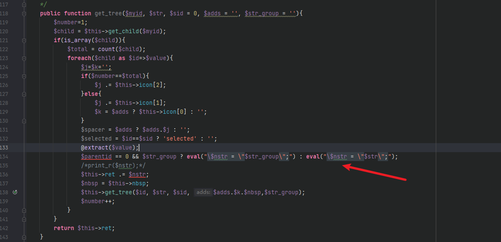


`eval`函数会将`$str`中的变量进行替换生成`$nstr` 然后拼接到`ret`返回.
而调用get_tree函数的在 application\admin\controller\menu.class.php中。


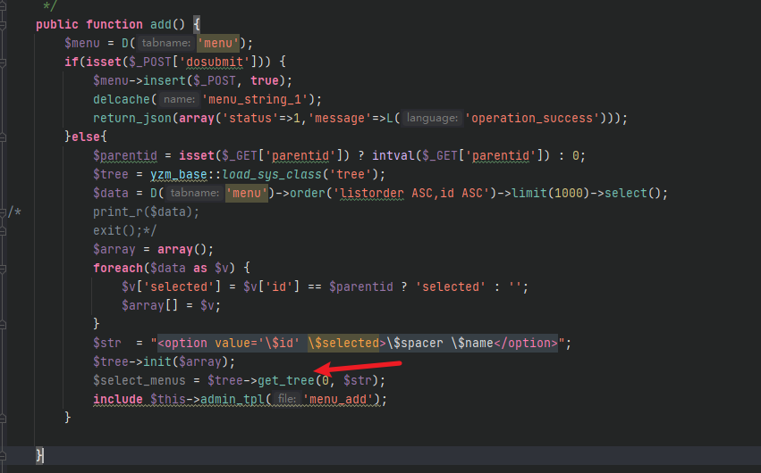


`$str`的值为 `"<option value='\$id' \$selected>\$spacer \$name</option>"`
也就是`eval`会执行`str`中的变量值。但是只执行一次时无法触发代码执行的。例如 `$str`中的`$name`可控，将`$name`改为`${@phpinfo()}` ，那么`eval`执行后就会把`${{@phpinfo()}}`替换到`$nstr`中，此刻依旧无法执行代码。


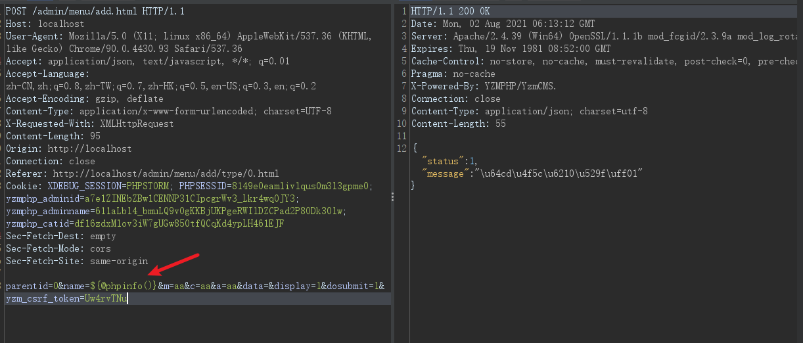


数据库中`yzm_menu`表中`name`字段会添加为`${@phpinfo()}`


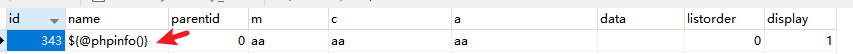


在调用`get_tree`函数时，会从`yzm_menu`表中遍历`name`字段带入到`$str`中进行替换。


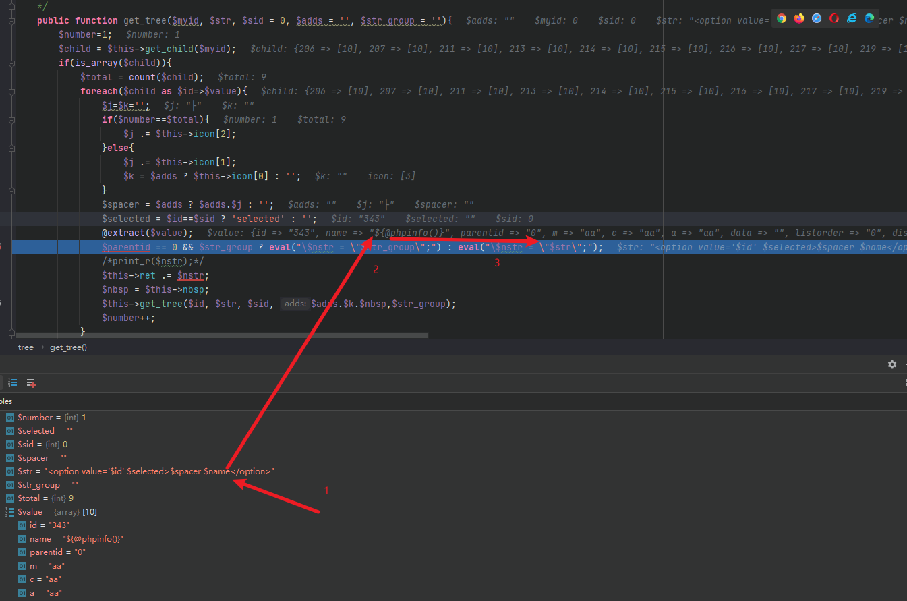


此时并不会执行`phpinfo()`,因为这里将 `${@phpinfo()}`当作了一个字符串，而不是php变量.


那怎么才能执行`eval`呢？我们将目光转到 extract函数，这个函数是可以导致变量覆盖的。


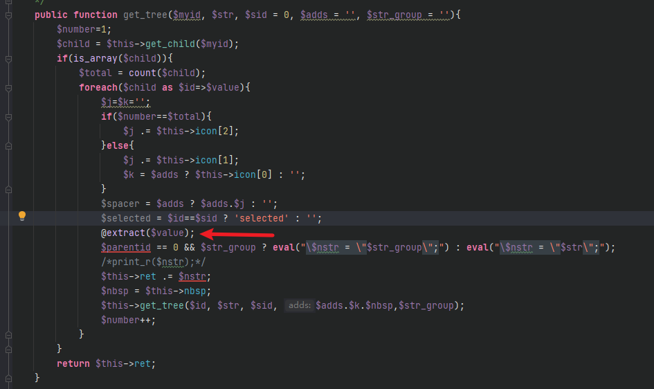


`$value`的值是从`yzm_menu`表中遍历出来的，`extract`会对其进行数组的解包操作。


而且在`menu.class.php`中是没有限定取哪些列的，也就是会全部取出`yzm_menu`表中的列和数据。


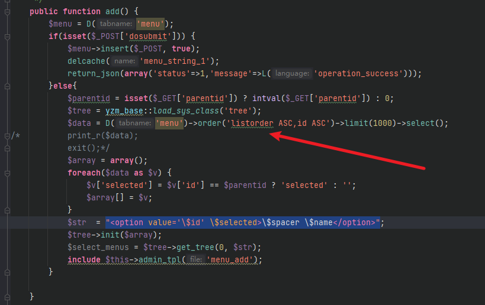


那我们不就可以在`yzm_menu`表中新增一列名叫`str`, 在将此列的内容添加为 `${@phpinfo()}`。在经过`get_tree`函数时，`ectract`函数会进行变量覆盖，将原本的`$str`进行覆盖，然后带入到`eval`函数中执行了代码。


要可以操作数据库，我们需要找到一处sql注入，但是系统后台有一个叫做SQL命令行的功能。利用此功能即可执行sql语句。


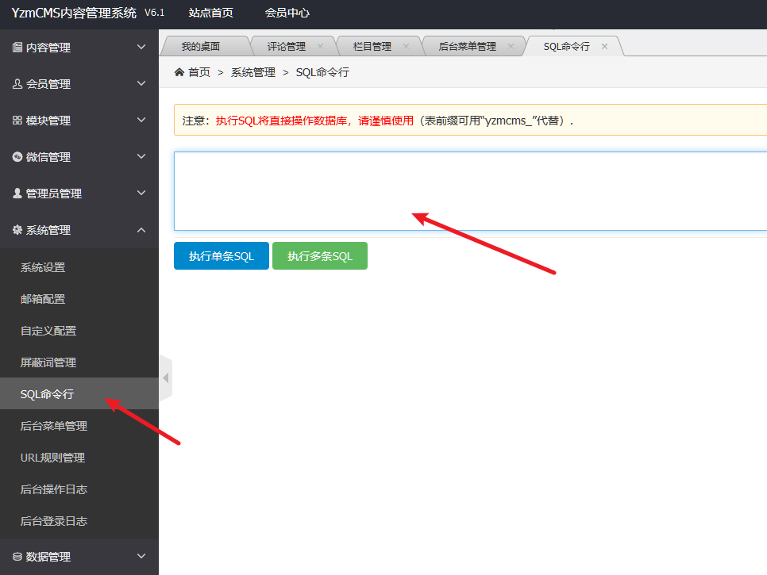


（此功能在v6.1版本时默认关闭的，也就是需要此功能开启后才能触发此次的代码执行漏洞）。


那么payload如下：


```text
ALTER TABLE yzm_menu ADD str varchar(255);
```


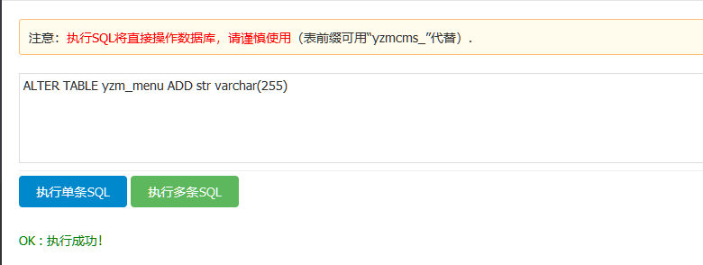


```text
UPDATE yzm_menu SET str="${@phpinfo()}" WHERE name = "aa";
```


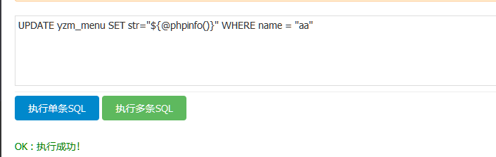


此时数据变为了如下：


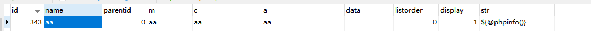


然后返回后台菜单管理处即可触发代码执行。


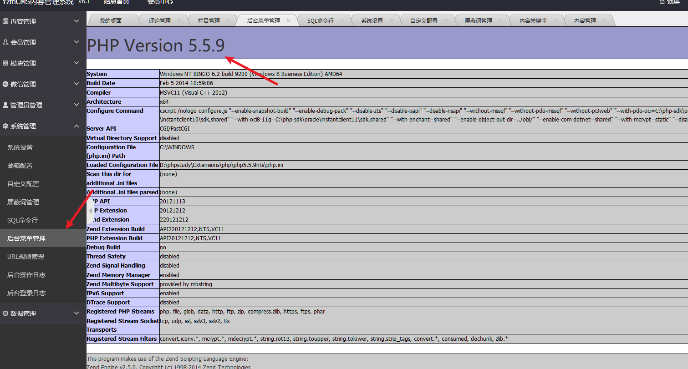


调式可看到`str`的值为`${@phpinfo()}`


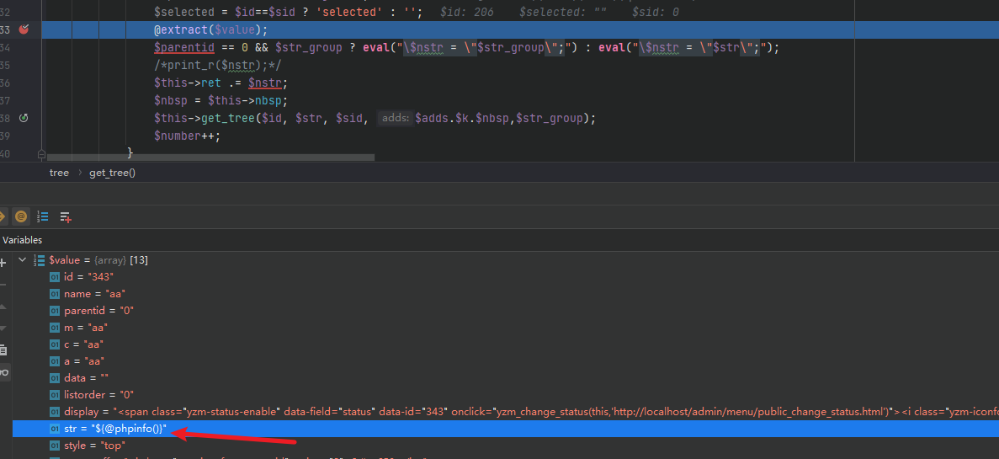


经过


```text
extract
```


函数后


```text
$str
```


变量已被覆盖


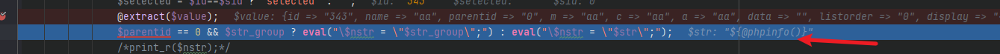


然后触发代码执行。


## **后记**


其实这个漏洞配合一个sql注入漏洞也是可以触发的，但是在V6.1版本中我没有发现存在SQL注入漏洞，要是可以找到一个sql注入漏洞，那么这个代码执行就不会显得那么鸡肋了。

