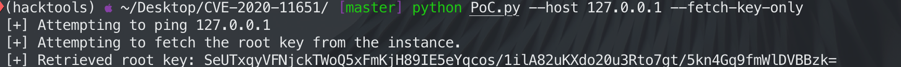

## 简介


SaltStack是一种基于C/S架构的服务器基础架构集中管理平台，它是一种全新的基础设施管理方式，部署轻松，在几分钟内可运行起来，扩展性好，很容易管理上万台服务器，速度够快，服务器之间秒级通讯。
Saltstack使用Python开发，是一个非常简单易用和轻量级的管理工具。由Master和Minion构成，通过ZeroMQ进行通信，master可以通过发布消息来管理多个minion。
Saltstack的master端监听4505与4506端口，4505为salt的消息发布系统，4506为salt客户端与服务端通信的端口；salt客户端程序不监听端口，客户端启动后，会主动连接master端注册，然后一直保持该TCP连接，master通过这条TCP连接对客户端控制，


2020年4月30日 F-Secure 安全团队披露了关于SaltStack两个安全漏洞：CVE-2020-11651 权限缺陷、CVE-2020-11652 任意文件读写漏洞。受影响的版本为：

- CVE-2020-11651 SaltStack Salt before 2019.2.4 and 3000 before 3000.2
- CVE-2020-11652 SaltStack Salt before 2019.2.4 and 3000 before 3000.2

本文来分析并复现下CVE-2020-11651这个漏洞。


## SaltStack安装


SaltStack有多种安装方式，[这个是](https://docs.saltstack.cn/topics/installation/index.html#installation)官方的安装教程,涵盖了多个平台的安装。但是我推荐使用Salt bootstrap的快速安装方式，只需一个脚本即可完成安装，项目地址：[https://github.com/saltstack/salt-bootstrap/tree/stable](https://github.com/saltstack/salt-bootstrap/tree/stable).


由于本次只是为了漏洞的演示，所以使用docker快速安装。
使用以下命令即可完成安装


```shell
docker pull vulfocus/saltstack-cve_2020_11651
docker run -d -p 4506:4506 -p 4505:4505 vulfocus/saltstack-cve_2020_11651

```


其实VULFOCUS上也集成了这个靶场.


先试用exp进行下验证, 使用的exp是github上开源的一个,[https://github.com/0xc0d/CVE-2020-11651](https://github.com/0xc0d/CVE-2020-11651):





## 漏洞分析


在漏洞分析之前需要先梳理下SaltStack的认证方式：


上图为SaltStack Master和Monion的一个简单架构，Master负责管理众多Monion.


Salt master 与 minion 通讯采用的是”订阅-发布“的模式。
通讯的连接由 Salt minion 发起，这意味着 minion 无须开启进向的端口（注意：此方式极大地简便了网络规则的设定）。
而 Salt master 的 4505 和 4506 端口（默认）必须开启，以接收外部的连接。其中端口功能如下表所示。


1.当 minion 启动时，其将搜索网络中的 master。当找到时， minion 将发送公钥给 Salt master，从而实现初次握手。
2.当初次握手后，Salt minion 的公钥将被保存在服务端，此时 master 需要使用过 salt-key 命令接收公钥（也可以采用自动机制）。注意：在 Salt minion 的公钥被接收前，Salt master 是不会将密钥发放给 minion 的，也就是说 minion 在此之前不会执行任何命令。
3.当 Salt minion 的公钥被接收后，Salt master 就会把公钥连同用于加解密 master 信息的可变动 AES 密钥发送至 Salt minion。其中，返回给 Salt minion 的 AES 密钥由 minion 的公钥加密，可由 Salt minion 解密。


当密钥交换完毕后，后续的通讯过程就可以使用AES进行加密。


本次漏洞发生的原因就出在了4506端口上，由于Master端的ClearFuncs类处理未经身份验证的请求，并且调用_send_pub（）方法，此方法可以获取root key从而导致可以以root权限执行任意命令。


看一下POC的核心语句：


在看代码：/salt/transport/zeromq.py


```python
@salt.ext.tornado.gen.coroutine
    def send(self, load, tries=3, timeout=60, raw=False):
        '''
        Send a request, return a future which will complete when we send the message
        '''
        if self.crypt == 'clear':
            ret = yield self._uncrypted_transfer(load, tries=tries, timeout=timeout)
        else:
            ret = yield self._crypted_transfer(load, tries=tries, timeout=timeout, raw=raw)
        raise salt.ext.tornado.gen.Return(ret)

```


salt.transport.client.ReqChannel.factory 最后被实例化为AsyncZeroMQReqChannel，而且带有clear参数，即发给master的命令是clear没有AES加密的.


_salt-master普遍使用这两行代码进行认证，其中clearload是可控输入点。_


```python
auth_type, err_name, key, sensitive_load_keys = self._prep_auth_info(clear_load)
auth_check = self.loadauth.check_authentication(clear_load, auth_type, key=key)

```


_prep_auth_info首先会识别clear__load输入的字段并选用其中之一作为认证方式，然后传参到checkauthentication方法检验认证是否有效。_


```python
    def _prep_auth_info(self, clear_load):
        sensitive_load__keys = []
        key = None
        if "token" in clearload:
            authtype = "token"
            errname = "TokenAuthenticationError"
            sensitive__load__keys = ["token"]
        elif "eauth" in clearload:
            authtype = "eauth"
            errname = "EauthAuthenticationError"
            sensitive__load__keys = ["username", "password"]
        else:
            authtype = "user"
            errname = "UserAuthenticationError"
            key = self.key

        return auth__type, err_name, key, sensitive_load_keys

```


在第三种认证方式auth_type=='user'中，会由_prep_auth__info获取到系统opt的key，传递到checkauthentication中和API参数中携带的key进行==比对。_


理论上_prep_auth_info是不可被外部调用的，漏洞成因即是攻击者通过匿名API直接调用_prep_auth_info方法，在回显中拿到self.key，并在后续的请求中使用获取到的key过验证，以root权限执行高危指令。


## 参考

- [SaltStack CVE-2020-11651/11652 分析](https://xz.aliyun.com/t/7741)
- [https://github.com/0xc0d/CVE-2020-11651](https://github.com/0xc0d/CVE-2020-11651)
- [SaltStack远程命令执行漏洞介绍及复现](https://www.secrss.com/articles/19214)
- [SaltStack，Shell Master 和 Minion 漏洞分析](https://l0gs.xf0rk.space/2020/05/04/saltstack-rce-your-master-and-minions/)
