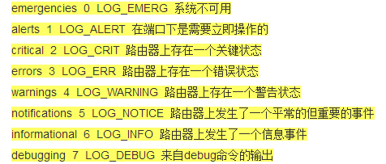

## syslog


syslog 是日志服务功能。
在思科的路由器上是默认打开的


```shell
logging on

```


但console下的syslog功能是默认关闭的。
打开命令：`logging console`


syslog有七个级别：





> 每个日志消息被关联一个严重级别，用来分类消息的严重等级：数字越低，消息越严重。严重级别的范围从0（最高）到7（最低）。使用logging命令可以用数字或者名称来指定严重性。


基本配置如下：


```shell
logging on  //打开路由器logging功能。默认是打开的
logging trap 7  //设置路由器向syslog服务器发送trap消息的级别（也可以直接敲logging trap,默认级别为 6）
logging 10.1.1.1 //设置syslog服务器
logging bufferd 7  //将log信息缓存到buffer里面

```


show logging看到的部分信息如下：


```shell
_Inside#show logging
Syslog logging: enabled (0 messages dropped, 3 messages rate-limited, 0 flushes, 0 overruns, xml disabled, filtering disabled)

No Active Message Discriminator.


No Inactive Message Discriminator.


    Console logging: level debugging, 63 messages logged, xml disabled,
                     filtering disabled
    Monitor logging: level debugging, 0 messages logged, xml disabled,
                     filtering disabled
    Buffer logging:  level debugging, 65 messages logged, xml disabled,
                    filtering disabled
    Exception Logging: size (4096 bytes)
    Count and timestamp logging messages: disabled
    Persistent logging: disabled

No active filter modules.

    Trap logging: level debugging, 66 message lines logged
        Logging to 10.1.1.100  (udp port 514, audit disabled,
              link up),
              19 message lines logged,
              0 message lines rate-limited,
              0 message lines dropped-by-MD,
              xml disabled, sequence number disabled
              filtering disabled
        Logging Source-Interface:       VRF Name:

Log Buffer (4096 bytes):
figuration file cdrom1:/ovf-env.xml is ignored: checksum unchanged since last inspected
Sep 23 10:04:06.400: %SYS-5-CONFIGI: Configured from memory by console
Sep 23 10:04:06.413: %IOSXEOIR-6-INSCARD: Card (rp) inserted in slot R1
Sep 23 10:04:06.413: %IOSXEOIR-6-INSCARD: Card (fp) inserted in slot F0_


```


在syslog服务器上也可以看到log信息：


---


## snmp


关于snmp的详解可以参考：


[http://blog.csdn.net/shanzhizi/article/details/11606767](http://blog.csdn.net/shanzhizi/article/details/11606767)


这里重点说一下容易理解错误的地方：
get和set消息都是网管主动向agent(设备)发送的
get:网管主动向agent获取一些消息（如：设备CPU，内存的使用情况，路由表，接口地址等）
set:网管向agent发出一些指令（如：网管要shutdown设备接口，下发路由等）
trap消息是agent主动向网管发送一些设备的运行状态消息


**snmp分为三个版本v1,v2c,v3.**
v1和v2c几乎没有安全性可言，v3新增了加密，完整性校验，身份认证等安全功能。


snmp v1,v2c和v3的配置有较大的区别。


snmp v1，v2c的基本配置：


基本trap配置：


```shell
snmp-server location xxxxx //配置地址，可不配
snmp-server contact xxxxx //配置联系方式，可不配
snmp-server enable traps //使能trap功能
snmp-server host 10.1.1.100 xxxxx //配nms地址，XXXXX为community值或者v3的用户名


```


基本get/set配置：


```shell
snmp-server community XXXX ro //配置读团体值
snmp-server community XXXX rw //配置读写团体值

```


snmp v3的基本配置：


_snmp v3可以配置mib节点的读取范围，配置如下_


```shell
snmp-server view XXX interfaces included //XXX只是一个名字，和下面read和write后面的一致 **interfaces为mib节点的范围**，这个只能配置mib库中的节点名称。
snmp-server group groupname v3 priv read  XXX write XXX //配置snmp组并引用上方的mib节点读取范围


```


上面的配置是可选的，snmp v3的基本配置如下：


```shell
snmp-server user username groupname v3 auth md5 xxxx priv des xxxx //配置snmp用户，网管侧网管时需要填写此用户名
snmp-server host 10.1.1.100 version 3 priv username //配置trap消息的主机地址

```


snmp v1,v2c和v3在配置上的区别如上，配置过程中可以看到v1和v2c只需要配置一个团体名，NMS侧与其一致即可，v3还需要配置用户名，密码，认证方式等,NMS侧的这些参数都要与一致，当然v3也可以选择不认证不加密。


**除此外，SNMP还有一些安全机制，借助ACL来实现一些访问控制。**


---


## SSH


telnet是目前使用最广泛的网络管理协议，但它存在比较多的安全隐患。SSH或者stelnet由于其比较安全，现在也在广泛使用。
关于SSH的工作原理和安全特性参考：[http://http://www.ruanyifeng.com/blog/2011/12/ssh_remote_login.html](http://http://www.ruanyifeng.com/blog/2011/12/ssh_remote_login.html)


ssh登录配置：


```shell
hostname  inside //配置主机名为inside
ip domain name hand123.com  //配置域名为hand123.com
//为什么要配置以上两步，因为思科在生成rsa密钥时的名字为主机名加域名

```


如下：


```shell
inside(config)#crypto key generate rsa  modulus  2048 //生成RSA秘钥
% You already have RSA keys defined named inside.hand123.com.
% They will be replaced.

% The key modulus size is 2048 bits
% Generating 2048 bit RSA keys, keys will be non-exportable...
[OK] (elapsed time was 1 seconds)

```


SSH的工作已经完成，下面配置用户名和登录方式：


```shell
username admin privilege 15 password admin123 //p配置用户名和密码
line vty 0 15 //进入vty接口下
login local  //配置登录方式为本地认证
transport input ssh  //配置只允许ssh登录，默认为all

```


ssh的版本分为v1和v2,可以由命令：`ip ssh version [1,2]`来控制


如果版本为1.99，可以兼容版本1和版本2


当然ssh的登录也可以由acl来控制：


```shell
R1(config)#line vty 0 15
R1(config-line)#access-class 1 in

```


路由器SSH登录命令：


```shell
Router#ssh -l username -v [1,2] password

```


## NTP


NTP为网络时间协议，用来同步网络设备的时间，一般为client-server模式，client向网络中的NTP服务器同步时间。
比如windows也会想微软的时间服务器同步时间：


时间在网络设备中是非常重要的：比如syslog，pki证书等都必须要求时间准确。


**cisco NTP的配置：**


NTP-server:


```shell
R1(config)#clock timezone GMT +8  //配置时区为东八区
R1#clock set 13:17:50 sept 24 2017  //设置服务器时间
R1(config)#ntp authentication-key 1 md5 12345  //可选，配置NTP服务器的认证
R1(config)#ntp authenticate  //可选，开启NTP认证
R1(config)#ntp trusted-key 1  //可选，配置NTP信任key
R1(config)#ntp master  //使能该设备为NTP服务器

```


配置完成之后，服务器会和自己进行NTP的同步：


NTP-client:


```shell
R2(config)#clock timezone GMT +8  //配置时区。NTP是不会同步时区的，只会同步时间
R2(config)#ntp authenticate
R2(config)#ntp authentication-key 1 md5 12345
R2(config)#ntp  trusted-key 1
//以上三步都是可选的，为NTP的认证
R2(config)#ntp  server 10.1.1.1 key 1  //配置NTP-server地址

```


查看同步情况：
可以看到已经同步，并且时间一致


