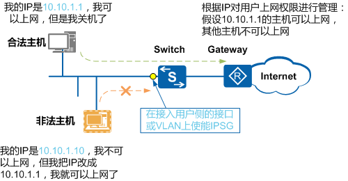
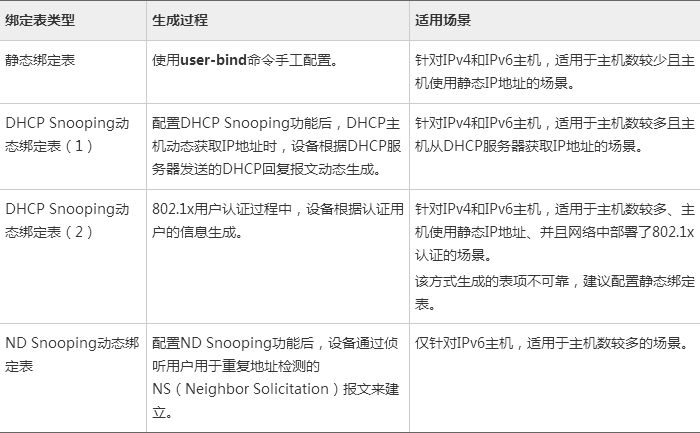
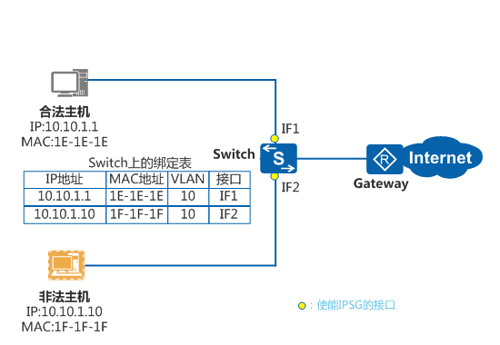
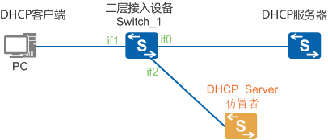

DHCP服务已是网络中必不可少的服务之一。随着DHCP服务的部署，一些安全问题也逐渐暴露出一些问题：

- DHCP报文泛红攻击
- 仿冒DHCP报文攻击
- DHCP仿冒者攻击
- DHCP server拒绝服务攻击
- 仿冒DHCP服务器攻击

DHCP Snooping是DHCP（Dynamic Host Configuration Protocol）的一种安全特性，用于保证DHCP客户端从合法的DHCP服务器获取IP地址，并记录DHCP客户端IP地址与MAC地址等参数的对应关系，防止网络上针对DHCP攻击。

> 这里要注意的是：DHCP snooping 只是会动态的生成绑定表，需要结合其它功能和特性来实现安全防护。

### 1.DHCP报文泛红攻击

在DHCP网络环境中，若存在DHCP用户短时间内向设备发送大量的DHCP报文，将会对设备的性能造成巨大的冲击以致可能会导致设备无法正常工作。通过使能对DHCP报文上送DHCP报文处理单元的速率进行检测功能将能够有效防止DHCP报文泛洪攻击。

**解决办法：**
配置限制DHCP报文的上送速率，可在系统视图、VLAN视图或接口视图下执行。

执行命令`dhcp snooping check dhcp-rate enable`，使能对DHCP报文上送DHCP报文处理单元的速率进行检测功能。
缺省情况下，未使能对DHCP报文上送DHCP报文处理单元的速率进行检测功能。

执行命令`dhcp snooping check dhcp-rate rate`，配置DHCP报文上送DHCP报文处理单元的最大允许速率。
缺省情况下，全局DHCP报文上送DHCP报文处理单元的最大允许速率为**100pps**，接口下DHCP报文上送DHCP报文处理单元的最大允许速率为在系统视图下配置的值。

### 2.仿冒DHCP报文攻击

在DHCP网络环境中，若攻击者仿冒合法用户的DHCP Request报文发往DHCP Server，将会导致用户的IP地址租约到期之后不能够及时释放，以致合法用户无法使用该IP地址；若攻击者仿冒合法用户的DHCP Release报文发往DHCP Server，将会导致用户异常下线。
在生成DHCP Snooping绑定表后，设备可根据绑定表项，对DHCP Request报文或DHCP Release报文进行匹配检查，只有匹配成功的报文设备才将其转发，否则将丢弃。这将能有效的防止非法用户通过发送伪造DHCP Request或DHCP Release报文冒充合法用户续租或释放IP地址。

**解决办法：**
使能对DHCP报文进行绑定表匹配检查的功能，可在系统视图、VLAN视图或接口视图下进行配置。

执行命令`dhcp snooping check dhcp-request enable vlan { vlan-id1 [ to vlan-id2 ] }&<1-10>`，使能对从指定VLAN内上送的DHCP报文进行绑定表匹配检查的功能。
缺省情况下，未使能对DHCP报文进行绑定表匹配检查的功能。

在VLAN或者接口视图下：
执行命令`dhcp snooping check dhcp-request enable`，使能对DHCP报文进行绑定表匹配检查的功能。
缺省情况下，未使能对DHCP报文进行绑定表匹配检查的功能。

### 3. DHCP仿冒者攻击：

此功能需要结合IPSG来实现：

随着网络规模越来越大，通过伪造源IP地址实施的网络攻击（简称IP地址欺骗攻击）也逐渐增多。一些攻击者通过伪造合法用户的IP地址获取网络访问权限，非法访问网络，甚至造成合法用户无法访问网络，或者信息泄露。IPSG针对IP地址欺骗攻击提供了一种防御机制，可以有效阻止此类网络攻击行为。
一个典型的利用IPSG防攻击的示例如图1所示，非法主机伪造合法主机的IP地址获取上网权限。此时，通过在Switch的接入用户侧的接口或VLAN上部署IPSG功能，Switch可以对进入接口的IP报文进行检查，丢弃非法主机的报文，从而阻止此类攻击。

IPSG利用绑定表（源IP地址、源MAC地址、所属VLAN、入接口的绑定关系）去匹配检查二层接口上收到的IP报文，只有匹配绑定表的报文才允许通过，其他报文将被丢弃。

绑定表生成后，IPSG基于绑定表向指定的接口或者指定的VLAN下发ACL，由该ACL来匹配检查所有IP报文。主机发送的报文，只有匹配绑定表才会允许通过，不匹配绑定表的报文都将被丢弃。当绑定表信息变化时，设备会重新下发ACL。缺省情况下，如果在没有绑定表的情况下使能了IPSG，设备会允许IP协议报文通过，但是会拒绝所有的数据报文。

> IPSG只匹配检查主机发送的IP报文，对于ARP、PPPoE等非IP报文，IPSG不做匹配检查。

**IPSG实现原理图**

### 4.DHCP server拒绝服务攻击

若在网络中存在DHCP用户恶意申请IP地址，将会导致IP地址池中的IP地址快速耗尽以致DHCP Server无法为其他合法用户分配IP地址。另一方面，DHCP Server通常仅根据CHADDR（client hardware address）字段来确认客户端的MAC地址。如果攻击者通过不断改变DHCP Request报文中的CHADDR字段向DHCP Server申请IP地址，将会导致DHCP Server上的地址池被耗尽，从而无法为其他正常用户提供IP地址。
为了防止某些端口的DHCP用户恶意申请IP地址，可配置接口允许学习的DHCP Snooping绑定表项的最大个数来控制上线用户的个数，当用户数达到该值时，则任何用户将无法通过此接口成功申请到IP地址。为了防止攻击者不断改变DHCP Request报文中的CHADDR字段进行攻击，可使能检测DHCP Request报文帧头MAC地址与DHCP数据区中CHADDR字段是否相同的功能，相同则转发报文，否则丢弃。

**解决办法：**
配置接口允许学习的DHCP Snooping绑定表项的最大个数，可在系统视图、VLAN视图或接口视图下配置。

执行命令`dhcp snooping max-user-number max-number vlan { vlan-id1 [ to vlan-id2 ] } &<1-10>`，配置设备允许学习的DHCP Snooping绑定表项的最大个数。
执行该命令后，设备所有的接口允许学习的DHCP Snooping绑定表项之和为该命令所配置的值。

在VLAN或者接口视图下：
执行命令`dhcp snooping max-user-number max-number`，配置接口允许学习的DHCP Snooping绑定表项的最大个数。
若在VLAN视图下执行该命令，则VLAN内所有的接口接入的用户最大数为该命令所配置的值。

### 5.仿冒DHCP服务器攻击

此功能需要配置DHCP 信任功能来实现：

配置接口信任状态

背景信息

如图所示场景中，为使DHCP客户端能通过合法的DHCP服务器获取IP地址，需将与管理员信任的DHCP服务器直接或间接连接的设备接口设置为信任接口（如图中的if0），其他接口设置为非信任接口（如图中的if2）。从而保证DHCP客户端只能从合法的DHCP服务器获取IP地址，私自架设的DHCP Server仿冒者无法为DHCP客户端分配IP地址。
在连接用户的接口或VLAN下使能DHCP Snooping功能之后，需将连接DHCP服务器的接口配置为“信任”模式，两者同时生效设备即能够生成DHCP Snooping动态绑定表。

**解决办法：**
请在二层网络中的接入设备上执行以下步骤。
配置接口为“信任”状态，可在接口视图或VLAN视图下执行。
接口视图下：
执行命令`interface interface-type interface-number`，进入接口视图。
执行命令`dhcp snooping trusted`，配置接口为“信任”接口。
缺省情况下，接口的状态为“非信任”状态。
VLAN视图下：
执行命令`vlan vlan-id`，进入VLAN视图。
执行命令`dhcp snooping trusted interface interface-type interface-number` ，配置接口为“信任”接口。
缺省情况下，接口的状态为“非信任”状态。
在VLAN视图下执行此命令，则命令功能仅对加入该VLAN的接口收到的属于此VLAN的DHCP报文生效；在接口下执行该命令，则命令功能对该接口接收到的所有DHCP报文生效。

