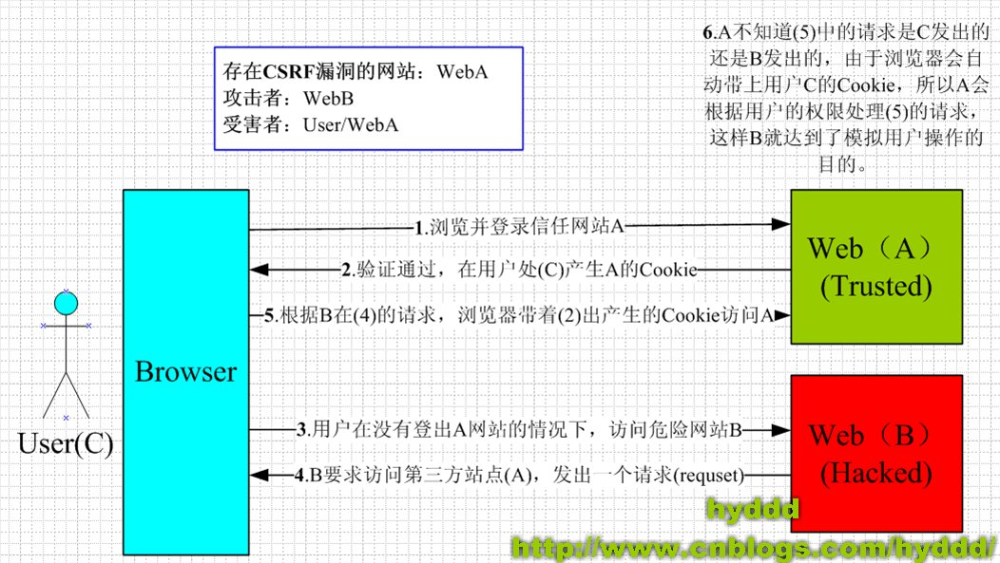
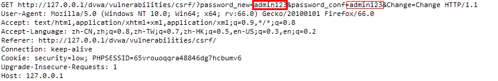
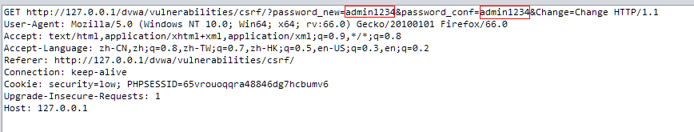
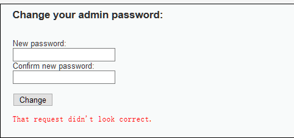
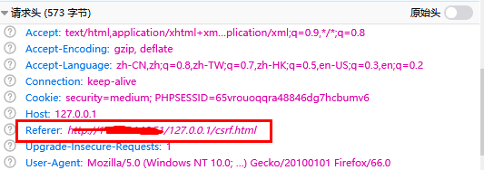
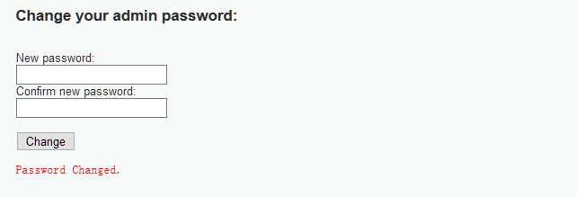
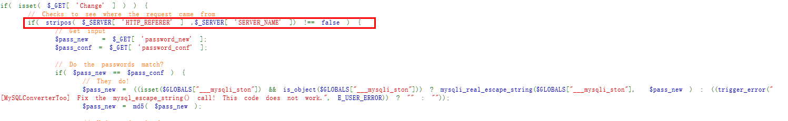
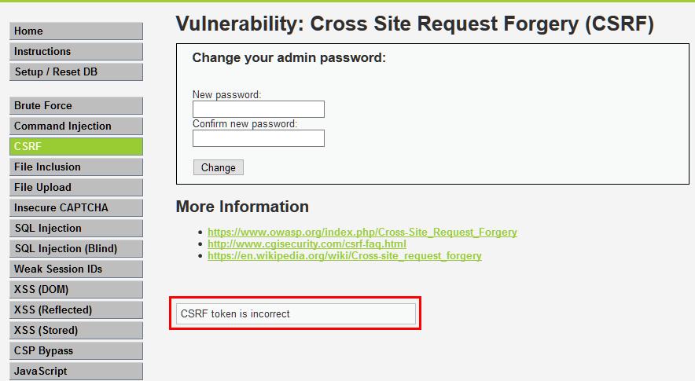
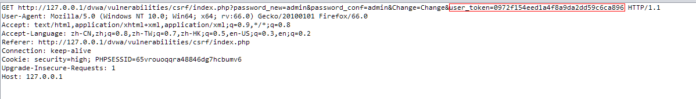
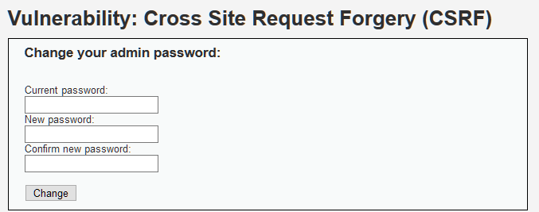

## 什么是CSRF


CSRF（Cross Site Request Forgery），中文是跨站点请求伪造。CSRF攻击者在用户已经登录目标网站之后，诱使用户访问一个攻击页面，利用目标网站对用户的信任，以用户身份在攻击页面对目标网站发起伪造用户操作的请求，达到攻击目的。


CSRF的原理图：





图片来自https://www.cnblogs.com/wangyuyu/p/3388169.html


可以看到CSRF是利用了受害者已登录的A网站cooike未失效的情况下诱导用户访问B网站，而访问B网站时会携带A网站的cookie，这样就导致了使用A网站用户的权限处理了B网站的恶意请求。


## LOW等级


正常去修改密码，查看浏览器的请求。





发现再request请求中，浏览器想服务器发送了get请求，只要get请求中包含新密码和确认密码两个字段就可修改密码，那是否可以自己构造get请求来修改密码呢，进行尝试：





尝试后发现密码修改成功。


当然再实际场景下，我们不可能以这种方式去修改别人的密码，但是我们必须知道修改密码的原理。


这时候我们就需要利用CSRF漏洞了，可以伪造一个URL发送给受害者，他一旦点击密码就会修改。用http:/1.1.1.1/dvwa/vulnerabilities/csrf/?password_new=admin1234&password_conf=admin1234&Change=Change这样的链接显然不合适，可以利用短链接生成器或者直接伪造HTML页面发送。


> 1.1.1.1是一个可以访问的公网地址，这里我就随便写了个


这里我使用短链接生成网站[http://url.tool.cc/](http://url.tool.cc/)来生成一个短连接`http://t.cn/EasESOu`


再浏览器里点击这个短连接，密码即可修改，这就是CSRF最简单的一个利用。


## Medium等级


尝试用Low等级的方法，发现无效，页面弹出错误信息：





这时候就得去思考为什么会出现这种错误，在这之前我们应该先了解下CSRF的防护，CSRF的防护可以有这几种：

- 尽量使用POST，限制GET

GET接口太容易被拿来做CSRF攻击，看第一个示例就知道，只要构造一个img标签，而img标签又是不能过滤的数据。接口最好限制为POST使用，GET则无效，降低攻击风险。


当然POST并不是万无一失，攻击者只要构造一个form就可以，但需要在第三方页面做，这样就增加暴露的可能性。

- 浏览器Cookie策略

IE6、7、8、Safari会默认拦截第三方本地Cookie（Third-party Cookie）的发送。但是Firefox2、3、Opera、Chrome、Android等不会拦截，所以通过浏览器Cookie策略来防御CSRF攻击不靠谱，只能说是降低了风险。


PS：Cookie分为两种，Session Cookie（在浏览器关闭后，就会失效，保存到内存里），Third-party Cookie（即只有到了Exprie时间后才会失效的Cookie，这种Cookie会保存到本地）。


PS：另外如果网站返回HTTP头包含P3P Header，那么将允许浏览器发送第三方Cookie。

- 加验证码

验证码，强制用户必须与应用进行交互，才能完成最终请求。在通常情况下，验证码能很好遏制CSRF攻击。但是出于用户体验考虑，网站不能给所有的操作都加上验证码。因此验证码只能作为一种辅助手段，不能作为主要解决方案。

- Referer Check

Referer Check在Web最常见的应用就是“防止图片盗链”。同理，Referer Check也可以被用于检查请求是否来自合法的“源”（Referer值是否是指定页面，或者网站的域），如果都不是，那么就极可能是CSRF攻击。


但是因为服务器并不是什么时候都能取到Referer，所以也无法作为CSRF防御的主要手段。但是用Referer Check来监控CSRF攻击的发生，倒是一种可行的方法。

- Anti CSRF Token

现在业界对CSRF的防御，一致的做法是使用一个Token（Anti CSRF Token）。


例子：

1. 用户访问某个表单页面。
2. 服务端生成一个Token，放在用户的Session中，或者浏览器的Cookie中。
3. 在页面表单附带上Token参数。
4. 用户提交请求后， 服务端验证表单中的Token是否与用户Session（或Cookies）中的Token一致，一致为合法请求，不是则非法请求。

这个Token的值必须是随机的，不可预测的。由于Token的存在，攻击者无法再构造一个带有合法Token的请求实施CSRF攻击。另外使用Token时应注意Token的保密性，尽量把敏感操作由GET改为POST，以form或AJAX形式提交，避免Token泄露。


注意：


CSRF的Token仅仅用于对抗CSRF攻击。当网站同时存在XSS漏洞时候，那这个方案也是空谈。所以XSS带来的问题，应该使用XSS的防御方案予以解决。


经过不断尝试后，发现High等级是用了检查Refer来预防CSRF，那我们是否可以构造和目标网站相同的Refer来进行攻击呢？


> 不了解http头中Refer作用的可以先去百度下


我这里是写了一个html网页并将其放在了服务器的一个名为`127.0.0.1`的目录下，这样访问的时候Refer字段中就会存在127.0.0.1，从而骗过了后端代码的验证。


html代码如下：


```html
_<p>美女图片，点击下方按钮查看</p>
<form method="get" action="http://127.0.0.1/dvwa/vulnerabilities/csrf/">
  <input type="hidden" name="passwordnew" value="admin">
  <input type="hidden" name="passwordconf" value="admin">
  <input type="hidden" name="Change" value="Change">
  <input type="submit" name="" value="查看">
</form>_

```


验证是否可以修改密码，将此链接发给受害者，诱导他点击。


抓包看到，Refer中已经包含了`127.0.0.1`





密码也成功修改：





可以看到Medium等级的CSRF只要请求头中的Refer包含了Host就可以攻击成功，查看源码也是如此：





## High等级


使用前面的方法去尝试，发现都不可用，提示`CSRF token is incorrect`





抓包可发现，此次修改密码时需要添加token字段：





token字段是不断变化的，不知道此字段的情况下是无法修改密码的，High等级的CSRF攻击需要配合后面的XSS漏洞一起，这里就先不做介绍，等XSS漏洞时一起介绍。


## Impossible等级


Impossible等级修改密码时需要先输入当前密码。这一措施使得CSRF攻击无法进行。




