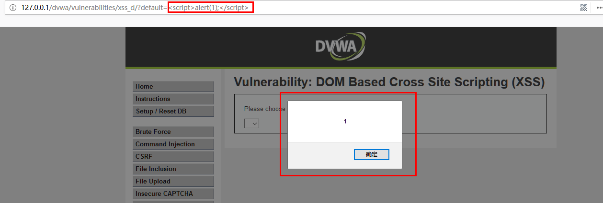
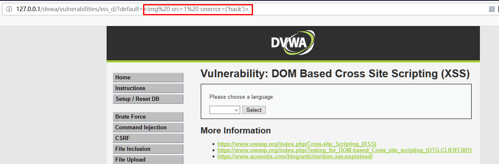
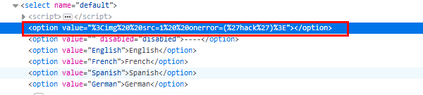
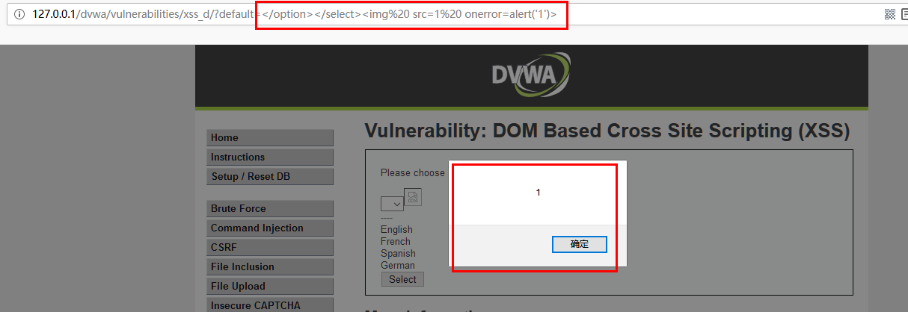
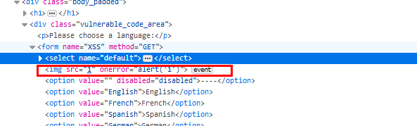
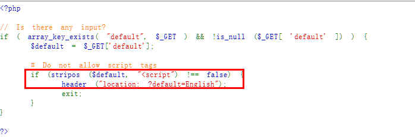
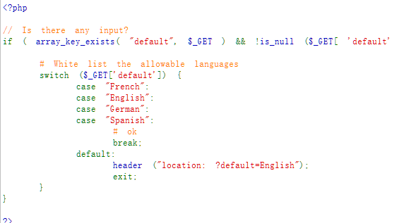
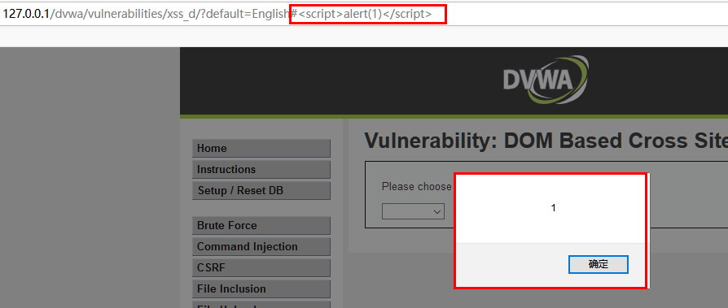
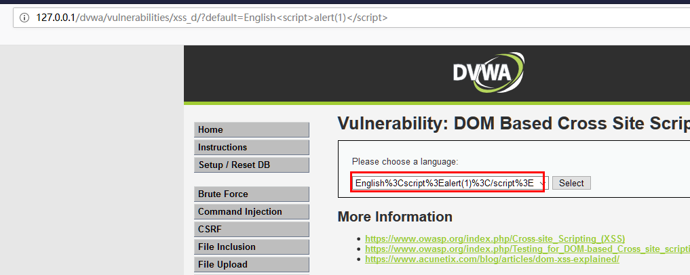

## XSS 简介


XSS(Cross Site Scripting) 跨站脚本攻击，CSS的重点不在跨站上，而在脚本上。大多数的XSS攻击是在目标网站上嵌入一段恶意的JS代码来完成特性的攻击，如获取用户登陆信息，获取键盘输入，网页截屏等操作。


XSS的危害：

- 通过document.cookie盗取cookie
- 使用js或css破坏页面正常的结构与样式
- 流量劫持（通过访问某段具有window.location.href定位到其他页面）
- Dos攻击：利用合理的客户端请求来占用过多的服务器资源，从而使合法用户无法得到服务器响应。
- 利用iframe、frame、XMLHttpRequest或上述Flash等方式，以（被攻击）用户的身份执行一些管理动作，或执行一些一般的如发微博、加好友、发私信等操作。
- 利用可被攻击的域受到其他域信任的特点，以受信任来源的身份请求一些平时不允许的操作，如进行不当的投票活动。

XSS大概有三种攻击方式，DOM型XSS, 反射性XSS，存储型XSS。


本篇文章先介绍DOM型XSS


## DOM型XSS


基于DOM的XSS不需要服务器参与参数的解析，完全由浏览器完成，DOM—based XSS漏洞是基于文档对象模型Document Objeet Model，DOM)的一种漏洞。DOM是一个与平台、编程语言无关的接口，它允许程序或脚本动态地访问和更新文档内容、结构和样式，处理后的结果能够成为显示页面的一部分。DOM中有很多对象，其中一些是用户可以操纵的，如uRI ，location，refelTer等。客户端的脚本程序可以通过DOM动态地检查和修改页面内容，它不依赖于提交数据到服务器端，而从客户端获得DOM中的数据在本地执行，如果DOM中的数据没有经过严格确认，就会产生DOM—based XSS漏洞。


> 当javascript在浏览器执行时，浏览器提供给javascript代码几个DOM对象。文档对象首先在这些对象之中，并且它代表着大多数浏览器呈现的页面的属性。这个文档对象包含很多子对象，例如location，URL和referrer。这些对象根据浏览器的显示填充浏览器。因此， document.URL 和 document.location是由页面的URL按照浏览器的解析填充的。注意这些对象不是提取自HTML的body-它们不会出现在数据页面。文档对象包含一个body对象，它代表对于HTML的解析。


**举个例子：**


下面这段代码会从url中获取当前登陆的用户名：


```html
<HTML>
<TITLE>Welcome!</TITLE>
Hi
<SCRIPT>
var pos=document.URL.indexOf("name=")+5;
document.write(document.URL.substring(pos,document.URL.length));
</SCRIPT>
<BR>
Welcome to our system
…
</HTML>

```


通常这个页面作为用户欢迎页面, 例如:


```text
http://www.vulnerable.site/welcome.html?name=Joe

```


上面的代码就会获取此url中的`joe`用户名


然而当攻击者构造一个恶意的URL：


```json
http://www.vulnerable.site/welcome.html?name=<script>alert(document.cookie)</script>

```


将产生xss条件。


## Low等级


选择一个语言，抓包发现request请求为：


```text
_http://127.0.0.1/dvwa/vulnerabilities/xssd/?default=French_

```


在`default=`后面构造xss，会不会造成恶意代码执行呢，尝试一下：





执行成功。


## Medium等级


和Low等级执行相同的xss，发现无法执行，怀疑是对用户输入做了过滤，变换构造方法再次执行：





界面上无任何提示，我们查看网页源代码，发现我们的语句被插入到了value值中，但是并没有插入到option标签的值中，所以img标签并没有发起任何作用。





所以构造链接：


```json
_http://127.0.0.1/dvwa/vulnerabilities/xssd/?default=</option></select>_

```





可看到执行成功，因为将`<option>`闭合后, 构造的参数成了独立的js代码。





查看Medium等级源码，发现对`<script>`做了过滤。





## High等级


使用Medium等级的构造进行执行，发现无效。


查看源代码：





这里high级别的代码先判断defalut值是否为空，如果不为空的话，再用switch语句进行匹配，如果匹配成功，则插入case字段的相应值，如果不匹配，则插入的是默认的值。这样的话，我们的语句就没有可能插入到页面中了。


但是我们可以利用url中`#`号的特殊性，**URL中#号之后的内容，不会被提交到服务器，可以直接与浏览器进行交互**。





可以看到此方法依旧可以执行js代码。


## Impossible等级


尝试使用：


```json
_http://127.0.0.1/dvwa/vulnerabilities/xssd/?default=English<script>alert(1)</script>_

```


发现语言框内的值是我们输入的参数的经过URL编码后的数据：





查看源代码，发现这里对我们输入的参数并没有进行URL解码，所以我们输入的任何参数都是经过URL编码，然后直接赋值给option标签。所以，就不存在XSS漏洞了。

