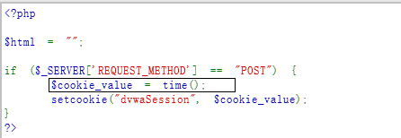

## session ID简介


由于HTTP协议是无连接的协议，也就是说当客户端访问通过HTTP协议访问服务器时，服务器是无法知道访问我的到底是哪一个客户端。这种情况会导致一系列的问题，比如无法判断是哪个用户登录或者无法面向用户提供差异化服务。于是session ID上场了，用户访问服务器的时候，一般服务器都会分配一个身份证 session id 给用户，用于标识。一个Session ID就对应一个客户端，用户拿到session id 后就会保存到 cookies 上，之后只要拿着 cookies 再访问服务器，服务器就知道你是谁了。


但是 session id 过于简单就会容易被人伪造，根本都不需要知道用户的密码就能登录服务器了。


## Low等级


判断session ID分配的方法就是通过抓包寻找规律，但是稍微正常点的网站都会使用随机值去分配Session ID，不像Low等级一样这么傻。


点击Genetate抓包查看cookies。


```text
Cookie: dvwaSession=1; security=low; PHPSESSID=phfts9604mgm9mbn4pqqlmkos1

```


```text
Cookie: dvwaSession=2; security=low; PHPSESSID=phfts9604mgm9mbn4pqqlmkos1

```


...


可发现session id是由1不断增加，每次加1.


查看代码也是如此：


## Medium等级


同样点击Genetate抓包查看cookies。


```text
dvwaSession=1557241378; security=medium; PHPSESSID=phfts9604mgm9mbn4pqqlmkos1

```


```text
Cookie: dvwaSession=1557241380; security=medium; PHPSESSID=phfts9604mgm9mbn4pqqlmkos1

```


...


判断规律，发现是当前时间的时间戳，这个有点难判断，但是遇到这种10位数的我们应该往这上面去想。推荐一个在线工具可计算时间戳：[https://tool.lu/timestamp/](https://tool.lu/timestamp/)


查看代码：





## High等级


同样点击Genetate抓包查看cookies。


```text
_dvwaSession=9bf31c7ff062936a96d3c8bd1f8f2ff3; expires=Tue, 07-May-2019 16:13:41 GMT; path=/vulnerabilities/weakid/; domain=127.0.0.1_

```


```text
_dvwaSession=c74d97b01eae257e44aa9d5bade97baf; expires=Tue, 07-May-2019 16:14:29 GMT; path=/vulnerabilities/weakid/; domain=127.0.0.1_

```


...


观察9bf31c7ff062936a96d3c8bd1f8f2ff3和c74d97b01eae257e44aa9d5bade97baf  是不是很像32位的MD5加密呢，尝试去解密：


9bf31c7ff062936a96d3c8bd1f8f2ff3解密为15


c74d97b01eae257e44aa9d5bade97baf解密为16


可发现此等级和Low等级一样也是逐渐加1，只不过用了MD5进行加密。


查看代码：


## Impossible等级


```text
_dvwaSession=ff034153e10d10820f6e0cb9602fbc3faf7ece57; expires=Tue, 07-May-2019 16:32:46 GMT; path=/vulnerabilities/weakid/; domain=127.0.0.1; secure; httponly_

```


此等级下的session id 为40位的随机字符串，无规律可循。


查看代码：


可看到是由随机字符串加时间戳再由sha1加密后的字符串，无法破解。

