## 反射型XSS简介


接着[上篇文章](https://darkless.cn/2019/05/11/dvwa-xss-dom/)介绍下什么是反射性XSS。


在三种类型的XSS中，反射型XSS是利用最广泛的一种。它通过给别人发送带有恶意脚本代码参数的URL，当URL地址被打开时，特有的恶意代码参数被HTML解析、执行。它的特点是非持久化，必须用户点击带有特定参数的链接才能引起。


## Low等级


先尝试在输入框中随便输入一个字符。


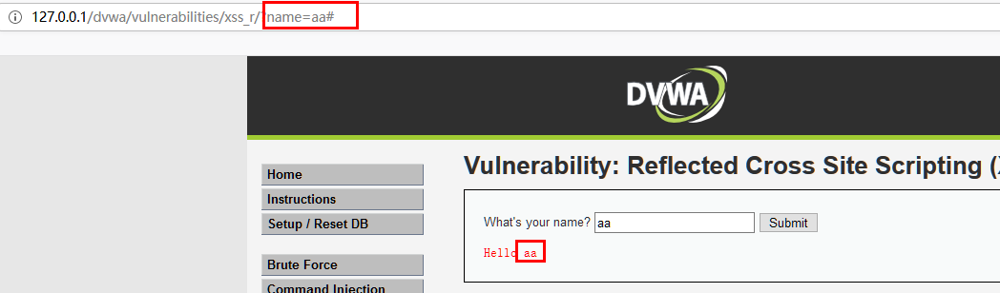


可见，服务器是从输入框中获取用户输入，然后展示在前端页面上，那随便输入一段JS代码，看能否执行。


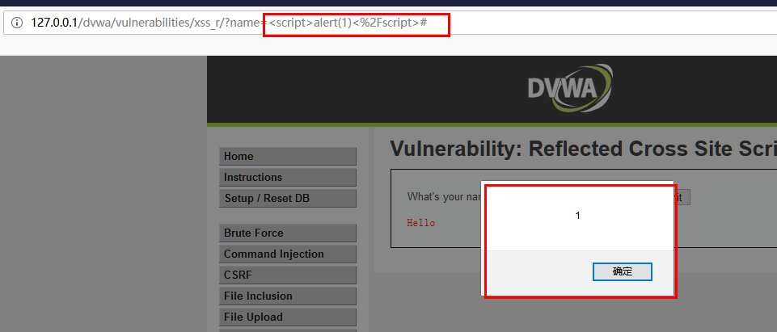


js代码被执行，说明存在xss攻击。


查看源码发现，并未对用户的输入做任何过滤：


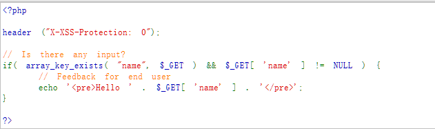


## Medium等级


使用Low等级的方法，输入一下js代码


```json
<script>alert(1)</script>

```


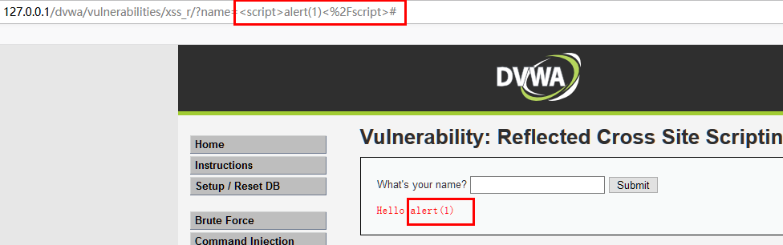


发现前端直接显示了alert(1),说明将用户输入的`<acript>`标签做了过滤。 换一种构造方式，重新输入：


在输入框中输入:


```json


```


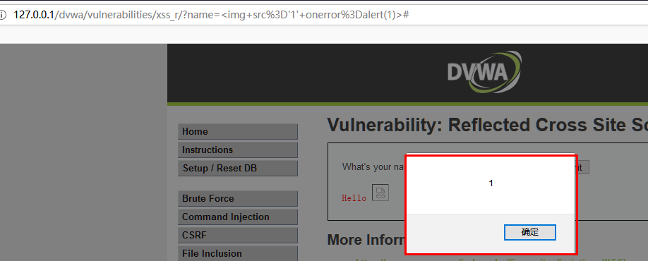


利用成功，查看源码发现对用户输入的`<script>`关键字做了替换，但并未对其它可能造成的xss攻击代码关键字做过滤。


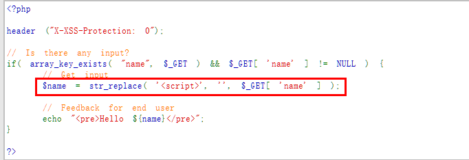


## High等级


使用Medium等级的方法输入发现也可以造成xss攻击：


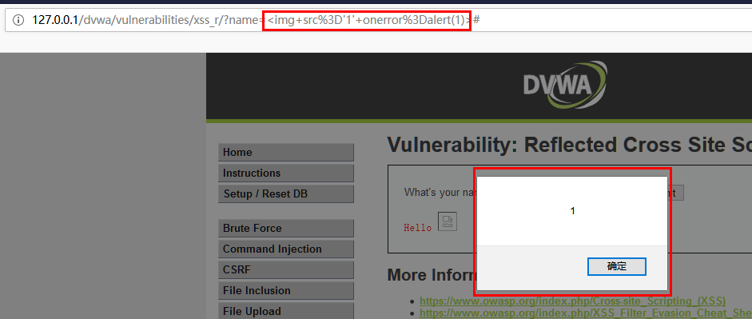


查看源码，发现只是用正则表达式匹配`<script>`里面的字母来做替换，并不能从根本上预防xss。


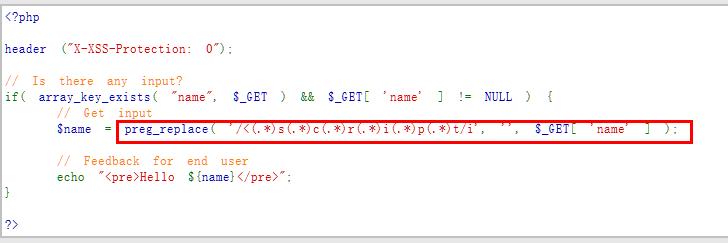


## Impossible等级


随便输入一个字符查看结果：


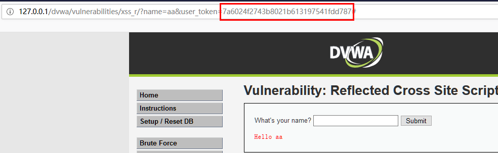


_发现此等级还使用了usertoken。_


使用High等级的方法进行输入：


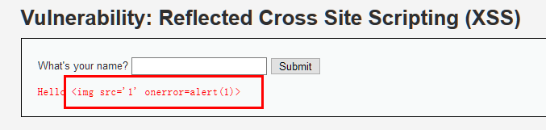


发现直接将用户的输入原封不动的打印了出来，这样的话我们的任何构造输入都将无效。


查看源码：


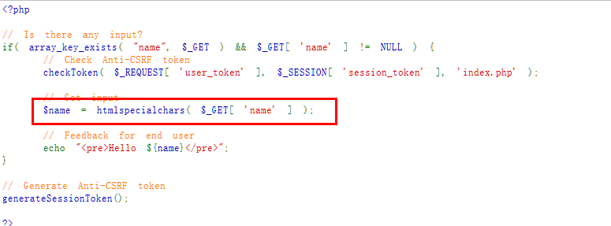


发现使用了`htmlspecialchars()`函数，它会把预定义的字符 "<" （小于）和 ">" （大于）转换为 HTML 实体。

