## 存储型XSS简介

存储型XSS也叫持久型XSS，这种XSS需要服务端的参与，它与反射型XSS的区别在于XSS代码是否持久化（硬盘，数据库）。反射型XSS过程中后端服务器仅仅将XSS代码保存在内存中，并未持久化，因此每次触发反射性XSS都需要由用户输入相关的XSS代码；而持久型XSS则仅仅首次输入相关的XSS代码，保存在数据库中，当下次从数据库中获取该数据时在前端未加字串检测和excape转码时，会造成XSS，而且由于该漏洞的隐蔽性和持久型的特点，在多人开发的大型应用和跨应用间的数据获取时造成的大范围的XSS漏洞，危害尤其大。

存储型XSS最容易在留言板，个性签名等用户输入的文本会存储到数据库中的地方发生。

## Low等级

此等级和反射型XSS一样没有做任何防护，直接输入js代码即可执行，需要注意的是，此js代码会存储进数据库中，每当用户访问此页面就会执行一次XSS。

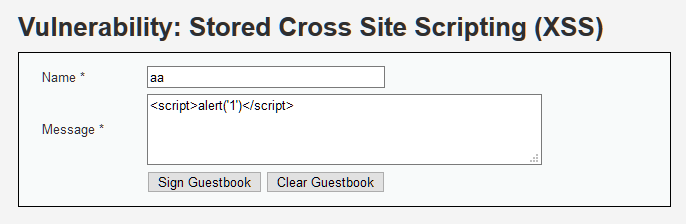

提交到留言板中就会执行xss，并且每次刷新此页面就会被执行一次。

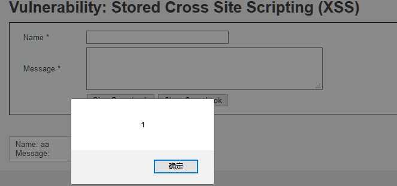

## Medium等级

提交Low等级的js代码，发现服务器将`<script>`标签过滤了。

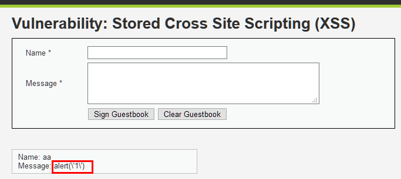

那不使用`<script>`标签，换用其它标签试试。

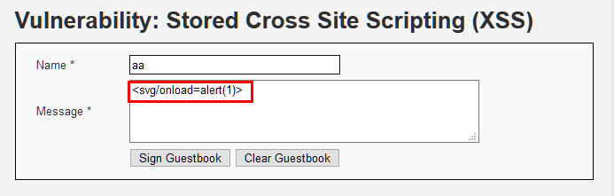

发现输出结果为空，且没有执行XSS。

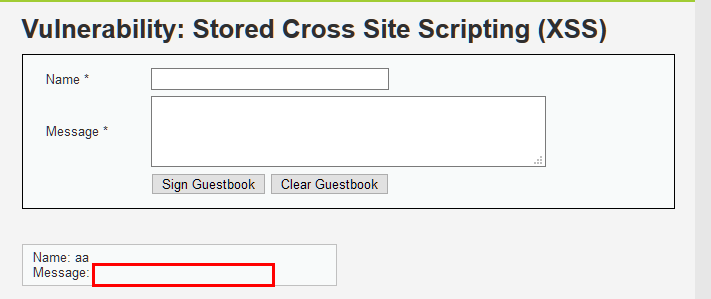

查看源码发现：

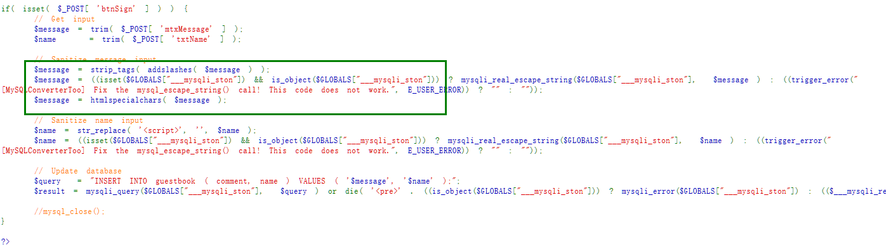

与Low级的相比，name值的处理增加了一个_`strreplace()`_ 函数，用来将字符串中含有`<script>`的字符串替换为空字符，从而稍微有点过滤作用；message值的处理中，在其第二次调用`trim()`函数时还内嵌了两个函数，先是使用`addslashes()` 函数、返回在预定义字符之前添加反斜杠的字符串，然后调用_`striptags()`_函数来剥去字符串中的HTML、XML 以及 PHP 的标签，在最后再调用`htmlspecialchars()` 函数、把预定义的字符转换为 HTML 实体，对输入的内容先进行HTML的编码然后再存储进服务器中，从而使message的SQL和XSS漏洞几乎不存在。

但是此等级对`name`的输入过滤不足，可以进行利用。

在输入name时，发现只允许输入10个字符，此时需要构造不超过10个字符的js代码或者抓包修改name输入进行上传，我使用的是第二种方法。

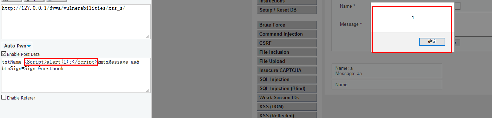

发现js代码执行成功，注意`<script>`中S大写。

## High等级

查看源码发现，在Medium等级的基础上，对name的输入也增加过滤，使用正则匹配`<script>`并进行替换，且大小写都替换。

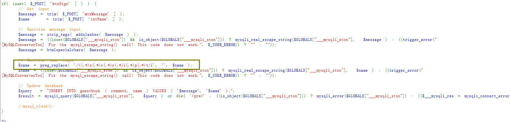

在Medium基础上重新构造js代码，不包含`<script`即可。

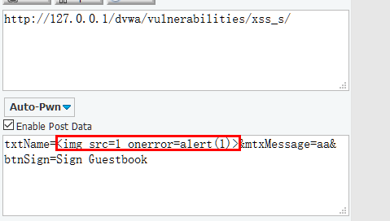

但是并没有执行XSS ，查看源码发现插入的js代码变为了如下形式：

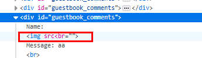

尝试将输入的js代码进行url编码后重新发送：

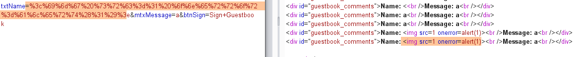

发现插入成功， xss执行。

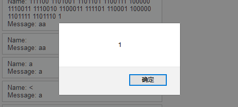

## Impossible等级

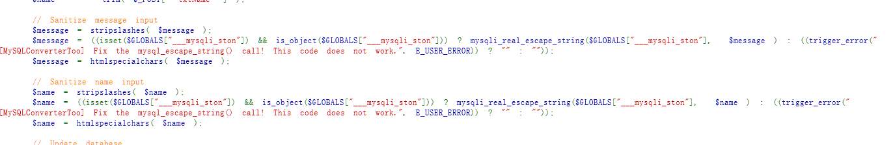

此等级对name和message的输入做了同等过滤，已无法进行xss。

