文件上传漏洞一般是因为网站上传文件的页面没有对文件类型做严格的过滤，从而导致攻击者能够上传任意文件，如webshell。


## Low等级


先上传一张正常的图片，观察上传过程。


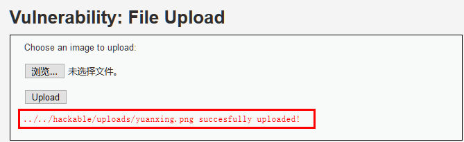


上传成功，并且界面上给出了上传地址，虽然是相对路径，但结合`http://127.0.0.1/dvwa/vulnerabilities/upload/`可以判断出上传路径为：`http://127.0.0.1/dvwa/hackable/uploads/`


那我们尝试直接上传其它类型的文件看能否上传成功，比如php文件。


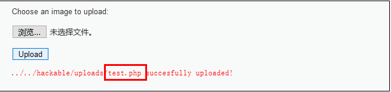


上传成功，接下来尝试访问此文件。


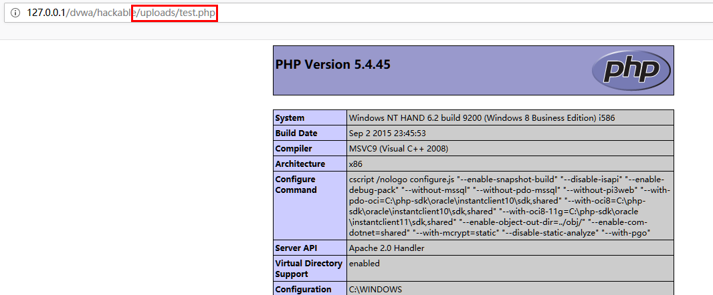


熟悉的味道，证明php文件可以执行，那么上传一句话木马也是可以的了。


## Medium等级


此等级下上传php文件会有提示`Your image was not uploaded. We can only accept JPEG or PNG images.`


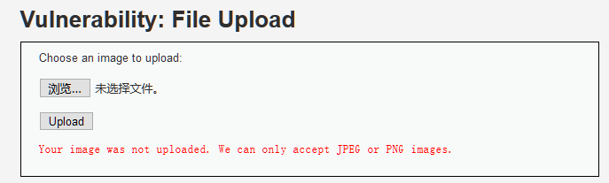


说明上传时对文件类型做了判断，非图片类型的文件是不能上传的。


抓包查看上传图片和上传其它文件有什么不同：


**上传图片抓包：**


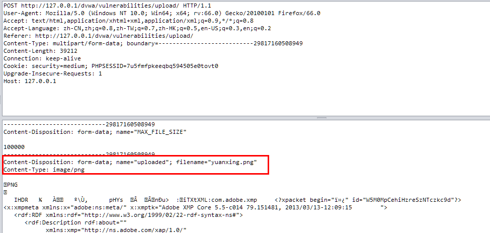


**上传php文件抓包：**


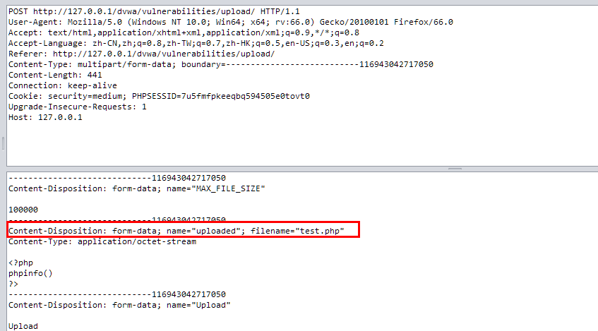


可以看到两个的`filename`和`content-type`不同，其余的都相同，那是否可以修改test.php文件的filename和content-type然后重新上传呢，来试一下。


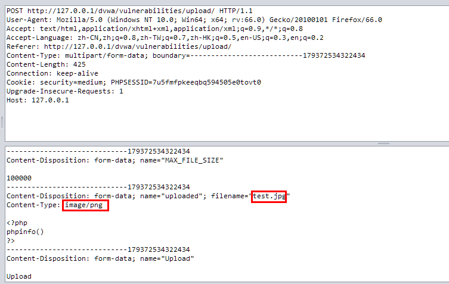


修改test.php为test.jpg, 修改content-type为image/png。 文件上传成功， 尝试去访问test.jpg，发现无法访问。


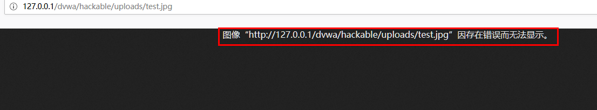


看来test.jpg里面的内容无法被读取，该怎么办呢，想起了上节的文件包含漏洞，访问文件时，只要里面有php代码就会被执行，尝试一下：


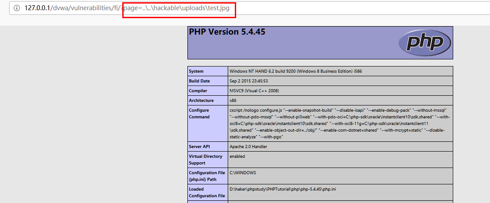


test.jpg中的PHP代码被正确执行。


第二种办法就是将test.php改一下后缀名，改为test.jpg，这样在上传时只需要改`filename`就行，修改方法与前面相同，不再赘述。


**查看Medum等级代码，发现代码对content-type和文件后缀名做了过滤，并且还限制了文件大小：**


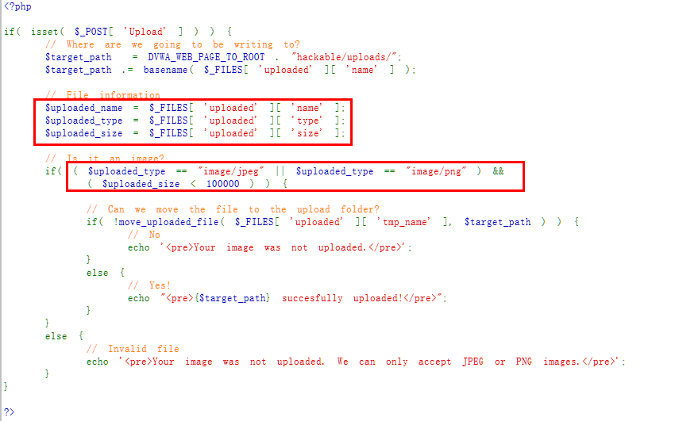


## High等级


此等级下使用修改数据包重新发送的方法已经不行了，也就是将php文件伪装成png或者jpeg格式的方法行不通了，难道后端代码对图片内容做了鉴定吗，非图片特征的不能上传。


有什么办法能够将php代码隐藏在图片中呢，想起来‘图种’是怎么弄的吗，在windows上可以用`copy`命令将文字和图片合到一起。


```shell
copy /b test.png+test.php  test1.png

```


用编辑器打开可以看到test.php中的代码已经被隐藏到test1.png中


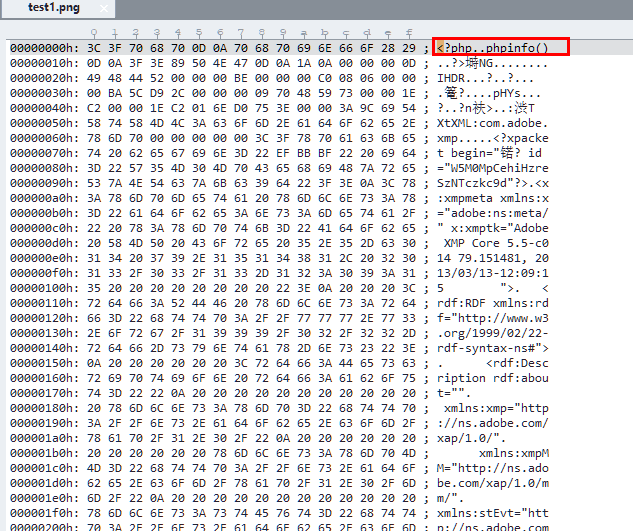


上传test1.png看能否成功。


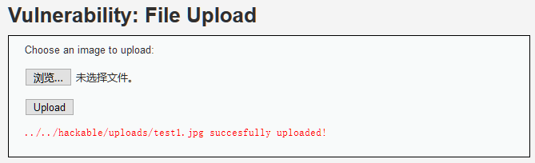


上传成功，利用文件包含漏洞查看能否解析test1.png里面存在的php代码：


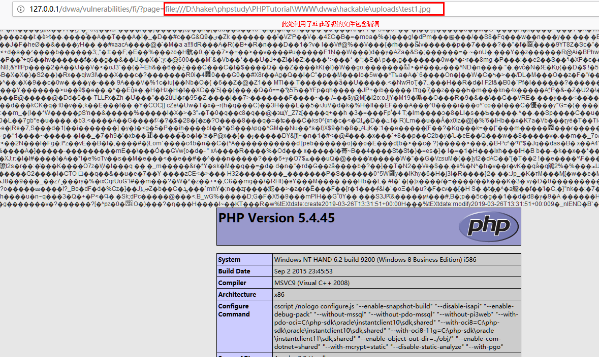


解析成功，可以被利用。


## Impossible等级


查看Impossible等级的代码：


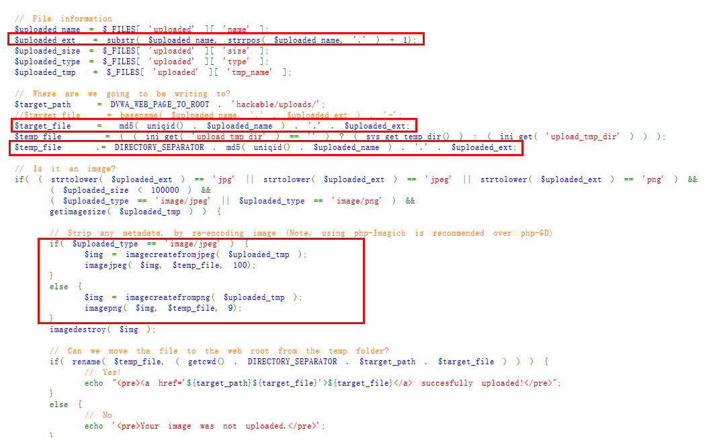


利用`substr`函数判断最后一个点号后面字符是否是合法的扩展名， 利用`md5`将上传的文件名变为随机字符串， 利用`imagejpeg`和`imagepng`去掉了不属于图片的部分。
这种方法有效避免了文件上传漏洞的产生。

