## 文件包含简介


服务器执行PHP文件时，可以通过文件包含函数加载另一个文件中的PHP代码，并且当PHP来执行，这会为开发者节省大量的时间。这意味着您可以创建供所有网页引用的标准页眉或菜单文件。当页眉需要更新时，您只更新一个包含文件就可以了，或者当您向网站添加一张新页面时，仅仅需要修改一下菜单文件（而不是更新所有网页中的链接）。


在PHP中文件包含函数有以下四种：

- require()
- _requireonce()_
- include()
- _includeonce()_

include和require区别主要是，include在包含的过程中如果出现错误，会抛出一个警告，程序继续正常运行；而require函数出现错误的时候，会直接报错并退出程序的执行。
而include_once()，require_once()这两个函数，与前两个的不同之处在于这两个函数只包含一次，适用于在脚本执行期间同一个文件有可能被包括超过一次的情况下，你想确保它只被包括一次以避免函数重定义，变量重新赋值等问题。


## 漏洞产生原因


件包含函数加载的参数没有经过过滤或者严格的定义，可以被用户控制，包含其他恶意文件，导致了执行了非预期的代码。


示例代码


```php
<?php
    $filename  = $_GET['filename'];
    include($filename);
?>_

```


$_GET['filename']`参数开发者没有经过严格的过滤，直接带入了include的函数，攻击者可以修改`$_`GET['filename']的值，执行非预期的操作。`_


## 本地文件包含


本地文件包含指的是可以执行windows或者linux下的敏感文件，这些文件一般不是PHP，执行这些文件可以直接显示出文件中的内容


### 常见的敏感信息路径


windows系统：


```text
c:\boot.ini // 查看系统版本

c:\windows\system32\inetsrv\MetaBase.xml // IIS配置文件

c:\windows\repair\sam // 存储Windows系统初次安装的密码

c:\ProgramFiles\mysql\my.ini // MySQL配置

c:\ProgramFiles\mysql\data\mysql\user.MYD // MySQL root密码

c:\windows\php.ini // php 配置信息

```


linux系统：


```text
/etc/passwd // 账户信息

/etc/shadow // 账户密码文件

/usr/local/app/apache2/conf/httpd.conf // Apache2默认配置文件

/usr/local/app/apache2/conf/extra/httpd-vhost.conf // 虚拟网站配置

/usr/local/app/php5/lib/php.ini // PHP相关配置

/etc/httpd/conf/httpd.conf // Apache配置文件

/etc/my.conf // mysql 配置文件

```


## 远程文件包含


PHP的配置文件_`allowurlfopen`_和_`allowurlinclude`_设置为ON，`include/require`等包含函数可以加载远程文件，如果远程文件没经过严格的过滤，导致了执行恶意文件的代码，这就是远程文件包含漏洞。


> allow_url_fopen = On（是否允许打开远程文件）  
> allow_url_include = On（是否允许include/require远程文件）


## LOW等级


先测试下LOW等级是否有本地文件包含漏洞：


点击页面上的`file1.php`查看链接为：`http://127.0.0.1/dvwa/vulnerabilities/fi/?page=file1.php`


尝试随便将链接更改一个不存在的文件，显示如下，将服务器的绝对路径也爆了出来。


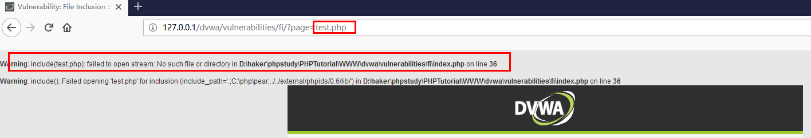


在服务器根目录下存在一个phpinfo文件，经过测试可以包含此文件：


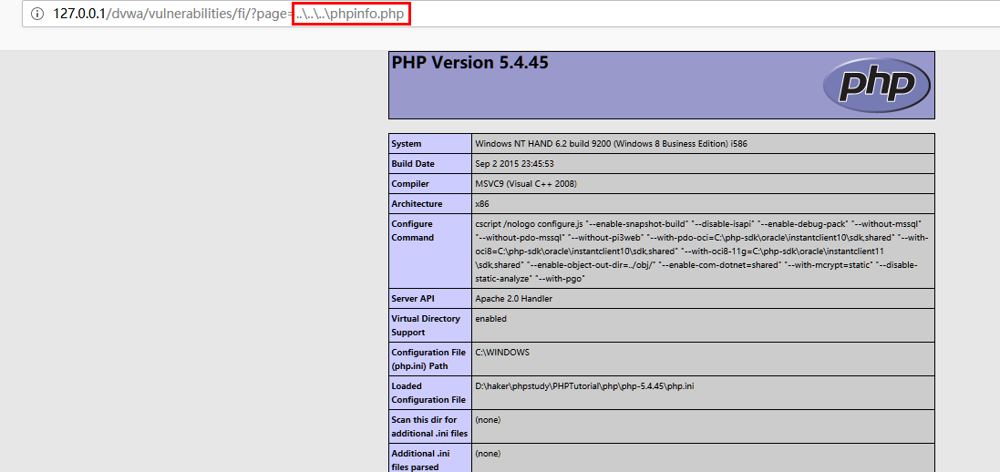


当然一般情况下很难爆出绝对路径，要靠去不断的猜测，当有本地文件包含漏洞时，可以和文件上传漏洞配合使用，上传一个大马getshell。


接下来测试是否可以远程包含：


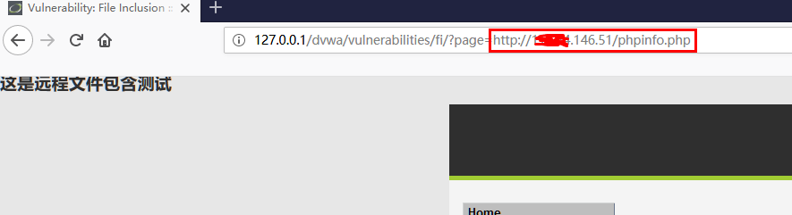


发现也可以远程包含，那这样就不用去上传文件执行了，我们写个木马放到远程服务器直接执行就可以了。


## Medium等级


同样和Low等级一样测试能否本地包含和远程包含。


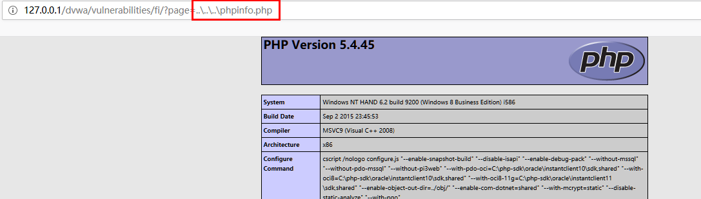


可以本地包含。


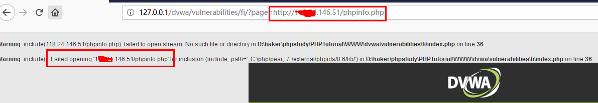


远程包含报错，猜测可能是服务器代码对包含的参数加了过滤，仔细分析报错可发现手工加的远程文件链接中的`http://`不见了，猜测可能是对`http://`加了过滤。


重新构造链接，查看能否被包含：


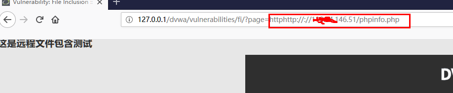


文件执行成功。


查看源码果然是对http://和https://进行了过滤，所以我们要善于观察。


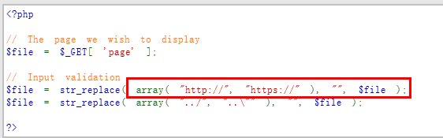


## High等级


High等级下，使用前面的办法都无法执行。


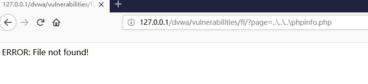


直接提示`ERROR: File not found!`


那为什么执行file1.php,file2.php,file3.php可以正常执行呢？


我们执行file10.php,发现报错信息和之前不一样了，猜测可能是只有file开头的文件才可以执行。


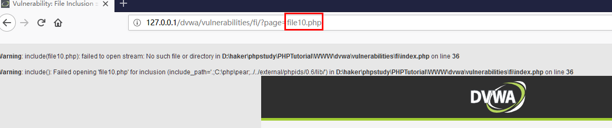


此时就无法使用远程文件包含了，而file开头的正是一种文件访问的格式，可以利用这一点去访问本地文件，但前提要知道此文件的绝对路径，这就必须配合后面的文件上传漏洞一起利用了。


查看源代码，发现也是如此：


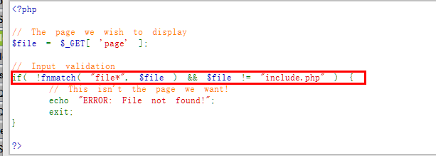


## Impossible等级


Impossible等价下对访问的文件做了白名单，其余任意文件都无法访问，这就有效避免了文件包含漏洞的产生。


代码如下：


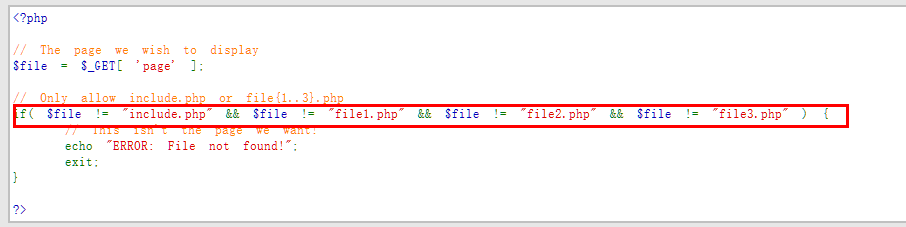


## 参考文章：


[https://www.freebuf.com/articles/web/182280.html](https://www.freebuf.com/articles/web/182280.html)

