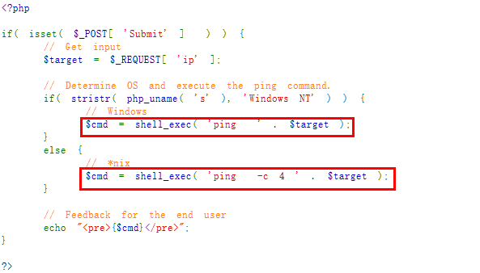
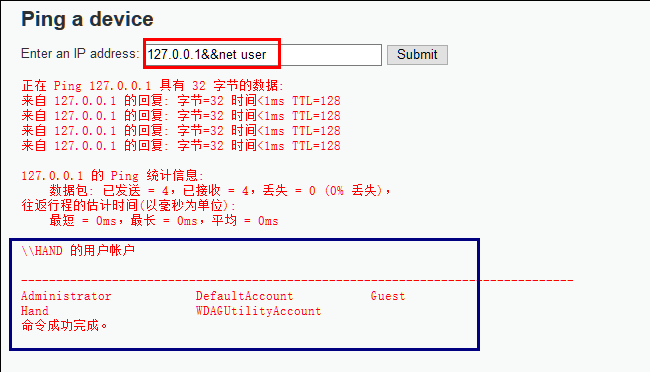
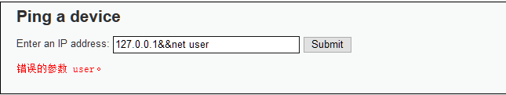
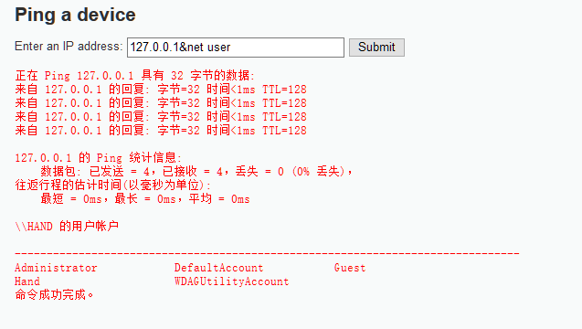
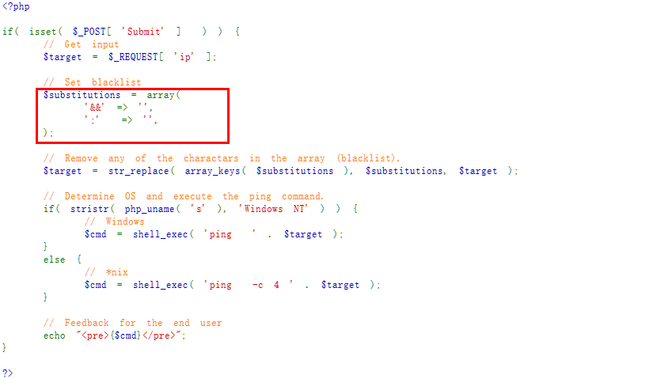
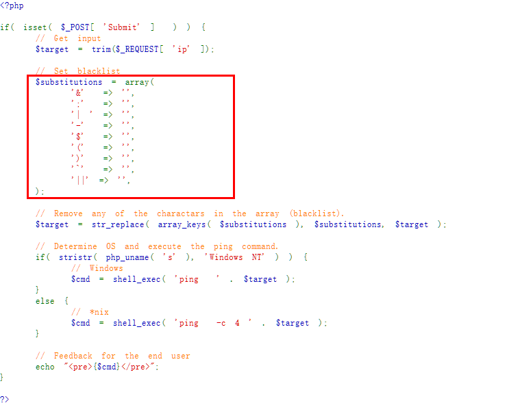

命令执行是指代码直接执行系统命令， 而我们可以利用windows或者linux下的命令拼接来达到执行另外的命令，这就是命令注入。


在命令执行中，常用的命令连接符号有四个：

- `&&`:前一个指令执行成功，后面的指令才继续执行，就像进行与操作一样
- `||`:前一个命令执行失败，后面的才继续执行，类似于或操作
- `&`：直接连接多个命令
- `|`：管道符，将前一个命令的输出作为下一个命令的输入
- `;`：直接连接多个命令

## Low等级


在DVWA的low等级中，代码完全没有过滤任何参数，直接去执行了系统命令，代码如下：





所以我们可以进行简单的命令拼接就可以达到目的：


在windows下可以使用`&&`或者`&`进行命令拼接，在linux下可以使用`;`或者`&&`进行命令拼接。


进行尝试：





可看到`net user`命令被正确执行。


## Medium等级


Medium等级下，先尝试用`&&`做命令拼接。





提示错误的参数，说明代码已经对输入的拼接做了过滤。再尝试用`&`拼接。





命令执行成功，产看源代码发现只对`&&`和`;`做了过滤：





## Hight等级


High等级下，尝试用`&&`和`&`都会提示错误参数，再使用`|`和`||`尝试，发现`|`可以正常执行命令，查看代码：





代码已经将可能用到的命令拼接符号全部做了过滤，但是为什么`|`可以呢，仔细观察发现`|`后面有个空格，这就是编码的不细心导致的命令执行。


## Impossible


Impossible等级使用了白名单的方式去检查我们的输入，它会将用户输入的数字用`.`分割，然后再重新拼接成IP地址，这就使得用户输入的其他参数是无效的。关键代码如下：


```php

    // Get input
    $target = $_REQUEST[ 'ip' ];_
    $target = stripslashes( $target );

    // Split the IP into 4 octects
    $octet = explode( ".", $_target );

    // Check IF each octet is an integer
    if( ( isnumeric(_ $octet[0] ) ) && ( is_numeric( $_octet[1] ) ) && ( isnumeric(_ $octet[2] ) ) && ( is_numeric( $octet[3] ) ) && ( sizeof( $octet ) == 4 ) ) {
        // If all 4 octets are int's put the IP back together.
        $target = $octet[0] . '.' . $octet[1] . '.' . $octet[2] . '.' . $octet[3];


```

