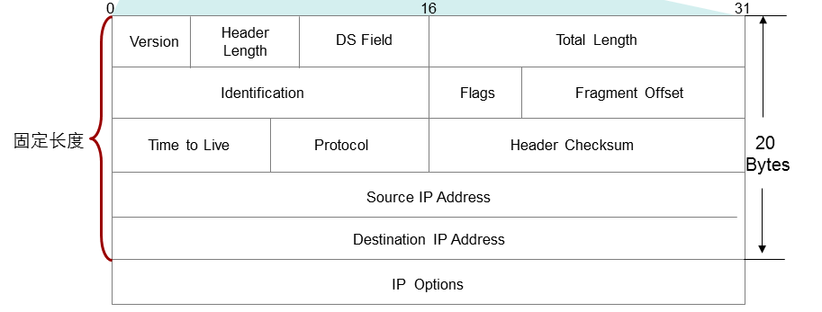
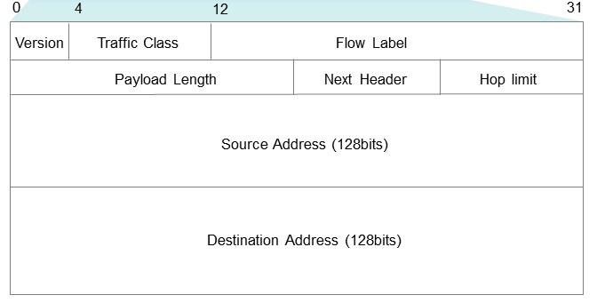

## IPV4报头分析

1.version:版本号，当前版本号为4即代表此报文为IPV4报文

2.header length：首部长度，表示当前iPv4报文头部长度。一般为20字节，此字段会根据后面的ip option选项的长度而变长，最长为60字节。

3.DS Field：此字段也叫作Type of Service (TOS)或DiffServ，用来给特殊的数据打标记，一般用来做QOS。

4.Total Length: 表示ipv4数据包的总长度，此字段长度为16 bit，因此用十进制表示最大为65535，也就是说IP数据包最大长度为65535字节即75字节。

5.Identification , Flags , Fragment Offect:这三个字段用于ipv4数据包的分片和重组，这里暂时不做讨论，后续文章会做详细讨论。

6.Timeto live:TTl值，用于ipv4数据报文的防环，此字段占8个比特，总长度为256，没经过一个路由器减一，当次字段为0时，路由器将丢弃此数据包。

7.Protocol:协议号，用于表示将要处理的上层协议类型。

8.Header Checksum:头部校验和，字段长度为16 bit。可以对于IP报头纠错，它不包括被封装的数据内容。由于这个字段与上层协议中这个功能有冗余之嫌，故在IPV6中取消了此字段。

9.Source ip Address ,Destionation IP Adress :源目ipv4地址，用于生成路由表，指导数据包的转发。

10.IP Options:可选字段可选且长度可变，但最长为40字节。此字段在实际中用得并不多。

## IPV6报头分析

1.version：版本号，和IPV4报头版本号意思相同，这里为6.

2.Traffic class:流类别，长度为8bit，它等同于IPv4报头中的TOS字段，表示IPv6数据报的类或优先级，主要应用于QoS。

3.Flow Lable：流标签，长度为20bit，它用于区分实时流量。流可以理解为特定应用或进程的来自某一源地址发往一个或多个目的地址的连续单播、组播或任播报文。IPv6中的流标签字段、源地址字段和目的地址字段一起为特定数据流指定了网络中的转发路径。（即三元组）而ipv4中区分一个特定的数据流需要五元组（源目IP，源目端口，协议）这样，报文在IP网络中传输时会保持原有的顺序，提高了处理效率。随着三网合一的发展趋势，IP网络不仅要求能够传输传统的数据报文，还需要能够传输语音、视频等报文。这种情况下，流标签字段的作用就显得更加重要。

4.Payload length:定义了负载的长度，数据包封装的字节数。

5.Next Header:下一个报头，长度为8bit。该字段定义了紧跟在IPv6报头后面的第一个扩展报头（如果存在）的类型，这个区域非常类似与ipv4包头中的协议字段，实际上使用的目的就是标识在下一头是一个上层协议的头（就是标识上层协议）。同ipv4这个区域类似，这个区域也是8个bit。 但是在ipv6中，在紧随在数据包头的不一定是上层协议的头（ipv4里面的数据包头后面跟的就是上层协议的头），有可能是扩展包头（再次出现这个名词，在下一段中描述）。 所以下一个头区域的命名具有很大范围的意义。

6.HOP Limit: 长度为8bit，该字段类似于IPv4报头中的Time to Live字段，它定义了IP数据报所能经过的最大跳数。每经过一个路由器，该数值减去1；当该字段的值为0时，数据报将被丢弃。

7.Source ip Address ,Destionation IP AdresS:源目ipv6地址。

## 区别

1. 版本号不同
2. pv6中没有了header length和Total length字段，增加了payload length字段。
3. IPV6没有了DS Filed这个字段，而用Taffic class代替。
4. IPV6增加了流标签字段用来标识特定的数据流，相比ipv4更加简化。
5. IPV6中去除了用来分片和重组的字段，而是将这个功能增加到了扩展包头中。
6. IPV6去除了协议字段，而用扩展报头来替代这一功能。
注意ipv6包头中取消了原来ipv4包头中的校验和区域。 现在的网络传输介质都增加了传输的可靠性（无线可能是一个特例），并且事实上上层协议常常使用自己的错误检测和修复机制，Ipv6包头中加入校验意义不打，所以就被将它剔除了。
