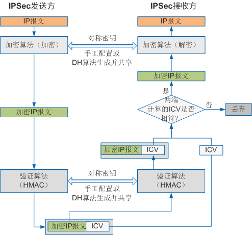

## IKE协议

在IPsec VPN中，对等体之间如果要建立起IPsec连接，首先需要建立IPsec安全联盟（IPsec SA）。IPsec SA是双向的，即每个对等体和对方分别建立IPsec SA，IPsec SA的建立可以手工配置也可以使用IKE协议来自动协商。二者的主要区别为：

- 密钥生成方式不同手工方式下，建立SA所需的全部参数，包括加密、验证密钥，都需要用户手工配置，也只能手工刷新，在中大型网络中，这种方式的密钥管理成本很高；IKE方式下，建立SA需要的加密、验证密钥是通过DH算法生成的，可以动态刷新，因而密钥管理成本低，且安全性较高。
- 生存周期不同手工方式建立的SA，一经建立永久存在；IKE方式建立的SA，其生存周期由双方配置的生存周期参数控制。

手工配置适用于网络简单，连接稳定的环境中，IKE方式适用于大部分场景且更加安全。

因特网密钥交换IKE（Internet Key Exchange）协议建立在Internet安全联盟和密钥管理协议ISAKMP定义的框架上，是基于UDP（User Datagram Protocol）的应用层协议。它为IPSec提供了自动协商密钥、建立IPSec安全联盟的服务，能够简化IPSec的使用和管理，大大简化IPSec的配置和维护工作。

上面只是大概介绍了IKE，在真正理解IKE之前，请先理解下面的概念：

## 安全联盟（SA）

SA由一个三元组来唯一标识，这个三元组包括安全参数索引SPI（Security Parameter Index）、目的IP地址和使用的安全协议号（AH或ESP）。其中，SPI是为唯一标识SA而生成的一个32位比特的数值，它在AH和ESP头中传输。在手工配置SA时，需要手工指定SPI的取值。使用IKE协商产生SA时，SPI将随机生成。

SA是单向的逻辑连接，因此两个IPSec对等体之间的双向通信，最少需要建立两个SA来分别对两个方向的数据流进行安全保护。如下图所示，为了在对等体A和对等体B之间建立IPSec隧道，需要建立两个安全联盟，其中，SA1规定了从对等体A发送到对等体B的数据采取的保护方式，SA2规定了从对等体B发送到对等体A的数据采取的保护方式。

## 加密和验证

在理解IKE之前需要先了解下加密和认证。加密是为了给数据包加密，即使黑客截获了数据包也无法解密。认证是为了验证对方是否是合法的身份，防止黑客伪造对等体身份。IPsec是如何实现这两种功能的呢？

### 对称加密

对称加密就是加密方和解密方使用同一个秘钥。只有知道加密方是使用何种加密方式和使用的秘钥，解密方才能进行解密。

举个例子：
在战争年代，小明和小红都做着绝密工作，小明和小红需要频繁通信，他们怕通信内容被敌人截获于是约定将他们收到的内容的**英文字母全部向后移两位**就是最终的结果。比如收到的是A，那么实际为C。这里**向后移**就是加密算法，**两**就是秘钥。只有当两人都知道这个算法和秘钥时，他们收到对方的信息才能正确解密。

目前常见的对称加密算法有：DES，3DES，AES等。

### 非对称加密

非对称加密算法使用一对秘钥进行加密和解密，这对秘钥成为公钥和私钥。用公钥加密的数据只能通过私钥解密，且无法通过一个秘钥推导出另外一个。非对称秘钥相对于对称秘钥来说更加安全。

举个例子：
接上列，小明有一天觉得秘钥不够安全了，向后移**两位**很容易就被敌人破解了，他想告诉小红变成向后移**四位**，但是两人相隔很远，该怎么办呢，他也不能通过电话去告诉小红，因为万一敌人截获了这个消息，他们之后的通信无疑和明文相同。这就体现了对称加密在某些情况下的不便，因为秘钥是万万不能泄露的。

如果要使用非对称加密的话，这个问题就比较容易解决了，小明只要把自己的公钥高速小红，让小红使用这个公钥来加密就行了。公钥可以让任何人指导，单是私钥只有小明有，加密过后的信息只能通过私钥解密。这样是不是就安全多了。

目前常见的非对称加密算法有：RSA，DSA，DH。前两种常用语验证功能，DH算法一般用于IPsec中的IKE协议。DH算法在IKE协商过程中比较重要，具体过程稍后再说。

### 认证

验证指IP通信的接收方确认数据发送方的真实身份以及数据在传输过程中是否遭篡改。前者称为数据源验证，后者称为数据完整性验证，IPSec通过这两种验证保证数据真实可靠。数据源验证和数据完整性验证这两种安全服务总是绑定在一起提供的。

虽然加密后的数据只能通过原始的加密密钥进行解密，但是**无法验证解密后的信息是否是原始发送的信息**。另外加密和解密的过程非常的消耗CPU，恶意用户可能会通过发送欺骗数据包，占用CPU资源。HMAC（Keyed-Hash Message Authentication Code）功能通过比较数字签名进行数据包完整性和真实性验证，这个过程消耗的CPU资源非常少，效率非常高。因此，IPSec采用HMAC功能进行验证。

在IPSec发送方，加密和验证通常配合使用。加密后的报文经HMAC生成数字签名，IP报文和数字签名同时发给对端；在IPSec接收方，通过比较数字签名进行数据完整性和真实性验证，验证不通过的报文直接丢弃，验证通过的报文再进行解密。加密和HMAC验证配合使用的过程如下图所示。

同加密一样，用于验证的对称密钥也可以手工配置，或者通过IKE协议自动协商生成。
常用的验证（HMAC）算法包括：MD5，SHA1，SHA2， SM3。

HMAC算法的原理如下：

- 双方共享执行hash算法的秘钥key。
- 路由器A的用户数据与共享秘钥key通过hash算法得到数字签名。
- 路由器A将数字签名和用户数据一同传输给路由器B。
- 路由器B执行相同的算法过程得到数字签名。
- 路由器B比对数字签名是否一致

> 国密算法SM3（Senior Middle 3）是国家密码管理局编制的商用算法，用于密码应用中的数字签 名和验证、消息认证码的生成与验证以及随机数的生成，可满足多种密码应用的安全需求。

### DH算法

在IPsec中DH算法很重要，上面也提到了DH算法，它是一种非对称加密算法，DH算法全称为diffie-hellman。在IKE协议中当对等体接收到对端发送过来的公钥后，会用自己的秘钥（这里的私钥在IPsec中指的是我们配置的**预共享密钥**）和对方的公钥通过DH算法计算出一个共享秘钥。然后通过这个密钥加密数据。

但是要解密这个数据就必须知道对方的私钥，包括要使用对称加密算法解密对端发过来的数据时也需要知道对端的私钥。那么问题来了，如何在两个对等体之间安全的传递私钥呢？

其实，解决这个问题并不困难，可以通过非对称加密算法（如前面提到的DH算法）加密对称加密算法的秘钥，在用对称加密算法加密实际要传输的数据。如果公司需要一小时更换一次秘钥，只需让非对称加密算法一小时重新计算一次即可，而且**由于非对称加密算法的私钥不会在网络上传输**，其安全性也可得到保障。

> 这是一个经典的解决私钥传递安全性的方法，使用非对称加密技术加密私钥，使用对称加密技术加密数据。这样既保证了加解密的高效性，也保证了私钥的安全性。

## IKE的安全机制（重点）

使用上面各个算法的特点，IKE具有一套自保护机制，可以在不安全的网络上安全地认证身份、分发密钥、建立IPsec SA：

### 身份认证

身份认证确认通信双方的身份（对等体的IP地址或名称），包括预共享密钥PSK（pre-shared key）认证、数字证书RSA（rsa-signature）认证和数字信封认证。

- 在预共享密钥认证中，**认证字**作为一个输入来产生密钥，通信双方采用共享的密钥对报文进行Hash计算，判断双方的计算结果是否相同。如果相同，则认证通过；否则认证失败。
- 在数字证书认证中，通信双方使用CA证书进行数字证书合法性验证，双方各有自己的公钥（网络上传输）和私钥（自己持有）。发送方对原始报文进行Hash计算，并用自己的私钥对报文计   算结果进行加密，生成数字签名。接收方使用发送方的公钥对数字签名进行解密，并对报文进行Hash计算，判断计算结果与解密后的结果是否相同。如果相同，则认证通过；否则认证失     败。
- 在数字信封认证中，发送方首先随机产生一个对称密钥，使用接收方的公钥对此对称密钥进行加密（被公钥加密的对称密钥称为数字信封），发送方用对称密钥加密报文，同时用自己的私   钥生成数字签名。接收方用自己的私钥解密数字信封得到对称密钥，再用对称密钥解密报文，同时根据发送方的公钥对数字签名进行解密，验证发送方的数字签名是否正确。如果正确，则   认证通过；否则认证失败。

对于预共享密钥认证方法，当有1个对等体对应多个对等体时，需要为每个对等体配置预共享的密钥。该方法在小型网络中容易建立，但安全性较低。使用数字证书安全性高，但需要CA来颁发数字证书，适合在大型网络中使用。而数字信封认证用于设备需要符合国家密码管理局要求时使用，此认证方法只能在IKEv1的主模式协商过程中支持。

IKE支持的认证算法有：MD5、SHA1、SHA2-256、SHA2-384、SHA2-512、AES-XCBC-MAC-96、SM3。

### 身份保护

身份数据在密钥产生之后加密传送，实现了对身份数据的保护。

IKE支持的加密算法有：DES、3DES、AES-128、AES-192、AES-256、SM1和SM4。

## IKE的两个建立阶段

IKE安全联盟是通过IKE协议协商建立的，IKE SA的建立时IPsec SA建立的基础。IKE第一阶段就是IKE SA的建立，IKE第二阶段时IPsec SA的建立。
_IKE SA建立是为了保护IPsec SA建立所需要的数据，IPsec SA建立是为了保护用户数据。_

### IKE协商第一阶段

IKEv1协商阶段1的目的是建立IKE SA。IKE SA建立后对等体间的所有ISAKMP消息都将通过加密和验证，这条安全通道可以保证IKEv1第二阶段的协商能够安全进行。IKE SA是一个双向的逻辑连接，两个IPSec对等体间只建立一个IKE SA。

IKEv1协商阶段1支持两种协商模式：主模式（Main Mode）和野蛮模式（Aggressive Mode）

主模式需要用到6条ISAKMP消息，野蛮模式只需要3条ISAKMP消息。
与主模式相比，野蛮模式减少了交换信息的数目，提高了协商的速度，但是没有对身份信息进行加密保护。虽然野蛮模式**不提供身份保护**，但它可以满足某些特定的网络环境需求：

- 如果发起方的IP地址不固定或者无法预知，而双方都希望**采用预共享密钥验证**方法来创建IKE SA，则只能采用野蛮模式。
- 如果发起方已知响应方的策略，或者对响应者的策略有全面的了解，采用野蛮模式能够更快地创建IKE SA。

> 为什么说野蛮模式不提供身份保护呢？ 请参考：[https://blog.csdn.net/bytxl/article/details/38655493](https://blog.csdn.net/bytxl/article/details/38655493)

IKE第一阶段协商过程如下图所示：

在主模式中，这三个任务是通过六个数据报文完成的：前两个数据包用于协商对等体间的管理连接使用何种安全策略（交换ISAKMP/IKEc传输集）；中间的两个数据包通过DH算法产生并交换加密算法和HMAC功能所需的秘钥，最后两个数据包使用预共享秘钥等方式执行对等体间的身份验证。这里需要注意的是，前四个报文为明文传输，从第5个数据报文开始为密文传输，而前四个数据包通过各种算法最终产生的秘钥用于第5、地6个数据包及后续数据的加密。

### IKE协商第二阶段

ISAKMP/IKE阶段2主要是在两个ipsec对等体间建立数据连接，其主要完成以下任务。

1. 定义对等体间需要保护何种流量。
2. 定义用来保护数据的安全协议。

IKEv1协商阶段2的目的就是建立用来安全传输数据的IPSec SA，并为数据传输衍生出密钥。这一阶段采用快速模式（Quick Mode）。该模式使用IKEv1协商阶段1中生成的密钥对ISAKMP消息的完整性和身份进行验证，并对ISAKMP消息进行加密，故保证了交换的安全性。

IKEv1协商阶段2通过三条ISAKMP消息完成双方IPSec SA的建立：

- 协商发起方发送本端的安全参数和身份认证信息。
安全参数包括被保护的数据流和IPSec安全提议等需要协商的参数。身份认证信息包括第一阶段计算出的密钥和第二阶段产生的密钥材料等，可以再次认证对等体。
- 协商响应方发送确认的安全参数和身份认证信息并生成新的密钥。
IPSec SA数据传输需要的加密、验证密钥由第一阶段产生的密钥、SPI、协议等参数衍生得出，以保证每个IPSec SA都有自己独一无二的密钥。
如果启用PFS，则需要再次应用DH算法计算出一个共享密钥，然后参与上述计算，因此在参数协商时要为PFS协商DH密钥组。
- 发送方发送确认信息，确认与响应方可以通信，协商结束。

这里所提到的是IKE V1版本，IKE还有V2版本，采用IKEv2协商安全联盟比IKEv1协商过程要简化的多。要建立一对IPSec SA，IKEv1需要经历两个阶段：“主模式＋快速模式”或者“野蛮模式＋快速模式”，前者至少需要交换9条消息，后者也至少需要6条消息。而IKEv2正常情况使用2次交换共4条消息就可以完成一对IPSec SA的建立，如果要求建立的IPSec SA大于一对时，每一对IPSec SA只需额外增加1次创建子SA交换，也就是2条消息就可以完成。
详细关于IKE V2的知识请自行研究。

## 参考资料：

- 华为产品文档
- [https://blog.csdn.net/bytxl/article/details/38655493](https://blog.csdn.net/bytxl/article/details/38655493)
- [https://blog.51cto.com/yangshufan/2103655](https://blog.51cto.com/yangshufan/2103655)
- [https://blog.csdn.net/y_xianjun/article/details/81327943](https://blog.csdn.net/y_xianjun/article/details/81327943)
