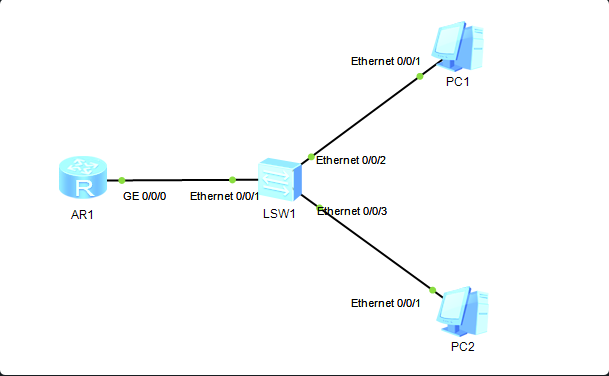

当用户通过交换机接入网络与网关（路由器）进行通信，如下图：

当PC1正常上网，另外一个用户PC2仿冒PC1的IP地址接入网络，此时会出现什么情况呢？

- 仿冒者可以正常上网
- 正常用户被踢下线

**原因分析:**

当PC2仿冒PC1的ip地址接入网络，PC2要访问网管时，会向网络中广播发送ARP报文寻找网关的MAC地址。PC1和网关都会收到此报文，pc1不予理会因为目标IP不是我，不是请求我的IP地址的。网关会正常回应PC2自己的MAC地址。
但网络中的主机会收到关于IP地址冲突的报文.

PC2获取到了网关的MAC地址可以访问网关，此时问题出现了，原来的PC1也正在访问网关，但网关回报时把数据包回给了PC2。因为PC1和PC2的ip地址一样，PC2后请求的网关的MAC地址，网关就回把数据包回给PC2，**此时就回导致PC1访问网关的数据中断，造成客户异常下线。**

> 实验证明：谁是最后请求的网关的MAC地址，网关回包时就会包数据包给谁，造成另一方用户下线。感兴趣的同学可以做个实验试一下

基于这种情况的发生，我们需要在交换机上配置DAI和IPSG，避免非法用户的接入以及非法ARP报文的请求。

DAI请参考下面这篇文章：
https://www.zybuluo.com/handbye/note/780400

