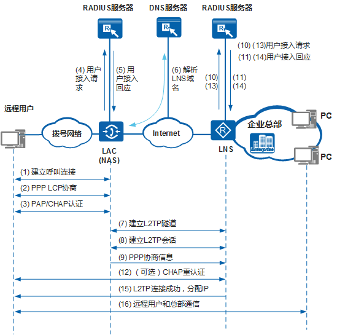

### L2TP VPN介绍

介绍了IPSECvpn，IPSECvpn主要用来两个站点之间的互联，比如公司总部和分部或者分部与分部之间。IPSECvpn建立后隧道会一直存在，用于站点之间的数据传输，并且IPSECvpn有很好的安全性。所以现在企业中很多的都在用IPSECvpn，对于企业不同地域之间的部门或者总分部之间，在用户感知来看就相当于在一个内网之中。但是IPSECvpn的建立需要在两个站点网络出口设备上进行配置，隧道建立之后，内网用户就可以进行通信了。显然对于那些出差的员工或者想要在家里办公的员工，ISPECvpn就不能满足了。 这时就需要L2TPvpn来满足这种移动用户可以随时与公司网络的出口设备建立L2TPvpn隧道，进而可以访问公司内网的资源。其实现在的SSLvpn也可以很好的满足这种需求，本篇本章重点介绍L2TPvpn,SSLvpn随后介绍。

### L2TP VPN的几个概念

1.LAC：L2TP Access Concentrator，接入汇聚点，在传统的VPDN网络中也叫NAC（Network Access Server）。VPDN是一种基于PSTN/ISDN的VPN。关于VPDN的介绍，请看：[VPDN简介](https://wenku.baidu.com/view/1ec7af595727a5e9856a61f4.html)。LAC一般部署在运行商网路，有的企业网络出口也会部署LAC。

2.LNS：L2TP Network Server，网络服务器，一般部署在企业网路中。LNS主要用来提供L2TP客户端拨号接入或者和LAC建立L2TP vpn。

3.PPP协议：L2tp顾名思义来说就是二层VPN，是一种将内层数据帧封装在而成协议中的技术。比如PPP,ATM,fram rely等。所以他可以支持多种网络类型。而现在运用的最多的二层成帧技术还要属PPP协议，它有众多优点：

- IP地址的动态分配和管理
- 同步或异步的物理层通信
- 链路的配置、质量检测和纠错
- 多种配置参数选项的协商
- 可以实现认证，计费等功能

因此广泛应用在用户接入到ISP网络中，甚至以太网中也借用了这种协议，形成了PPPOE协议。L2TP是PPP的扩展，使PPP报文可以通过隧道方式在公网网络中传输。
如果组网中只应用PPP，则PPP终端发起的拨号，最远只能到达拨号网络的边缘节点NAS，此时NAS可以称为PPP会话的终止节点。而应用L2TP，则可以使PPP报文在公网透传，到达企业总部的LNS，此时LNS相当于PPP会话的终止节点。至于何时会用到PPP协议以及具体的协商过程随后介绍。
另外关于PPP协议的详细介绍见：http://blog.csdn.net/windeal3203/article/details/51066331

### L2TP VPN分类

**L2TPvpn主要分为三类：**

1.L2TP Client-Initiated VPN
这种VPN是客户端（手机，电脑等移动设备）直接使用L2TP拨号软件或者系统自带的拨号软件拨号到LNS上与LNS建立L2TPvpn。
2.L2TP NAS-Initiated VPN
这种VPN是LAC和LNS配置了L2TPvpn的相关参数，当用户拨号到LAC上去访问公司内网数据时，会触发LAC与LNS建立L2TPvpn。
3.L2TP LAC-Auto-Initiated VPN
LAC-Auto-Initiated VPN 也叫做LAC 自动拨号VPN，顾名思义，在LAC 上配置完成后，LAC
会自动向LNS 发起拨号，建立L2TP 隧道和会话，不需要分支机构用户拨号来触发。对于分
支机构用户来说，访问总部网络就跟访问自己所在的分支机构网络一样，完全感觉不到自己
是在远程接入。

### L2TP VPN建立过程

### L2TP协议架构

L2TP协议包含两种类型的消息，控制消息和数据消息，消息的传输在LAC和LNS之间进行。L2TP协议通过这两种消息，扩展了PPP的应用。
**控制消息**
用于L2TP隧道和会话连接的建立、维护和拆除。在控制消息的传输过程中，使用消息丢失重传和定时检测隧道连通性等机制来保证控制消息传输的可靠性，支持对控制消息的流量控制和拥塞控制。
**数据消息**
用于封装PPP数据帧并在隧道上传输。数据消息是不可靠的传输，不重传丢失的数据报文，不支持对数据消息的流量控制和拥塞控制。

### L2TP报文结构

L2TP报文进行了多次封装，比原始报文多出38个字节（如果需要携带序列号信息，则比原始报文多出42个字节），封装后报文的长度可能会超出接口的MTU值，而L2TP协议本身不支持报文分片功能，这时需要设备支持对IP报文的分片功能。当L2TP报文长度超出发送接口的MTU值时，在发送接口进行报文分片处理，接收端对收到分片报文进行还原，重组为L2TP报文。

**工作过程**

- VPDN连接在远程用户和LNS之间建立。ISP将距离远程用户地理位置最近的NAS部署为LAC，LAC和LNS之间建立L2TP隧道连接。
- 远程用户在电话网络中拨号，发起PPP连接到ISP部署的本地NAS。 NAS接入远程用户的呼叫，和远程用户进行PPP协商。
- NAS作为LAC，根据远程用户拨号的用户名或者域，判断接入的用户是否为VPDN用户。如果接入用户是VPDN用户，则交由L2TP模块进行封装处理，将PPP报文通过L2TP隧道发送到LNS；如果不是VPDN用户，则正常处理和转发PPP报文。
- LNS从L2TP隧道收到远程用户的接入请求，对远程用户认证后，为远程用户分配IP地址，通过隧道和LAC发送到远程用户。
- 远程用户获取IP地址，向总部主机发送报文进行通信。
- LNS收到经由隧道传输的报文后，查找路由表，转发报文到内部目的主机。

经过L2TP处理，远程用户使用拨号建立到LNS的点到点连接，其中LAC和Internet对用户透明。具体报文处理过程如下图，LAC和LNS均使用远程认证。（也可以采用本地认证）

1.远程用户PC发起呼叫连接请求到LAC。
2.PC机和LAC进行PPP LCP协商。
3.LAC对PC机提供的用户信息进行CHAP认证。
4.LAC将用户信息（用户名和密码）发送给RADIUS服务器进行认证。
5.RADIUS服务器认证通过则返回对该用户认证的结果。
6.当LAC上指定LNS为域名时，LAC检查该LNS域名是否解析，如未解析则根据域名向DNS服务器请求解析对应的IP。如果LNS的IP地址解析成功，则触发建立隧道过程；否则用户上线失败。
7.LAC和LNS之间建立L2TP隧道连接。
8.LAC和LNS之间建立L2TP会话连接。
9.LNS处理在会话连接中收到的PPP协商信息。
10.LNS将接入请求信息发送给RADIUS服务器进行认证。
11.RADIUS服务器认证通过则返回响应信息。如果RADIUS服务器上为该用户配置了Frame-IP、Frame-Route属性或者指定了地址池名称，响应报文中会携带该Frame-IP、Frame-Route或者指定的地址池名称。
12.可选择是否对远程用户CHAP重认证，在LNS完成二次认证。
13.LNS将二次认证信息发送给RADIUS服务器进行认证。
14.RADIUS服务器认证通过则返回响应信息。
15.LNS处理响应报文中携带的信息，保存分配给该用户的Frame-IP、Frame-Route或者指定的地址池名称。L2TP连接成功，为远程用户分配IP地址。
16.远程用户和总部通信，LNS相当于远程用户的网关。

> 选择执行步骤12时，需要执行步骤13和14，否则不需要执行。如果是L2TP Client-Initiated VPN的方式则省略前三步。

