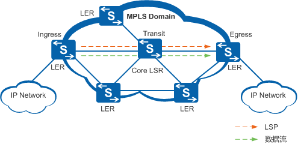
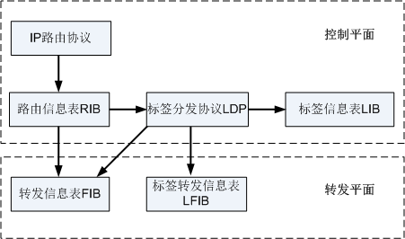
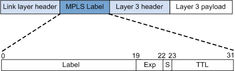
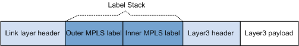
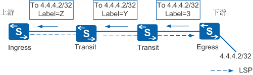

### 出现背景：

MPLS(Multiprotocol Label Switching)多协议标签交换，mpls的出现主要是因为上世纪90年代传统ip路由转发出现瓶颈，MPLS最初是为了提高路由器的转发速度而提出的。与传统IP路由方式相比，它在数据转发时，只在网络边缘分析IP报文头，而不用在每一跳都分析IP报文头，节约了处理时间，所以才想到了使用标签转发来替代传统的ip查表转发。但是随着硬件工艺的发展，逐渐出现的硬件转发和芯片转发，之前ip转发查表慢的问题已经不复存在。

由于mpls标签转发的思想在mpls vpn和mpls TE（流量工程）方面的应用也使得这一技术得以存在并且大放异彩，MPLS vpn在企业网和运营商中运用的都比较多，MPLS TE主要在运营商中应用。本篇先介绍MPLS，mpls vpn随后介绍。

### 相关概念：

mpls域：由mpls协议转发数据的区域。
LSR：Label Switching Router，标签交换路由器，在mpls域中负载标签交换操作的路由器。

LER：Label Edge Router，标签边缘路由器，在mpls域的边缘负责标签的压人或者弹出，连接其它网络的路由器。

LSP:Label Switched Path，标签转发路径，IP报文在MPLS网络中经过的路径，LSP是一个单向路径，与数据流的方向一致。

LSP的入口LER称为入节点（Ingress）；位于LSP中间的LSR称为中间节点（Transit）；LSP的出口LER称为出节点（Egress）。一条LSP可以有0个、1个或多个中间节点，但有且只有一个入节点和一个出节点。

根据LSP的方向，MPLS报文由Ingress发往Egress，则Ingress是Transit的上游节点，Transit是Ingress的下游节点。同理，Transit是Egress上游节点，Egress是Transit的下游节点。

### 体系结构：

mpls的体系结构如图所示，mpls把控制平面和转发平面分开，控制平面负载计算路由，转发平面负责利用FIB表转发数据。这种控转分离的思想十分重要，现在的SDN也正是应用了这种思想。

**控制平面：负责产生和维护路由信息以及标签信息。**

1. 路由信息表RIB（Routing Information Base）：由IP路由协议（IP Routing
Protocol）生成，用于选择路由。
2. 标签分发协议LDP（Label Distribution
Protocol）：负责标签的分配、标签转发信息表的建立、标签交换路径的建立、拆除等工作。
3. 标签信息表LIB（Label Information Base）：由标签分发协议生成，用于管理标签信息。

**转发平面：即数据平面（Data Plane），负责普通IP报文的转发以及带MPLS标签报文的转发。**

1. 转发信息表FIB（Forwarding Information Base）：从RIB提取必要的路由信息生成，负责普通IP报文的转发。
2. 标签转发信息表LFIB（Label Forwarding Information
Base）：简称标签转发表，由标签分发协议在LSR上建立LFIB，负责带MPLS标签报文的转发。

### mpls标签结构：

标签结构如上图，mpls中最重要的东西就是标签，标签的建立直接关系着报文的转发。mpls会为一个转发等价类分配相同的标签。

> 转发等价类：mpls将以相同方式处理的一组报文分为一个转发等价类，转发等价类的区分方式可以是路由，也可以是其他东西。但是目前用到的都是以路由来区分的，即将到达同一目路由的所有报文都会打上相同的标签。

**标签栈：**
标签栈即mpls的标签可以有多层，但是一般只用到二层或者三层。这里先提一下，在随后介绍到的mpls vpn中还会用到。

**标签空间**
标签空间就是指标签的取值范围。标签空间划分如下：

0～15：特殊标签。

16～1023：静态LSP和静态CR-LSP（Constraint-based Routed Label Switched Path）共享的标签空间。

1024及以上：LDP、RSVP-TE（Resource Reservation Protocol-Traffic Engineering）、MP-BGP（MultiProtocol Border Gateway Protocol）等动态信令协议的标签空间。

### mpls的转发：

mpls的转发依赖ip网络的连通性，因为需要为ip网络中路由来分配标签后按照标签来转发报文。

为不同的路由分配不同的标签后，就会为一个转发等价类（FEC）建立起一条LSP。建立LSP或者说分配标签的方式有两种：

静态建立LSP，即手动为不同的FEC分配不同的标签。

动态建立LSP，使用LDP，MP-BGP等协议来划分FEC和分配标签。

**动态LSP的基本建立过程**

标签由下游LSR分配，按从下游到上游的方向分发。如下图，由下游LSR在IP路由表的基础上进行FEC的划分，并根据FEC分配标签，通告给上游的LSR，以便建立标签转发表和LSP。

当标签分配完成，LSP确定之后，就开始了数据包的在mpls和ip网络中的传递。这时候就会涉及到标签的转发方式。

**标签操作类型包括标签压入（Push）、标签交换（Swap）和标签弹出（Pop），它们是标签转发的基本动作。**

- Push：当IP报文进入MPLS域时，MPLS边界设备在报文二层首部和IP首部之间插入一个新标签；或者MPLS中间设备根据需要，在标签栈顶增加一个新的标签（即标签嵌套封装）。
- Swap：当报文在MPLS域内转发时，根据标签转发表，用下一跳分配的标签，替换MPLS报文的栈顶标签。
- Pop：当报文离开MPLS域时，将MPLS报文的标签剥掉。

在最后一跳节点，标签已经没有使用价值。这种情况下，可以利用倒数第二跳弹出特性PHP（Penultimate Hop Popping），在倒数第二跳节点处将标签弹出，减少最后一跳的负担。最后一跳节点直接进行IP转发或者下一层标签转发。
默认情况下，设备支持PHP特性，支持PHP的Egress节点分配给倒数第二跳节点的标签值为3。标签操作类型包括标签压入（Push）、标签交换（Swap）和标签弹出（Pop），它们是标签转发的基本动作。

_详细转发过程这里就不写了，请参考产品文档。_

### MPLS对TTL的处理：

mpls也可以使用TTL来防环，mpls对TTL的处理方法分为两种：

MPLS标签中包含一个8比特的TTL字段，其含义与IP头中的TTL域相同。MPLS对TTL的处理除了用于防止产生路由环路外，也用于实现Traceroute功能。

RFC3443中定义了两种MPLS对TTL的处理模式：Uniform和Pipe。缺省情况下，MPLS对TTL的处理模式为Uniform。

**Uniform模式**
IP报文经过MPLS网络时，在入节点，IP TTL减1映射到MPLS TTL字段，此后报文在MPLS网络中按照标准的TTL处理方式处理。在出节点将MPLS TTL减1后映射到IP TTL字段。

**Pipe模式**
在入节点，IP TTL值减1，MPLS TTL字段为固定值，此后报文在MPLS网络中按照标准的TTL处理方式处理。在出节点会将IP TTL字段的值减1。即IP分组经过MPLS网络时，无论经过多少跳，IP TTL只在入节点和出节点分别减1。

