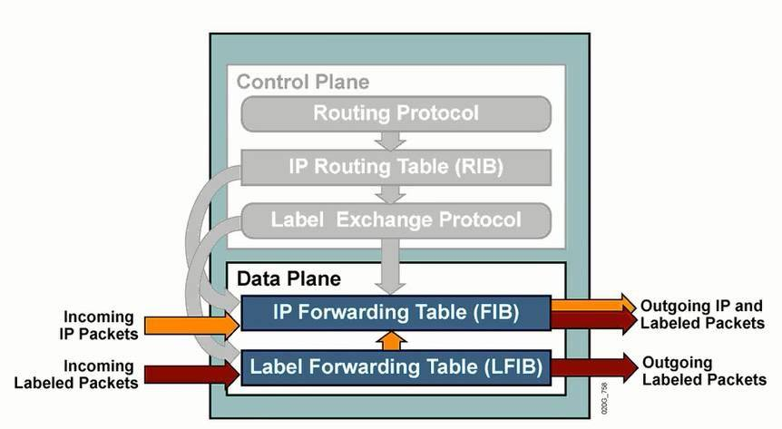

MPLS 的体系结构由控制平面（Control Plane）和转发平面（Forwarding Plane）组成。
MPLS 体系结构如图。

控制平面是无连接的，主要功能是负责产生和维护路由信息以及标签信息。

控制平面中IP 路由协议（IP Routing Protocol）模块用来传递路由信息，生成路由信息表；标签分发协议（Label Distributiion Protocol）模块用来完成标签信息的交换，建立标签转发路径。转发平面也称为数据平面（Data Plane），是面向连接的， 主要功能是负责普通IP 报文的转发以及带MPLS 标签报文的转发。

数据平面包括IP 转发信息表（Forwarding Information Base）和标签转发信息表（LabelForwarding Information Base），当收到普通IP 报文时，如果是普通IP 转发，则查找IP 路由表转发，如果需要标签转发，则按照标签转发表转发；当收到带有标签的报文时，如果需要 按照标签转发，根据标签转发表转发，如果需要转发到IP 网络，则去掉标签后根据IP 转发。

参考：[http://361531.blog.51cto.com/351531/1693692/](http://361531.blog.51cto.com/351531/1693692/)

