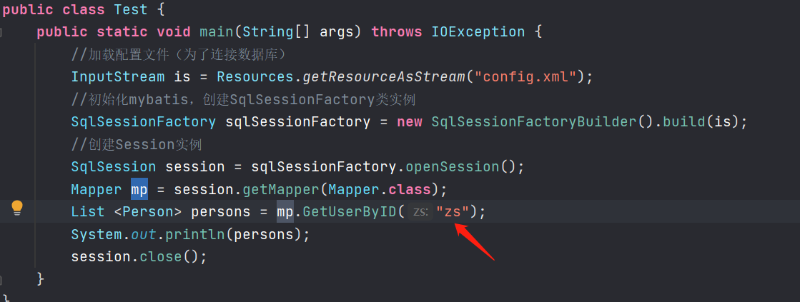
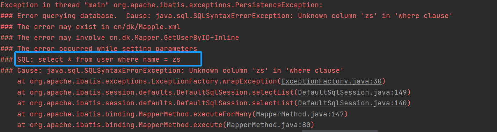

## MyBatis简介


MyBatis 是一款优秀的持久层框架，它支持定制化 SQL、存储过程以及高级映射。MyBatis 避免了几乎所有的 JDBC 代码和手动设置参数以及获取结果集。MyBatis 可以使用简单的 XML 或注解来配置和映射原生信息，将接口和 Java 的 POJOs(Plain Old Java Objects,普通的 Java对象)映射成数据库中的记录。


我理解的MyBatis是将数据库字段和java对象关联到了一起，开发者无需在关注数据库操作，直接操作java对象就可以完成数据库的增删改查等操作。但是在配置MyBatis的过程中还是无法避免需要在XML配置文件中编写sql语句，在某些情况下，如果sql语句编写不合理就可能导致sql注入的发生，本篇文章将从MyBatis框架配置开始讲讲SQL注入产生的原因和防范方法。


## MyBatis配置


在配置MyBatis之前需要先准备MyBatis的jar包或者使用maven自动下载jar包。
jar包下载地址：[http://www.mybatis.cn/82.html](http://www.mybatis.cn/82.html)


本次演示使用mavn，打开IDEA创建一个maven工程


在pom.xml中配置MyBatis的dependency,配置完成后Maven会自动下载相关的依赖到本地项目中。


```xml
<!-- https://mvnrepository.com/artifact/org.mybatis/mybatis -->
<dependency>
    <groupId>org.mybatis</groupId>
    <artifactId>mybatis</artifactId>
    <version>3.5.3</version>
</dependency>
```


在运行MyBatis之前先了解下MyBatis的执行过程，有助于编写MyBatis代码。


```text
第一步：MyBatis通过读取配置文件信息（全局配置文件和映射文件），构造出SqlSessionFactory，即会话工厂。
MyBatis配置文件，包括MyBatis全局配置文件和MyBatis映射文件，其中全局配置文件配置了数据源、事务等信息；映射文件配置了SQL执行相关的信息。

第二步：通过SqlSessionFactory，MyBatis可以创建SqlSession（即会话），MyBatis是通过SqlSession来操作数据库的。

第三步：MyBatis操作数据库。SqlSession本身不能直接操作数据库，它是通过底层的Executor执行器接口来操作数据库的。Executor接口有两个实现类，一个是普通执行器，一个是缓存执行器（默认）。Executor执行器要处理的SQL信息是封装到一个底层对象MappedStatement中。该对象包括：SQL语句、输入参数映射信息、输出结果集映射信息。其中输入参数和输出结果的映射类型包括Java的简单类型、HashMap集合对象、POJO对象类型。
```


可以看到MyBatis的运行是需要读取配置文件的，配置文件是XML格式的，其中每个字段具有不同的含义，具体的配置文件如下：


```xml
<?xml version="1.0" encoding="UTF-8"?>
<!DOCTYPE configuration PUBLIC "-//mybatis.org//DTD Config 3.0//EN"
        "http://mybatis.org/dtd/mybatis-3-config.dtd">

<configuration>
    <!--环境配置，连接的数据库，这里使用的是MySQL-->
    <environments default="mysql">
        <environment id="mysql">
            <!--指定事务管理的类型，这里简单使用Java的JDBC的提交和回滚设置-->
            <transactionManager type="JDBC"/>
            <!--dataSource 指连接源配置，POOLED是JDBC连接对象的数据源连接池的实现-->
            <dataSource type="POOLED">
                <property name="driver" value="com.mysql.jdbc.Driver"/>
                <property name="url" value="jdbc:mysql://127.0.0.1:3306/person"/>
                <property name="username" value="root"/>
                <property name="password" value="root"/>
            </dataSource>
        </environment>
    </environments>
    <mappers>        <!--这是告诉Mybatis区哪找持久化类的映射文件，对于在src下的文件直接写文件名,如果在某包下，则要写明路径,如：com/mybatistest/config/Mapper.xml-->
        <mapper resource="Mapper.xml"/>
    </mappers>
</configuration>
```


可以看到上述的配置文件已经指明了MyBatis连接数据库所需要的信息，这里需要注意的是MyBatis并不能直接操作数据库，它还需要借助JDBC驱动。其中的`<mapper>`字段指明了Mybatis到java代码的映射文件，这个后面会提到。


接下来就来配置Mapper.xml这个文件，在配置之前先创建一个Person实体类，其中实体类的属性和数据库字段保持一致：


```java
package cn.dk;

public class Person
{
    private int id;
    private String name;
    private int age;
    private String address;

    public Person(int id, String name, int age, String address) {
        this.id = id;
        this.name = name;
        this.age = age;
        this.address = address;
    }

    public int getId() {
        return id;
    }

    public String getName() {
        return name;
    }

    public int getAge() {
        return age;
    }

    public String getAddress() {
        return address;
    }

    public void setId(int id) {
        this.id = id;
    }

    public void setName(String name) {
        this.name = name;
    }

    public void setAge(int age) {
        this.age = age;
    }

    public void setAddress(String address) {
        this.address = address;
    }
    @Override
    public String toString() {
        return "Person{" +
                "id=" + id +
                ", name='" + name + '\'' +
                ", age=" + age +
                ", address='" + address + '\'' +
                '}';
    }
}
```


有了上述的实体类，Mapper.xml文件这配置就是为这个实体类服务的，其具体内容如下：


```xml
<?xml version="1.0" encoding="UTF-8"?>
<!DOCTYPE mapper PUBLIC "-//mybatis.org//DTD Mapper 3.0//EN"
        "http://mybatis.org/dtd/mybatis-3-mapper.dtd">
<mapper namespace="cn.dk.Person.Mapper">
    <select id="GetUserByID" parameterType="int" resultType="cn.dk.Person">
        select  from user where id = #{id}
    </select>
</mapper>
```


`<mapper namespace="cn.dk.Person"`为这个mapper指定一个唯一的namespace，它习惯上设置为:映射文件的全路径，这样可以保值名的唯一。


`<select id="GetUserByID" parameterType="int" resultType="Person">` id：用于标识这个select语句，这样就可以通过namespace加id找到唯一的sql语句。parameterType：指定查询是传入的参数类型。 resultType：即返回结果集的类型，这理指定为Person对象类型。


_`select  from user where id = #{id}`_  这个语句中的`#{}`表示要动态传入的值，sql注入往往发生在这里，具体情况后面会讲到。


> 当parameterType参数为简单类型时（8个基本类型+String）,则sql语句中可以使用任何占位符，当parameterType为对象类型时，则sql语句中的占位符必须写属性名。


## MyBatis基础查询方式


到这里配置文件和映射文件都有了，就可以使用java代码来操作数据库了，写一个testl类来进行验证。


```java
package cn.dk;

import org.apache.ibatis.io.Resources;
import org.apache.ibatis.session.SqlSession;
import org.apache.ibatis.session.SqlSessionFactory;
import org.apache.ibatis.session.SqlSessionFactoryBuilder;

import java.io.IOException;
import java.io.InputStream;
import java.io.Reader;

public class Test {
    public static void main(String[] args) throws IOException {
        //加载配置文件（为了连接数据库）
        InputStream is = Resources.getResourceAsStream("config.xml");
        //初始化mybatis，创建SqlSessionFactory类实例
        SqlSessionFactory sqlSessionFactory = new SqlSessionFactoryBuilder().build(is);
        //创建Session实例
        SqlSession session = sqlSessionFactory.openSession();
        //通过Mapper.xml文件找到sql语句
        String Statement = "cn.dk.Person.Mapper.GetUserByID";
        执行查询
        Person person = session.selectOne(Statement,1);
        System.out.println(person);
    }
}
```


上述代码执行的结果为：


可以看到已经将数据查出，执行的为sql语句，却和java对象关联到了一起，这就是MyBatis的方便之处。


## MyBatis接口查询方式


上述方式为MyBatis的基础CRUD方法，除此外MyBatis还有另外一种方式称为MyBatis接口开发模式，MyBatis接口开发模式基于动态代理。


这种方式在基础查询方式之上加了一个接口类，接口类的实现必须满足以下要求：

1. 方法名和Mapper.xml中的id值相同
2. 方法的输入参数和Mapper.xml中的parameterType一致
3. 方法的返回值和Mapper.xml中resultType一致

```java
package cn.dk;

public interface Mapper {
    /
    1. 方法名和Mapper.xml中的id值相同
    2. 方法的输入参数和Mapper.xml中的parameterType一致
    3. 方法的返回值和Mapper.xml中resultType一致
     /

    public abstract Person GetUserByID(int id);
}

```


除了以上约定，要实现接口中的方法和Mapper.xml中的Sql语句一一对应还需要将Mapper.xml中的namespace值改为接口的全类名。


这样就可以使用session对象操作数据库了，和基本查询方法不同的是此种方法需要使用getMapper()方法反射获取Mapper对象。


完整代码：


```java
package cn.dk;

import org.apache.ibatis.io.Resources;
import org.apache.ibatis.session.SqlSession;
import org.apache.ibatis.session.SqlSessionFactory;
import org.apache.ibatis.session.SqlSessionFactoryBuilder;

import java.io.IOException;
import java.io.InputStream;

public class Test {
    public static void main(String[] args) throws IOException {
        //加载配置文件（为了连接数据库）
        InputStream is = Resources.getResourceAsStream("config.xml");
        //初始化mybatis，创建SqlSessionFactory类实例
        SqlSessionFactory sqlSessionFactory = new SqlSessionFactoryBuilder().build(is);
        //创建Session实例
        SqlSession session = sqlSessionFactory.openSession();
        Mapper mp = session.getMapper(Mapper.class);
        Person person = mp.GetUserByID(1);
        System.out.println(person);
        session.close();
    }
}
```


执行结果


上面演示的都是查询单个结果，那么如何进行多个结果的查询呢，也就是sql语句需要传入多个参数，实现传多个参数的方法有很多种，我这里就使用了最简单的一中方式：匿名传参。其它的传参方式请参考：[https://blog.csdn.net/bdqx_007/article/details/94836637](https://blog.csdn.net/bdqx_007/article/details/94836637)


MyBatis规定匿名传参时必须传入param1，param2这种方式的，例如：


```xml
<?xml version="1.0" encoding="UTF-8"?>
<!DOCTYPE mapper PUBLIC "-//mybatis.org//DTD Mapper 3.0//EN"
        "http://mybatis.org/dtd/mybatis-3-mapper.dtd">
<mapper namespace="cn.dk.Mapper">
    <select id="GetUserByID" parameterType="int" resultType="cn.dk.Person">
        select  from user where id = #{param1} or id = #{param2}
    </select>
</mapper>
```


然后Mapper接口中的方法使用List接收多个返回结果就可以了。


```java
package cn.dk;

import java.util.List;

public interface Mapper {
    public abstract List<Person> GetUserByID(int param1, int param2);
}
```


执行结果：


## MyBatis两种取值符号


在上面的演示实例中，只使用到了MyBatis的一种取值方式也就是`#{}`这种方式的。
除了这种方式还有另外一种方式`${value}`。


> 当parameterType为简单类型时，当取值符号为`$`时，{}中的值必须为value。当parameterType为对象时，{}中的值为对象属性名。


这两种取值符号的差别是：`#{}``会自动传入值加上单引号，而`${}`不会。**请注意这个差别，sql注入的产生的原因之一就是因为取值符号使用`$`{}时，用户传入的值含单引号引起的。`


下面演示下`${value}`这种传值方式。


修改Mapper.xml文件中的sql查询语句：


```xml
<?xml version="1.0" encoding="UTF-8"?>
<!DOCTYPE mapper PUBLIC "-//mybatis.org//DTD Mapper 3.0//EN"
        "http://mybatis.org/dtd/mybatis-3-mapper.dtd">
<mapper namespace="cn.dk.Mapper">
    <select id="GetUserByID" parameterType="String" resultType="cn.dk.Person">
        select  from user where name = ${value}
    </select>
</mapper>
```


然后测试类:





这里有个坑点，先运行下看下结果：





前面说了`${}`这种传值方式不会给传入的值添加引号的，所以我们传入的String类型带到数据库中查询时也不会加引号，从而导致sql查询报错。解决办法是手动在xml文件中添加引号，如下：


`但是`${}`这种方式在动态排序时更加好用，比如当需要根据数据库字段id进行降序排列查询结果，`#{}`由于会给传入的值自动加上引号，导致查询语句变为了`select * from user order by 'id' desc`，此时会根据一个字符常量进行排序，显然不能得到我们想要的结果，此时就必须使用`$`{}这种方式了，因此在涉及到排序相关的业务时很容易导致sql输入的产生。`


举一个例子，当我们需要执行的sql语句为：_`select  from user order by id desc`_时，MyBatis中的传值符号使用`#{}`，看能否得到我们想要的结果：


可以看到排序结果并不是降序，当把传值方式改为`${}`时即可得到正确的结果 ：


## MyBatis可能导致的注入


上面我们讲了MyBatis的两种传值方式，现在来总结一下两者的差别：

1. `#`将传入的数据都当成一个字符串，会对自动传入的数据加一个双引号。如：_`order by #userid#`_，如果传入的值是111,那么解析成sql时的值为`order by "111"`, 如果传入的值是id，则解析成的sql为`order by "id"`。
2. $`将传入的数据直接显示生成在sql中。如：`order by $user_`id$，如果传入的值是111,那么解析成sql时的值为order by user`_id`,  如果传入的值是id，则解析成的sql为``order by id。`
3. `#`方式能够很大程度防止sql注入,因为`#{}`实现 SQL 语句的参数化，避免直接引入恶意的 SQL 语句并执行。
4. `$`方式无法防止Sql注入。
5. `$`方式一般用于传入数据库对象，例如传入表名。
6. 一般能用`#`的就别用`$`。

所以大多数sql注入产生的原因都是因为开发者在xml文件中使用了`${}`传值方式。


MYBatis最有可能产生注入的三种情况：

1. SQL语句中的一些部分，例如order by字段、表名等，是无法使用预编译语句的。这种场景极易产生SQL注入。推荐开发在Java层面做映射，设置一个字段/表名数组，仅允许用户传入索引值。这样保证传入的字段或者表名都在白名单里面。
2. like参数注入。使用如下SQL语句可防止SQL注入

```sql
like concat('%',#{title}, '%')
```

1. in之后参数的SQL注入。使用如下SQL语句可防止SQL注入

```sql
id in
<foreach collection="ids" item="item" open="("separator="," close=")">
#{item} 
</foreach>
```


**sql注入演示：**


接着上一个章节提到的Order by 查询来演示下sql注入，我们提到`${}`这种取值方式是不会自动添加引号的，当我们传入的payload变为`id and extractvalue(1,concat(0x7C,(select user()),0x7C))`时，sql注入就产生了。


最后以freeCMS为例看下MyBatis的sql注入。MyBatis有很多工具可以根据对象实体自动生成Mapper接口和映射文件，其中最常用的应该是Mybatis-Generator，关于Mybatis-Generator的使用方法请参考[https://www.cnblogs.com/throwable/p/12046848.html](https://www.cnblogs.com/throwable/p/12046848.html)。遗憾的是Mybatis-Generator生成的Mapper映射文件order by查询也是使用的`${}`这种方式，如果开发者没有在业务层对用户输入进行过滤就会导致sql注入的产生。freeCMS正是由于这个原因导致的sql注入，freeCMS分为免费版和商业版，免费版的最新版本为1.5，下载地址：[http://www.freeteam.cn/](http://www.freeteam.cn/)。截至目前位置，最新版本依旧存在sql注入漏洞，据说商业版也存在这个漏洞。


freeCMS的安装过程就不说了，官网有操作手册。


freeCMS有个会员积分查询功能，漏洞点就存在这里，首先看下此功能对应的Mapper映射文件：


order by 参数使用了`${}`进行传入，继续查看其业务层实现逻辑：


并未对order传参进行任何过滤，紧接着就是Action的实现了：


如果order为空则默认值为`credittime desc`,否则就按照传入的值进行排序。order传参可控且并未进行任何过滤，那么就导致了sql注入的产生：


如何防范MyBatis sql注入的产生呢？这里引用madneal师傅的总结：

- 能不使用拼接就不要使用拼接，这应该也是避免 SQL 注入最基本的原则
- `在使用` ${}` 传入变量的时候，一定要注意变量的引入和过滤，避免直接通过 `$`{}传入外部变量`
- 不要自己造轮子，尤其是在安全方面，其实在这个问题上，框架已经提供了标准的方法。如果按照规范开发的话，也不会导致 SQL 注入问题
- 可以注意 MyBatis 中 targetRuntime 的配置，如果不需要复杂的条件查询的话，建议直接使用 MyBatis3Simple。这样可以更好地直接杜绝风险，因为一旦有风险点，就有发生问题的可能。

## 参考文章


[审计mybatis的sql注入](http://xdxd.love/2016/03/14/%E5%AE%A1%E8%AE%A1mybatis%E7%9A%84sql%E6%B3%A8%E5%85%A5/)
[MyBatis 和 SQL 注入的恩恩怨怨](https://www.anquanke.com/post/id/190170)
[Mybatis框架下SQL注入审计分析](https://www.freebuf.com/vuls/240578.html)

