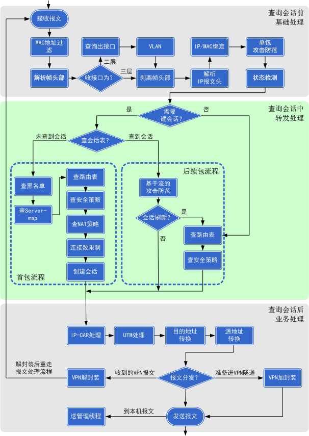
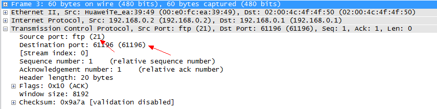
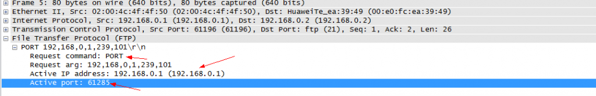
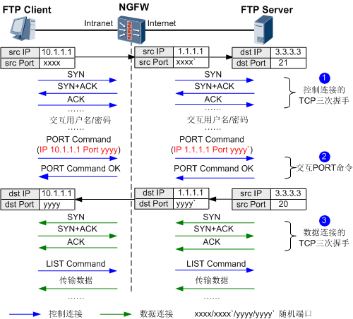

NAT的部署已经在企业网中必不可少，当防火墙作为网络的出口或者在网络中充当安全网关时，内网用户访问外网或者外网用户访问内网的服务器都要经过NAT穿越。


由于防火墙的特殊性，出于安全的考虑，需要建立相应的安全策略。当防火墙检测到这个数据包是一个首包时，就会根据相应的安全策略进行检查，符合安全策略就给通过并生成对应的会话表项。后续数据包到达是就无须在进行安全策略的检查，直接匹配会话表进行转发，这样就大大提高了转发效率。


### 先上一张防火墙转发数据的流程图：





> 可以看到在生成会话表之前是先查NAT策略的，也就是查找玩NAT策略以后，再根据NAT生成会话表。


比如下方的会话表：


```shell
SIP  VPN: public --> public  192.168.2.5:5060[1.1.1.1:2327] +-> 221.181.108.137:5060

```


[] 中的就是NAT过后的IP地址


通常情况下，NAT只对报文中IP头部的地址信息和TCP/UDP头部的端口信息进行转换，不关注报文载荷的信息。但是对于一些特殊的协议（如FTP协议），其报文载荷中也携带了地址或端口信息，而报文载荷中的地址或端口信息往往是由通信的双方动态协商生产的，管理员并不能为其提前配置好相应的NAT规则。如果提供NAT功能的设备不能识别并转换这些信息，将会影响到这些协议的正常使用。


### 下面以FTP报文为例说下为什么要启用NAT alg 或者 ASPF


FTP控制层面的连接报文，使用TCP端口号21





控制层面的TCP连接端口号是携带在头部的，是可以被NAT转换的。控制层面在有NAT的环境下是可以进行连接的。


控制层面连接完成之后，进行文件传送之前要建立数据层面的连接，这时会由client侧向server侧发送port消息，携带自己开放的数据层面连接端口号（主动模式下是这样的，FTP还有被动模式，这里就以主动模式来说）。报文如下：





问题来了，数据层面的端口号是携带在报文载荷部分的，NAT只能转换头部信息，无法转换载荷信息。在存在NAT穿越的场景下，数据连接就无法建立，这时看到的情况就是能够登陆成功，但是无法显示服务器文件列表也不能上传和下载文件。


**这时就需要用到NAT alg功能来识别载荷部分的端口信息，来做对应的NAT转换。**


FTP协议包括两种工作模式：主动模式和被动模式。主动模式中，FTP Server主动向FTP Client发起数据连接；被动模式中，FTP Server被动接收FTP Client发起的数据连接。无论是主动模式还是被动模式，在控制连接交互报文的载荷中，都包含用于建立数据连接的IP地址和端口号信息。
如果在FTP Client和FTP Server之间部署了NAT设备，这就要求NAT设备必须能够识别出控制连接中包含的IP地址和端口号并进行处理，否则数据连接无法成功建立，FTP协议不能正常工作。


下面以FTP协议工作在主动模式为例，介绍NAT ALG功能对FTP协议的处理过程。


如图1所示，FTP Client位于私有网络，FTP Server位于公共网络。NGFW对FTP协议的报文处理过程如下：
1.FTP Client通过源NAT地址转换后可以访问FTP Server，与FTP Server完成FTP控制连接的TCP三次握手，并交付用户名和密码信息。
2.NGFW收到FTP Client发送的PORT命令报文后，将报文载荷字段中携带的私网地址和端口替换为公网地址和新的端口，然后发送至FTP Server。
3.NGFW收到FTP Server请求建立数据连接的报文后，替换报文的目的地址和目的端口为原始的地址和端口，然后发送至FTP Client。由此保证数据连接可以成功建立，FTP协议正常工作。





### NAT ALG与ASPF的关系


**差异点：**
开启ASPF功能的目的是识别多通道协议，并自动为其开放相应的安全策略。
开启NAT ALG功能的目的是识别多通道协议，并自动转换报文载荷中的IP地址和端口信息。
**共同点：**
二者使用相同的配置。开启其中一个功能，另一功能同时生效。


其实在防火墙上二者的配置命令是同一个，对于防火墙来说对二者是没区别的。因为NAT alg自动转换报文载荷中的ip地址和端口信息后，防火墙没有将其对应的安全策略放行，数据也是不能转发的。这一安全策略是基于防火墙的server-map表实现的。
关于server-map表的详解可以百度搜索serve-map表来了解一下。

