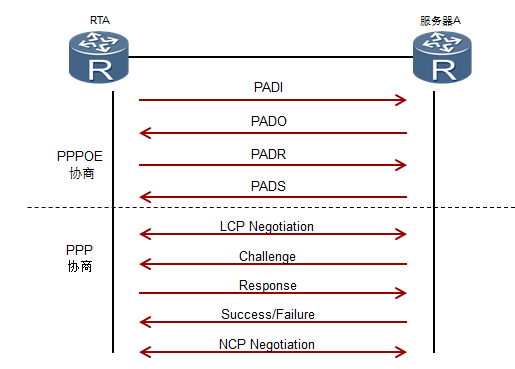

1.用户客户端向服务器发送一个PADI报文，开始PPPOE接入。

2.服务器向客户端发送PADO报文。

3.客户端根据回应，发起PADR请求给服务器。

4.服务器产生一个Session ID，通过PADS发给客户端。

5.客户端和服务器之间进行PPP的LCP协商，建立链路层通信。同时，协商使用CHAP认证方式。

6.服务器通过Challenge报文发送给认证客户端，提供一个128bit的Challenge。

7.客户端收到Challenge报文后，并将密码和Challenge做MD5算法运算后，在Response回应报文中把结果发送给服务器。

8.服务器根据用户发送的信息判断用户是否合法，然后回应认证成功/失败报文，将认证结果返回给客户端。

9.进行NCP（如IPCP）协商，通过服务器获取到规划的IP地址等参数。

