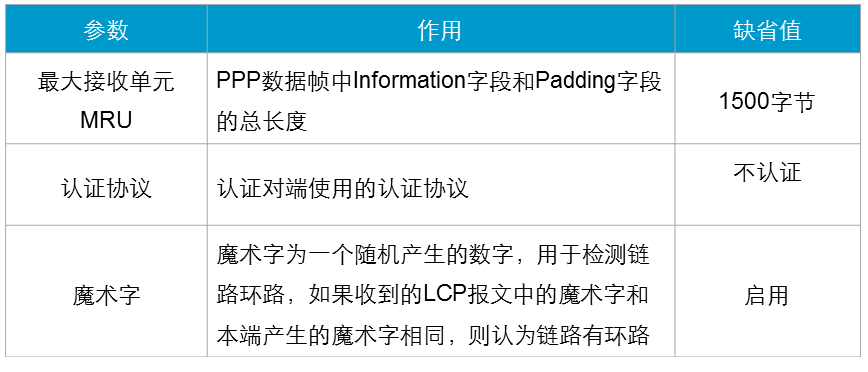

ppp是一个协议族，其中包含了两个协议：LCP（link control protocol）和NCP（network control protocol）两个协议，也称为ppp的两个组件。

链路控制协议LinkControlProtocol用来建立、拆除和监控PPP数据链路

网络层控制协议NetworkControlProtocol用于对不同的网络层协议进行连接建立和参数协商

为了能适应多种多样的链路类型，（这里指的是物理层链路类型）PPP定义了链路控制协议LCP。LCP可以自动检测链路环境，如是否存在环路，协商链路参数，如最大数据包长度，使用何种认证协议等等。与其他数据链路层协议相比，PPP协议的一个重要特点是可以提供认证功能，链路两端可以协商使用何种认证协议来实施认证过程，只有认证成功之后才会建立连接。

PPP定义了一组网络层控制协议NCP，每一个NCP对应了一种网络层协议，用于协商网络层地址等参数，例如IPCP用于协商控制IP协议，IPXCP用于协商控制IPX协议等。

**报文**

1. Configure-Request（配置请求）：链路层协商过程中发送的第一个报文，该报文表明点对点双方开始进行链路层参数的协商。
2. Configure-Ack（配置响应）：收到对端发来的Configure-Request报文，如果参数取值完全接受，则以此报文响应。
3. Configure-Nak（配置不响应）：收到对端发来的Configure-Request报文，如果参数取值不被本端认可，则发送此报文并且携带本端可接受的配置参数。
4. Configure-Reject（配置拒绝）：收到对端发来的Configure-Request报文，如果本端不能识别对端发送的Configure-Request中的某些参数，则发送此报文并且携带那些本端不能认别的配置参数。

**LCP协商参数**

**NCP（IPCP协商过程）**

IPCP使用和LCP相同的协商机制、报文类型，但IPCP并非调用LCP，只是工作过程、报文等和LCP相同。

IP地址协商包括两种方式：静态配置协商和动态配置协商。

静态协商是指ppp两端都配置了IP地址，此时要用静态协商，如果使用ppp客户端和服务器的模式此时要用动态协商。

**静态协商过程：**

静态IP地址的协商过程如下：

1. 每一端都要发送Configure-Request报文，在此报文中包含本地配置的地址；
2. 每一端接收到此Configure-Request报文之后，检查其中的IP地址，如果IP地址是一个合法的单播IP地址，而且和本地配置的IP地址不同（没有IP冲突），则认为对端可以使用该地址，回应一个Configure-Ack报文。

**动态协商过程：**

两端动态协商IP地址的过程如下：

1. RTA向RTB发送一个Configure-Request报文，此报文中会包含一个IP地址0.0.0.0，表示向对端请求IP地址;
2. RTB收到上述Configure-Request报文后，认为其中包含的地址（0.0.0.0）不合法，使用Configure-Nak回应一个新的IP地址10.1.1.1（此ip地址是从服务器端的地址中随机拿出的）;
3. RTA收到此Configure-Nak报文之后，更新本地IP地址，并重新发送一个Configure-Request报文，包含新的IP地址10.1.1.1；
4. RTB收到Configure-Request报文后，认为其中包含的IP地址为合法地址，回应一个Configure-Ack报文。
5. 同时，RTB也要向RTA发送Configure-Request报文请求使用地址10.1.1.2，RTA认为此地址合法，回应Configure-Ack报文。
