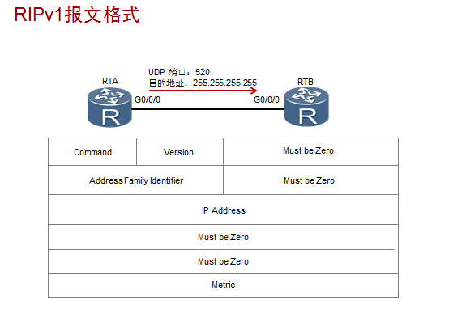
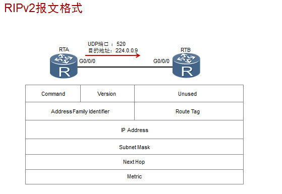

## 共有点

1. 都是距离矢量的路由协议（距离代表跳数，矢量代表方向），使用跳数作为度量来衡量到达目的网络的距离。
2. 配置简单，易于维护，适合小型网络。
3. 工作过程相同，也就是路由的交互过程相同：

路由器运行RIP后，会首先发送路由更新请求，收到请求的路由器会发送自己的RIP路由进行响应。

网络稳定后，路由器会周期性发送路由更新信息。

1. RIP度量值使用标准相同：

RIP使用跳数作为度量值来衡量到达目的网络的距离。

缺省情况下，直连网络的路由跳数为0。当路由器发送路由更新时，会把度量值加1。RIP规定超过15跳为网络不可达。

1. 时间参数（定时器）相同：
周期通告路由信息的时间都为30秒，路由老化时间都为180秒，垃圾定时器都为120秒（response报文发送四次的时间）
2. 承载协议相同：都是用UDP协议承载报文，但端口号不相同：RIPV1和RIPV2使用UDP端口号520，而RIPng使用UDP端口号521。

## 不同点

1. 使用场景不同：RIPV1和RIPV2用于IPV4的网络中，而RIPng用于IPV6网络中。
2. RIP报文发送的目的地址不同：RIPV1是以广播报文的方式发送，RIPV2目的地为组播地址：224.0.0.9，RIPng目的地为组播地址：ff02::9/8.
3. 路由条目的下一跳地址不同：RIPV1和RIPv2路由条目的下一跳地址为全局私网或公网地址，RIPng路由条目的下一跳地址为0::0或者链路本地地址。

（备注：IPv4路由协议一般采用全局公网地址或私网地址作为路由条目的下一跳地址，而IPv6路由协议通常采用链路本地地址作为路由条目的下一跳地址。）

1. 是否是无类路由协议：RIPv1是有类别路由协议，不支持VLSM和CIDR。RIPv2为无类别路由协议，支持VLSM，支持路由聚合与CIDR。在IPV6中由于地址格式的不同，有类和无类这一概念就不再使用，所以RIPng在这个点上不在作对比。但RIPng也支持ipv6路由聚合。
2. 报文格式不同：

RIPV1:

**备注**：command代表此报文是一个RIP请求报文还是响应报文，1代表请求，2代表响应。

version表示版本，RIPV1为1，RIPV2和RIPng均为2.

Address Family Identifier（AFI）：表示地址标识信息，对于IP协议，其值为2。在RIPV2中这个字段还

具有认证功能。

RIPV2：

RIPng：

1. 安全认证不同：

RIPV1不支持认证，RIPV2支持认证，RIPng本身不提供认证机制，依靠IPv6提供的安全机制（扩展报头）来保证自身报文的合法性。

1. 与网络层协议的兼容性不同：

RIP不仅能在IP网络中运行，也能在IPX网络中运行；RIPng只能在IPv6网络中运行。

