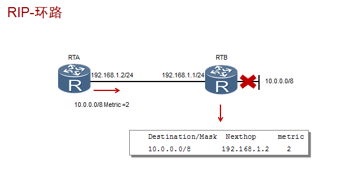
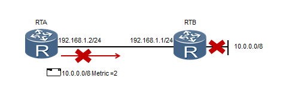
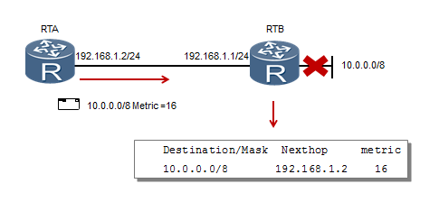
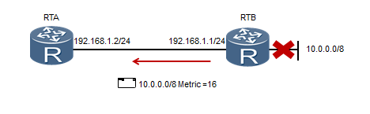

环路的产生:

如果没有防环机制，RIP网络正常运行时，RTA会通过RTB学习到10.0.0.0/8网络的路由，度量值为1。一旦路由器RTB的直连网络10.0.0.0/8产生故障，RTB会立即检测到该故障，并认为该路由不可达。此时，RTA还没有收到该路由不可达的信息，于是会继续向RTB发送度量值为2的通往10.0.0.0/8的路由信息。RTB会学习此路由信息，认为可以通过RTA到达10.0.0.0/8网络。此后，RTB发送的更新路由表，又会导致RTA路由表的更新，RTA会新增一条度量值为3的10.0.0.0/8网络路由表项，从而形成路由环路。这个过程会持续下去，直到度量值为16。

**环路避免一水平分割**

水平分割的原理是，路由器从某个接口学习到的路由，不会再从该接口发出去。

RTA从RTB学习到的10.0.0.0/8网络的路由不会再从RTA的接收接口重新通告给RTB，由此避免了路由环路的产生。

**环路避免—毒性反转**

毒性反转是指路由器从某个接口学到路由后，将该路由的跳数设置为16，并从原接收接口发回给邻居路由器。

RTB向RTA通告了度量值为1的10.0.0.0/8路由，RTA在通告给RTB时将该路由度量值设为16。如果10.0.0.0/8网络发生故障，RTB便不会认为可以通过RTA到达10.0.0.0/8网络，因此就可以避免路由环路的产生。

**环路避免—触发更新**

触发更新是指当路由信息发生变化时，立即向邻居设备发送触发更新报文。

缺省情况下，一台RIP路由器每30秒会发送一次路由表更新给邻居路由器。

当本地路由信息发生变化时，触发更新功能允许路由器立即发送触发更新报文给邻居路由器，来通知路由信息更新，而不需要等待更新定时器超时，从而加速了网络收敛。

