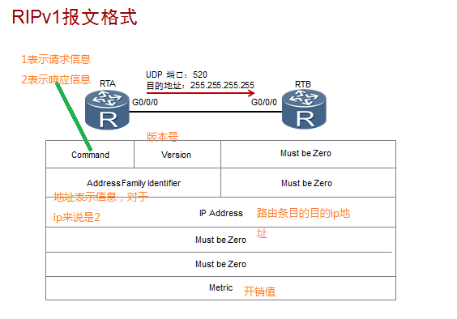
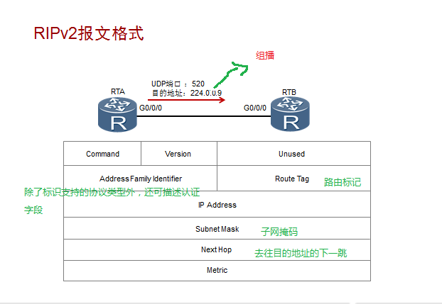

## RIP路由协议简介

RIP（路由信息协议）是一种距离矢量的路由协协议，距离：是指其使用跳数来作为路由的cost值，矢量：代表其传递路由时是有方向性的。

由于RIP协议的配置简单，易于维护而得到广泛的应用吗，但又因其最大支持15跳的原因只能应用于较小规模的网络中。

## RIP两个版本的区别

RIP现有两个版本：RIPV1和RIPV2。两版本最主要的区域如下：

RIPv1：

- 有类别路由协议，不支持VLSM和CIDR。
- 以广播的形式发送报文。
- 不支持认证。

RIPv2：

- 无类别路由协议，支持VLSM，支持路由聚合与CIDR。
- 支持以广播或者组播（224.0.0.9）方式发送报文。
- 支持明文认证和MD5密文认证。

## RIP报文结构

今天主要来比较RIPV1和RIPv2的报文结构：

RIPV1报文:

RIPV2报文:

其实RIPV1和RIPV2的不同之处已经表现在报文内容中。

