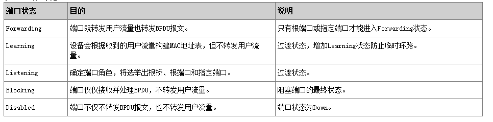
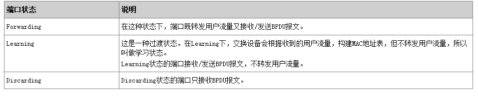
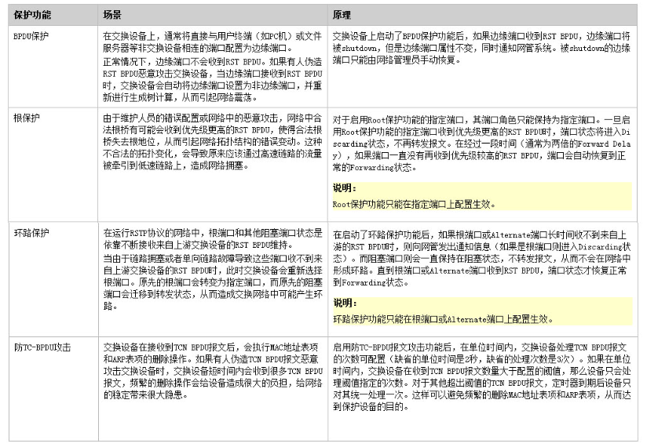
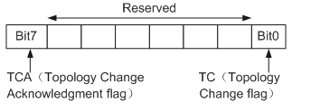
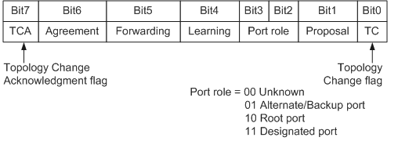

**一，端口角色不同：**

STP有是那种端口角色：Root Port , Destinaged Port, Alternate Port.

RSTP在STP的基础上增加了两种端口角色：Backup Port ,Edge Port.

在RSTP中Alternate Port是用来备份根端口的，Backup Port是用来备份指定端口的。Edge Port是RSTP中独有的一种端口角色。

**二，端口状态不同：**

STP中的端口状态有五种：discarding   blocking  listering  learning   forwarding

RSTP端口状态有三种：disabled   learning  forwarding

**三，拓扑收敛方式不同：**

**STP的拓扑收敛方式：**

1. 在网络拓扑发生变化后，下游设备会不间断地向上游设备发送TCN BPDU报文。
2. 上游设备收到下游设备发来的TCN BPDU报文后，只有指定端口处理TCN BPDU报文。其它端口也有可能收到TCN BPDU报文，但不会处理。
3. 上游设备会把配置BPDU报文中的Flags的TCA位设置1，然后发送给下游设备，告知下游设备停止发送TCN BPDU报文。
4. 上游设备复制一份TCN BPDU报文，向根桥方向发送。
5. 重复步骤1、2、3、4，直到根桥收到TCN BPDU报文。
6. 根桥把配置BPDU报文中的Flags的TC位置1后发送，通知下游设备直接删除桥MAC地址表项。

**RSTP的拓扑收敛方式：**

引入三种机制快速收敛：

- Proposal/Agreement机制
当一个端口被选举成为指定端口之后，在STP中，该端口至少要等待一个Forward Delay（Learning）时间才会迁移到Forwarding状态。而在RSTP中，此端口会先进入Discarding状态，再通过Proposal/Agreement机制快速进入Forward状态。这种机制必须在点到点全双工链路上使用。
- 根端口快速切换机制
如果网络中一个根端口失效，那么网络中最优的Alternate端口将成为根端口，进入Forwarding状态。因为通过这个Alternate端口连接的网段上必然有个指定端口可以通往根桥。
- 边缘端口的引入
在RSTP里面，如果某一个指定端口位于整个网络的边缘，即不再与其他交换设备连接，而是直接与终端设备直连，这种端口叫做边缘端口。
边缘端口不接收处理配置BPDU，不参与RSTP运算，可以由Disable直接转到Forwarding状态，且不经历时延，就像在端口上将STP禁用。但是一旦边缘端口收到配置BPDU，就丧失了边缘端口属性，成为普通STP端口，并重新进行生成树计算，从而引起网络震荡。

**RSTP拓扑变化处理**

在RSTP中检测拓扑是否发生变化只有一个标准：一个非边缘端口迁移到Forwarding状态。

一旦检测到拓扑发生变化，将进行如下处理：

- 为本交换设备的所有非边缘指定端口启动一个TC While Timer，该计时器值是Hello Time的两倍。
在这个时间内，清空状态发生变化的端口上学习到的MAC地址。
同时，由这些端口向外发送RST BPDU，其中TC置位。一旦TC While Timer超时，则停止发送RST BPDU。
- 其他交换设备接收到RST BPDU后，清空所有端口学习到MAC地址，除了收到RST BPDU的端口。然后也为自己所有的非边缘指定端口和根端口启动TC While Timer，重复上述过程。
如此，网络中就会产生RST BPDU的泛洪。

**四，RSTP有各种保护机制，STP没有。**

**五，发送BPDU用到的flag位不同。**

**STP只用到了TC TCN TCA三个flag位：**

**RSTP用到了P位，A位，TC位，接口状态位，接口角色位**

配置BPDU格式的改变，充分利用了STP协议报文中的Flag字段，明确了端口角色。

在配置BPDU报文的格式上，除了保证和STP格式基本一致之外，RSTP作了一些小变化：

Type字段，配置BPDU类型不再是0而是2，所以运行STP的设备收到RSTP的配置BPDU时会丢弃。

Flag字段，使用了原来保留的中间6位，这样改变的配置BPDU叫做RST BPDU。

**RSTP flag:**

