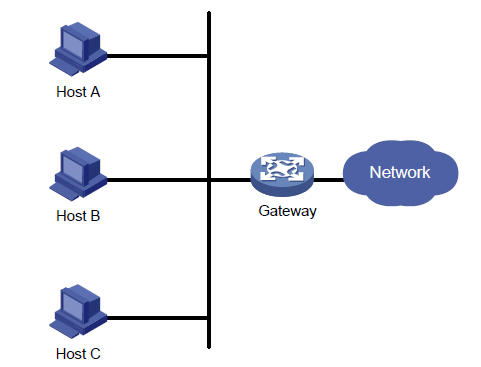

## 了解传统的局域网组网方案:

传统的局域网组网一般是将多台内部pc的取胜网关设为同一个出口路由器的IP地址。这样会造成一个问题那就是一旦这台出口路由器因为某些原因无法工作时，所有内部的pc将无法连接到外网。这样的设计虽然简单，但几乎没有什么可靠性，对于一些重要数据流无法得到保证。

这时有一种办法来解决这种问题，那就是设置多台出口路由器互为备份，将pc的网关分别设为这些出口网关路由器的IP地址，一旦当一个路由器出现故障后，内网中的pc可以用另一台的出口路由器连接到外网。

上述方法看似可行，因为这种方法对于一些对于延时要求较低，不是那么重要的数据确实不失为一种方法。为什么说这种方案的收敛时间较慢呢，因为我们的现实组网不可能这么简单，一定会用到一些路由协议如：ospf bgp 等，而这些路由器的收敛时间都是按秒计算的，在收敛时间内一些数据会丢失。

VRRP技术正是用来解决这一问题。

## 什么是VRRP

- VRRP（Virtual Router Redundancy Protocol，虚拟路由器冗余协议）将可以承担网关功能的一组路由器加入到备份组中，形成一台虚拟路由器，由VRRP 的选举机制决定哪台路由器承担转发任务，局域网内的主机只需将虚拟路由器配置为缺省网关。
- VRRP 是一种容错协议，在提高可靠性的同时，简化了主机的配置。在具有多播或广播能力的局域网（如以太网）中，借助VRRP 能在某台路由器出现故障时仍然提供高可靠的缺省链路，有效避免单一链路发生故障后网络中断的问题，而无需修改动态路由协议、路由发现协议等配置信息。
- VRRP 协议的实现有VRRPv2 和VRRPv3 两个版本。其中，VRRPv2 基于IPv4，VRRPv3 基于IPv6。
