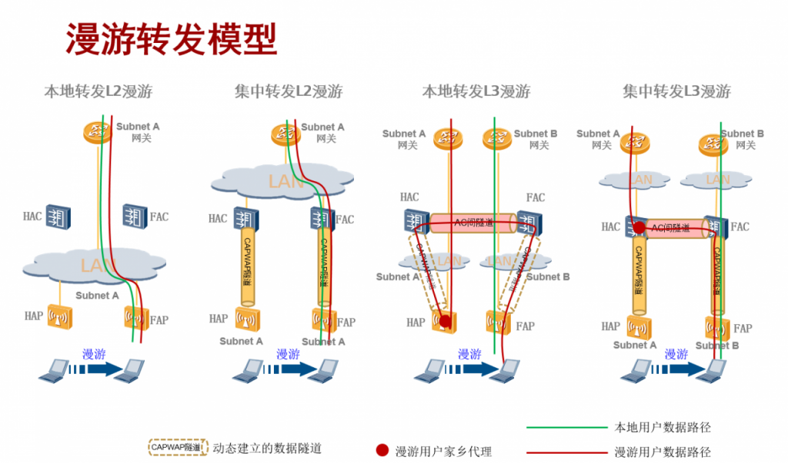

wlan的漫游分为AC内漫游和AC间漫游。

AC内的漫游比较简单，不涉及连个AC间的数据同步等问题。配置只需满足一下四个条件即可：

- 关联在同一AC上
- 配置相同的安全策略
- 配置相同的SSID
- 如果AC上配置了NAC业务，需要保证下发给各个AP的认证策略和授权策略是相同的。

AC间的漫游相对复杂，因为需要同步两个AC间的数据，还要考虑AP和AC之间的组网类型。

**漫游域**
根据STA是否在同一个子网内漫游，可以将漫游分为二层漫游和三层漫游。

- 如果两个子网的VLAN ID不同，那么这两个子网是处于不同的网段，STA在这两个子网间漫游是属于三层漫游。
网络中有时候会出现以下情况：两个子网的VLAN
- ID相同，但是这两个子网又属于不同的子网。此时为了避免系统仅仅依据VLAN
- ID将用户在两个子网间的漫游误判为二层漫游，需要通过漫游域来确定设备是否在同一个子网内，只有当VLAN相同且漫游域也相同的时候才是二层漫游，否则是三层漫游。

**WLAN漫游场景:**

上图中分别描述了在二层漫游和三层漫游中不同转发场景的业务数据走向。

**二层漫游：**
二层漫游后STA仍然在原来的子网中，FAP/FAC对二层漫游用户的报文转发同普通新上线用户没有区别，直接在FAP/FAC本地的网络转发，不需要通过AC间隧道转回到HAP/HAC中转。

**三层漫游：**
三层漫游时，用户漫游前后不在同一个子网中，为了支持用户漫游后仍能正常访问漫游前的网络，需要将用户流量通过隧道转发到原来的子网进行中转。

- 隧道转发模式下，HAP和HAC之间的业务报文通过CAPWAP隧道封装，此时可以将HAP和HAC看作在同一个子网内，报文无需返回到HAP，直接通过HAC进行中转到上层网络。
- 直接转发模式下，HAP和HAC之间的业务报文不通过CAPWAP隧道封装，无法判定HAP和HAC是否在同一个子网内，此时设备默认报文需要返回到HAP进行中转。如果HAP和HAC在同一个子网时，可以将家乡代理设置为性能更强的HAC，减少HAP的负荷并提高转发效率。
