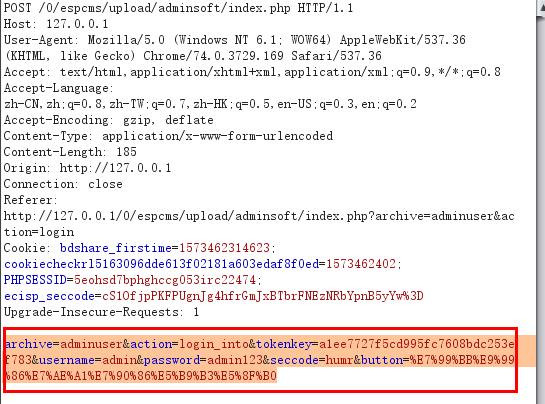
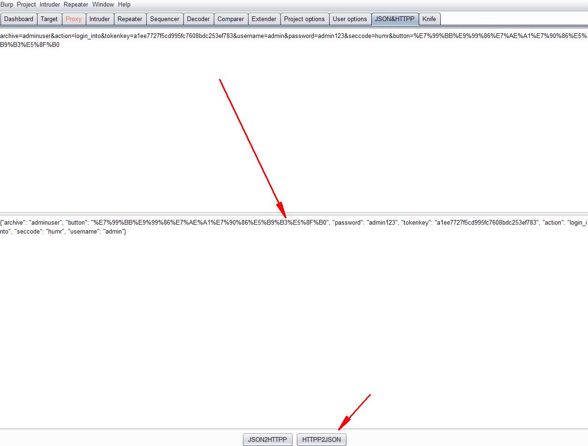

## JSON&HTTPP

此插件可以互相转换JSON和HTTP

用法：

将需要转换的http数据放到插件中转换即可：

## Knife

功能很多，详见：https://github.com/bit4woo/knife/blob/master/README-zh.md

## burp collector

可以使用burpsuite来构建字典，从而发现更多隐形资产。

github地址：[https://github.com/TEag1e/BurpCollector](https://github.com/TEag1e/BurpCollector)

## Bypass WAF

如其名，可以绕过一些waf

使用方法详见：[https://www.codewatch.org/blog/?p=408](https://www.codewatch.org/blog/?p=408)

## chunked-coding-converter

此插件可以利用分块传输原来烧过WAF，详见：[https://github.com/c0ny1/chunked-coding-converter](https://github.com/c0ny1/chunked-coding-converter)

## httpsmuggler

此插件也可用来绕过WAF，详见：[https://github.com/nccgroup/BurpSuiteHTTPSmuggler](https://github.com/nccgroup/BurpSuiteHTTPSmuggler)

## reCAPTCHA

一款验证码识别爆破工具，使用方法见：[https://github.com/bit4woo/reCAPTCHA/blob/master/README.md](https://github.com/bit4woo/reCAPTCHA/blob/master/README.md)

## jsEncrypter

可调用js加密函数对数据进行加密，方面对加密了的参数进行fuzz和爆破，使用方法参考：[https://github.com/c0ny1/jsEncrypter](https://github.com/c0ny1/jsEncrypter)

## sqlmap4burp++

burpsuite调用sqlmap进行注入验证，用法请见：[https://github.com/c0ny1/sqlmap4burp-plus-plus](https://github.com/c0ny1/sqlmap4burp-plus-plus)

更多插件请看这里：[https://github.com/Mr-xn/BurpSuite-collections](https://github.com/Mr-xn/BurpSuite-collections)

