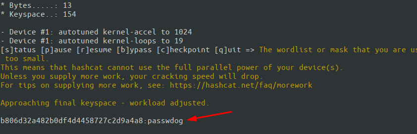

## hashcat简介


hahcat自称是世界上密码破解最快的工具，hashcat支持多种密码散列算法，可以使用CPU或者GPU进行破解且破解规则灵活。关于hashcat破解密码的使用可以参考：[Hashcat的使用手册总结](https://xz.aliyun.com/t/4008#toc-28)


## hashcat  rule


hashcat除了进行hash破解外还支持基于规则生成密码字典，或者直接基于规则去破解hash。


hashcat的规则位于`/usr/share/hashcat/rules`目录下，默认存在的规则如下：


```shell
_.
├── best64.rule
├── combinator.rule
├── d3ad0ne.rule
├── dive.rule
├── generated2.rule
├── generated.rule
├── hybrid
│   ├── appendd.rule
│   ├── appendds.rule
│   ├── appenddu.rule
│   ├── appenddus.rule
│   ├── appendhl.rule
│   ├── appendhu.rule
│   ├── appendld.rule
│   ├── appendlds.rule
│   ├── appendldu.rule
│   ├── appendldus.rule
│   ├── appendl.rule
│   ├── appendls.rule
│   ├── appendlu.rule
│   ├── appendlus.rule
│   ├── appends.rule
│   ├── appendu.rule
│   ├── appendus.rule
│   ├── prependd.rule
│   ├── prependds.rule
│   ├── prependdu.rule
│   ├── prependdus.rule
│   ├── prependhl.rule
│   ├── prependhu.rule
│   ├── prependld.rule
│   ├── prependlds.rule
│   ├── prependldu.rule
│   ├── prependldus.rule
│   ├── prependl.rule
│   ├── prependls.rule
│   ├── prependlu.rule
│   ├── prependlus.rule
│   ├── prepends.rule
│   ├── prependu.rule
│   └── prependus.rule
├── Incisive-leetspeak.rule
├── InsidePro-HashManager.rule
├── InsidePro-PasswordsPro.rule
├── leetspeak.rule
├── oscommerce.rule
├── rockyou-30000.rule
├── specific.rule
├── T0XlC-insert__00-99_1950-2050_toprules__0F.rule
├── T0XlC-insert__space_and_special__0F.rule
├── T0XlC-insert__top_100_passwords__1G.rule
├── T0XlC.rule
├── T0XlCv1.rule
├── toggles1.rule
├── toggles2.rule
├── toggles3.rule
├── toggles4.rule
├── toggles5.rule
└── unix-ninja-leetspeak.rule_

```


不同的规则可以生成不同的密码字典，我们可也可以自定义规则文件。规则说明可以参考：[Rule-based Attack](https://hashcat.net/wiki/doku.php?id=rule_based_attack)


## 使用方法


### 基于规则生成字典


建立一个基本字典文件，只包含abc和password两个密码，使用规则生成新的字典：


例如使用best64规则生成一个新的字典文件：


```shell
hashcat --stdout base.txt -r /usr/share/hashcat/rules/best64.rule -o password.txt

```


这样就生层完毕了，生成了154个密码。


### 基于规则进行hash爆破


密码破解过程中，如果源字典比较大，使用密码规则生成新字典保存在硬盘上的方式就不太明智了，更常用的方式是直接在命令中指定规则使用。


shadow.txt包含一个测试账号Hash。密码文件包含abc和password两个密码，hash类型为md5，使用密码字典+规则破解的命令如下：


```shell
hashcat -a 0 -m 0 shadow.txt ./base.txt -r /usr/share/hashcat/rules/best64.rule

```





## 参考文章


有一篇文章很有意思是关于常见rule的对比：[One Rule to Rule Them Al](https://www.notsosecure.com/one-rule-to-rule-them-all/)

