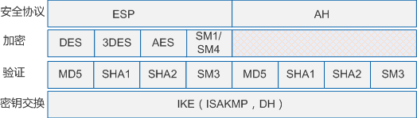
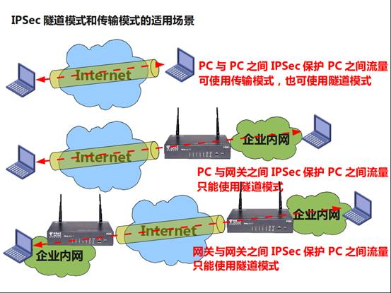
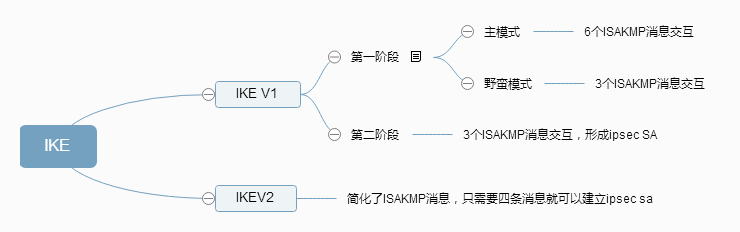
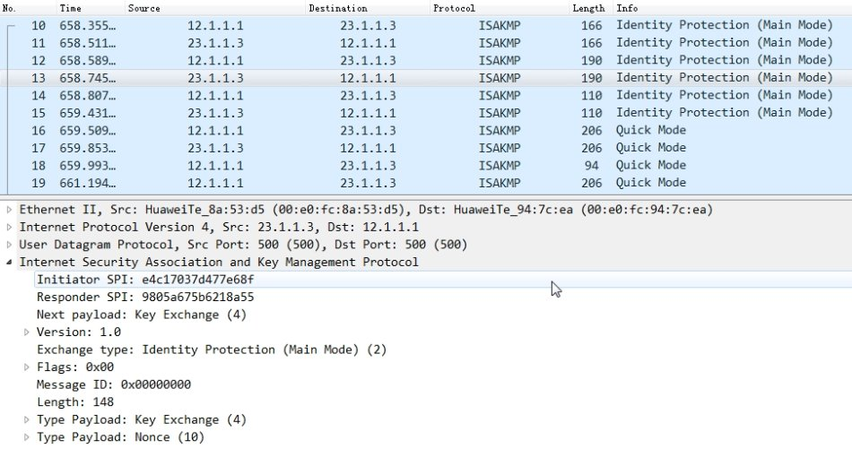
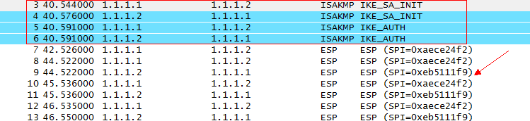
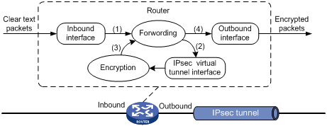
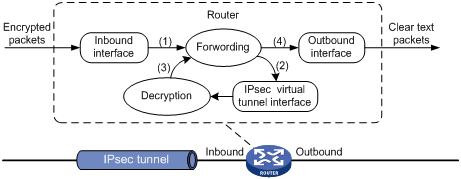

### ipsec 不是一个单独的协议，是一系列为ip网络提供安全性的协议和服务的集合

ipsec能够为不安全的ip协议提供安全保证，包括：数据加密，数据完整性验证，防重放等。即便有人窃取了被ipsec加密过后的数据也无法解密。

**ipsec协议安全体系：**

ipsec 通过两个安全协议实现ip报文的安全防护：

- AH（Authentication Header）:AH是报文头验证协议，主要提供数据源验证、数据完整性验证和防报文重放功能，不提供加密功能。
- AH协议会验证整个ip报文，包括ip头，所以只能用来没有NAT穿越的场景下，并且AH不提供数据的加密功能，所以现在AH协议基本不用。
- ESP（Encapsulating SecurityPayload）是封装安全载荷协议，主要提供加密、数据源验证、数据完整性验证和防报文重放功能。
- ESP协议验证部分不包括IP头部，并且提供数据的加密功能，现在正在被广泛应用。

### 安全联盟（SA）

IPSec安全传输数据的前提是在IPSec对等体（即IPSec协议的两个端点）之间成功建立安全联盟SA（Security Association）。SA是通信的IPSec对等体间对某些要素的约定，例如：对等体间使用何种安全协议、需要保护的数据流特征、对等体间传输的数据的封装模式、协议采用的加密算法、验证算法，以及用于数据安全转换和传输的密钥以及SA的生存周期等。IPSec安全联盟简称IPSec SA。
SA由一个三元组来唯一标识，这个三元组包括安全参数索引SPI（Security Parameter Index）、目的IP地址和使用的安全协议号（AH或ESP）。其中，SPI是用于唯一标识SA的一个32比特数值，它在AH和ESP头中传输。在手工配置SA时，需要手工指定SPI的取值。使用IKE协商产生SA时，SPI将随机生成。
SA是单向的逻辑连接，因此两个IPSec对等体之间的双向通信，最少需要建立两个SA来分别对两个方向的数据流进行安全保护。
另外，SA的个数还与安全协议相关。如果您只使用AH或ESP来保护两个对等体之间的流量，则对等体之间就有两个SA，每个方向上一个。如果对等体同时使用了AH和ESP，那么对等体之间就需要四个SA，每个方向上两个，分别对应AH和ESP。

**有两种方式建立IPSec安全联盟：手工方式和IKE自动协商方式。二者的主要区别为**：

- 密钥生成方式不同
手工方式下，建立SA所需的全部参数，包括加密、验证密钥，都需要用户手工配置，也只能手工刷新，在中大型网络中，这种方式的密钥管理成本很高；IKE方式下，建立SA需要的加密、验证密钥是通过DH算法生成的，可以动态刷新，因而密钥管理成本低，且安全性较高。
- 生存周期不同
手工方式建立的SA，一经建立永久存在；IKE方式建立的SA，其生存周期由双方配置的生存周期参数控制。
因此，手工方式适用于对等体设备数量较少时，或是在小型网络中。对于中大型网络，推荐使用IKE自动协商建立SA。

关于使用两种方式建立IPSEC SA 在华为设备上的配置对比请参考：
https://www.zybuluo.com/handbye/note/961552

### 封装模式

封装模式是指将AH或ESP相关的字段插入到原始IP报文中，以实现对报文的认证和加密，封装模式有传输模式和隧道模式两种。

- 传输模式：AH头或ESP头被插入到IP头与传输层协议头之间，保护TCP/UDP/ICMP负载。传输模式不改变报文头，故隧道的源和目的地址必须与IP报文头中的源和目的地址一致，所以只适合两台主机或一台主机和一台VPN网关之间通信。（由于私网地址不能在公网进行路由）
- 隧道模式：AH头或ESP头被插到原始IP头之前，另外生成一个新的报文头放到AH头或ESP头之前，保护IP头和负载。隧道模式主要应用于两台VPN网关之间或一台主机与一台VPN网关之间的通信。（其实隧道模式可以应用在任何场景下）

### IKE（Internet Key Exchange）

说了这么多，以上各种安全性的前提下（认证，加密）都必须建立在秘钥可以安全的共享的前提下。

有两种方法解决这个问题：

- 带外共享密钥
在发送、接收设备上手工配置静态的加密、验证密钥。双方通过带外共享的方式（例如通过电话或邮件方式）保证密钥一致性。这种方式的缺点是可扩展性差，在点到多点组网中配置密钥的工作量成倍增加。另外，为提升网络安全性需要周期性修改密钥，这种方式下也很难实施。
- 使用一个安全的密钥分发协议
通过IKE协议自动协商密钥。IKE采用DH（Diffie-Hellman）算法在不安全的网络上安全地分发密钥。这种方式配置简单，可扩展性好，特别是在大型动态的网络环境下此优点更加突出。同时，通信双方通过交换密钥交换材料来计算共享的密钥，即使第三方截获了双方用于计算密钥的所有交换数据，也无法计算出真正的密钥。

IKE是基于UDP（User DatagramProtocol）的应用层协议。它为IPSec提供了自动协商密钥、建立IPSec安全联盟的服务，能够简化IPSec的使用和管理，大大简化IPSec的配置和维护工作。

**IKE分为IKEV1和IKEV2两个版本：**
IKE协商IPSEC SA的大概过程如下：

主模式下IKEv1采用3个步骤6条ISAKMP消息建立IKE SA

在阶段2中IKEv1采用快速交换模式通过3条ISAKMP消息建立IPSec SA。

报文交互过程如下：

野蛮模式只用了3条ISAKMP消息就完成了阶段1的协商过程，阶段2仍旧是快速模式不变。

报文如下：

KEv1协商建立IPSec SA的时间太长
IKEv1主模式协商一对IPSec SA，需要6（协商IKE SA）+3（协商IPSec SA）=9条消息。
IKEv1野蛮模式协商一对IPSec SA，需要3（协商IKE SA）+3（协商IPSec SA）=6条消息。

**IKEv2相比IKEv1：**

- 协商建立IPSec SA的速度大大提升，正常情况IKEv2协商一对IPSec SA只需要2（协商IKESA）+2（协商IPSecSA）=4条消息。后续每建立一对IPSec SA只会增加2条消息。
- 增加了EAP（Extensible Authentication Protocol）方式的身份认证。
IKEv2通过EAP协议解决了远程接入用户认证的问题，彻底摆脱了L2TP的牵制。目前IKEv2已经广泛应用于远程接入网络中了。

	

报文交互如下：

### 数据经过ipsec隧道的转发过程

1.形成IPSEC SA，建立隧道。
2.定义感兴趣数据流发送到Tunnel口，转发模块依据路由查询结果，将IP明文发送到IPsec虚拟隧道接口进行加封装：原始IP报文被AH/ESP封装在一个新的IP报文中，新IP头中的源地址和目的地址分别为隧道接口的源地址和目的地址。
3.ipsec对等体收到后转发模块识别到此IP密文的目的地为本设备的隧道接口地址且IP协议号为AH或ESP时，会将IP密文送到相应的IPsec虚拟隧道接口进行解封装：将IP密文的外层IP头去掉，对内层IP报文进行解密处理。

**具体工作过程如下：**

**1.概述**

IPsec虚拟隧道接口是一种支持路由的三层逻辑接口，它可以支持动态路由协议，所有路由到IPsec虚拟隧道接口的报文都将进行IPsec保护，同时还可以支持对组播流量的保护。使用IPsec虚拟隧道接口建立IPsec隧道具有以下优点：

(1) 简化配置：通过路由来确定对哪些数据流进行IPsec保护。与通过ACL指定数据流范围的方式相比，这种方式简化了用户在部署IPsec安全策略时配置上的复杂性，使得IPsec的配置不会受到网络规划的影响，增强了网络规划的可扩展性，降低了网络维护成本。
(2) 减少开销：在保护远程接入用户流量的组网应用中，在IPsec虚拟隧道接口处进行报文封装，与IPsec over GRE或者IPsec over L2TP方式的隧道封装相比，无需额外为入隧道流量加封装GRE头或者L2TP头，减少了报文封装的层次，节省了带宽。
(3) 业务应用更灵活：IPsec虚拟隧道接口在实施过程中明确地区分出“加密前”和“加密后”两个阶段，用户可以根据不同的组网需求灵活选择其它业务（例如NAT、QoS）实施的阶段。例如，如果用户希望对IPsec封装前的报文应用QoS，则可以在IPsec虚拟隧道接口上应用QoS策略；如果希望对IPsec封装后的报文应用QoS，则可以在物理接口上应用QoS策略。

**2.工作原理**

IPsec虚拟隧道接口对报文的加封装/解封装发生在隧道接口上。用户流量到达实施IPsec配置的设备后，需要IPsec处理的报文会被转发到IPsec虚拟隧道接口上进行加封装/解封装。

**IPsec虚拟隧道接口对报文进行加封装的过程如下：**

(1) Router将从入接口接收到的IP明文送到转发模块进行处理；
(2)转发模块依据路由查询结果，将IP明文发送到IPsec虚拟隧道接口进行加封装：原始IP报文被封装在一个新的IP报文中，新IP头中的源地址和目的地址分别为隧道接口的源地址和目的地址。
(3)IPsec虚拟隧道接口完成对IP明文的加封装处理后，将IP密文送到转发模块进行处理；
(4)转发模块进行第二次路由查询后，将IP密文通过隧道接口的实际物理接口转发出去。

**IPsec虚拟隧道接口对报文进行解封装的过程如下：**

(1) Router将从入接口接收到的IP密文送到转发模块进行处理；
(2) 转发模块识别到此IP密文的目的地为本设备的隧道接口地址且IP协议号为AH或ESP时，会将IP密文送到相应的IPsec虚拟隧道接口进行解封装：将IP密文的外层IP头去掉，对内层IP报文进行解密处理。
(3) IPsec虚拟隧道接口完成对IP密文的解封装处理之后，将IP明文重新送回转发模块处理；
(4) 转发模块进行第二次路由查询后，将IP明文从隧道的实际物理接口转发出去。

> 从上面描述的加封装/解封装过程可见，IPsec虚拟隧道接口将报文的IPsec处理过程区分为两个阶段：“加密前”和“加密后”。需要应用到加密前的明文上的业务（例如NAT、QoS），可以应用到隧道接口上；需要应用到加密后的密文上的业务，则可以应用到隧道接口对应的物理接口上

参考文章：

- http://www.h3c.com/cn/d_200812/624140_30003_0.htm#_Toc259032798
- http://blog.51cto.com/sukhoi/1549430
- http://blog.csdn.net/nanfeng1686/article/details/45741561
