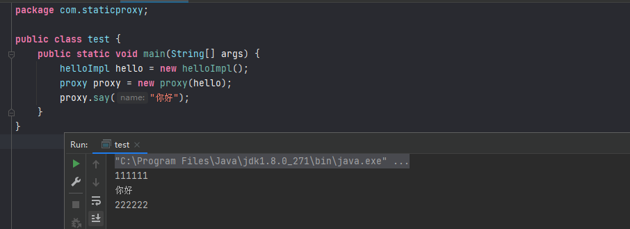
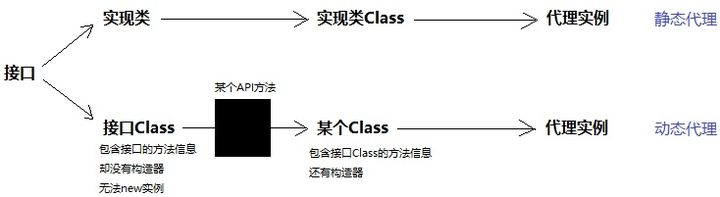
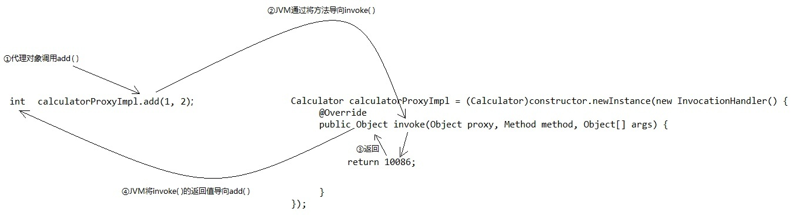
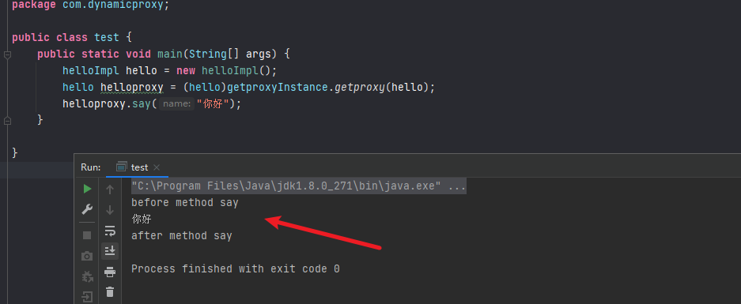

## 前言


代理模式是一种设计模式，提供了对目标对象额外的访问方式，即通过代理对象访问目标对象，这样可以在不修改原目标对象的前提下，提供额外的功能操作，扩展目标对象的功能。我理解的代理就是一个中间人，这个中间人不仅实现了代理对象的功能，还能自己添加一些功能。


## 静态代理


在说动态代理之前不得不提静态代理，静态代理的实现需要代理对象和目标对象实现一样的接口，用起来比较繁琐。


静态代理实现的步骤如下：


```text
1. 定义一个接口及其实现类
2. 创建一个代理类同样实现这个接口
3. 将目标对象注入进代理类，然后在代理类的对应方法调用目标类中的对应方法。这样的话，我们就可以通过代理类屏蔽对目标对象的访问，并且可以在目标方法执行前后做一些自己想做的事情。
```


静态代理代码实现：


定义hello接口


```java
package com.staticproxy;

public interface hello {
    String say(String name);
}
```


实现hello接口


```java
package com.staticproxy;

public class helloImpl implements hello{
    @Override
    public String say(String name) {
        return name;
    }
}
```


创建代理类并同样实现hello接口


```java
package com.staticproxy;

public class proxy implements hello{
    private hello hello;
    public proxy(hello hello){
        this.hello = hello;
    }
    @Override
    public String say(String name) {
        //调用方法之前，我们可以添加自己的操作
        System.out.println("111111");
        hello.say(name);
        //调用方法之后，我们可以添加自己的操作
        System.out.println("222222");
        return name;
    }
}
```


静态代理使用结果：


```java
package com.staticproxy;

public class test {
    public static void main(String[] args) {
        helloImpl hello = new helloImpl();
        proxy proxy = new proxy(hello);
        proxy.say("你好");
    }
}
```





**静态代理的缺点：**
静态代理中，我们对目标对象的每个方法的增强都是手动完成的，非常不灵活（比如接口一旦新增加方法，目标对象和代理对象都要进行修改）且麻烦(需要对每个目标类都单独写一个代理类)。 实际应用场景非常非常少。


## 动态代理


动态代理利用了JDK API，动态地在内存中构建代理对象，从而实现对目标对象的代理功能。动态代理又被称为JDK代理或接口代理。


静态代理与动态代理的区别主要在：

- 静态代理在编译时就已经实现，编译完成后代理类是一个实际的class文件
- 动态代理是在运行时动态生成的，即编译完成后没有实际的class文件，而是在运行时动态生成类字节码，并加载到JVM中

JDK提供了`java.lang.reflect.InvocationHandler`接口和 `java.lang.reflect.Proxy`类，这两个类相互配合，入口是Proxy。Proxy有个静态方法：`getProxyClass(ClassLoader, interfaces)`，只要你给它传入类加载器和一组接口，它就给你返回代理Class对象。


所以，一旦我们明确接口，完全可以通过接口的Class对象，创建一个代理Class，通过代理Class即可创建代理对象。





根据代理Class的构造器创建对象时，需要传入InvocationHandler。每次调用代理对象的方法，最终都会调用InvocationHandler的invoke()方法：





不过实际编程中，一般不用`getProxyClass()`，而是使用Proxy类的另一个静态方法：`Proxy.newProxyInstance()`，直接返回代理实例，连中间得到代理Class对象的过程都帮你隐藏。


JDK 动态代理类使用步骤：


```text
1. 定义一个接口及其实现类；
2. 自定义 InvocationHandler 并重写invoke方法，在 invoke 方法中我们会调用原生方法（被代理类的方法）并自定义一些处理逻辑；
2. 通过 Proxy.newProxyInstance(ClassLoader loader,Class<?>[] interfaces,InvocationHandler h) 方法创建代理对象；
```


动态代理的代码实现：


定义hello接口


```java
package com.dynamicproxy;

public interface hello {
    String say(String name);
}
```


实现hello接口


```java
package com.dynamicproxy;

public class helloImpl implements hello {
    @Override
    public String say(String name) {
        System.out.println(name);
        return name;
    }
}
```


定义一个 JDK 动态代理类


```java
package com.dynamicproxy;

import java.lang.reflect.InvocationHandler;
import java.lang.reflect.Method;

public class proxyHandle implements InvocationHandler {

    //target为要代理的目标对象
    private final Object target;

    public proxyHandle(Object target) {
        this.target = target;
    }

    @Override
    public Object invoke(Object proxy, Method method, Object[] args) throws Throwable {
        //调用方法之前，我们可以添加自己的操作
        System.out.println("before method " + method.getName());
        Object result = method.invoke(target, args);
        //调用方法之后，我们同样可以添加自己的操作
        System.out.println("after method " + method.getName());
        return result;
    }
}
```


获取代理实例


```java
package com.dynamicproxy;

import java.lang.reflect.Proxy;

public class getproxyInstance {
    public static Object getproxy(Object target){
        return Proxy.newProxyInstance(target.getClass().getClassLoader(), target.getClass().getInterfaces(),new proxyHandle(target));
    }
}
```


动态代理使用结果：


```java
package com.dynamicproxy;

public class test {
    public static void main(String[] args) {
        helloImpl hello = new helloImpl();
        hello helloproxy = (hello)getproxyInstance.getproxy(hello);
        helloproxy.say("你好");
    }
```





可以看到动态代理无需实现代理目标类的接口即可实现代理功能，很方便。


动态代理在很多框架中都用到了吗，比如spring,mybatis,ysoserial等，学习动态代理有助于看懂这些框架。


## 参考


[Java 动态代理作用是什么？](https://www.zhihu.com/question/20794107)

