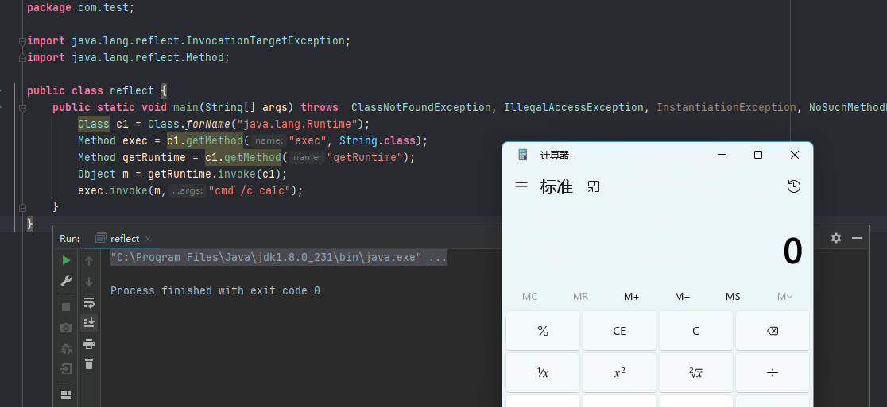

## 前言


如果要想深入学习java安全，除了java必备的基础知识外，还有一些java高阶的知识需要了解，例如反射，类加载，RPC，动态代理等。这些概念是java漏洞利用的基础，例如shiro反序列化，fastjson反序列化等。


这篇文章我们来详细说说java反射。


## 反射的基本概念


java 作为动态语言最基本的一个特性就是反射，反射可以使得java在运行时动态的去获取要加载的类对象并执行其中的方法，当然也可以获取并修改其属性等。


一般情况下，我们使用某个类时必定知道它是什么类，是用来做什么的。于是我们直接对这个类进行实例化，之后使用这个类对象进行操作，例如：


现在有一个类名为`com.test.Cat`，其有一个方法为`eat`.


```java
package com.test;

public class Cat {
    public void eat(String food){
        System.out.println("cat eat: "+ food);
    }
}

```


当需要调用`eat`方法时，需要实例化`Cat`对象。


```java
package com.test;

public  class main {
    public static void main(String[] args) {
        Cat cat = new Cat();
        cat.eat("香肠");
    }
}

```


那么现在有一个配置文件内容如下：


```text
className=com.test.Cat
method=eat

```


现在要求从配置文件中读取className的值和method的值去创建com.test.Cat对象，并执行其eat方法，那么该如何去实现呢？


可以肯定的是使用传统的方法是无法实现的，**java反射**就是用来解决此类问题的。


```java
package com.test;

import java.io.FileInputStream;
import java.io.IOException;
import java.lang.reflect.InvocationTargetException;
import java.lang.reflect.Method;
import java.util.Properties;

public class reflect {
    public static void main(String[] args) throws IOException, ClassNotFoundException, IllegalAccessException, InstantiationException, NoSuchMethodException, InvocationTargetException {
        Properties pro = new Properties();
        FileInputStream fio = new FileInputStream("src\\config.properties");
        pro.load(fio);
        String className = pro.getProperty("className").toString();
        String method = pro.getProperty("method").toString();

        //获取com.test.Cat类对象
        Class<?> cls = Class.forName(className);
        //通过反射创建类对象
        Object o = cls.newInstance();
        //通过反射获取类方法
        Method method1 = cls.getMethod(method,String.class);
        //反射调用方法
        method1.invoke(o,"香肠");
    }
}

```


运行结果：


可以看到和直接实例化Cat对象运行的结果是一样的。


## 反射的常用API


- Field 类：提供有关类的属性信息，以及对它的动态访问权限。它是一个封装反射类的属性的类。
- Constructor 类：提供有关类的构造方法的信息，以及对它的动态访问权限。它是一个封装反射类的构造方法的类。
- Method 类：提供关于类的方法的信息，包括抽象方法。它是用来封装反射类方法的一个类。
- Class 类：表示正在运行的 Java 应用程序中的类的实例。
- Object 类：Object 是所有 Java 类的父类。所有对象都默认实现了 Object 类的方法。

现有一个Student类，如下：


```java
package com.test.reflection;

public class Student {

    private String studentName;
    public int studentAge;

    public Student() {
    }

    private Student(String studentName) {
        this.studentName = studentName;
    }

    public void setStudentAge(int studentAge) {
        this.studentAge = studentAge;
    }

    private String show(String message) {
        System.out.println("show: " + studentName + "," + studentAge + "," + message);
        return "testReturnValue";
    }
}

```


可以看到，Student 类中有两个字段、两个构造方法、两个函数，且都是一个私有，一个公有。由此可知，这个测试类基本涵盖了我们平时常用的所有类成员。


### 获取Class对象


```java
通过字符串获取Class对象，这个字符串必须带上完整路径名
Class studentClass = Class.forName("com.test.reflection.Student");

```


> 这里要提一下几种获取Class对象的方法。

1. `forName()` 方法:当要使用 Class 类中的方法获取类对象时，就需要使用 `forName()` 方法，只需要有类名称即可，在配置 JDBC 中通常采用这种方法。
2. `.class 方法`:任何数据类型都具备静态的属性，因此可以使用 `.class` 直接获取其对应的 Class 对象，使用这种方法时需要明确用到类中的静态成员。
3. `getClass() 方法`:可以通过 Object 类中的 `getCLass()` 方法来获取字节码，使用这种方法时必须明确具体的类，然后创建对象。
4. `getSystemClassLoad().loadClass() 方法`:`getSystemClassLoad().loadClass()` 方法与 `forName()` 方法类似，只要有类名即可；但是，`forName(`) 的静态方法 JVM 会装载类，并且执行 `static()` 中的代码，而 `getSystemClassLoad().loadClass()` 不会执行 `ststic()` 中的代码。


### 获取成员变量


获取字段有两个 API：`getDeclaredFields`和`getFields`。他们的区别是:`getDeclaredFields`用于获取所有声明的字段，包括公有字段和私有字段，`getFields`仅用来获取公有字段：


```java
Class studentClass = Class.forName("com.test.reflection.Student");

//获取所有声明字段
Field[] declaredFields = studentClass.getDeclaredFields();
for (Field declaredField : declaredFields) {
    System.out.println("declared Field: " + declaredField);
}
//获取所有公有字段
Field[] fields = studentClass.getFields();
for (Field field:fields){
    System.out.println("field: " + field);
}
//获取指定字段
Field studentAge = studentClass.getField("studentAge");
System.out.println(studentAge);

```


### 获取构造方法


获取构造方法同样包含了两个 API：用于获取所有构造方法的 getDeclaredConstructors和用于获取公有构造方法的getConstructors:


```java
Class studentClass = Class.forName("com.test.reflection.Student");

//获取所有构造方法
Constructor[] declaredConstructors = studentClass.getDeclaredConstructors();
for (Constructor declaredConstructor:declaredConstructors){
    System.out.println(declaredConstructor);
}

//获取共有构造方法
Constructor[] Constructors = studentClass.getConstructors();
for (Constructor Constructor:Constructors){
    System.out.println(Constructor);
}

```


### 获取非构造方法


同样地，获取非构造方法的两个 API 是：获取所有声明的非构造函数的 getDeclaredMethods 和仅获取公有非构造函数的 getMethods：


```java
Class studentClass = Class.forName("com.test.reflection.Student");

//获取所有声明的非构造方法
Method[] declaredMethods = studentClass.getDeclaredMethods();
for (Method declaredMethod : declaredMethods){
    System.out.println("declaredMethod: " + declaredMethod );
}

//获取公有非构造方法
Method[] Methods = studentClass.getMethods();
for (Method Method : Methods){
    System.out.println("dMethod: " + Method );
}

```


从输出中我们看到，`getMethods` 方法不仅获取到了我们声明的公有方法`setStudentAge`，还获取到了很多 `Object` 类中的公有方法。这是因为我们前文已说到：`Object` 是所有`Java` 类的父类。所有对象都默认实现了 `Object` 类的方法。 而`getDeclaredMethods`是无法获取到父类中的方法的。


### 完整使用示例


```java
// 1.通过字符串获取Class对象，这个字符串必须带上完整路径名
Class studentClass = Class.forName("com.test.reflection.Student");
// 2.获取声明的构造方法，传入所需参数的类名，如果有多个参数，用','连接即可
Constructor studentConstructor = studentClass.getDeclaredConstructor(String.class);
// 如果是私有的构造方法，需要调用下面这一行代码使其可使用，公有的构造方法则不需要下面这一行代码
studentConstructor.setAccessible(true);
// 使用构造方法的newInstance方法创建对象，传入构造方法所需参数，如果有多个参数，用','连接即可
Object student = studentConstructor.newInstance("小明");
// 3.获取声明的字段，传入字段名
Field studentAgeField = studentClass.getDeclaredField("studentAge");
// 如果是私有的字段，需要调用下面这一行代码使其可使用，公有的字段则不需要下面这一行代码
// studentAgeField.setAccessible(true);
// 使用字段的set方法设置字段值，传入此对象以及参数值
studentAgeField.set(student,10);
// 4.获取声明的函数，传入所需参数的类名，如果有多个参数，用','连接即可
Method studentShowMethod = studentClass.getDeclaredMethod("show",String.class);
// 如果是私有的函数，需要调用下面这一行代码使其可使用，公有的函数则不需要下面这一行代码
studentShowMethod.setAccessible(true);
// 使用函数的invoke方法调用此函数，传入此对象以及函数所需参数，如果有多个参数，用','连接即可。函数会返回一个Object对象，使用强制类型转换转成实际类型即可
Object result = studentShowMethod.invoke(student,"message");
System.out.println("result: " + result);

```


## 反射应用实例


利用java的反射去执行命令。


大家都知道在java中可以用`Runtime.getRuntime().exec("calc");`来执行系统命令，那么如何利用反射来调用Runtime类来执行命令呢？


代码如下：


```java
package com.test;

import java.lang.reflect.InvocationTargetException;
import java.lang.reflect.Method;

public class reflect {
    public static void main(String[] args) throws  ClassNotFoundException, IllegalAccessException, InstantiationException, NoSuchMethodException, InvocationTargetException {
        Class c1 = Class.forName("java.lang.Runtime");
        Object m = c1.newInstance();
        Method method = c1.getMethod("exec", String.class);
        method.invoke(m,"cmd /c calc");
    }
}

```


因为Runtime类的构造方法是私有的。


执行后会报如下错误：


既然我现在不能绕过 private 权限的检测，那我先不管 newIntance 创建类对象，先获取 Rumtime 类的方法先谈个计算器再看看。所以我们需要对代码进行简单修改下。


```java
package com.test;

import java.lang.reflect.InvocationTargetException;
import java.lang.reflect.Method;

public class reflect {
    public static void main(String[] args) throws  ClassNotFoundException, IllegalAccessException, InstantiationException, NoSuchMethodException, InvocationTargetException {
        Class c1 = Class.forName("java.lang.Runtime");
        Method exec = c1.getMethod("exec", String.class);
        Method getRuntime = c1.getMethod("getRuntime");
        Object m = getRuntime.invoke(c1);
        exec.invoke(m,"cmd /c calc");
    }
}

```





Runtime类本身是不希望除了其自身的任何人去创建该类实例的，因为这是一个私有的类构造方法，所以我们没办法new一个Runtime类实例即不能使用Runtime rt = new Runtime();的方式创建Runtime对象，但示例中我们借助了反射机制，修改了方法访问权限从而间接的创建出了Runtime对象。


除了间接创建Runtime类来执行命令也可以暴力的使用 设置 `setAccessible(true)`来突破private的限制，代码如下:


```java

import java.lang.reflect.Constructor;
import java.lang.reflect.InvocationTargetException;
import java.lang.reflect.Method;

public class reflect {
    public static void main(String[] args) throws ClassNotFoundException, NoSuchMethodException, IllegalAccessException, InvocationTargetException, InstantiationException {
        Class<?> c = Class.forName("java.lang.Runtime");
        Constructor<?> declaredConstructor = c.getDeclaredConstructor();
        declaredConstructor.setAccessible(true);
        Object o = declaredConstructor.newInstance();
        Method exec = c.getMethod("exec", String.class);
        exec.invoke(o,"cmd /c calc");
    }
}

```


