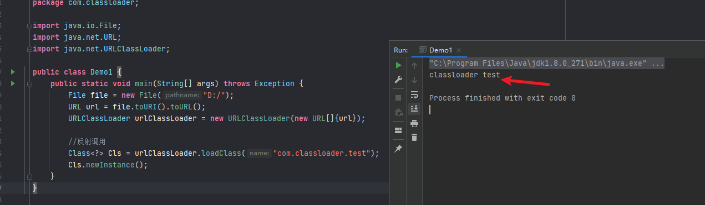
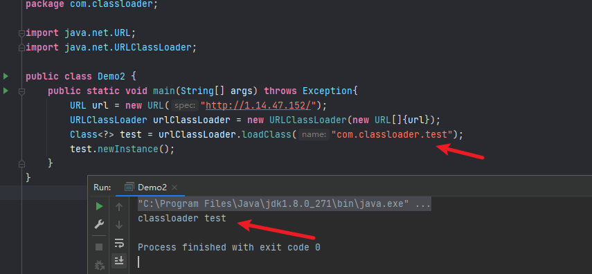
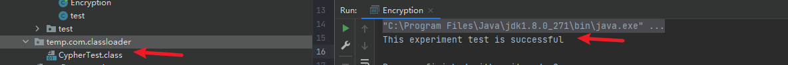
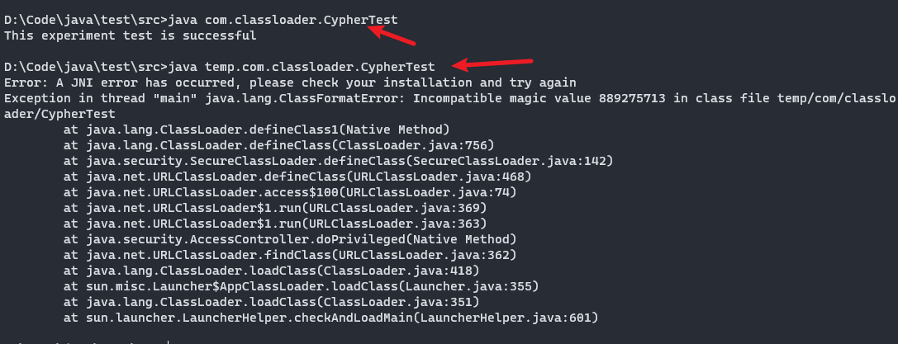
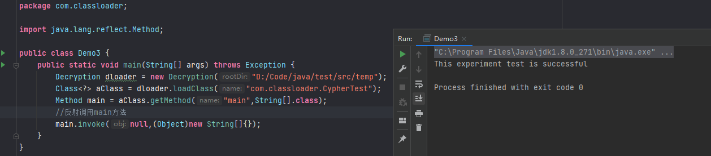

## 前言


java类加载器是JVM加载类到内存并运行的过程，这个过程有点复杂，除了系统自定义的三类加载器外，java运行用户编写自定义加载器来完成类的加载过程。java安全中常常需要远程加载恶意类文件来完成漏洞的利用，所以学习类加载器的编写也是很重要的。


## 类加载器


java系统定义了三类加载器，分别是BootstrapClassLoader,ExtensionClassLoader,AppClassLoader。其中BootstrapClassLoader由 C 语言代码实现，主要负责加载存储在$JAVA_HOME/jre/lib/rt.jar中的核心 Java 库，包括 JVM 本身。`ExtensionClassLoader`由`sun.misc.Launcher$ExtClassLoader类实现。负责加载 JVM 扩展类，用来加载\\jre\\lib\\ext的类，这些库名通常以 javax 开头，它们的 jar 包位于 $JAVA_HOME/lib/ext/*.jar` 中，有很多 jar 包。`AppClassLoader`由`sun.misc.Launcher$AppClassLoader`实现。是直接面向我们用户的加载器，它会加载 Classpath 环境变量里定义的路径中的 jar 包和目录。


这三类加载器互相配合，完成了类的加载，这个过程比较复杂，而且还有一个比较重要的“双亲委派”机制，想要深入了解的同学可以看下[老大难的 Java ClassLoader 再不理解就老了](https://zhuanlan.zhihu.com/p/51374915)。


不过这里我们只需要重点关注下`URLClassLoader`和如何自定义类加载器就可以了。


## URLClassLoader


URLClassLoader扩展了ClassLoader，所以它在ClassLoader的基础上扩展了一些功能，这些扩展的功能中，最主要的一点就是URLClassLoader却可以加载任意路径下的类(ClassLoader只能加载classpath下面的类)。


在上篇的java反射介绍中，要实现动态加载类都是使用用Class.forName()这个方法，但是这个方法只能创建程序中已经引用的类，如果我们需要动态加载程序外的类，Class.forName()是不够的，这个时候就是需要使用URLClassLoader。


### 从本地文件加载外部类


首先先编写一个测试类，并将其编译为class文件。


```java
package com.classloader;

public class test {
    public test(){
        System.out.println("classloader test");
    }
}
```


此时会在`D:\com\classloader`文件夹下生成一个`test.class`文件。


URLClassLoader本地加载外部类示例：


```java
package com.classloader;

import java.io.File;
import java.net.URL;
import java.net.URLClassLoader;

public class Demo1 {
    public static void main(String[] args) throws Exception {
        File file = new File("D:/");
        URL url = file.toURI().toURL();
        URLClassLoader urlClassLoader = new URLClassLoader(new URL[]{url});

        //反射调用
        Class<?> Cls = urlClassLoader.loadClass("com.classloader.test");
        Cls.newInstance();
    }
}
```





### 远程加载外部类


URLClassLoader远程加载外部类示例：


同上一步，将`test.class`文件放在远端的一个服务器上，使用http远程访问此文件。


地址为：`http://1.14.47.152/test.class`


URLClassLoader远程加载外部类示例：


```java
package com.classloader;

import java.net.URL;
import java.net.URLClassLoader;

public class Demo2 {
    public static void main(String[] args) throws Exception{
        URL url = new URL("http://1.14.47.152/");
        URLClassLoader urlClassLoader = new URLClassLoader(new URL[]{url});
        Class<?> test = urlClassLoader.loadClass("com.classloader.test");
        test.newInstance();
    }
}
```





## 自定义类加载器


除了系统内置的类加载器，我们还可以自定义类加载器，自定义的类加载器需要继承`java.lang.ClassLoader`，通过重写其中的`findClass()`方法来达到想要的功能。


这里引用[JAVA安全基础（一）--类加载器（ClassLoader）](https://xz.aliyun.com/t/9002)这篇文章中加密 java 类字节码例子来讲解。


首先创建`CypherTest.java`文件并生成`CypherTest.class`


```java
package com.classloader;

public class CypherTest{
    public static void main(String[] args) {
        System.out.println("This experiment test is successful");
    }
}
```


之后我们编写一个加密类 Encryption，使用简单的逐位取反进行加密操作。


```java
package com.classloader;

import java.io.File;
import java.io.FileInputStream;
import java.io.FileOutputStream;
import java.io.IOException;

public class Encryption {
    public static void main(String[] args) {
        encode(new File("D:\\Code\\java\\test\\src\\com\\classloader\\CypherTest.class"), // 获取路径CypherTest.class文件
                new File("D:\\Code\\java\\temp\\src\\com\\classloader\\CypherTest1.class")); // 为了保持一致，创建了一个空的temp目录
    }
    public static void encode(File src, File dest) {
        FileInputStream fis = null;
        FileOutputStream fos = null;

        try {
            fis = new FileInputStream(src);
            fos = new FileOutputStream(dest);

            // 逐位取反操作
            int temp = -1;
            while ((temp = fis.read()) != -1) {// 读取一个字节
                fos.write(temp ^ 0xff);// 取反输出
            }

        } catch (IOException e) {

        } finally { // 关闭数据流
            if (fis != null) {
                try {
                    fis.close();
                } catch (IOException e) {
                    e.printStackTrace();
                }
                try {
                    fos.close();
                } catch (IOException e) {
                    e.printStackTrace();
                }
            }
        }
        System.out.println("This experiment test is successful");
    }
}
```


运行后生成了加密后的`CypherTest.class`文件





因为这个是自定义加密后，我们无法使用工具直接进行反编译操作和直接使用 jvm 默认类加载器去使用它。





那此时就需要自定义类加载器去加载了。


**自定义解密类加载器示例：**


```java
package com.classloader;

import java.io.ByteArrayOutputStream;
import java.io.FileInputStream;
import java.io.IOException;
import java.io.InputStream;

public class Decryption extends ClassLoader { // 继承ClassLoader类

    private String rootDir;

    public Decryption(String rootDir) {
        this.rootDir = rootDir;
    }

    @Override // 重写覆盖findClass
    protected Class<?> findClass(String className) throws ClassNotFoundException {
                byte[] classData = getClassData(className);
                    return defineClass(className, classData, 0, classData.length);
                }

    public byte[] getClassData(String className) {
        String path = rootDir + File.separator + className.replace(".", File.separator) + ".class";
        // 将流中的数据转换为字节数组
        InputStream is = null;
        ByteArrayOutputStream baos = new ByteArrayOutputStream();
        try {
            is = new FileInputStream(path);
            byte[] buffer = new byte[1024];
            int temp = -1;
            while ((temp = is.read()) != -1) {
                baos.write(temp ^ 0xff);
            }
            return baos.toByteArray();
        } catch (Exception e) {
            e.printStackTrace();
            return null;
        } finally {
            if (is != null) {
                try {
                    is.close();
                } catch (IOException e) {
                    e.printStackTrace();
                }
            }
            if (baos != null) {
                try {
                    baos.close();
                } catch (IOException e) {
                    e.printStackTrace();
                }
            }
        }
    }
}
```


然后调用自定义的类加载器去加载加密后的class文件即可。


```java
package com.classloader;

import java.lang.reflect.Method;

public class Demo3 {
    public static void main(String[] args) throws Exception {
        Decryption dloader = new Decryption("D:/Code/java/test/src/temp");
        Class<?> aClass = dloader.loadClass("com.classloader.CypherTest");
        Method main = aClass.getMethod("main",String[].class);
        //反射调用main方法
        main.invoke(null,(Object)new String[]{});
    }
}
```




