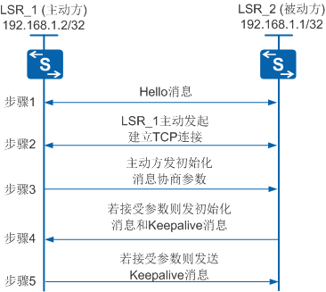
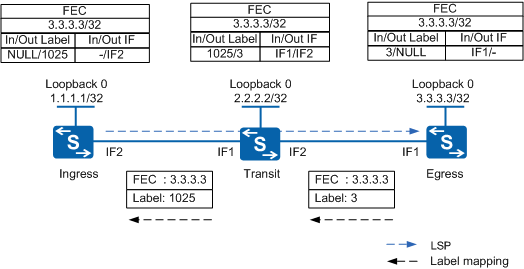

## mpls lsp的建立


介绍完了mpls基础部分，想必大家对mpls应该有了初步的了解。mpls中最重要的一个元素就是标签，因为mpls就是靠标签来完成数据报文的转发的。怎么为一个FEC来分配标签呢，有两种方法:静态（手工）分配标签，动态分配标签。


## 静态分配标签


手工分配标签的方式比较简单，通过人为的方法为一个FEC来指定标签，标签指定完后之后建立静态LSP，数据报文到达后按照标签来进行转发。手工分配标签的时候有一个原则:**上游节点的出标签为下游节点的入标签** 。
静态LSP不使用标签发布协议，不需要交互控制报文，资源消耗比较小，但通过静态方式建立的LSP不能根据网络拓扑变化动态调整，需要管理员干预。手动分配标签的方法适用于网络结构清晰，规模较小，网络结构稳定的环境下。


注意：静态LSP的配置需要区分ingress transit engress。


### 配置方法如下：


```shell
_static-lsp ingress lsp-name destination ip-address { mask-length | mask } { nexthop next-hop-address | outgoing-interface interface-type interface-number }  out-label out-label_

```


配置本节点为指定LSP的Ingress。


```shell
_static-lsp transit lsp-name [ incoming-interface interface-type interface-number ] in-label in-label { nexthop next-hop-address | outgoing-interface interface-type interface-number }  out-label out-label_

```


配置本节点为指定LSP的Transit。


```shell
static-lsp egress lsp-name [ incoming-interface interface-type interface-number ] in-label in-label [ lsrid ingress-lsr-id tunnel-id tunnel-id ]

```


配置本节点为指定LSP的Egress。


## 动态分配标签


动态分配标签就是利用标签分配协议来进行LSP的建立，动态分配标签的协议有几种，但是最为常用也是最好的协议就是LDP。在某些复杂网络环境下，使用手工建立LSP的方法过于复杂并及其容易出错。通过LDP协议，标签交换路由器LSR（Label Switched Router）可以把网络层的路由信息直接映射到数据链路层的交换路径上，动态建立起网络层的LSP。目前，LDP广泛地应用在VPN服务上，具有组网、配置简单、支持基于路由动态建立LSP、支持大容量LSP等优点。


标签分发协议LDP（Label Distribution Protocol）是多协议标签交换MPLS的一种控制协议，相当于传统网络中的信令协议，负责转发等价类FEC（Forwarding Equivalence Class）的分类、标签的分配以及标签交换路径LSP（Label Switched Path）的建立和维护等操作。LDP规定了标签分发过程中的各种消息以及相关处理过程。


## LDP基本概念：

1. LDP会话：LDP会话用于LSR之间交换标签映射、释放等消息。只有存在对等体才能建立LDP会话，LDP会话分为两种类型：
本地LDP会话（Local LDP Session）：建立会话的两个LSR之间是直连的。
远端LDP会话（Remote LDP Session）：建立会话的两个LSR之间可以是直连的，也可以是非直连的。
本地LDP会话和远端LDP会话可以共存。
2. LDP对等体：LDP对等体是指相互之间存在LDP会话、使用LDP来交换标签消息的两个LSR。LDP对等体通过它们之间的LDP会话获得对方的标签。
3. LDP邻接体：当一台LSR接收到对端发送过来的Hello消息后LDP邻接体建立。LDP邻接体存在两种类型：
本地邻接体（Local Adjacency）：以组播形式发送Hello消息（即链路Hello消息）发现的邻接体叫做本地邻接体。
远端邻接体（Remote Adjacency）：以单播形式发送Hello消息（即目标Hello消息）发现的邻接体叫做远端邻接体。
LDP通过邻接体来维护对等体的存在，对等体的类型取决于维护它的邻接体的类型。一个对等体可以由多个邻接体来维护，如果由本地邻接体和远端邻接体两者来维护，则对等体类型为本远共存对等体。

## LDP工作机制：


简单来说：LDP的存在就是为了建立LSP，完成标签的交换。怎么来实现这个功能呢？

- 两个LSR之间会形成LDP的邻居关系，交换LSP消息报文，建立LDP session。
- LDP session一旦建立，LSR之间就会发送标签请求和标签映射消息，在LDP对等体之间通告FEC和标签的绑定关系来建立LSP。
- 将FEC绑定对应的标签后，LSP建立。数据报文按照这个LSP来转发。

## LDP消息类型：


LDP协议主要使用四类消息：

- 发现（Discovery）消息：用于通告和维护网络中LSR的存在，如Hello消息。
- 会话（Session）消息：用于建立、维护和终止LDP对等体之间的会话，如Initialization消息、Keepalive消息。
- 通告（Advertisement）消息：用于创建、改变和删除FEC的标签映射。
- 通知（Notification）消息：用于提供建议性的消息和差错通知。

为保证LDP消息的可靠发送，除了Discovery消息使用UDP（User Datagram Protocol）传输外，LDP的Session消息、Advertisement消息和Notification消息都使用TCP（Transmission Control Protocol）传输。


## LDP会话的建立：




1. 两个LSR之间互相发送Hello消息。Hello消息中携带传输地址（即设备的IP地址），双方使用传输地址建立LDP会话。
2. 传输地址较大的一方作为主动方，发起建立TCP连接。如图所示，LSR_1作为主动方发起建立TCP连接，LSR_2作为被动方等待对方发起连接。
3. _TCP连接建立成功后，由主动方LSR1发送初始化消息，协商建立LDP会话的相关参数。LDP会话的相关参数包括LDP协议版本、标签分发方式、Keepalive保持定时器的值、最大PDU长度和标签空间等。_
4. 被动方LSR_2收到初始化消息后，LSR_2接受相关参数，则发送初始化消息，同时发送Keepalive消息给主动方LSR_1。如果被动方LSR_2不能接受相关参数，则发送Notification消息终止LDP会话的建立。
初始化消息中包括LDP协议版本、标签分发方式、Keepalive保持定时器的值、最大PDU长度和标签空间等。
5. 主动方LSR_1收到初始化消息后，接受相关参数，则发送Keepalive消息给被动方LSR_2。如果主动方LSR_1不能接受相关参数，则发送Notification消息给被动方LSR_2终止LDP会话的建立。

当双方都收到对端的Keepalive消息后，LDP会话建立成功。


## LDP LSP的建立


当LDP会话建立完成后，开始发送标签请求来进行FEC和标签的映射。进而建立LSP。
但是如何发送标签请求，由谁来发送，发过来的标签请求我应该怎么处理。等问题则需要标签发布方式，标签分配控制方式和标签保持方式来决定。
**这部分简单总结一下，不在赘述，详细的请参考相关资料。**


### 标签发布方式（Label Advertisement Mode）


标签发布方式有两种方式。具有标签分发邻接关系的上游LSR和下游LSR必须对使用的标签发布方式达成一致。


下游自主方式DU（Downstream Unsolicited）：对于一个特定的FEC，LSR无需从上游获得标签请求消息即进行标签分配与分发。


下游按需方式DoD（Downstream on Demand）：对于一个特定的FEC，LSR获得标签请求消息之后才进行标签分配与分发。


### 标签分配控制方式（Label Distribution Control Mode）


标签分配控制方式是指在LSP的建立过程中，LSR分配标签时采用的处理方式。


独立标签分配控制方式（Independent）：本地LSR可以自主地分配一个标签绑定到某个FEC，并通告给上游LSR，而无需等待下游的标签。


有序标签分配控制方式（Ordered）：对于LSR上某个FEC的标签映射，只有当该LSR已经具有此FEC下一跳的标签映射消息、或者该LSR就是此FEC的出节点时，该LSR才可以向上游发送此FEC的标签映射。


### 标签保持方式（Label Retention Mode）


标签保持方式是指LSR对收到的、但目前暂时不需要的标签映射的处理方式。


自由标签保持方式（Liberal）：对于从邻居LSR收到的标签映射，无论邻居LSR是不是自己的下一跳都保留。


保守标签保持方式（Conservative）：对于从邻居LSR收到的标签映射，只有当邻居LSR是自己的下一跳时才保留。


## 建立过程




1. 缺省情况下，网络的路由改变时，如果有一个边缘节点（Egress）发现自己的路由表中出现了新的主机路由，并且这一路由不属于任何现有的FEC，则该边缘节点需要为这一路由建立一个新的FEC。
2. 如果MPLS网络的Egress有可供分配的标签，则为FEC分配标签，并主动向上游发出标签映射消息，标签映射消息中包含分配的标签和绑定的FEC等信息。
3. Transit收到标签映射消息后，判断标签映射的发送者（Egress）是否为该FEC的下一跳。若是，则在其标签转发表中增加相应的条目，然后主动向上游LSR发送对于指定FEC的标签映射消息。
4. Ingress收到标签映射消息后，判断标签映射的发送者（Transit）是否为该FEC的下一跳。若是，则在标签转发表中增加相应的条目。这时，就完成了LSP的建立，接下来就可以对该FEC对应的数据报文进行标签转发。
