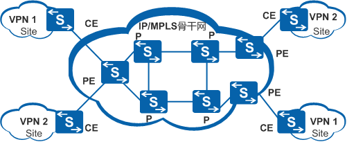
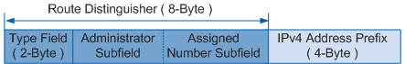
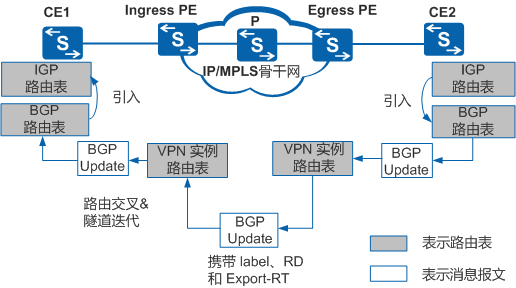
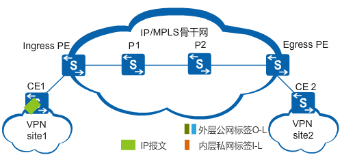

### 背景：

前面介绍了mpls的基础以及mpls lsp的建立，mpls在当前网络中的应用主要是mpls vpn。其实mpls vpn应该叫BGP/MPLS ip vpn,因为mpls vpn的建立除了需要mpls和ip协议还需要BGP的一个扩展协议MP-BGP。并且mpls vpn主要承载在运营商网络上，为多个分支站点提供vpn服务。
传统的VPN通过在所有站点间建立全连接隧道或者永久虚链路PVC（Permanent Virtual Circuit）的方式实现，不易维护和扩展，尤其是向已有的VPN加入新的站点时，需要同时修改所有接入此VPN站点的边缘节点的配置。
BGP/MPLS IP VPN基于对等体模型，这种模型使得服务提供商和用户可以交换路由，服务提供商转发用户站点间的数据而不需要用户的参与。相比较传统的VPN，BGP/MPLS IP VPN更容易扩展和管理。新增一个站点时，只需要修改提供该站点业务的边缘节点的配置。
BGP/MPLS IP VPN支持地址空间重叠、支持重叠VPN、组网方式灵活、可扩展性好，并能够方便地支持MPLS QoS和MPLS TE，成为在IP网络运营商提供增值业务的重要手段，因此得到越来越多的应用。

### 几个概念：

- **CE（Customer Edge）**：用户网络边缘设备，有接口直接与服务提供商网络相连。CE可以是路由器或交换机，也可以是一台主机。通常情况下，CE“感知”不到VPN的存在，也不需要支持MPLS。
- **PE（Provider Edge）**：是服务提供商网络的边缘设备，与CE直接相连。在MPLS网络中，对VPN的所有处理都发生在PE上，对PE性能要求较高。
- **P（Provider）**：服务提供商网络中的骨干设备，不与CE直接相连。P设备只需要具备基本MPLS转发能力，不维护VPN信息。
- **site**: site是指一个不需要运营商网络互连的独立的ip网络站点，简而言之就是分布在不同地域的一个公司。但是如果两个公司分布在两个地域，但他们之间通过专线互连，这两个公司也属于一个site。
- **vpn实例**：在BGP/MPLS IP VPN中，不同VPN之间的路由隔离通过VPN实例（VPN-instance）实现。VPN实例也称为VPN路由转发表VRF（VPN Routing and Forwarding table）。PE上存在多个路由转发表，包括一个公网路由转发表，以及一个或多个VPN路由转发表。

**两个重要概念：**

- **RD（Route Distinguisher）**：RD用来区分来自不同site的相同ip地址。

传统BGP无法正确处理地址空间重叠的VPN的路由。假设VPN1和VPN2都使用了10.110.10.0/24网段的地址，并各自发布了一条去往此网段的路由。虽然本端PE通过不同的VPN实例可以区分地址空间重叠的VPN的路由，但是这些路由发往对端PE后，由于不同VPN的路由之间不进行负载分担，因此对端PE将根据BGP选路规则只选择其中一条VPN路由，从而导致去往另一个VPN的路由丢失。
PE之间使用MP-BGP（Multiprotocol Extensions for BGP-4，BGP-4的多协议扩展）来发布VPN路由，并使用VPN-IPv4地址来解决上述问题。
VPN-IPv4地址共有12个字节，包括8字节的路由标识符**RD（Route Distinguisher）**和4字节的IPv4地址前缀。

RD用于区分使用相同地址空间的IPv4前缀，增加了RD的IPv4地址称为VPN-IPv4地址（即VPNv4地址）。PE从CE接收到IPv4路由后，转换为全局唯一的VPN-IPv4路由，并在公网上发布。

- **VPN Target**：BGP/MPLS IP VPN使用BGP扩展团体属性－VPN Target（也称为Route Target）来控制VPN路由信息的发布。

每个VPN实例关联一个或多个VPN Target属性。有两类**VPN Target**属性：
Export Target：本地PE从直接相连Site学到IPv4路由后，转换为VPN-IPv4路由，并为这些路由设置Export Target属性。Export Target属性作为BGP的扩展团体属性随路由发布。
Import Target：PE收到其它PE发布的VPN-IPv4路由时，检查其Export Target属性。当此属性与PE上某个VPN实例的Import Target匹配时，PE就把路由加入到该VPN实例中。
在BGP/MPLS IP VPN网络中，通过VPN Target属性来控制VPN路由信息在各Site之间的发布和接收。VPN Export Target和Import Target的设置相互独立，并且都可以设置多个值，能够实现灵活的VPN访问控制，从而实现多种VPN组网方案。

### 两层标签分配：

> 在讲MPLS VPN的标签之前，大家应该有这么一个基本的认识：

1. BGP/IP MPLS VPN是因为有一些原因必须要用到mpls的标签技术。第一个原因是为了解决P设备上没有VPN路由导致的路由黑洞问题（外层标签），第二个原因是为了解决数据报文到达对端PE后，不知道发往哪个CE的问题（内层标签）。
2. 整个路由的传递过程和mpls没有半毛钱关系，只需要mp-bgp和igp协议就可以完成。

mpls vpn的建立其实就是使用标签来建立一条“隧道”，用户数据就可以沿着这条“虚拟隧道”来进行转发。mpls vpn需要两层标签，这就是前面介绍的标签栈。外层标签是由mpls ldp来分配的，为了解决BGP路由黑洞问题。内层标签是由mp-bgp协议为私网路由分配的，并且mp-bgp会为这条私网路由打上RD，这时这条路由就会被称为vpn-v4路由。这条路由还会随着bgp协议来进行传递到对端PE，然后对端PE需要根据内层标签来判断这条路由需要进入哪一个CE。

**当标签分配完成，两个PE之间的lSP建立完成后。私网路由在PE上是怎样查找路由，进入对应的隧道，又是怎样一步一步转发到对端PE，剥掉标签后到达CE的呢？**

### 这就涉及到两个概念：私网路由交叉和公网隧道迭代

两台PE之间通过MP-BGP传播的路由是VPNv4路由。当接收到VPNv4路由，PE先进行如下处理：

- 检查其下一跳是否可达。如果下一跳不可达，该路由被丢弃。
- 对于RR发送过来的VPNv4路由，如果收到的路由中cluster_list包含自己的cluster_id，则丢弃这条路由。
- 进行BGP的路由策略过滤，如果不通过，则丢弃该路由。

之后，PE把没有丢弃的路由与本地的各个VPN实例的Import Target属性匹配。VPNv4路由与本地VPN实例的Import VPN-Target进行匹配的过程称为**私网路由交叉**。

PE上有种特殊的路由，即来自本地CE的属于不同VPN的路由。对于这种路由，如果其下一跳直接可达或可迭代成功，PE也将其与本地的其他VPN实例的Import Target属性匹配，该过程称为**本地交叉**。例如：CE1所在的Site属于VPN1，CE2所在的Site属于VPN2，且CE1和CE2同时接入PE1。当PE1收到来自CE1的VPN1的路由时，也会与VPN2对应的VPN实例的Import Target属性匹配。

> 为了能够将报文正确转发出去，BGP设备必须先找到一个直接可达的地址，通过这个地址到达路由表中指示的下一跳。在上述过程中，去往直接可达地址的路由被称为依赖路由，BGP路由依赖于这些路由指导报文转发。根据下一跳地址找到依赖路由的过程就是**路由迭代**。

**公网隧道迭代**

为了将私网流量通过公网传递到另一端，需要有一条公网隧道承载这个私网流量。因此私网路由交叉完成后，需要根据目的IPv4前缀进行**路由迭代**，查找合适的隧道（本地交叉的路由除外）；只有**隧道迭代**成功，该路由才被放入对应的VPN实例路由表。将路由迭代到相应的隧道的过程叫做**隧道迭代**。

隧道迭代成功后，保留该隧道的标识符（Tunnel ID），供后续转发报文时使用。**Tunnel ID用于唯一标识一条隧道**。VPN报文转发时根据Tunnel ID查找对应的隧道，然后从隧道上发送出去。

### 路由发布和转发过程：

**BGP/MPLS IP VPN的路由发布**

基本BGP/MPLS IP VPN组网中，VPN路由信息的发布涉及CE和PE，P设备只维护骨干网的路由，不需要了解任何VPN路由信息。PE设备一般维护所有VPN路由。

VPN路由信息的发布过程包括三部分：本地CE到入口PE、入口PE到出口PE、出口PE到远端CE。完成这三部分后，本地CE与远端CE之间建立可达路由，VPN路由信息能够在骨干网上发布。

－　本地CE到入口PE的路由信息交换

CE与直接相连的PE建立邻居或对等体关系后，把本站点的IPv4路由发布给PE。CE与PE之间可以使用静态路由、RIP（Routing Information Protocol）、OSPF（Open Shortest Path First）、IS-IS（Intermediate System to Intermediate System）或BGP（Border Gateway Protocol）。无论使用哪种路由协议，CE发布给PE的都是标准的IPv4路由。**其实是vpnv4路由，在PE上的全局路由表中是看不到用户的私网路由的，只有在VPN路由表中才可以看到。**

- 入口PE到出口PE的路由信息交换

PE从CE学到VPN路由信息后，存放到VPN实例中。同时，为这些标准IPv4路由增加RD，形成VPN-IPv4路由。

入口PE通过MP-BGP的Update报文把VPN-IPv4路由发布给出口PE。Update报文中携带Export VPN Target属性及MPLS标签。

出口PE收到VPN-IPv4路由后，在下一跳可达的情况下进行路由交叉、隧道迭代和路由优选，决定是否将该路由加入到VPN实例的路由表。被加入到VPN路由表的路由，本地PE为其保留如下信息以供后续转发报文时使用：

1. MP-BGP Update消息中携带的MPLS标签值
2. Tunnel ID

**关于Tunnel ID的详细介绍请参考：**
http://www.handbye.cn/916.html

- 出口PE到远端CE的路由信息交换

远端CE有多种方式可以从出口PE学习VPN路由，包括静态路由、RIP、OSPF、IS-IS和BGP，与本地CE到入口PE的路由信息交换相同。此处不再赘述。值得注意的是，出口PE发布给远端CE的路由是普通IPv4路由。

1. 在CE2的BGP IPv4单播地址族下引入IGP（Interior Gateway Protocol）路由。
2. CE2将该路由随EBGP的Update消息一起发布给Egress PE。Egress PE从连接CE2的接口收到Update消息，把该路由转化为VPN IPv4路由，加入对应的VPN实例路由表。
3. Egress PE为该路由分配MPLS标签，并将标签和VPN IPv4路由信息加入MP-IBGP的Update消息中的NLRI字段中，Export-RT属性加入MP-BGP Update消息的扩展团体属性字段中，将Update消息发送给Ingress PE。
4. Ingress PE对该路由进行路由交叉。交叉成功则根据路由目的IPv4地址进行隧道迭代，查找合适的隧道。如果迭代成功，则保留该隧道的Tunnel ID和标签，并将路由加入该VPN实例路由表。
5. Ingress PE把该路由通过BGP Update消息发布给CE1。此时路由是普通IPv4路由。
6. CE1收到该路由后，把该路由加入BGP路由表。通过在IGP中引入BGP路由的方法可使CE1把该路由加入IGP路由表。

上面过程只是将CE2的路由发布给CE1。要实现CE1与CE2的互通，还需要将CE1的路由发布给CE2，其过程与上面的步骤类似，此处不再赘述。

**BGP/MPLS IP VPN的报文转发**

1. CE1发送一个VPN报文。
2. Ingress PE从绑定了VPN实例的接口上接收VPN数据包后进行如下操作：
- 先根据绑定的VPN实例的RD查找对应VPN的转发表。
- 匹配目的IPv4前缀，查找对应的Tunnel ID。
- 将报文打上对应的标签（I-L），根据Tunnel-ID找到隧道。
- 将报文从隧道发送出去。此例的隧道是LSP，则打上公网（外层）MPLS标签头（O-L1）。

接着，该报文携带两层MPLS标签穿越骨干网。骨干网的每台P设备都对该报文进行外层标签交换。

1. P2收到该携带两层标签的报文，交给MPLS协议处理。由于使能了倒数第二跳弹出功能，MPLS协议将去掉外层标签（O-L2），将携带内层标签的报文发送给Egress PE。
2. 此时Egress PE就可以看见内层标签，发现该标签处于栈底，将内层标签剥离。
3. Egress PE将报文从对应出接口发送给CE2。此时报文是个纯IP报文。这样，报文就成功地从CE1传到CE2了。CE2按照普通的IP转发过程将报文传送到目的地。
