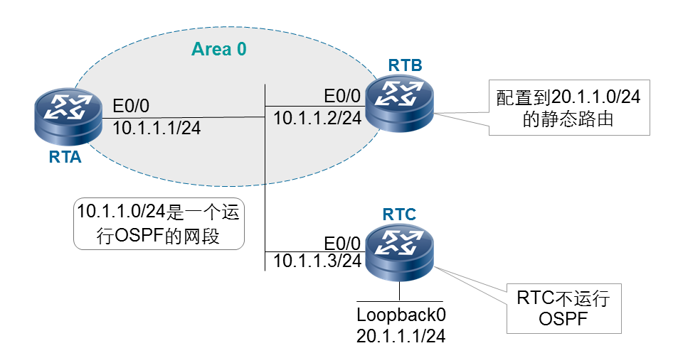

FA地址（Forwarding Address）是在ospf五类lsa和七类lsa中携带，用来在区域间防止次优路径的产生和环路的发生。

**五类LSA中的FA地址：**

本例中如果没有FA地址，那么将这条静态路由引入到OSPF中后，对于ospf来说，这是一条外部路由，RTA访问RTC时将会查找路由表发现下一跳为RTB，于是产生次优路径。当存在FA地址后，此时五类LSA中的FA地址会设置为10.1.1.3 RTA再次访问RTC时将会按照FA地址作为下一跳从而避免了次优路径的产生。

**FA地址是否为0的规则：**

通常情况下，生成AS-External-LSA时，Forwarding Address设置为0.0.0.0。

但是如果引入到OSPF中的外部路由的下一跳在一个OSPF路由域内，则在描述该外部路由的AS-External-LSA中，Forwarding Address应当被设置为ASBR路由表中该路由的下一跳。

如果Forwarding Address没有被设置为0，则该路由的下一跳就是路由表中到Forwarding Address的下一跳。

**七类LSA FA地址和五类略微不同：**

NSSA FA地址详解：

如果Options字段显示此LSA不可以被转换成五类LSA，FA地址可以被设置成0.0.0.0；

如果Options字段显示此LSA可以被转换成五类LSA，FA地址不可以被设置成0.0.0.0；

如果所引入外部路由的下一跳在OSPF路由域内，则FA直接设置为所引入外部路由的下一跳；

如果所引入外部路由的下一跳不在OSPF路由域内，则FA地址设置为该ASBR上某个OSPF路由域内的Stub网段（例如LOOPBACK0接口）的接口IP地址，有多个Stub网段时选IP地址最大者。

