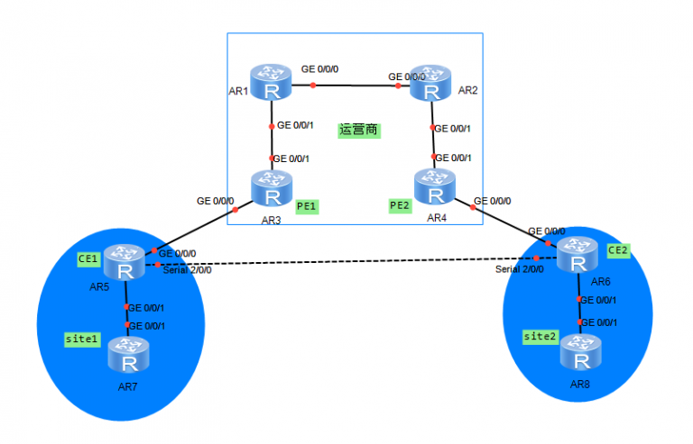

## ospf shamlink 是应用在MPLS VPN中的一种灵活组网方式

ospf shamlink 中实现了可以两个CE设备或用户站点间设计一条back door 链路。当运营商网络中出现问题后可以立马切换到后门备份链路，防止了重要业务和流量的中断。

shamlink的简单应用场景：

PE1和PE2用MPLS vpn建立bgp vpnv4邻居。运营商内部使用ospf传递路由。

site1和site2中也使用ospf传递路由

CE1和CE2之间存在后门链路，两台CE设备使用loopback地址建立ospf shamlink

一方面两个site站点间可以通过MPLSvpn传递路由，另一方面可以通过后门链路传递路由。但由于通过后门链路学到的路由cost值更小，所以会优选后门链路。而shamlink的作用就是抑制ospf路由而使bgpvpnv4路由生效。

**在sham link通过下面实现方式来屏蔽ospf路由:**

在PE的ospf多实例路由计算完成后，过滤掉所有下一跳为sham link的ospf路由，这样PE上学到对端CE的私网路由就是通过BGP了（通过cost值小优选sham link链路，避免PE直接从本端CE到对端CE，然后又过滤掉下一跳为sham link的ospf路由，使得bgp vpnv4路由生效）。

## shamlink配置步骤

1.环回口绑定vpn实例。

2.在BGP vpn 实例中宣告环回口，保证环回口路由可以通过bgp vpnv4传递。

3.在ospf下建立shamlink。

